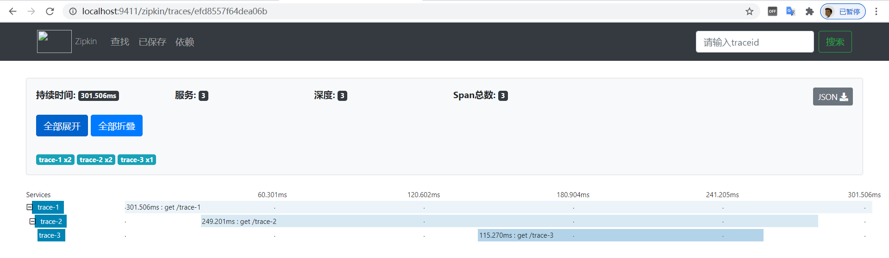

# 品达物流TMS项目

## 第10章 TMS客户端开发(pd-web-customer)

### 1. 导入功能代码

将资料中`用户端(pd-web-customer)代码导入`代码对应导入到pd-web-customer工程使用即可。

启动服务查看swagger接口文档，如下图：


### 2. RabbitMQ

#### 2.1 RabbitMQ介绍

MQ全称为Message Queue，即消息队列，它是一种应用程序之间的通信方法，消息队列在分布式系统开发中应用非常广泛。常见的消息队列产品（消息队列中间件）ActiveMQ、RabbitMQ、Kafka、RocketMQ等。

**消息队列应用场景：**

- 任务异步处理，将不需要同步处理的并且耗时长的操作由消息队列通知消息接收方进行异步处理
- 应用程序解耦 ，MQ相当于一个中介，生产方通过MQ与消费方交互，它将应用程序进行解耦合

RabbitMQ是由erlang语言开发，基于AMQP（ Advanced Message Queuing Protocol，即高级消息队列协议）实现的消息队列产品。

RabbitMQ官方地址：http://www.rabbitmq.com/

**RabbitMQ的优点：**

- 使用简单，功能强大
- 基于AMQP协议
- 社区活跃，文档完善
- 高并发性能好，这主要得益于Erlang语言
- Spring Boot默认已集成RabbitMQ

#### 2.2 RabbitMQ工作原理

RabbitMQ的工作原理如下：


组成部分说明如下：

- Broker：消息队列服务进程，此进程包括两个部分：Exchange和Queue。
- Exchange：消息队列交换机，按一定的规则将消息路由转发到某个队列，对消息进行过滤。
- Queue：消息队列，存储消息的队列，消息到达队列并转发给指定的消费方。
- Producer：消息生产者，即生产方客户端，生产方客户端将消息发送到MQ。
- Consumer：消息消费者，即消费方客户端，接收MQ转发的消息。

#### 2.3 RabbitMQ安装和启动

拉取镜像：

```
docker pull rabbitmq:3.7.7-management
```


查看镜像：

```
docker images
```


启动服务：

```
docker run -d --name rabbitmq3.7.7 -p 5672:5672 -p 15672:15672 -v `pwd`/data:/var/lib/rabbitmq --hostname myRabbit -e RABBITMQ_DEFAULT_VHOST=my_vhost  -e RABBITMQ_DEFAULT_USER=admin -e RABBITMQ_DEFAULT_PASS=admin 2888deb59dfc
```


参数说明：

-d 后台运行容器；

--name 指定容器名；

-p 指定服务运行的端口（5672：应用访问端口；15672：控制台Web端口号）；

-v 映射目录或文件；

--hostname 主机名（RabbitMQ的一个重要注意事项是它根据所谓的 “节点名称” 存储数据，默认为主机名）；

-e 指定环境变量；（RABBITMQ_DEFAULT_VHOST：默认虚拟机名；RABBITMQ_DEFAULT_USER：默认的用户名；RABBITMQ_DEFAULT_PASS：默认用户名的密码）

访问web控制台：

http://服务ip:15672/


登录成功：


#### 2.4 RabbitMQ入门案例

##### 2.4.1 生产者开发

第一步：创建maven工程并配置pom.xml文件

```
<?xml version="1.0" encoding="UTF-8"?>
<project xmlns="http://maven.apache.org/POM/4.0.0"
         xmlns:xsi="http://www.w3.org/2001/XMLSchema-instance"
         xsi:schemaLocation="http://maven.apache.org/POM/4.0.0 http://maven.apache.org/xsd/maven-4.0.0.xsd">
    <modelVersion>4.0.0</modelVersion>
    <parent>
        <groupId>org.springframework.boot</groupId>
        <artifactId>spring-boot-starter-parent</artifactId>
        <version>2.2.5.RELEASE</version>
    </parent>
    <groupId>com.itheima</groupId>
    <artifactId>mq-producer</artifactId>
    <version>1.0-SNAPSHOT</version>
    <dependencies>
        <dependency>
            <groupId>org.springframework.boot</groupId>
            <artifactId>spring-boot-starter-amqp</artifactId>
        </dependency>
        <dependency>
            <groupId>org.springframework.boot</groupId>
            <artifactId>spring-boot-starter-test</artifactId>
        </dependency>
    </dependencies>
</project>
```

第二步：编写配置文件application.yml

```
spring:
  rabbitmq:
    host: 68.79.7.219
    port: 5672
    username: admin
    password: admin@2020
    virtual-host: /
```

第三步：编写配置类RabbitmqConfig

```
package com.itheima.rabbitmq.config;

import org.springframework.amqp.core.*;
import org.springframework.beans.factory.annotation.Qualifier;
import org.springframework.context.annotation.Bean;
import org.springframework.context.annotation.Configuration;

@Configuration
public class RabbitmqConfig {
    public static final String EXCHANGE = "myexchange";
    public static final String QUEUE = "myqueue";
    public static final String ROUTING_KEY = "fire";
    
    /**
     * 交换机
     */
    @Bean(EXCHANGE)
    public DirectExchange exchange() {
        return ExchangeBuilder.directExchange(EXCHANGE).durable(true).build();
    }

    /**
     * 队列
     */
    @Bean(QUEUE)
    public Queue queue() {
        return new Queue(QUEUE);
    }

    /**
     * 将队列和交换机绑定
     */
    @Bean
    public Binding binding(@Qualifier(QUEUE) Queue queue, @Qualifier(EXCHANGE) DirectExchange exchange) {
        return BindingBuilder.bind(queue).to(exchange).with(ROUTING_KEY);
    }
}
```

第四步：编写启动类RabbitmqApplication

```
package com.itheima;

import org.springframework.boot.SpringApplication;
import org.springframework.boot.autoconfigure.SpringBootApplication;

@SpringBootApplication
public class RabbitmqApplication {
    public static void main(String[] args) {
        SpringApplication.run(RabbitmqApplication.class,args);
    }
}
```

第五步：编写测试类

```
package com.itheima.rabbitmq.test;

import com.itheima.rabbitmq.config.RabbitmqConfig;
import org.junit.Test;
import org.junit.runner.RunWith;
import org.springframework.amqp.rabbit.core.RabbitTemplate;
import org.springframework.beans.factory.annotation.Autowired;
import org.springframework.boot.test.context.SpringBootTest;
import org.springframework.test.context.junit4.SpringRunner;

@SpringBootTest
@RunWith(SpringRunner.class)
public class RabbitmqTest {
    @Autowired
    RabbitTemplate rabbitTemplate;

    @Test
    public void testSendMsg(){
        rabbitTemplate.convertAndSend(RabbitmqConfig.EXCHANGE,
                                      RabbitmqConfig.ROUTING_KEY,
                                      "hello world");
    }
}
```

执行测试方法，可以通过RabbitMQ的web控制台查看消息已经发送到队列中，如下：


##### 2.4.2 消费者开发

第一步：创建maven工程并配置pom.xml文件

```
<?xml version="1.0" encoding="UTF-8"?>
<project xmlns="http://maven.apache.org/POM/4.0.0"
         xmlns:xsi="http://www.w3.org/2001/XMLSchema-instance"
         xsi:schemaLocation="http://maven.apache.org/POM/4.0.0 http://maven.apache.org/xsd/maven-4.0.0.xsd">
    <modelVersion>4.0.0</modelVersion>
    <parent>
        <groupId>org.springframework.boot</groupId>
        <artifactId>spring-boot-starter-parent</artifactId>
        <version>2.2.5.RELEASE</version>
    </parent>
    <groupId>com.itheima</groupId>
    <artifactId>mq-consumer</artifactId>
    <version>1.0-SNAPSHOT</version>
    <dependencies>
        <dependency>
            <groupId>org.springframework.boot</groupId>
            <artifactId>spring-boot-starter-amqp</artifactId>
        </dependency>
        <dependency>
            <groupId>org.springframework.boot</groupId>
            <artifactId>spring-boot-starter-test</artifactId>
        </dependency>
    </dependencies>
</project>
```

第二步：编写配置文件application.yml

```
spring:
  rabbitmq:
    host: 68.79.7.219
    port: 5672
    username: admin
    password: admin@2020
    virtual-host: /
```

第三步：编写启动类RabbitmqApplication

```
package com.itheima;

import org.springframework.boot.SpringApplication;
import org.springframework.boot.autoconfigure.SpringBootApplication;

@SpringBootApplication
public class RabbitmqApplication {
    public static void main(String[] args) {
        SpringApplication.run(RabbitmqApplication.class,args);
    }
}
```

第四步：编写消息处理类MyConsumer

```
package com.itheima.consumer;

import org.springframework.amqp.rabbit.annotation.RabbitListener;
import org.springframework.stereotype.Component;

@Component
public class MyConsumer {
    /**
     * 监听队列消息
     * @param msg
     */
    @RabbitListener(queues = {"myqueue"})
    public void receive(String msg){
        System.out.println("消费者接收到消息："+msg);
    }
}
```

执行启动类，查看控制台：


#### 2.5 RabbitMQ工作模式

RabbitMQ提供了6种工作模式，分别为：

1、简单模式 Hello World

2、工作队列模式 Work Queue

3、发布/订阅模式 Publish/Subscribe

4、路由模式 Routing

5、通配符模式 Topics

6、RPC模式（不建议使用）

##### 2.5.1 简单模式

简单模式的特点为：一个生产者发送消息到队列,一个消费者接收。


##### 2.5.2 工作队列模式

工作队列模式的特点为：存在一个生产者和多个消费者， 多个消费者共同消费同一个队列中的消息。在工作队列模式下，一条消息只能被一个消费者接收到。对于任务过重或任务较多的情况下使用工作队列模式可以提高任务处理的速度。 rabbitmq采用轮询的方式将消息平均发送给消费者。


##### 2.5.3 发布/订阅模式

发布/订阅模式的特点为：每个消费者监听自己的队列。生产者将消息发送给交换机，由交换机将消息转发到绑定此交换机的每个队列，结果就是每个绑定交换机的队列都将接收到消息。


注意：在发布订阅模式下，交换机的类型为fanout

##### 2.5.4 路由模式

路由模式的特点为：

1、每个消费者监听自己的队列。

2、生产者将消息发给交换机，由交换机根据routingkey来转发消息到指定的队列。


注意：在路由模式下，交换机的类型为direct

##### 2.5.5 通配符模式

通配符模式的特点为：

1、每个消费者监听自己的队列。

2、生产者声明队列和交换机，并且绑定交换机和队列时设置通配符方式的routingkey。

3、生产者将消息发给交换机，由交换机根据routingkey来转发消息到指定的队列。


注意：在通配符模式下，交换机的类型为topic

通配符规则：

1、中间以“.”分隔。

2、#可以匹配一个或多个词，*可以匹配一个词。

### 3. 分布式链路追踪

#### 3.1 分布式链路追踪介绍

微服务架构是通过业务来划分服务，各个服务之间使用REST调用。对于复杂的业务可能需要很多个服务协同才能完成某个业务功能，如下图所示：


如果调用链路上任何一个服务出现问题或者网络超时，都会导致接口调用失败。随着业务的不断扩张，服务之间互相调用会越来越复杂，程序出现任何问题都少不了查看日志。由于调用关系非常复杂，导致日志排查困难。

分布式链路追踪就是要解决多个服务调用导致日志排查困难的问题，它可以将一个完整的调用链整合为一个完整有序的日志，然后根据时间排序就可以清晰的看到这个业务中全部日志以及执行顺序，从而轻松定位问题。

#### 3.2 Spring Cloud Sleuth介绍

Spring Cloud Sleuth是Spring Cloud体系中的一个模块，用于在整个分布式系统中跟踪一个用户请求的过程(包括数据采集，数据传输，数据存储，数据分析，数据可视化)。捕获这些跟踪数据，就能构建微服务的整个调用链的视图，这是调试和监控微服务的关键工具。

Spring Cloud Sleuth有4个特点：

| 特点             | 说明                                                         |
| ---------------- | ------------------------------------------------------------ |
| 提供链路追踪     | 通过sleuth可以很清楚的看出一个请求经过了哪些服务， 可以方便的理清服务间的调用关系 |
| 性能分析         | 通过sleuth可以很方便的看到每个请求的耗时，分析出哪些服务调用比较耗时，当服务调用耗时随着请求量的增大而增大时，也可以对服务的扩容提供一定的提醒作用 |
| 数据分析优化链路 | 对于频繁地调用一个服务，或者并行地调用等， 可以针对业务做一些优化措施 |
| 可视化           | 对于程序未捕获的异常，可以在zipkpin界面上看到                |

```
Zipkin是一个开放源代码的分布式跟踪系统，每个服务向zipkin报告计时数据，zipkin会根据调用关系通过Zipkin UI生成依赖关系图。github地址：https://github.com/openzipkin/zipkin
Zipkin提供了可插拔数据存储方式：In-Memory、MySql、Cassandra以及Elasticsearch。
在企业应用中一般是Sleuth和zipkin一起使用。
```

#### 3.3 入门案例

##### 3.3.1 启动zipkin

资料中已经提供好了zipkin的jar包，位置为：`资料/zipkin`


启动zipkin服务：


zipkin服务端口号为9411，访问地址：http://localhost:9411


##### 3.3.2 导入maven工程

为了方便演示链路追踪效果，我们导入四个maven工程，位置：`资料/zipkin`


分别为sleuth_parent、sleuth_client1、sleuth_client2、sleuth_client3。

maven工程说明：

- sleuth_parent：父工程，统一管理依赖，聚合其他3个工程
- sleuth_client1：链路追踪客户端工程，通过rest调用sleuth_client2
- sleuth_client2：链路追踪客户端工程，通过rest调用sleuth_client3
- sleuth_client3：链路追踪客户端工程

重点代码说明：

- sleuth_parent/pom.xml：


- application.yml：


注：sleuth_client1、sleuth_client2、sleuth_client3的application.yml中的端口和应用名称配置不同，其他都相同。

##### 3.3.3 操作过程

分别启动sleuth_client1、sleuth_client2、sleuth_client3，访问：http://localhost:9101/trace-1


整个流程调用成功，此时访问zipkin，点击“依赖”按钮，进入如下页面：


可以看到，zipkin已经收集到调用链路的数据，并在页面上将依赖关系展示出来了。

点击查找按钮，进入查找页面：


可以看到对于刚才调用过程的数据分析。

点击数据分析行，进入详细页面：



##### 3.3.4 概念说明

- Span：基本工作单元，发送一个远程调用就会产生一个Span，Span是一个64位ID唯一标识的，Trace是用另一个64位ID唯一标识的，Span还有其他数据信息，比如摘要、时间戳事件、Span的ID
- Trace：一系列Span组成的一个树状结构。请求一个微服务系统的API接口，这个API接口需要调用多个微服务，调用每个微服务都会产生一个新的Span，所有由这个请求产生的Span组成了这个Trace
- Annotation：用来定义一个请求的开始和结束 。这些注解包括以下：
  - cs：客户端发送(client send) 客户端发起一个请求，表示span开始
  - sr：服务器接收(server received) 服务器接收到客户端的请求并开始处理。sr - cs 的时间为网络延迟
  - ss：服务器发送(server send) 服务器处理完请求准备返回数据给客户端。ss - sr 的时间表示服务器端处理请求花费的时间
  - cr：客户端接收(client received) 客户端接收到处理结果，表示span结束。 cr - cs 的时间表示客户端接收服务端数据的时间

#### 3.4 使用MySQL存储追踪信息

前面的入门案例中zipkin展示的数据是使用默认的存储方式，即内存存储。如果zipkin服务重启则数据丢失。在实际企业应用中，这些数据是需要持久化存储的，本小节我们就将zipkin的数据存储方式改为MySQL存储。

第一步：从如下地址获取建表脚本

https://github.com/openzipkin/zipkin/blob/master/zipkin-storage/mysql-v1/src/main/resources/mysql.sql

第二步：创建数据库zipkin

第三步：执行建表脚本


第四步：执行如下命令启动zipkin

```
java -jar zipkin-server-2.12.2-exec.jar --STORAGE_TYPE=mysql --MYSQL_HOST=127.0.0.1 --MYSQL_TCP_PORT=3306 --MYSQL_DB=zipkin --MYSQL_USER=root --MYSQL_PASS=root
```

#### 3.5 通过MQ发送数据

sleuth提供了多种方式将追踪数据传输给zipkin，如下：


Sleuth 默认采用Http方式将追踪数据传输给Zipkin，也可以显示的在application.yml中进行指定：


http 传输过程中如果由于不可抗因素导致http通信中断，那么此次通信的数据将会丢失。而使用中间件的话，RabbitMQ消息队列可以积压千万级别的消息，下次重连之后可以继续消费。随着线程增多，并发量提升之后，RabbitMQ异步发送数据明显具有优势。

操作过程：

第一步：在sleuth_parent/pom.xml文件中导入mq坐标

```
<dependency>
    <groupId>org.springframework.boot</groupId>
    <artifactId>spring-boot-starter-amqp</artifactId>
</dependency>
```

第二步：配置各个服务的application.yml文件

```
server:
  port: 9101
spring:
  application:
     name: trace-1
  sleuth:
     sampler:
       probability: 1 #这个是收集比例，1表示100% ,全部收集
  zipkin:
    base-url: http://localhost:9411
    sender:
      type: rabbit
  rabbitmq:
    host: 68.79.7.219
    port: 5672
    username: admin
    password: admin@2020
    virtual-host: /
```

第三步：执行下面命令重启zipkin

```
java -jar zipkin-server-2.12.2-exec.jar --STORAGE_TYPE=mysql --MYSQL_HOST=127.0.0.1 --MYSQL_TCP_PORT=3306 --MYSQL_DB=zipkin --MYSQL_USER=root --MYSQL_PASS=root --RABBIT_ADDRESSES=68.79.7.219:5672 --RABBIT_USER=admin --RABBIT_PASSWORD=admin@2020 --RABBIT_VIRTUAL_HOST=/
```