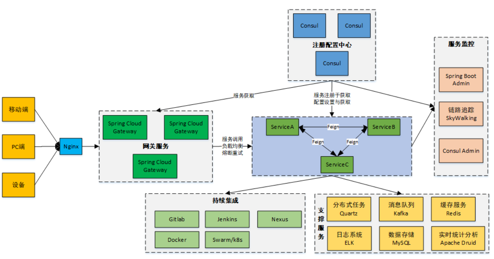
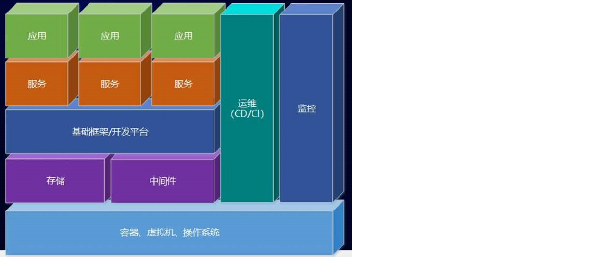
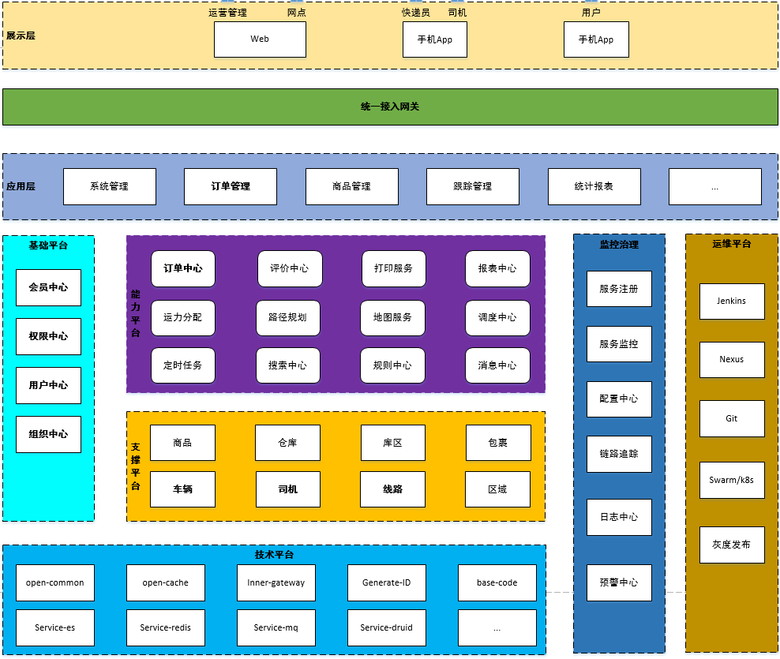
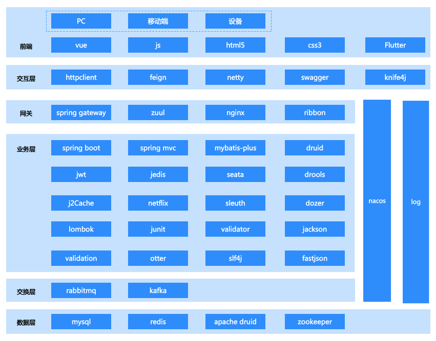
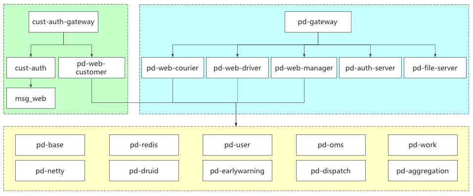

# 品达物流TMS项目

## 第12章 项目总结

### 1. 微服务架构

### 2. 软件架构体系

### 3. 系统架构

### 4. 技术架构

### 5. 业务流程

### 6. 数据库设计

| 数据库名       | 说明                                                         |
| -------------- | ------------------------------------------------------------ |
| pd_base        | 基础数据数据库，存储TMS项目中的基础数据，例如：货物类型、车辆类型、车队、线路、车次等基础数据 |
| pd_users       | 用户数据库，存储TMS项目中的C端用户相关数据，例如：用户信息、地址簿等数据 |
| pd_oms         | 订单数据库，存储TMS项目中的订单相关数据，例如：货物信息、订单信息、订单位置信息等数据 |
| pd_work        | 物流作业数据库，存储TMS项目中的运输作业相关数据，例如：快递员取派件任务、运输任务、司机作业单、运单等数据 |
| pd_aggregation | 数据聚合数据库，将其他业务数据库中的数据统一聚合到当前数据库，提供查询功能 |
| pd_dispatch    | 智能调度数据库，存储TMS项目中智能调度服务产生的相关数据，例如：订单分类、缓存路线等数据 |
| pd_auth        | 通用权限数据库，存储权限相关数据，例如：资源、菜单、权限、岗位、组织、角色等数据，此数据库存储的是企业内部员工用户相关数据 |
| customer_auth  | 通用C端用户数据库，存储C端登录用户相关数据，例如：用户认证信息、登录记录等数据 |

### 7. 服务列表

 

 

 

 