# 品达物流TMS项目

## 第2章 基础数据服务开发(pd-base)

### 1. 基础数据服务数据模型

本章要开发的是基础数据微服务，对应的maven工程为pd-base。基础数据微服务提供TMS中基础数据的维护功能，例如：货物类型、车型、车队、车辆、车次、线路类型、线路等的维护功能。

基础数据服务对应操作的数据库为pd_base数据库，本小节就来了解一下pd_base数据库中所有的数据表结构。

#### 1.1 pd_goods_type

pd_goods_type为货物类型表，结构如下：

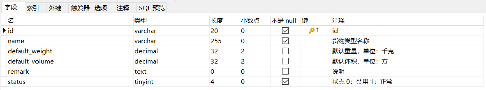

#### 1.2 pd_truck_type

pd_truck_type为车辆类型表，结构如下：

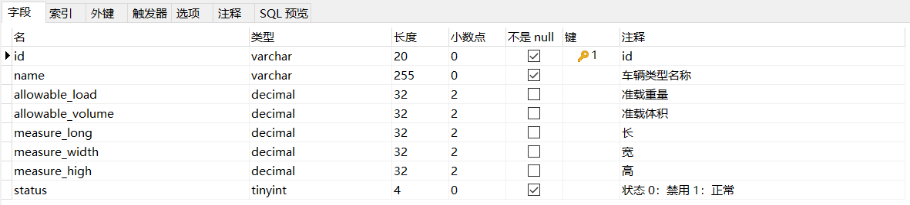

#### 1.3 pd_truck_type_goods_type

pd_truck_type_goods_type为车辆类型和货物类型关联表，结构如下：

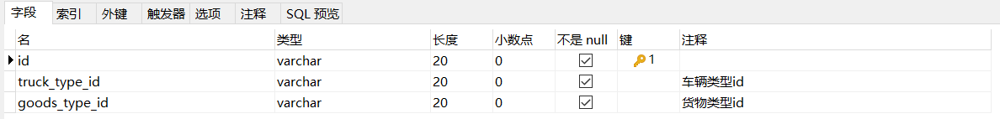

#### 1.4 pd_transport_line_type

pd_transport_line_type为线路类型表，结构如下：

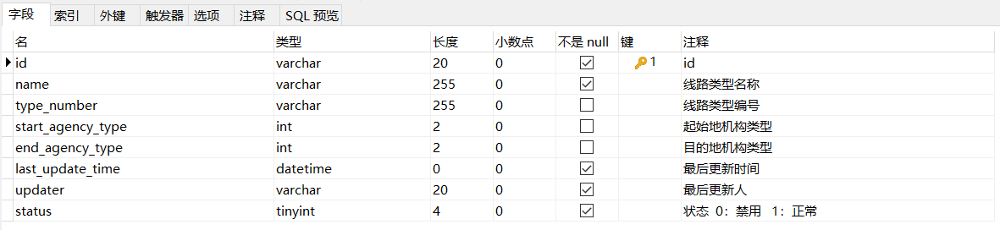

#### 1.5 pd_transport_line

pd_transport_line为运输线路表，结构如下：

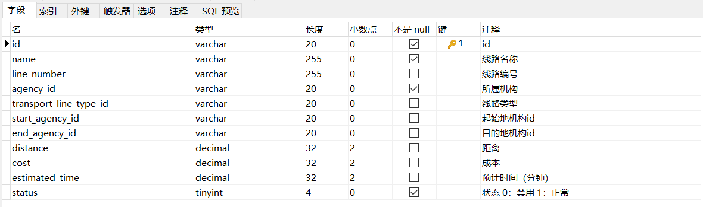

#### 1.6 pd_transport_trips

pd_transport_trips为车次表，结构如下：

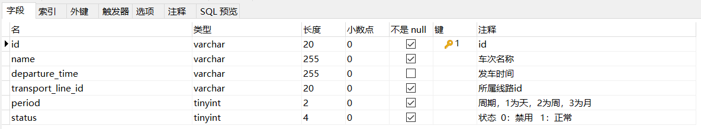

#### 1.7 pd_fleet

pd_fleet为车队表，结构如下：

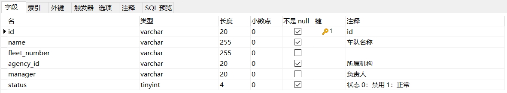

#### 1.8 pd_truck_driver

pd_truck_driver为司机表，结构如下：

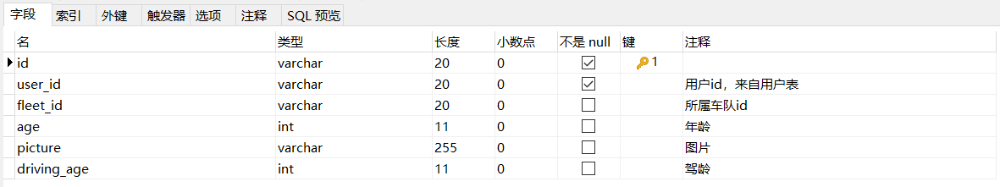

#### 1.9 pd_transport_trips_truck_driver

pd_transport_trips_truck_driver为车次和司机关系表，结构如下：

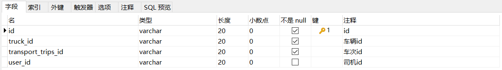

#### 1.10 pd_truck_license

pd_truck_license为车辆行驶证信息表，结构如下：

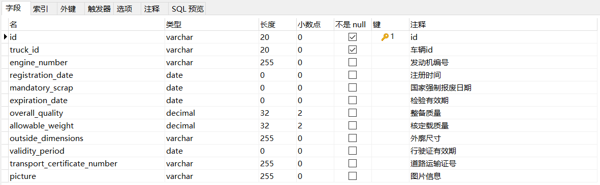

#### 1.11 pd_truck_driver_license

pd_truck_driver_license为司机驾驶证信息表，结构如下：

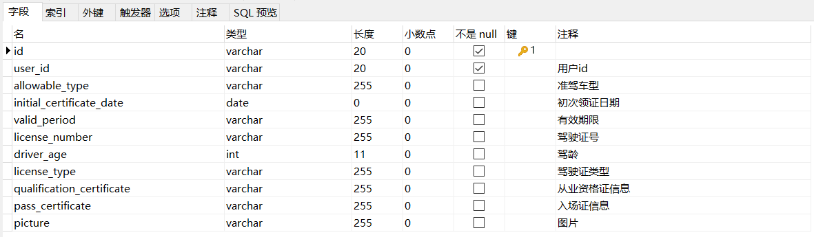

#### 1.12 pd_agency_scope

pd_agency_scope为结构作业范围表，结构如下：

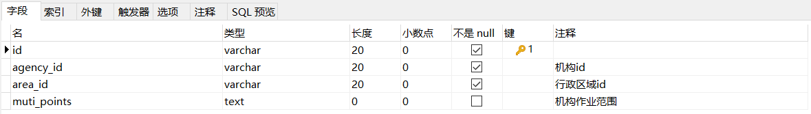

#### 1.13 pd_truck

pd_truck为车辆表，结构如下：

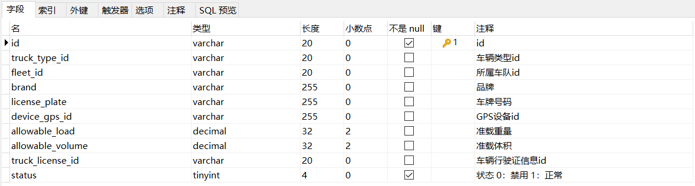

#### 1.14 pd_courier_scop

pd_courier_scop为快递员作业范围表，结构如下：

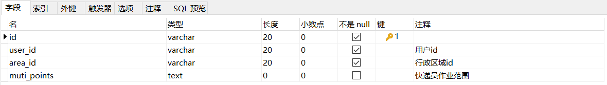

### 2. 基础数据微服务开发准备

#### 2.1 SpringBoot配置文件

bootstrap.yml：

```
server:
  tomcat:
    uri-encoding: UTF-8
    max-threads: 1000
    min-spare-threads: 30
  port: 8185
  connection-timeout: 50000ms
#  servlet:
#    context-path: /pd-base

spring:
  application:
    name: pd-base
  # 环境 dev|test|prod
  profiles:
    active: dev
  main:
    allow-bean-definition-overriding: true
```

bootstrap-dev.yml：

```
spring:
  cloud:
    nacos:
      username: tms
      password: itheima123
      discovery:
        server-addr: 68.79.63.42:8848
        group: pinda-tms
        namespace: 6107f553-3214-48d8-89c3-945f8446e3d9
      config:
        server-addr: 68.79.63.42:8848
        file-extension: yml
        group: pinda-tms
        namespace: 6107f553-3214-48d8-89c3-945f8446e3d9

  # jackson时间格式化
  jackson:
    time-zone: ${spring.jackson.time-zone}
    date-format: ${spring.jackson.date-format}
  servlet:
    multipart:
      max-file-size: ${spring.servlet.multipart.max-file-size}
      max-request-size: ${spring.servlet.multipart.max-request-size}
      enabled: ${spring.servlet.multipart.enabled}

  datasource:
      druid:
          type: ${spring.datasource.druid.type}
          driver-class-name: ${spring.datasource.druid.driver-class-name}
          url: ${spring.datasource.druid.url}
          username: ${spring.datasource.druid.username}
          password: ${spring.datasource.druid.password}
          initial-size: ${spring.datasource.druid.initial-size}
          max-active: ${spring.datasource.druid.max-active}
          min-idle: ${spring.datasource.druid.min-idle}
          max-wait: ${spring.datasource.druid.max-wait}
          pool-prepared-statements: ${spring.datasource.druid.pool-prepared-statements}
          max-pool-prepared-statement-per-connection-size: ${spring.datasource.druid.max-pool-prepared-statement-per-connection-size}
          time-between-eviction-runs-millis: ${spring.datasource.druid.time-between-eviction-runs-millis}
          min-evictable-idle-time-millis: ${spring.datasource.druid.min-evictable-idle-time-millis}
          test-while-idle: ${spring.datasource.druid.test-while-idle}
          test-on-borrow: ${spring.datasource.druid.test-on-borrow}
          test-on-return: ${spring.datasource.druid.test-on-return}
          stat-view-servlet:
              enabled: ${spring.datasource.druid.stat-view-servlet.stat-view-servlet}
              url-pattern: ${spring.datasource.druid.stat-view-servlet.url-pattern}
          filter:
              stat:
                  log-slow-sql: ${spring.datasource.druid.filter.stat.log-slow-sql}
                  slow-sql-millis: ${spring.datasource.druid.filter.stat.slow-sql-millis}
                  merge-sql: ${spring.datasource.druid.filter.stat.merge-sql}
              wall:
                  config:
                      multi-statement-allow: ${spring.datasource.druid.filter.wall.config.multi-statement-allow}


#mybatis
mybatis-plus:
  mapper-locations: ${mybatis-plus.mapper-locations}
  #实体扫描，多个package用逗号或者分号分隔
  typeAliasesPackage: ${mybatis-plus.typeAliasesPackage}
  global-config:
    #数据库相关配置
    db-config:
      #主键类型  AUTO:"数据库ID自增", INPUT:"用户输入ID", ID_WORKER:"全局唯一ID (数字类型唯一ID)", UUID:"全局唯一ID UUID";
      id-type: ${mybatis-plus.global-config.db-config.id-type}
      #字段策略 IGNORED:"忽略判断",NOT_NULL:"非 NULL 判断"),NOT_EMPTY:"非空判断"
      field-strategy: ${mybatis-plus.global-config.db-config.field-strategy}
      #驼峰下划线转换
      column-underline: ${mybatis-plus.global-config.db-config.column-underline}
      logic-delete-value: ${mybatis-plus.global-config.db-config.logic-delete-value}
      logic-not-delete-value: ${mybatis-plus.global-config.db-config.logic-not-delete-value}
    banner: ${mybatis-plus.global-config.banner}

  #原生配置
  configuration:
    map-underscore-to-camel-case: ${mybatis-plus.configuration.map-underscore-to-camel-case}
    cache-enabled: ${mybatis-plus.configuration.cache-enabled}
    call-setters-on-nulls: ${mybatis-plus.configuration.call-setters-on-nulls}
    jdbc-type-for-null: ${mybatis-plus.configuration.jdbc-type-for-null}
    log-impl: org.apache.ibatis.logging.stdout.StdOutImpl
```

#### 2.2 服务启动类

```
package com.itheima.pinda;

import org.springframework.boot.SpringApplication;
import org.springframework.boot.autoconfigure.SpringBootApplication;
import org.springframework.cloud.client.discovery.EnableDiscoveryClient;
import springfox.documentation.swagger2.annotations.EnableSwagger2;

@SpringBootApplication
@EnableDiscoveryClient
public class BaseApplication {

    public static void main(String[] args) {
        SpringApplication.run(BaseApplication.class, args);
    }

}
```

#### 2.3 配置类

```
package com.itheima.pinda.config;

import com.baomidou.mybatisplus.extension.plugins.PaginationInterceptor;
import org.springframework.context.annotation.Bean;
import org.springframework.context.annotation.Configuration;

@Configuration
public class MybatisPlusConfig {
    @Bean
    public PaginationInterceptor paginationInterceptor() {
        return new PaginationInterceptor();
    }
}
package com.itheima.pinda.config;

import org.springframework.context.annotation.Bean;
import org.springframework.context.annotation.Configuration;
import org.springframework.web.servlet.config.annotation.ResourceHandlerRegistry;
import org.springframework.web.servlet.config.annotation.WebMvcConfigurationSupport;
import springfox.documentation.builders.ApiInfoBuilder;
import springfox.documentation.builders.PathSelectors;
import springfox.documentation.builders.RequestHandlerSelectors;
import springfox.documentation.service.ApiInfo;
import springfox.documentation.spi.DocumentationType;
import springfox.documentation.spring.web.plugins.Docket;
import springfox.documentation.swagger2.annotations.EnableSwagger2;

@Configuration
@EnableSwagger2
public class SwaggerConfig extends WebMvcConfigurationSupport {

  // 定义分隔符
  private static final String splitor = ";";
  @Bean
  public Docket createRestApi() {
    // 文档类型
    return new Docket(DocumentationType.SWAGGER_2)
        // 创建api的基本信息
        .apiInfo(apiInfo())
        // 选择哪些接口去暴露
        .select()
        // 扫描的包
        .apis(RequestHandlerSelectors.basePackage("com.itheima.pinda.controller"))
        .paths(PathSelectors.any())
        .build();
  }

  private ApiInfo apiInfo() {
    return new ApiInfoBuilder()
        .title("品达物流管理后台基础数据--Swagger文档")
        .version("1.0")
        .build();
  }

  /**
   * 防止@EnableMvc把默认的静态资源路径覆盖了，手动设置的方式
   *
   * @param registry
   */
  @Override
  protected void addResourceHandlers(ResourceHandlerRegistry registry) {
    // 解决静态资源无法访问
    registry.addResourceHandler("/**").addResourceLocations("classpath:/static/");
    // 解决swagger无法访问
    registry.addResourceHandler("/swagger-ui.html").addResourceLocations("classpath:/META-INF/resources/");
    // 解决swagger的js文件无法访问
    registry.addResourceHandler("/webjars/**").addResourceLocations("classpath:/META-INF/resources/webjars/");

  }
}
```

#### 2.4 Id生成器

```
package com.itheima.pinda.common;

import com.baomidou.mybatisplus.core.incrementer.IdentifierGenerator;
import com.itheima.pinda.common.utils.IdWorker;
import org.springframework.beans.factory.annotation.Autowired;
import org.springframework.context.annotation.Bean;
import org.springframework.stereotype.Component;

/**
 * 自定义ID生成器
 */
@Component
public class CustomIdGenerator implements IdentifierGenerator {
    @Bean
    public IdWorker idWorker(){
        return new IdWorker(1, 1);
    }
    
    @Autowired
    private IdWorker idWorker;

    @Override
    public Long nextId(Object entity) {
        return idWorker.nextId();
    }
}
```

### 3. 货物类型管理

#### 3.1 业务需求和产品原型

货物类型是TMS的基础数据，表示物流货物的类别，例如：服饰、食品、数码产品等类型。

产品原型如下：

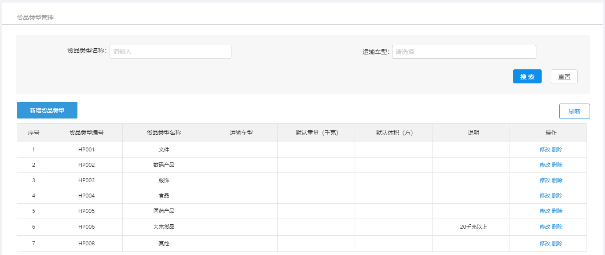

 

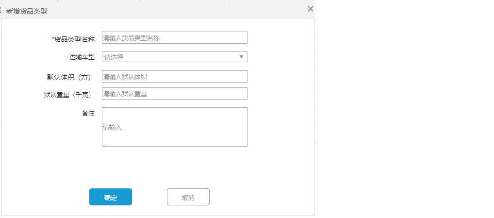

#### 3.2 数据模型

货物类型对应的数据模型为：pd_base数据库中的pd_goods_type表，表结构如下：


#### 3.3 导入实体类

```
package com.itheima.pinda.entity.base;

import java.io.Serializable;
import java.math.BigDecimal;
import com.baomidou.mybatisplus.annotation.IdType;
import com.baomidou.mybatisplus.annotation.TableId;
import com.baomidou.mybatisplus.annotation.TableName;
import lombok.Data;
import lombok.EqualsAndHashCode;
import lombok.experimental.Accessors;

/**
 * 货物类型
 */
@Data
@TableName("pd_goods_type")
public class PdGoodsType implements Serializable {

    private static final long serialVersionUID = 1L;
    /**
     * id
     */
    @TableId(value = "id", type = IdType.INPUT)
    private String id;
    /**
     * 货物类型名称
     */
    private String name;
    /**
     * 默认重量，单位：千克
     */
    private BigDecimal defaultWeight;
    /**
     * 默认体积，单位：方
     */
    private BigDecimal defaultVolume;
    /**
     * 说明
     */
    private String remark;
    /**
     * 状态 0：禁用 1：正常
     */
    private Integer status;
}
package com.itheima.pinda.entity.truck;

import java.io.Serializable;
import com.baomidou.mybatisplus.annotation.IdType;
import com.baomidou.mybatisplus.annotation.TableId;
import com.baomidou.mybatisplus.annotation.TableName;
import lombok.Data;

/**
 * 车辆类型与货物类型关联
 */
@Data
@TableName("pd_truck_type_goods_type")
public class PdTruckTypeGoodsType implements Serializable {

    private static final long serialVersionUID = 1L;
    /**
     * id
     */
    @TableId(value = "id", type = IdType.INPUT)
    private String id;
    /**
     * 车辆类型id
     */
    private String truckTypeId;

    /**
     * 货物类型id
     */
    private String goodsTypeId;
}
```

#### 3.4 服务接口开发

##### 3.4.1 新增货物类型

第一步：创建GoodsTypeController并提供saveGoodsType方法

```
package com.itheima.pinda.controller.base;

import com.itheima.pinda.DTO.base.GoodsTypeDto;
import com.itheima.pinda.common.utils.Constant;
import com.itheima.pinda.common.utils.PageResponse;
import com.itheima.pinda.common.utils.Result;
import com.itheima.pinda.entity.base.PdGoodsType;
import com.itheima.pinda.entity.truck.PdTruckTypeGoodsType;
import com.itheima.pinda.service.base.IPdGoodsTypeService;
import com.itheima.pinda.service.truck.IPdTruckTypeGoodsTypeService;
import org.springframework.beans.BeanUtils;
import org.springframework.beans.factory.annotation.Autowired;
import org.springframework.web.bind.annotation.*;
import java.util.List;
import java.util.stream.Collectors;
import io.swagger.annotations.Api;
import io.swagger.annotations.ApiOperation;

/**
 * 货物类型管理
 */
@RestController
@RequestMapping("base/goodsType")
@Api(tags = "货物类型管理")
public class GoodsTypeController {
    @Autowired
    private IPdGoodsTypeService goodsTypeService;
    @Autowired
    private IPdTruckTypeGoodsTypeService truckTypeGoodsTypeService;

    /**
     * 添加货物类型
     *
     * @param dto 货物类型信息
     * @return 货物类型信息
     */
    @PostMapping("")
    @ApiOperation(value = "添加货物类型")
    public GoodsTypeDto saveGoodsType(@RequestBody GoodsTypeDto dto) {
        PdGoodsType pdGoodsType = new PdGoodsType();
        BeanUtils.copyProperties(dto, pdGoodsType);
        pdGoodsType = goodsTypeService.saveGoodsType(pdGoodsType);
        String goodsTypeId = pdGoodsType.getId();
        if (dto.getTruckTypeIds() != null) {
            truckTypeGoodsTypeService.batchSave(dto.getTruckTypeIds().stream().map(truckTypeId -> {
                PdTruckTypeGoodsType truckTypeGoodsType = new PdTruckTypeGoodsType();
                truckTypeGoodsType.setTruckTypeId(truckTypeId);
                truckTypeGoodsType.setGoodsTypeId(goodsTypeId);
                return truckTypeGoodsType;
            }).collect(Collectors.toList()));
        }
        BeanUtils.copyProperties(pdGoodsType, dto);
        return dto;
    }

}
```

第二步：创建IPdGoodsTypeService和IPdTruckTypeGoodsTypeService接口

```
package com.itheima.pinda.service.base;

import com.baomidou.mybatisplus.extension.service.IService;
import com.itheima.pinda.entity.base.PdGoodsType;
import java.util.List;

/**
 * 货物类型
 */
public interface IPdGoodsTypeService extends IService<PdGoodsType> {
    /**
     * 添加货物类型
     *
     * @param pdGoodsType 货物类型信息
     * @return 货物类型信息
     */
    PdGoodsType saveGoodsType(PdGoodsType pdGoodsType);
}
package com.itheima.pinda.service.truck;

import com.baomidou.mybatisplus.extension.service.IService;
import com.itheima.pinda.entity.truck.PdTruckTypeGoodsType;
import java.util.List;

/**
 * 车辆类型与货物类型关联
 */
public interface IPdTruckTypeGoodsTypeService extends IService<PdTruckTypeGoodsType> {
    /**
     * 批量添加车辆类型与货物类型关联
     *
     * @param truckTypeGoodsTypeList 车辆类型与货物类型信息
     */
    void batchSave(List<PdTruckTypeGoodsType> truckTypeGoodsTypeList);
}
```

第三步：创建上面服务接口的实现类PdGoodsTypeServiceImpl和PdTruckTypeGoodsTypeServiceImpl

```
package com.itheima.pinda.service.base.impl;

import com.baomidou.mybatisplus.extension.service.impl.ServiceImpl;
import com.itheima.pinda.common.CustomIdGenerator;
import com.itheima.pinda.mapper.base.PdGoodsTypeMapper;
import com.itheima.pinda.entity.base.PdGoodsType;
import com.itheima.pinda.service.base.IPdGoodsTypeService;
import org.springframework.beans.factory.annotation.Autowired;
import org.springframework.stereotype.Service;
import java.util.List;

/**
 * 货物类型实现类
 */
@Service
public class PdGoodsTypeServiceImpl extends ServiceImpl<PdGoodsTypeMapper, PdGoodsType> implements IPdGoodsTypeService {
    @Autowired
    private CustomIdGenerator idGenerator;

    @Override
    public PdGoodsType saveGoodsType(PdGoodsType pdGoodsType) {
        pdGoodsType.setId(idGenerator.nextId(pdGoodsType) + "");
        baseMapper.insert(pdGoodsType);
        return pdGoodsType;
    }
}
package com.itheima.pinda.service.truck.impl;

import com.baomidou.mybatisplus.extension.service.impl.ServiceImpl;
import com.itheima.pinda.common.CustomIdGenerator;
import com.itheima.pinda.mapper.truck.PdTruckTypeGoodsTypeMapper;
import com.itheima.pinda.entity.truck.PdTruckTypeGoodsType;
import com.itheima.pinda.service.truck.IPdTruckTypeGoodsTypeService;
import org.apache.commons.lang.StringUtils;
import org.springframework.beans.factory.annotation.Autowired;
import org.springframework.stereotype.Service;
import java.util.List;

/**
 * 车辆类型与货物类型关联实现类
 */
@Service
public class PdTruckTypeGoodsTypeServiceImpl extends 
    ServiceImpl<PdTruckTypeGoodsTypeMapper, PdTruckTypeGoodsType>
        implements IPdTruckTypeGoodsTypeService {
    @Autowired
    private CustomIdGenerator idGenerator;

    @Override
    public void batchSave(List<PdTruckTypeGoodsType> truckTypeGoodsTypeList) {
        truckTypeGoodsTypeList.forEach(pdTruckTypeGoodsType -> pdTruckTypeGoodsType.setId(idGenerator.nextId(pdTruckTypeGoodsType) + ""));
        saveBatch(truckTypeGoodsTypeList);
    }
}
```

第四步：创建PdGoodsTypeMapper接口和PdTruckTypeGoodsTypeMapper接口

```
package com.itheima.pinda.mapper.base;

import com.baomidou.mybatisplus.core.mapper.BaseMapper;
import com.itheima.pinda.entity.base.PdGoodsType;
import org.apache.ibatis.annotations.Mapper;
import java.util.List;

/**
 * 物类型Mapper接口
 */
@Mapper
public interface PdGoodsTypeMapper extends BaseMapper<PdGoodsType> {
}
package com.itheima.pinda.mapper.truck;

import com.baomidou.mybatisplus.core.mapper.BaseMapper;
import com.itheima.pinda.entity.truck.PdTruckTypeGoodsType;
import org.apache.ibatis.annotations.Mapper;

/**
 * 车辆类型与货物类型关联Mapper接口
 */
@Mapper
public interface PdTruckTypeGoodsTypeMapper extends BaseMapper<PdTruckTypeGoodsType> {
}
```

第五步：创建上面Mapper接口对应的xml映射文件

文件位置：/resources/mapper/base/PdGoodsTypeMapper.xml

```
<?xml version="1.0" encoding="UTF-8"?>
<!DOCTYPE mapper PUBLIC "-//mybatis.org//DTD Mapper 3.0//EN" "http://mybatis.org/dtd/mybatis-3-mapper.dtd">
<mapper namespace="com.itheima.pinda.mapper.base.PdGoodsTypeMapper">
</mapper>
```

文件位置：/resources/mapper/truck/PdTruckTypeGoodsTypeMapper.xml

```
<?xml version="1.0" encoding="UTF-8"?>
<!DOCTYPE mapper PUBLIC "-//mybatis.org//DTD Mapper 3.0//EN" "http://mybatis.org/dtd/mybatis-3-mapper.dtd">
<mapper namespace="com.itheima.pinda.mapper.truck.PdTruckTypeGoodsTypeMapper">
</mapper>
```

##### 3.4.2 根据id查询货物类型

第一步：在GoodsTypeController中创建findById方法

```
/**
* 根据id查询货物类型
*
* @param id 货物类型id
* @return 货物类型信息
*/
@GetMapping("/{id}")
public GoodsTypeDto fineById(@PathVariable(name = "id") String id) {
    PdGoodsType pdGoodsType = goodsTypeService.getById(id);
    GoodsTypeDto dto = null;
    if (pdGoodsType != null) {
        dto = new GoodsTypeDto();
        BeanUtils.copyProperties(pdGoodsType, dto);
        dto.setTruckTypeIds(truckTypeGoodsTypeService.findAll(null, dto.getId()).stream().map(truckTypeGoodsType -> truckTypeGoodsType.getTruckTypeId()).collect(Collectors.toList()));
    }
    return dto;
}
```

第二步：在IPdTruckTypeGoodsTypeService接口中扩展findAll方法

```
/**
* 获取车辆类型与货物类型关联
*
* @param truckTypeId 车辆类型id
* @param goodsTypeId 货物类型id
* @return 车辆类型与货物类型关联
*/
List<PdTruckTypeGoodsType> findAll(String truckTypeId, String goodsTypeId);
```

第三步：在PdTruckTypeGoodsTypeServiceImpl实现类中实现findAll方法

```
@Override
public List<PdTruckTypeGoodsType> findAll(String truckTypeId, String goodsTypeId) {
    LambdaQueryWrapper<PdTruckTypeGoodsType> lambdaQueryWrapper = new LambdaQueryWrapper<>();
    if (StringUtils.isNotEmpty(truckTypeId)) {
        lambdaQueryWrapper.eq(PdTruckTypeGoodsType::getTruckTypeId, truckTypeId);
    }
    if (StringUtils.isNotEmpty(goodsTypeId)) {
        lambdaQueryWrapper.eq(PdTruckTypeGoodsType::getGoodsTypeId, goodsTypeId);
    }
    return baseMapper.selectList(lambdaQueryWrapper);
}
```

##### 3.4.3 查询所有货物类型

第一步：在GoodsTypeController中创建findAll方法

```
/**
* 查询所有货物类型
* @return
*/
@GetMapping("/all")
@ApiOperation(value = "查询所有货物类型")
public List<GoodsTypeDto> findAll() {
    List<PdGoodsType> goodsType = goodsTypeService.findAll();
    List<GoodsTypeDto> goodsTypeDtoList = goodsType.stream().map(item -> {
        GoodsTypeDto dto = new GoodsTypeDto();
        BeanUtils.copyProperties(item, dto);
        return dto;
    }).collect(Collectors.toList());
    return goodsTypeDtoList;
}
```

第二步：在IPdGoodsTypeService接口中扩展findAll方法

```
List<PdGoodsType> findAll();
```

第三步：在PdGoodsTypeServiceImpl中实现findAll方法

```
@Override
public List<PdGoodsType> findAll() {
    QueryWrapper<PdGoodsType> wrapper = new QueryWrapper<>();
    wrapper.eq("status",1);
    return baseMapper.selectList(wrapper);
}
```

##### 3.4.4 分页查询货物类型

第一步：在GoodsTypeController中创建findByPage方法

```
/**
* 获取分页货物类型数据
*
* @param page          页码
* @param pageSize      页尺寸
* @param name          货物类型名称
* @param truckTypeId   车辆类型Id
* @param truckTypeName 车辆类型名称
* @return
*/
@GetMapping("/page")
@ApiOperation(value = "获取分页货物类型数据")
public PageResponse<GoodsTypeDto> findByPage(
    @RequestParam(name = "page") Integer page,
    @RequestParam(name = "pageSize") Integer pageSize,
    @RequestParam(name = "name", required = false) String name,
    @RequestParam(name = "truckTypeId", required = false) String truckTypeId,
    @RequestParam(name = "truckTypeName", required = false) String truckTypeName) {
    IPage<PdGoodsType> goodsTypePage = goodsTypeService.findByPage(page, pageSize, name, truckTypeId, truckTypeName);
    List<GoodsTypeDto> goodsTypeDtoList = goodsTypePage.getRecords().stream().map(goodsType -> {
        GoodsTypeDto dto = new GoodsTypeDto();
        BeanUtils.copyProperties(goodsType, dto);
        dto.setTruckTypeIds(truckTypeGoodsTypeService.findAll(null, dto.getId()).stream().map(truckTypeGoodsType -> truckTypeGoodsType.getTruckTypeId()).collect(Collectors.toList()));
        return dto;
    }).collect(Collectors.toList());
    return PageResponse.<GoodsTypeDto>builder().items(goodsTypeDtoList).counts(goodsTypePage.getTotal()).page(page).pages(goodsTypePage.getPages()).pagesize(pageSize).build();
}
```

第二步：在IPdGoodsTypeService接口中扩展findByPage方法

```
/**
* 获取分页货物类型数据
* @param page 页码
* @param pageSize 页尺寸
* @return 分页货物数据
*/
IPage<PdGoodsType> findByPage(Integer page, Integer pageSize,String name,String truckTypeId,String truckTypeName);
```

第三步：在PdGoodsTypeServiceImpl实现类中实现findByPage方法

```
@Override
public IPage<PdGoodsType> findByPage(Integer page, Integer pageSize, String name, String truckTypeId, String truckTypeName) {
    Page<PdGoodsType> iPage = new Page(page, pageSize);
    iPage.addOrder(OrderItem.asc("id"));
    iPage.setRecords(baseMapper.findByPage(iPage, name, truckTypeId, truckTypeName));
    return iPage;
}
```

第四步：在PdGoodsTypeMapper接口中创建findByPage方法

```
List<PdGoodsType> findByPage(Page<PdGoodsType> page, 
                             @Param("name")String name,
                             @Param("truckTypeId")String truckTypeId,
                             @Param("truckTypeName")String truckTypeName);
```

第五步：在PdGoodsTypeMapper.xml中提供sql

```
<select id="findByPage" resultType="com.itheima.pinda.entity.base.PdGoodsType">
    SELECT
    goods_type.*
    FROM
    pd_goods_type goods_type
    <if test="truckTypeId != null || truckTypeName != null">
        LEFT JOIN pd_truck_type_goods_type truck_type_goods_type ON goods_type.id = truck_type_goods_type.goods_type_id
    </if>
    <if test="truckTypeName != null">
        LEFT JOIN pd_truck_type truck_type ON   truck_type_goods_type.truck_type_id=truck_type.id
    </if>
    <where>
        goods_type.status=1
        <if test="truckTypeName != null">
            AND truck_type.status=1
        </if>
        <if test="name != null">
            AND goods_type.name LIKE "%"#{name}"%"
        </if>
        <if test="truckTypeId != null">
            AND truck_type_goods_type.truck_type_id = #{truckTypeId}
        </if>
        <if test="truckTypeName != null">
            AND truck_type.name LIKE "%"#{truckTypeName}"%"
        </if>
    </where>
</select>
```

##### 3.4.5 查询货物类型列表

第一步：在GoodsTypeController中创建findAll方法

```
/**
* 获取货物类型列表
*
* @return 货物类型列表
*/
@GetMapping("")
@ApiOperation(value = "获取货物类型列表")
public List<GoodsTypeDto> findAll(@RequestParam(name = "ids", required = false) List<String> ids) {
    return goodsTypeService.findAll(ids).stream().map(pdGoodsType -> {
        GoodsTypeDto dto = new GoodsTypeDto();
        BeanUtils.copyProperties(pdGoodsType, dto);
        dto.setTruckTypeIds(truckTypeGoodsTypeService.findAll(null, dto.getId()).stream().map(truckTypeGoodsType -> truckTypeGoodsType.getTruckTypeId()).collect(Collectors.toList()));
        return dto;
    }).collect(Collectors.toList());
}
```

第二步：在IPdGoodsTypeService接口中扩展findAll方法

```
/**
* 获取货物类型列表
* @param ids 货物类型id
* @return 货物类型列表
*/
List<PdGoodsType> findAll(List<String> ids);
```

第三步：在PdGoodsTypeServiceImpl实现类中实现findAll方法

```
@Override
public List<PdGoodsType> findAll(List<String> ids) {
    LambdaQueryWrapper<PdGoodsType> lambdaQueryWrapper = new LambdaQueryWrapper<>();
    if (ids != null && ids.size() > 0) {
        lambdaQueryWrapper.in(PdGoodsType::getId, ids);
    }
    return baseMapper.selectList(lambdaQueryWrapper);
}
```

##### 3.4.6 更新货物类型

第一步：在GoodsTypeController中创建update方法

```
/**
* 更新货物类型信息
*
* @param dto 货物类型信息
* @return 货物类型信息
*/
@PutMapping("/{id}")
@ApiOperation(value = "更新货物类型信息")
public GoodsTypeDto update(@PathVariable(name = "id") String id, @RequestBody GoodsTypeDto dto) {
    dto.setId(id);
    PdGoodsType pdGoodsType = new PdGoodsType();
    BeanUtils.copyProperties(dto, pdGoodsType);
    goodsTypeService.updateById(pdGoodsType);
    if (dto.getTruckTypeIds() != null) {
        truckTypeGoodsTypeService.delete(null, id);
        truckTypeGoodsTypeService.batchSave(dto.getTruckTypeIds().stream().map(truckTypeId -> {
            PdTruckTypeGoodsType truckTypeGoodsType = new PdTruckTypeGoodsType();
            truckTypeGoodsType.setTruckTypeId(truckTypeId);
            truckTypeGoodsType.setGoodsTypeId(id);
            return truckTypeGoodsType;
        }).collect(Collectors.toList()));
    }
    return dto;
}
```

第二步：在IPdTruckTypeGoodsTypeService接口中扩展delete方法

```
/**
* 删除关联关系
*
* @param truckTypeId 车辆类型id
* @param goodsTypeId 货物类型id
*/
void delete(String truckTypeId, String goodsTypeId);
```

第三步：在PdTruckTypeGoodsTypeServiceImpl实现类中实现delete方法

```
@Override
public void delete(String truckTypeId, String goodsTypeId) {
    LambdaQueryWrapper<PdTruckTypeGoodsType> lambdaQueryWrapper = new LambdaQueryWrapper<>();
    boolean canExecute = false;
    if (StringUtils.isNotEmpty(truckTypeId)) {
        lambdaQueryWrapper.eq(PdTruckTypeGoodsType::getTruckTypeId, truckTypeId);
        canExecute = true;
    }
    if (StringUtils.isNotEmpty(goodsTypeId)) {
        lambdaQueryWrapper.eq(PdTruckTypeGoodsType::getGoodsTypeId, goodsTypeId);
        canExecute = true;
    }
    if (canExecute) {
        baseMapper.delete(lambdaQueryWrapper);
    }
}
```

##### 3.4.7 删除货物类型

注意：此处删除货物类型为`逻辑删除`

在GoodsTypeController中创建disable方法

```
/**
* 删除货物类型
*
* @param id 货物类型id
* @return 返回信息
*/
@PutMapping("/{id}/disable")
@ApiOperation(value = "删除货物类型")
public Result disable(@PathVariable(name = "id") String id) {
    PdGoodsType pdGoodsType = new PdGoodsType();
    pdGoodsType.setId(id);
    pdGoodsType.setStatus(Constant.DATA_DISABLE_STATUS);
    goodsTypeService.updateById(pdGoodsType);
    return Result.ok();
}
```

### 4. 数据校验

#### 4.1 数据校验方式

前面我们已经完成了基础数据服务中货物类型相关接口的开发，但是现在还存在一个问题就是数据没有进行合法性校验，例如货物类型的名称和状态都不能为空。那么如何进行数据的合法性校验呢？

整体来说，数据合法性校验可以分为前端实现和后端实现。前端校验主要是通过JavaScript实现，后端校验可以通过一些校验框架实现。

- 前端校验：主要是提高用户体验
- 后端校验：主要是保证数据安全可靠

由于我们开发的是后端（服务端），所以只需要进行后端校验即可。

#### 4.2 hibernate validator介绍

校验参数基本上是一个体力活，而且冗余代码繁多，也影响代码的可读性，我们需要一个比较优雅的方式来解决这个问题。Hibernate Validator 框架刚好解决了这个问题，可以以很优雅的方式实现参数的校验，让业务代码和校验逻辑分开,不再编写重复的校验逻辑。

hibernate-validator优势：

- 验证逻辑与业务逻辑之间进行了分离，降低了程序耦合度
- 统一且规范的验证方式，无需你再次编写重复的验证代码
- 你将更专注于你的业务，将这些繁琐的事情统统丢在一边

hibernate-validator的maven坐标：

```
<dependency>
      <groupId>org.hibernate</groupId>
      <artifactId>hibernate-validator</artifactId>
      <version>6.0.18.Final</version>
</dependency>
```

 

注：在springboot项目中如果已经导入了spring-boot-starter-web的maven坐标，就不需要再显示的导入hibernate-validator的maven坐标了，因为在spring-boot-starter-web中已经通过maven的依赖传递特性传递过来了hibernate-validator的maven坐标，如下图：

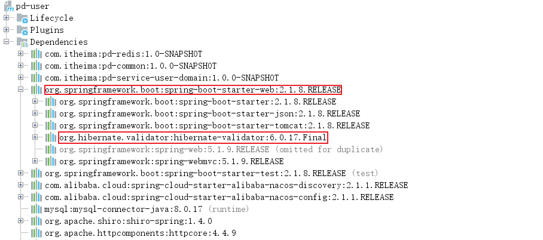

#### 4.3 hibernate-validator常用注解

hibernate-validator提供的校验方式为在类的属性上加入相应的注解来达到校验的目的。hibernate-validator提供的用于校验的注解如下：

| 注解                      | 说明                                                         |
| ------------------------- | ------------------------------------------------------------ |
| @AssertTrue               | 用于boolean字段，该字段只能为true                            |
| @AssertFalse              | 用于boolean字段，该字段只能为false                           |
| @CreditCardNumber         | 对信用卡号进行一个大致的验证                                 |
| @DecimalMax               | 只能小于或等于该值                                           |
| @DecimalMin               | 只能大于或等于该值                                           |
| @Email                    | 检查是否是一个有效的email地址                                |
| @Future                   | 检查该字段的日期是否是属于将来的日期                         |
| @Length(min=,max=)        | 检查所属的字段的长度是否在min和max之间,只能用于字符串        |
| @Max                      | 该字段的值只能小于或等于该值                                 |
| @Min                      | 该字段的值只能大于或等于该值                                 |
| @NotNull                  | 不能为null                                                   |
| @NotBlank                 | 不能为空，检查时会将空格忽略                                 |
| @NotEmpty                 | 不能为空，这里的空是指空字符串                               |
| @Pattern(regex=)          | 被注释的元素必须符合指定的正则表达式                         |
| @URL(protocol=,host,port) | 检查是否是一个有效的URL，如果提供了protocol，host等，则该URL还需满足提供的条件 |

#### 4.4 使用hibernate-validator进行校验

第一步：修改GoodsTypeDto，为name和status属性加入hibernate-validator注解进行数据校验

```
/**
* 货物类型名称
*/
@ApiModelProperty("物品类型名称")
@NotNull
private String name;

/**
* 状态 0：禁用 1：正常
*/
@ApiModelProperty("状态 0：禁用 1：正常")
@NotNull
@Max(value = 1)
@Min(value = 0)
private Integer status;
```

第二步：修改GoodsTypeController，开启校验

```
/**
* 添加货物类型
*
* @param dto 货物类型信息
* @return 货物类型信息
*/
@PostMapping("")
public GoodsTypeDto saveGoodsType(@Validated @RequestBody GoodsTypeDto dto) {
    ...
}
```

### 5. 导入基础数据服务其他代码

直接导入资料中提供的基础数据服务其他模块代码即可，代码位置:`资料\基础数据服务(pd-base)代码导入`