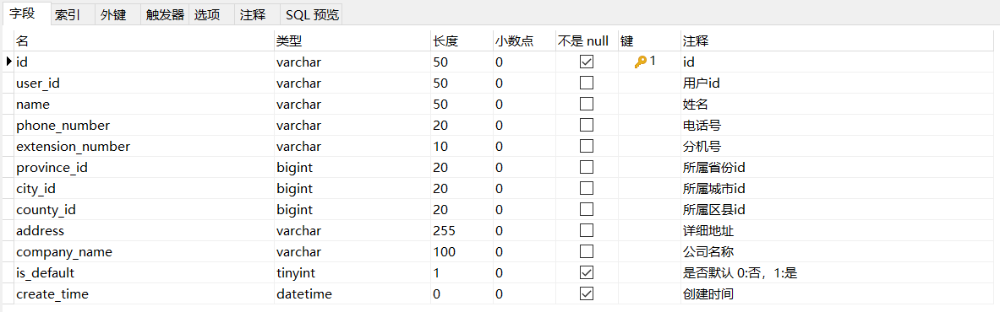
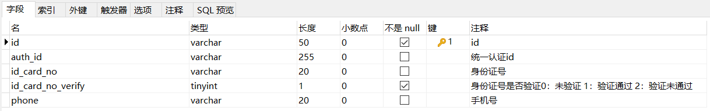
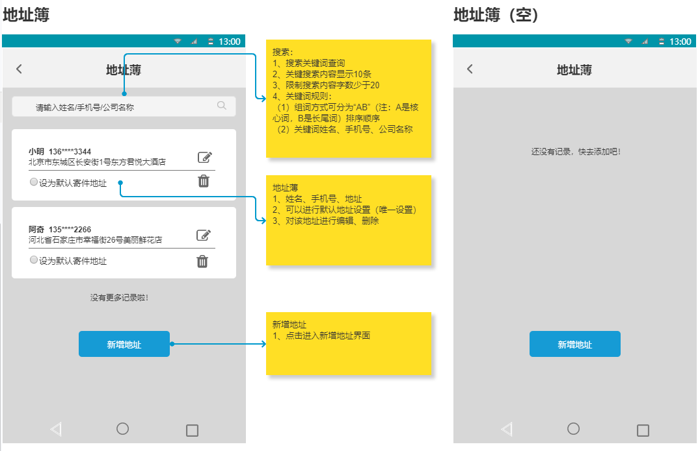
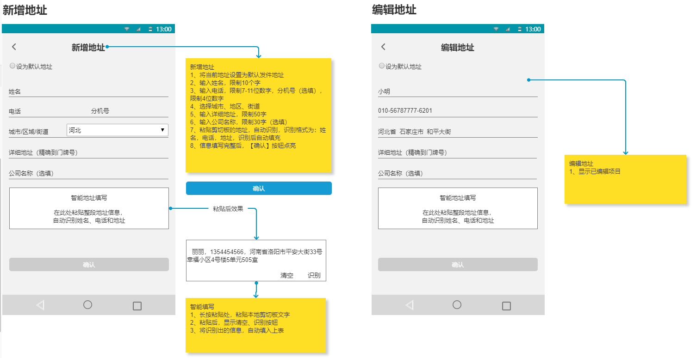
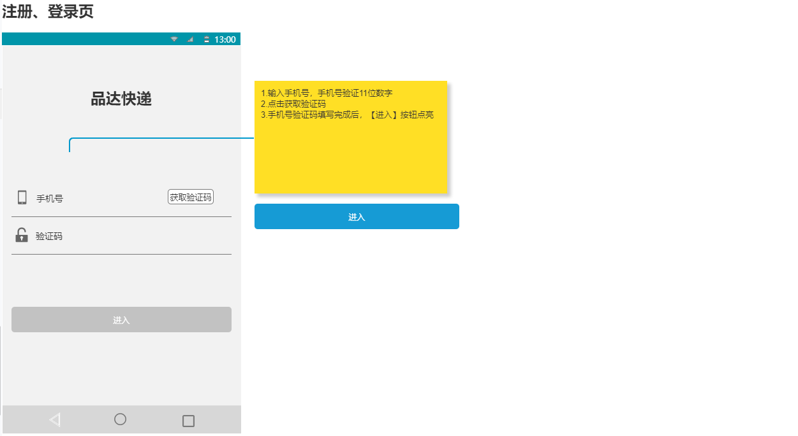
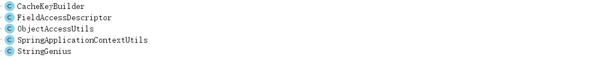
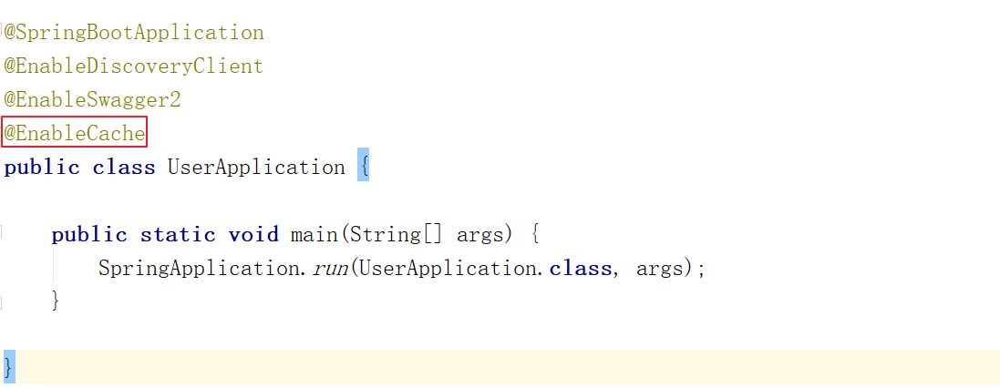

# 品达物流TMS项目

## 第3章 用户服务开发(pd-user)

### 1. j2cache多级缓存

#### 1.1 j2cache介绍

j2cache是OSChina目前正在使用的两级缓存框架。

j2cache的两级缓存结构：

- L1： 进程内缓存 caffeine/ehcache
- L2： 集中式缓存 Redis/Memcached

j2cache其实并不是在重复造轮子，而是作资源整合，即将Ehcache、Caffeine、redis、Spring Cache等进行整合。

由于大量的缓存读取会导致L2的网络成为整个系统的瓶颈，因此L1的目标是降低对L2的读取次数。该缓存框架主要用于集群环境中。单机也可使用，用于避免应用重启导致的ehcache缓存数据丢失。

j2cache从1.3.0版本开始支持JGroups和Redis Pub/Sub两种方式进行缓存事件的通知。

数据读取顺序 -> L1 -> L2 -> DB

使用j2cache需要导入的maven坐标：

```
<dependency>
    <groupId>net.oschina.j2cache</groupId>
    <artifactId>j2cache-spring-boot2-starter</artifactId>
    <version>2.8.0-release</version>
</dependency>
<dependency>
    <groupId>net.oschina.j2cache</groupId>
    <artifactId>j2cache-core</artifactId>
    <version>2.8.0-release</version>
    <exclusions>
        <exclusion>
            <groupId>org.slf4j</groupId>
            <artifactId>slf4j-simple</artifactId>
        </exclusion>
        <exclusion>
            <groupId>org.slf4j</groupId>
            <artifactId>slf4j-api</artifactId>
        </exclusion>
    </exclusions>
</dependency>
```

#### 1.2 j2cache入门案例

第一步：创建maven工程j2cache_demo并配置pom.xml文件

```
<?xml version="1.0" encoding="UTF-8"?>
<project xmlns="http://maven.apache.org/POM/4.0.0"
         xmlns:xsi="http://www.w3.org/2001/XMLSchema-instance"
         xsi:schemaLocation="http://maven.apache.org/POM/4.0.0 
                             http://maven.apache.org/xsd/maven-4.0.0.xsd">
    <modelVersion>4.0.0</modelVersion>
    <parent>
        <groupId>org.springframework.boot</groupId>
        <artifactId>spring-boot-starter-parent</artifactId>
        <version>2.2.2.RELEASE</version>
        <relativePath/>
    </parent>
    <groupId>cn.itcast</groupId>
    <artifactId>j2cache_demo</artifactId>
    <version>1.0-SNAPSHOT</version>
    <dependencies>
        <dependency>
            <groupId>org.springframework.boot</groupId>
            <artifactId>spring-boot-starter-web</artifactId>
        </dependency>
        <dependency>
            <groupId>net.oschina.j2cache</groupId>
            <artifactId>j2cache-spring-boot2-starter</artifactId>
            <version>2.8.0-release</version>
        </dependency>
        <dependency>
            <groupId>net.oschina.j2cache</groupId>
            <artifactId>j2cache-core</artifactId>
            <version>2.8.0-release</version>
            <exclusions>
                <exclusion>
                    <groupId>org.slf4j</groupId>
                    <artifactId>slf4j-simple</artifactId>
                </exclusion>
                <exclusion>
                    <groupId>org.slf4j</groupId>
                    <artifactId>slf4j-api</artifactId>
                </exclusion>
            </exclusions>
        </dependency>
    </dependencies>
</project>
```

第二步：创建application.yml

```
server:
  port: 9000
pinda:
  redis:
    ip: 127.0.0.1
    port: 6379
    password: 
    database: 0
spring:
  redis:
    host: ${pinda.redis.ip}
    password: ${pinda.redis.password}
    port: ${pinda.redis.port}
    database: ${pinda.redis.database}

j2cache:
  cache-clean-mode: passive
  allow-null-values: true
  redis-client: lettuce #指定redis客户端使用lettuce，也可以使用Jedis
  l2-cache-open: true #开启二级缓存
  broadcast: net.oschina.j2cache.cache.support.redis.SpringRedisPubSubPolicy
  #  broadcast: jgroups
  L1: #指定一级缓存提供者为caffeine
    provider_class: caffeine 
  L2: #指定二级缓存提供者为redis
    provider_class: net.oschina.j2cache.cache.support.redis.SpringRedisProvider
    config_section: lettuce
  sync_ttl_to_redis: true
  default_cache_null_object: false
  serialization: fst  #序列化方式：fst、kyro、Java
caffeine:
  properties: /caffeine.properties   # 这个配置文件需要放在项目中
lettuce:
  mode: single
  namespace:
  storage: generic
  channel: j2cache
  scheme: redis
  hosts: ${pinda.redis.ip}:${pinda.redis.port}
  password: ${pinda.redis.password}
  database: ${pinda.redis.database}
  sentinelMasterId:
  maxTotal: 100
  maxIdle: 10
  minIdle: 10
  timeout: 10000
```

第三步：创建/resources/caffeine.properties文件

```
#########################################
# Caffeine configuration
# [name] = size, xxxx[s|m|h|d]
#########################################
default=2000, 2h
rx=50, 2h
```

第四步：创建MyController

```
package cn.itcast.controller;

import net.oschina.j2cache.CacheChannel;
import net.oschina.j2cache.CacheObject;
import org.springframework.beans.factory.annotation.Autowired;
import org.springframework.web.bind.annotation.GetMapping;
import org.springframework.web.bind.annotation.RequestMapping;
import org.springframework.web.bind.annotation.RestController;
import java.util.ArrayList;
import java.util.List;

@RestController
@RequestMapping("/cache")
public class MyController {
    private String key = "myKey";
    private String region="rx";
    @Autowired
    private CacheChannel cacheChannel;

    @GetMapping("/getInfos")
    public List<String> getInfos(){
        CacheObject cacheObject = cacheChannel.get(region, key);
        if(cacheObject.getValue() == null){
            //缓存中没有找到，查询数据库获得
            List<String> data = new ArrayList<String>();
            data.add("info1");
            data.add("info2");
            //放入缓存
            cacheChannel.set(region,key,data);
            return data;
        }
        return (List<String>) cacheObject.getValue();
    }

    //清理指定缓存
    @GetMapping("/evict")
    public String evict(){
        cacheChannel.evict(region,key);
        return "evict success";
    }

    //检测存在那级缓存
    @GetMapping("/check")
    public String check(){
        int check = cacheChannel.check(region, key);
        return "level:" + check;
    }

    //检测缓存数据是否存在
    @GetMapping("/exists")
    public String exists(){
        boolean exists = cacheChannel.exists(region, key);
        return "exists:" + exists;
    }

    //清理指定区域的缓存
    @GetMapping("/clear")
    public String clear(){
        cacheChannel.clear(region);
        return "clear success";
    }
}
```

第五步：创建启动类

```
package cn.itcast;

import org.springframework.boot.SpringApplication;
import org.springframework.boot.autoconfigure.SpringBootApplication;

@SpringBootApplication
public class J2CacheApp {
    public static void main(String[] args) {
        SpringApplication.run(J2CacheApp.class,args);
    }
}
```

注意：由于我们当前第二级缓存使用的是redis，所以需要启动redis服务才能正常运行入门案例。

启动项目，访问地址：http://localhost:9000/cache/getInfos

可以发现redis中已经缓存了数据：


 

重启项目，由于j2cache的一级缓存（caffeine）是进程级缓存，重启后一级缓存消失。但是二级缓存（redis）的数据还存在，再次访问上面地址，通过debug断点调试可以看到程序从redis中获取了缓存数据。

### 2. 用户服务数据模型

本章要开发的是用户微服务，对应的maven工程为pd-user。用户微服务提供TMS中C端用户的维护功能，例如：地址簿、用户信息等的维护功能。

用户服务对应操作的数据库为pd_users数据库，本小节就来了解一下pd_users数据库中的数据表结构。

#### 2.1 pd_address_book

pd_address_book为地址簿表，结构如下：



#### 2.2 pd_member

pd_member为C端用户表，结构如下：



### 3. 用户服务开发准备

#### 3.1 配置文件

pom.xml追加j2cache的maven坐标：

```
<dependency>
    <groupId>net.oschina.j2cache</groupId>
    <artifactId>j2cache-spring-boot2-starter</artifactId>
    <version>2.8.0-release</version>
</dependency>
<dependency>
    <groupId>net.oschina.j2cache</groupId>
    <artifactId>j2cache-core</artifactId>
    <version>2.8.0-release</version>
    <exclusions>
        <exclusion>
            <groupId>org.slf4j</groupId>
            <artifactId>slf4j-simple</artifactId>
        </exclusion>
        <exclusion>
            <groupId>org.slf4j</groupId>
            <artifactId>slf4j-api</artifactId>
        </exclusion>
    </exclusions>
</dependency>
```

bootstrap.yml：

```
server:
  tomcat:
    uri-encoding: UTF-8
    max-threads: 1000
    min-spare-threads: 30
  port: 8189
  connection-timeout: 50000ms

spring:
  application:
    name: pd-user
  # 环境 dev|test|prod
  profiles:
    active: dev
  main:
    allow-bean-definition-overriding: true
```

bootstrap-dev.yml：

```
spring:
  redis:
    host: ${pinda.redis.ip}
    password: ${pinda.redis.password}
    port: ${pinda.redis.port}
    database: ${pinda.redis.database}
  cloud:
    nacos:
      username: tms
      password: itheima123
      discovery:
        server-addr: 68.79.63.42:8848
        group: pinda-tms
        namespace: 6107f553-3214-48d8-89c3-945f8446e3d9
      config:
        server-addr: 68.79.63.42:8848
        file-extension: yml
        group: pinda-tms
        namespace: 6107f553-3214-48d8-89c3-945f8446e3d9

  # jackson时间格式化
  jackson:
    time-zone: ${spring.jackson.time-zone}
    date-format: ${spring.jackson.date-format}
  servlet:
    multipart:
      max-file-size: ${spring.servlet.multipart.max-file-size}
      max-request-size: ${spring.servlet.multipart.max-request-size}
      enabled: ${spring.servlet.multipart.enabled}

  datasource:
      druid:
          type: ${spring.datasource.druid.type}
          driver-class-name: ${spring.datasource.druid.driver-class-name}
          url: ${spring.datasource.druid.url}
          username: ${spring.datasource.druid.username}
          password: ${spring.datasource.druid.password}
          initial-size: ${spring.datasource.druid.initial-size}
          max-active: ${spring.datasource.druid.max-active}
          min-idle: ${spring.datasource.druid.min-idle}
          max-wait: ${spring.datasource.druid.max-wait}
          pool-prepared-statements: ${spring.datasource.druid.pool-prepared-statements}
          max-pool-prepared-statement-per-connection-size: ${spring.datasource.druid.max-pool-prepared-statement-per-connection-size}
          time-between-eviction-runs-millis: ${spring.datasource.druid.time-between-eviction-runs-millis}
          min-evictable-idle-time-millis: ${spring.datasource.druid.min-evictable-idle-time-millis}
          test-while-idle: ${spring.datasource.druid.test-while-idle}
          test-on-borrow: ${spring.datasource.druid.test-on-borrow}
          test-on-return: ${spring.datasource.druid.test-on-return}
          stat-view-servlet:
              enabled: ${spring.datasource.druid.stat-view-servlet.stat-view-servlet}
              url-pattern: ${spring.datasource.druid.stat-view-servlet.url-pattern}
          filter:
              stat:
                  log-slow-sql: ${spring.datasource.druid.filter.stat.log-slow-sql}
                  slow-sql-millis: ${spring.datasource.druid.filter.stat.slow-sql-millis}
                  merge-sql: ${spring.datasource.druid.filter.stat.merge-sql}
              wall:
                  config:
                      multi-statement-allow: ${spring.datasource.druid.filter.wall.config.multi-statement-allow}

j2cache:
  cache-clean-mode: passive
  allow-null-values: true
  redis-client: lettuce #指定redis客户端使用lettuce，也可以使用Jedis
  l2-cache-open: true #开启二级缓存
  broadcast: net.oschina.j2cache.cache.support.redis.SpringRedisPubSubPolicy
  #  broadcast: jgroups
  L1: #指定一级缓存提供者为caffeine
    provider_class: caffeine
  L2: #指定二级缓存提供者为redis
    provider_class: net.oschina.j2cache.cache.support.redis.SpringRedisProvider
    config_section: lettuce
  sync_ttl_to_redis: true
  default_cache_null_object: false
  serialization: fst  #序列化方式：fst、kyro、Java
caffeine:
  properties: /caffeine.properties   # 这个配置文件需要放在项目中
lettuce:
  mode: single
  namespace:
  storage: generic
  channel: j2cache
  scheme: redis
  hosts: ${pinda.redis.ip}:${pinda.redis.port}
  password: ${pinda.redis.password}
  database: ${pinda.redis.database}
  sentinelMasterId:
  maxTotal: 100
  maxIdle: 10
  minIdle: 10
  timeout: 10000

#mybatis
mybatis-plus:
  mapper-locations: ${mybatis-plus.mapper-locations}
  #实体扫描，多个package用逗号或者分号分隔
  typeAliasesPackage: ${mybatis-plus.typeAliasesPackage}
  global-config:
    #数据库相关配置
    db-config:
      #主键类型  AUTO:"数据库ID自增", INPUT:"用户输入ID", ID_WORKER:"全局唯一ID (数字类型唯一ID)", UUID:"全局唯一ID UUID";
      id-type: ${mybatis-plus.global-config.db-config.id-type}
      #字段策略 IGNORED:"忽略判断",NOT_NULL:"非 NULL 判断"),NOT_EMPTY:"非空判断"
      field-strategy: ${mybatis-plus.global-config.db-config.field-strategy}
      #驼峰下划线转换
      column-underline: ${mybatis-plus.global-config.db-config.column-underline}
      logic-delete-value: ${mybatis-plus.global-config.db-config.logic-delete-value}
      logic-not-delete-value: ${mybatis-plus.global-config.db-config.logic-not-delete-value}
    banner: ${mybatis-plus.global-config.banner}

  #原生配置
  configuration:
    map-underscore-to-camel-case: ${mybatis-plus.configuration.map-underscore-to-camel-case}
    cache-enabled: ${mybatis-plus.configuration.cache-enabled}
    call-setters-on-nulls: ${mybatis-plus.configuration.call-setters-on-nulls}
    jdbc-type-for-null: ${mybatis-plus.configuration.jdbc-type-for-null}
    log-impl: org.apache.ibatis.logging.stdout.StdOutImpl
```

caffeine.properties：

```
#########################################
# Caffeine configuration
# [name] = size, xxxx[s|m|h|d]
#########################################
default=2000, 2h
addressBook=2000, 2h
```

#### 3.2 服务启动类

```
package com.itheima.pinda;

import org.springframework.boot.SpringApplication;
import org.springframework.boot.autoconfigure.SpringBootApplication;
import org.springframework.cloud.client.discovery.EnableDiscoveryClient;
import springfox.documentation.swagger2.annotations.EnableSwagger2;

@SpringBootApplication
@EnableDiscoveryClient
@EnableSwagger2
public class UserApplication {

    public static void main(String[] args) {
        SpringApplication.run(UserApplication.class, args);
    }

}
```

#### 3.3 配置类

```
package com.itheima.pinda.config;

import com.baomidou.mybatisplus.extension.plugins.PaginationInterceptor;
import org.springframework.context.annotation.Bean;
import org.springframework.context.annotation.Configuration;

@Configuration
public class MybatisPlusConfig {
    @Bean
    public PaginationInterceptor paginationInterceptor() {
        return new PaginationInterceptor();
    }
}
package com.itheima.pinda.config;

import org.springframework.context.annotation.Bean;
import org.springframework.context.annotation.Configuration;
import org.springframework.web.servlet.config.annotation.ResourceHandlerRegistry;
import org.springframework.web.servlet.config.annotation.WebMvcConfigurationSupport;
import springfox.documentation.builders.ApiInfoBuilder;
import springfox.documentation.builders.PathSelectors;
import springfox.documentation.builders.RequestHandlerSelectors;
import springfox.documentation.service.ApiInfo;
import springfox.documentation.spi.DocumentationType;
import springfox.documentation.spring.web.plugins.Docket;
import springfox.documentation.swagger2.annotations.EnableSwagger2;

@Configuration
@EnableSwagger2
public class SwaggerConfig extends WebMvcConfigurationSupport {
  // 定义分隔符
  private static final String splitor = ";";
  @Bean
  public Docket createRestApi() {
    // 文档类型
    return new Docket(DocumentationType.SWAGGER_2)
        // 创建api的基本信息
        .apiInfo(apiInfo())
        // 选择哪些接口去暴露
        .select()
        // 扫描的包
        .apis(RequestHandlerSelectors.basePackage("com.itheima.pinda.controller"))
        .paths(PathSelectors.any())
        .build();
  }

  private ApiInfo apiInfo() {
    return new ApiInfoBuilder()
        .title("品达物流订单模块--Swagger文档")
        .version("1.0")
        .build();
  }

  /**
   * 防止@EnableMvc把默认的静态资源路径覆盖了，手动设置的方式
   *
   * @param registry
   */
  @Override
  protected void addResourceHandlers(ResourceHandlerRegistry registry) {
    // 解决静态资源无法访问
    registry.addResourceHandler("/**").addResourceLocations("classpath:/static/");
    // 解决swagger无法访问
    registry.addResourceHandler("/swagger-ui.html").addResourceLocations("classpath:/META-INF/resources/");
    // 解决swagger的js文件无法访问
    registry.addResourceHandler("/webjars/**").addResourceLocations("classpath:/META-INF/resources/webjars/");

  }

}
```

### 4. 地址簿管理

#### 4.1 业务需求和产品原型

地址簿是TMS的C端用户来负责维护的基础数据，用户可以在寄件时从地址簿中选择寄件人和收件人。

产品原型如下：



 



#### 4.2 数据模型

地址簿对应的数据模型为：pd_users数据库中的pd_address_book表，表结构如下：


#### 4.3 导入实体类

```
package com.itheima.pinda.entity;

import com.baomidou.mybatisplus.annotation.IdType;
import com.baomidou.mybatisplus.annotation.TableId;
import com.baomidou.mybatisplus.annotation.TableName;
import com.fasterxml.jackson.annotation.JsonFormat;
import lombok.Data;
import lombok.EqualsAndHashCode;
import lombok.experimental.Accessors;
import org.springframework.format.annotation.DateTimeFormat;
import java.time.LocalDateTime;

/**
 * 地址簿
 */
@Data
@EqualsAndHashCode(callSuper = false)
@Accessors(chain = true)
@TableName("pd_address_book")
public class AddressBook implements Serializable{
    @TableId(value = "id", type = IdType.ASSIGN_UUID)
    private String id;
    /**
     * 用户id
     */
    private String userId;
    /**
     * 名字
     */
    private String name;
    /**
     * 手机号
     */
    private String phoneNumber;
    /**
     * 分机号
     */
    private String extensionNumber;
    /**
     * 省id
     */
    private Long provinceId;
    /**
     * 市id
     */
    private Long cityId;
    /**
     * 区域id
     */
    private Long countyId;
    /**
     * 详细地址
     */
    private String address;
    /**
     * 公司名称
     */
    private String companyName;
    /**
     * 是否默认  1默认
     */
    private Integer isDefault;
    /**
     * 创建时间
     */
    @DateTimeFormat(pattern = "yyyy-MM-dd HH:mm:ss")
    @JsonFormat(
            pattern = "yyyy-MM-dd HH:mm:ss"
    )
    private LocalDateTime createTime;

}
```

#### 4.4 服务接口开发

##### 4.4.1 新增地址簿

第一步：创建AddressBookController并提供save方法

```
package com.itheima.pinda.controller;

import com.baomidou.mybatisplus.extension.plugins.pagination.Page;
import com.itheima.pinda.common.utils.PageResponse;
import com.itheima.pinda.common.utils.Result;
import com.itheima.pinda.entity.AddressBook;
import com.itheima.pinda.service.IAddressBookService;
import lombok.extern.log4j.Log4j2;
import org.apache.commons.lang3.StringUtils;
import org.springframework.web.bind.annotation.*;
import org.springframework.beans.factory.annotation.Autowired;
import net.oschina.j2cache.CacheChannel;
import net.oschina.j2cache.CacheObject;

/**
 * 地址簿
 */
@Log4j2
@RestController
@RequestMapping("addressBook")
public class AddressBookController {
    @Autowired
    private IAddressBookService addressBookService;
    
    @Autowired
    private CacheChannel cacheChannel;

    private String region = "addressBook";
    
    /**
     * 新增
     *
     * @param entity
     * @return
     */
    @PostMapping("")
    public Result save(@RequestBody AddressBook entity) {
        if (1 == entity.getIsDefault()) {
            addressBookService.lambdaUpdate().set(AddressBook::getIsDefault, 0).eq(AddressBook::getUserId, entity.getUserId()).update();
        }

        boolean result = addressBookService.save(entity);
        if (result) {
            //载入缓存
            cacheChannel.set(region,entity.getId(),entity);
            return Result.ok();
        }
        return Result.error();
    }

}
```

第二步：创建IAddressBookService接口

```
package com.itheima.pinda.service;

import com.baomidou.mybatisplus.extension.service.IService;
import com.itheima.pinda.entity.AddressBook;

/**
 * 地址簿
 */
public interface IAddressBookService extends IService<AddressBook> {

}
```

第三步：创建上面服务接口的实现类AddressBookServiceImpl

```
package com.itheima.pinda.service.impl;

import com.baomidou.mybatisplus.extension.service.impl.ServiceImpl;
import com.itheima.pinda.entity.AddressBook;
import com.itheima.pinda.mapper.AddressBookMapper;
import com.itheima.pinda.service.IAddressBookService;
import org.springframework.stereotype.Service;

/**
 * 地址簿服务类实现
 */
@Service
public class AddressBookServiceImpl extends ServiceImpl<AddressBookMapper, AddressBook> implements IAddressBookService {

}
```

第四步：创建AddressBookMapper接口

```
package com.itheima.pinda.mapper;

import com.baomidou.mybatisplus.core.mapper.BaseMapper;
import com.itheima.pinda.entity.AddressBook;
import org.apache.ibatis.annotations.Mapper;

/**
 * 地址簿Mapper接口
 */
@Mapper
public interface AddressBookMapper extends BaseMapper<AddressBook> {
}
```

第五步：创建上面Mapper接口对应的xml映射文件

文件位置：/resources/mapper/AddressBookMapper.xml

```
<?xml version="1.0" encoding="UTF-8"?>
<!DOCTYPE mapper PUBLIC "-//mybatis.org//DTD Mapper 3.0//EN" "http://mybatis.org/dtd/mybatis-3-mapper.dtd">
<mapper namespace="com.itheima.pinda.mapper.AddressBookMapper">
</mapper>
```

##### 4.4.2 根据id查询地址簿详情

在AddressBookController中创建detail方法

```
/**
* 查询地址簿详情
*
* @param id
* @return
*/
@GetMapping("detail/{id}")
public AddressBook detail(@PathVariable(name = "id") String id) {
    //查询缓存
    CacheObject cacheObject = cacheChannel.get(region, id);
    if(cacheObject.getValue() != null){
        return (AddressBook) cacheObject.getValue();
    }

    AddressBook addressBook = addressBookService.getById(id);

    if(addressBook != null){
        //载入缓存
        cacheChannel.set(region,id,addressBook);
    }

    return addressBook;
}
```

##### 4.4.3 分页查询地址簿

在AddressBookController中创建page方法

```
/**
* 分页查询
*
* @param page
* @param pageSize
* @param userId
* @return
*/
@GetMapping("page")
public PageResponse<AddressBook> page(Integer page, Integer pageSize, String userId, String keyword) {
    Page<AddressBook> iPage = new Page(page, pageSize);
    Page<AddressBook> pageResult = addressBookService.lambdaQuery()
        .eq(StringUtils.isNotEmpty(userId), AddressBook::getUserId, userId)
        .and(StringUtils.isNotEmpty(keyword), wrapper ->
             wrapper.like(AddressBook::getName, keyword).or()
             .like(AddressBook::getPhoneNumber, keyword).or()
             .like(AddressBook::getCompanyName, keyword))
        .page(iPage);

    return PageResponse.<AddressBook>builder()
        .items(pageResult.getRecords())
        .page(page)
        .pagesize(pageSize)
        .pages(pageResult.getPages())
        .counts(pageResult.getTotal())
        .build();
}
```

##### 4.4.4 更新地址簿

在AddressBookController中创建update方法

```
/**
* 修改
*
* @param id
* @param entity
* @return
*/
@PutMapping("/{id}")
public Result update(@PathVariable(name = "id") String id, @RequestBody AddressBook entity) {
    entity.setId(id);
    if (1 == entity.getIsDefault()) {
        addressBookService.lambdaUpdate().set(AddressBook::getIsDefault, 0).eq(AddressBook::getUserId, entity.getUserId()).update();
    }
    boolean result = addressBookService.updateById(entity);
    if (result) {
        //清理缓存
        cacheChannel.evict(region,id);
        return Result.ok();
    }
    return Result.error();
}
```

##### 4.4.5 删除地址簿

在AddressBookController中创建del方法

```
/**
* 删除
*
* @param id
* @return
*/
@DeleteMapping("/{id}")
public Result del(@PathVariable(name = "id") String id) {
    boolean result = addressBookService.removeById(id);
    if (result) {
        //清理缓存
        cacheChannel.evict(region,id);
        return Result.ok();
    }
    return Result.error();
}
```

### 5. 用户信息管理

#### 5.1 业务需求和产品原型

此处的用户是指TMS的C端用户，用户在进行验证码登录时会自动完成注册。

产品原型如下：



注意：此处的注册登录功能调用的是通用的注册登录服务，由注册登录服务来完成C端用户的注册和登录功能，将用户信息保存到注册登录服务对应的customer_auth数据库中，同时将用户信息再保存到用户服务对应的pd_users数据库中。

#### 5.2 数据模型

用户对应的数据模型为：pd_users数据库中的pd_member表，表结构如下：


#### 5.3 导入实体类

```
package com.itheima.pinda.entity;

import com.baomidou.mybatisplus.annotation.IdType;
import com.baomidou.mybatisplus.annotation.TableId;
import com.baomidou.mybatisplus.annotation.TableName;
import lombok.Data;
import lombok.EqualsAndHashCode;
import lombok.experimental.Accessors;

/**
 * 用户
 */
@Data
@EqualsAndHashCode(callSuper = false)
@Accessors(chain = true)
@TableName("pd_member")
public class Member implements Serializable{

    @TableId(value = "id", type = IdType.ASSIGN_UUID)
    private String id;
    /**
     * 认证id
     */
    private String authId;
    /**
     * 身份证号
     */
    private String idCardNo;
    /**
     * 身份证号是否认证 1认证
     */
    private Integer idCardNoVerify;
    /**
     * 手机号
     */
    private String phone;

}
```

#### 5.4 服务接口开发

##### 5.4.1 新增用户信息

第一步：创建MemberController并提供save方法

```
package com.itheima.pinda.controller;

import com.itheima.pinda.common.utils.Result;
import com.itheima.pinda.entity.Member;
import com.itheima.pinda.service.IMemberService;
import lombok.extern.log4j.Log4j2;
import org.springframework.stereotype.Controller;
import org.springframework.web.bind.annotation.*;
import org.springframework.beans.factory.annotation.Autowired;

/**
 * 用户前端控制器
 */
@Log4j2
@RestController
@RequestMapping("member")
public class MemberController {
    @Autowired
    private IMemberService memberService;

    /**
     * 新增
     *
     * @param entity
     * @return
     */
    @PostMapping("")
    public Result save(@RequestBody Member entity) {
        boolean result = memberService.save(entity);
        if (result) {
            return Result.ok();
        }
        return Result.error();
    }

}
```

第二步：创建IMemberService接口

```
package com.itheima.pinda.service;

import com.baomidou.mybatisplus.extension.service.IService;
import com.itheima.pinda.entity.Member;

/**
 * 用户服务接口
 */
public interface IMemberService extends IService<Member> {

}
```

第三步：创建MemberServiceImpl实现类

```
package com.itheima.pinda.service.impl;

import com.baomidou.mybatisplus.extension.service.impl.ServiceImpl;
import com.itheima.pinda.entity.Member;
import com.itheima.pinda.mapper.MemberMapper;
import com.itheima.pinda.service.IMemberService;
import org.springframework.stereotype.Service;

/**
 * 用户服务类实现
 */
@Service
public class MemberServiceImpl extends ServiceImpl<MemberMapper, Member> implements IMemberService {

}
```

第四步：创建MemberMapper接口

```
package com.itheima.pinda.mapper;

import com.baomidou.mybatisplus.core.mapper.BaseMapper;
import com.itheima.pinda.entity.Member;
import org.apache.ibatis.annotations.Mapper;

/**
 * 用户Mapper接口
 */
@Mapper
public interface MemberMapper extends BaseMapper<Member> {
}
```

第五步：创建上面Mapper接口对应的xml映射文件

文件位置：/resources/mapper/MemberMapper.xml

```
<?xml version="1.0" encoding="UTF-8"?>
<!DOCTYPE mapper PUBLIC "-//mybatis.org//DTD Mapper 3.0//EN" "http://mybatis.org/dtd/mybatis-3-mapper.dtd">
<mapper namespace="com.itheima.pinda.mapper.MemberMapper">
</mapper>
```

##### 5.4.2 根据id查询用户信息详情

在MemberController中创建detail方法：

```
/**
* 详情
*
* @param id
* @return
*/
@GetMapping("detail/{id}")
public Member detail(@PathVariable(name = "id") String id) {
    Member Member = memberService.getById(id);
    return Member;
}
```

##### 5.4.3 分页查询用户信息

在MemberController中创建page方法：

```
/**
* 分页查询
*
* @param page
* @param pageSize
* @return
*/
@GetMapping("page")
public PageResponse<Member> page(Integer page, Integer pageSize) {
    Page<Member> iPage = new Page(page, pageSize);
    LambdaQueryWrapper<Member> queryWrapper = new LambdaQueryWrapper<>();
    Page<Member> pageResult = memberService.page(iPage, queryWrapper);

    return PageResponse.<Member>builder()
        .items(pageResult.getRecords())
        .page(page)
        .pagesize(pageSize)
        .pages(pageResult.getPages())
        .counts(pageResult.getTotal())
        .build();
}
```

##### 5.4.4 更新用户信息

在MemberController中创建update方法：

```
/**
* 修改
*
* @param id
* @param entity
* @return
*/
@PutMapping("/{id}")
public Result update(@PathVariable(name = "id") String id, @RequestBody Member entity) {
    entity.setId(id);
    boolean result = memberService.updateById(entity);
    if (result) {
        return Result.ok();
    }
    return Result.error();
}
```

##### 5.4.5 删除用户信息

在MemberController中创建del方法：

```
/**
* 删除
*
* @param id
* @return
*/
@DeleteMapping("/{id}")
public Result del(@PathVariable(name = "id") String id) {
    boolean result = memberService.removeById(id);
    if (result) {
        return Result.ok();
    }
    return Result.error();
}
```

### 6. 声明式缓存

#### 6.1 原生j2cache问题分析

##### 6.1.1 问题分析和改进方案

前面我们讲解了j2cache框架的使用方法，使用j2cache可以将数据进行多级缓存。代码如下：

```
@GetMapping("/getInfos")
public List<String> getInfos(){
    CacheObject cacheObject = cacheChannel.get(region, key);
    if(cacheObject.getValue() == null){
        //缓存中没有找到，查询数据库获得
        List<String> data = new ArrayList<String>();
        data.add("info1");
        data.add("info2");
        //放入缓存
        cacheChannel.set(region,key,data);
        return data;
    }
    return (List<String>) cacheObject.getValue();
}

//清理指定缓存
@GetMapping("/evict")
public String evict(){
    cacheChannel.evict(region,key);
    return "evict success";
}

//检测存在那级缓存
@GetMapping("/check")
public String check(){
    int check = cacheChannel.check(region, key);
    return "level:" + check;
}

//检测缓存数据是否存在
@GetMapping("/exists")
public String exists(){
    boolean exists = cacheChannel.exists(region, key);
    return "exists:" + exists;
}

//清理指定区域的缓存
@GetMapping("/clear")
public String clear(){
    cacheChannel.clear(region);
    return "clear success";
}
```

如果项目中很多模块都需要使用缓存功能，这些模块都需要调用j2cache的API来进行缓存操作，这种j2cache提供的原生API使用起来就比较繁琐了，并且操作缓存的代码和我们的业务代码混合到一起，即j2cache的API对我们的业务代码具有侵入性。那么我们如何更加简洁、优雅的使用j2cache提供的缓存功能呢？

答案就是使用`声明式缓存`。所谓声明式缓存，就是定义缓存注解，在需要使用缓存功能的方法上加入缓存注解即可自动进行缓存操作。

这种使用方式类似于我们以前使用的声明式事务，即在类的方法上加入事务注解就可以实现事务控制。

注意：j2cache原生API和我们实现的声明式缓存可以兼容，即在项目中可以同时使用，互为补充。例如在Controller的方法中需要将多类业务数据载入缓存，此时通过声明式缓存就无法做到(因为声明式缓存只能将方法的返回值载入缓存)，这种场景下就需要调用j2cache的原生API来完成。

##### 6.1.2 实现思路

声明式缓存底层实现原理是基于AOP，通过代理技术来实现的。更确切的说，就是通过Spring提供的拦截器来拦截Controller，在拦截器中动态获取Controller方法上的注解，从而进行缓存相关操作。

要实现声明式缓存，需要设计如下主要的类和注解：

- Cache:缓存注解，在Controller的方法上使用，用于缓存此方法的返回值
- CacheEvictor:清理缓存注解，在Controller的方法上使用，用于清理指定缓存数据
- CacheMethodInterceptor:缓存拦截器，用于拦截加入缓存相关注解的Controller方法
- AbstractCacheAnnotationProcessor:抽象缓存注解处理器，为缓存操作提供一些公共方法
- CachesAnnotationProcessor:缓存注解处理器，当Controller的方法上加入Cache注解时由此处理器进行缓存处理
- CacheEvictorAnnotationProcessor:失效缓存注解处理器，当Controller的方法上加入CacheEvictor注解时由此处理器进行缓存失效处理
- EnableCache:开启缓存功能注解，一般在项目的启动类上使用，用于开启缓存功能

#### 6.2 声明式缓存代码实现

##### 6.2.1 编写缓存注解

```
package com.itheima.j2cache.annotation;
import java.lang.annotation.*;

/**
 * 缓存注解
 */
@Documented
@Target({ElementType.METHOD})
@Retention(RetentionPolicy.RUNTIME)
public @interface Cache {
    String region() default "rx";
    String key() default "";
    String params() default "";
}


1. @Documented – 表示使用该注解的元素应被javadoc或类似工具文档化，它应用于类型声明，类型声明的注解会影响客户端对注解元素的使用。如果一个类型声明添加了Documented注解，那么它的注解会成为被注解元素的公共API的一部分。

2. @Target – 表示支持注解的程序元素的种类，一些可能的值有TYPE, METHOD, CONSTRUCTOR, FIELD等等。如果Target元注解不存在，那么该注解就可以使用在任何程序元素之上。

3. @Inherited – 表示一个注解类型会被自动继承，如果用户在类声明的时候查询注解类型，同时类声明中也没有这个类型的注解，那么注解类型会自动查询该类的父类，这个过程将会不停地重复，直到该类型的注解被找到为止，或是到达类结构的顶层（Object）。

4. @Retention – 表示注解类型保留时间的长短，它接收RetentionPolicy参数，可能的值有SOURCE, CLASS, 以及RUNTIME。
package com.itheima.j2cache.annotation;
import java.lang.annotation.*;

/**
 * 失效缓存
 */
@Documented
@Target({ElementType.METHOD})
@Retention(RetentionPolicy.RUNTIME)
public @interface CacheEvictor {
    Cache[] value() default {};
}
```

##### 6.2.2 编写model模型

```
package com.itheima.j2cache.model;
import com.alibaba.fastjson.JSONObject;
import java.lang.annotation.Annotation;

/**
 * Cache信息包装
 */
public class AnnotationInfo<T extends Annotation> {
    private T annotation;
    private String key;
    private String region;

    public T getAnnotation() {
        return annotation;
    }

    public void setAnnotation(T cache) {
        this.annotation = cache;
    }

    public String getKey() {
        return key;
    }

    public String getRegion() {
        return region;
    }

    public void setKey(String key) {
        this.key = key;
    }

    public void setRegion(String region) {
        this.region = region;
    }

    public String toString() {
        if (annotation == null) {
            return null;
        }
        return JSONObject.toJSONString(this);
    }
}
package com.itheima.j2cache.model;

/**
 * 缓存结果封装
 */
public class CacheHolder {
    private Object value;//缓存的数据
    private boolean existsCache;//缓存数据是否存在
    private Throwable throwable;

    /**
     * 初始化缓存占位
     */
    private CacheHolder() {
    }

    /**
     * 获取值
     *
     * @return
     */
    public Object getValue() {
        return value;
    }

    /**
     * 是否存在缓存
     *
     * @return
     */
    public boolean isExistsCache() {
        return existsCache;
    }

    /**
     * 是否有错误
     *
     * @return
     */
    public boolean hasError() {
        return throwable != null;
    }

    /**
     * 生成缓存结果的占位
     *
     * @param value       结果
     * @param existsCache 是否存在缓存
     * @return 缓存
     */
    public static CacheHolder newResult(Object value, boolean existsCache) {
        CacheHolder cacheHolder = new CacheHolder();
        cacheHolder.value = value;
        cacheHolder.existsCache = existsCache;
        return cacheHolder;
    }

    /**
     * 生成缓存异常的占位
     *
     * @param throwable 异常
     * @return 缓存
     */
    public static CacheHolder newError(Throwable throwable) {
        CacheHolder cacheHolder = new CacheHolder();
        cacheHolder.throwable = throwable;
        return cacheHolder;
    }
}
```

##### 6.2.3 导入工具类



 

##### 6.2.4 编写拦截器

```
package com.itheima.j2cache.aop;
import com.itheima.j2cache.annotation.Cache;
import com.itheima.j2cache.annotation.CacheEvictor;
import com.itheima.j2cache.aop.processor.AbstractCacheAnnotationProcessor;
import com.itheima.j2cache.utils.SpringApplicationContextUtils;
import org.aopalliance.intercept.Interceptor;
import org.aspectj.lang.ProceedingJoinPoint;
import org.aspectj.lang.annotation.Around;
import org.aspectj.lang.annotation.Aspect;
import org.aspectj.lang.reflect.MethodSignature;
import org.springframework.context.annotation.EnableAspectJAutoProxy;
import org.springframework.context.annotation.Import;
import org.springframework.core.annotation.AnnotationUtils;
import org.springframework.stereotype.Component;

/**
 * 缓存拦截器
 */
@Aspect
@Component
@EnableAspectJAutoProxy(proxyTargetClass = true)
@Import(SpringApplicationContextUtils.class)
public class CacheMethodInterceptor implements Interceptor {
    /**
     * 拦截单个Cache注解的方法以便实现缓存
     *
     * @param proceedingJoinPoint 切点
     * @return 结果
     * @throws Throwable 异常
     */
    @Around("@annotation(com.itheima.j2cache.annotation.Cache)")
    public Object invokeCacheAllMethod(ProceedingJoinPoint proceedingJoinPoint) throws Throwable {
        MethodSignature methodSignature = (MethodSignature) proceedingJoinPoint.getSignature();
        Cache cache = AnnotationUtils.findAnnotation(methodSignature.getMethod(), Cache.class);
        if (cache != null) {
            AbstractCacheAnnotationProcessor processor = AbstractCacheAnnotationProcessor.getProcessor(proceedingJoinPoint, cache);
            return processor.process(proceedingJoinPoint);
        }
        return proceedingJoinPoint.proceed(proceedingJoinPoint.getArgs());
    }

    /**
     * 拦截CacheEvictor注解的方法以便实现失效指定key的缓存
     *
     * @param proceedingJoinPoint 切点
     * @return 结果
     * @throws Throwable 异常
     */
    @Around("@annotation(com.itheima.j2cache.annotation.CacheEvictor)")
    public Object invokeCacheEvictorAllMethod(ProceedingJoinPoint proceedingJoinPoint) throws Throwable {
        MethodSignature methodSignature = (MethodSignature) proceedingJoinPoint.getSignature();
        CacheEvictor cacheEvictor = AnnotationUtils.findAnnotation(methodSignature.getMethod(), CacheEvictor.class);
        if (cacheEvictor != null) {
            AbstractCacheAnnotationProcessor processor = AbstractCacheAnnotationProcessor.getProcessor(proceedingJoinPoint, cacheEvictor);
            return processor.process(proceedingJoinPoint);
        }
        return proceedingJoinPoint.proceed(proceedingJoinPoint.getArgs());
    }
}
```

编写Controller并且在方法上加入缓存注解来测试当前方法能否被拦截：

```
package com.itheima.controller;
import com.itheima.j2cache.annotation.Cache;
import com.itheima.j2cache.annotation.CacheEvictor;
import org.springframework.web.bind.annotation.*;
import java.util.ArrayList;
import java.util.List;
import java.util.Map;
/**
 * 测试j2cache缓存相关操作
 */
@RestController
@RequestMapping("/cache")
public class J2cacheController {
    /**
     * 从j2cache中获取缓存数据
     *
     * @return
     */
    @GetMapping("/getCacheData/{id}")
    @Cache(region = "rx", key = "user",params = "id")
    public List<String> getCacheData(@PathVariable(name = "id") String id) {
        //没有获取到缓存数据，需要从数据库中查询数据
        List<String> data = new ArrayList<>();
        data.add("beijing");
        data.add("nanjing");
        data.add("shanghai");
        System.out.println("查询数据库");

        return data;
    }

    /**
     * 从j2cache中获取缓存数据
     *
     * @return
     */
    @GetMapping("/getCacheDataBody")
    @Cache(region = "rx", key = "user",params = "0.name")
    public List<Map> getCacheDataBody(@RequestBody Map body) {
        //没有获取到缓存数据，需要从数据库中查询数据
        List<Map> data = new ArrayList<>();
        data.add(body);
        System.out.println("查询数据库");
        return data;
    }

    /**
     * 从j2cache中获取缓存数据
     *
     * @return
     */
    @GetMapping("/getCacheDataParams")
    @Cache(region = "rx", key = "user",params = "0.name")
    public List<Map> getCacheDataParams(@RequestParam Map params) {
        //没有获取到缓存数据，需要从数据库中查询数据
        List<Map> data = new ArrayList<>();
        data.add(params);
        System.out.println("查询数据库");
        return data;
    }

    @GetMapping("/getAllData")
    @Cache(region = "rx", key = "users")
    public List<String> getAllData() {
        //没有获取到缓存数据，需要从数据库中查询数据
        List<String> data = new ArrayList<>();
        data.add("beijing");
        data.add("nanjing");
        data.add("shanghai");
        System.out.println("查询数据库");
        return data;
    }

    /**
     * 清理指定缓存数据
     *
     * @return
     */
    @CacheEvictor({@Cache(region = "rx",key = "user", params = "id")})
    @GetMapping("/evict/{id}")
    public String evict(@PathVariable(name = "id") String id) {
        System.out.println("删除数据库");
        return "evict success";
    }

    /**
     * 清理指定缓存数据
     *
     * @return
     */
    @CacheEvictor({@Cache(region = "rx",key = "users")})
    @GetMapping("/evict")
    public String evictAll() {
        System.out.println("删除数据库");
        return "evict success";
    }
}
```

##### 6.2.5 编写抽象注解处理器

```
package com.itheima.j2cache.aop.processor;
import com.itheima.j2cache.annotation.Cache;
import com.itheima.j2cache.annotation.CacheEvictor;
import com.itheima.j2cache.model.AnnotationInfo;
import com.itheima.j2cache.utils.CacheKeyBuilder;
import com.itheima.j2cache.utils.SpringApplicationContextUtils;
import net.oschina.j2cache.CacheChannel;
import org.aspectj.lang.ProceedingJoinPoint;
import org.aspectj.lang.reflect.MethodSignature;
import org.springframework.context.ApplicationContext;
import org.springframework.util.StringUtils;
import java.lang.reflect.Method;

/**
 * 抽象注解处理器
 */
public abstract class AbstractCacheAnnotationProcessor {
    protected CacheChannel cacheChannel;

    /**
     * 初始化缓存注解处理器
     *
     * @param proceedingJoinPoint 切点
     */
    public AbstractCacheAnnotationProcessor() {
        ApplicationContext applicationContext = 
            SpringApplicationContextUtils.getApplicationContext();
        cacheChannel = applicationContext.getBean(CacheChannel.class);
    }

    /**
     * 转换为注解信息
     *
     * @param cache 缓存注解
     * @return 注解信息
     */
    protected AnnotationInfo<Cache> getAnnotationInfo(ProceedingJoinPoint proceedingJoinPoint, Cache cache) {
        AnnotationInfo<Cache> annotationInfo = new AnnotationInfo<>();
        annotationInfo.setAnnotation(cache);
        annotationInfo.setRegion(cache.region());
        try {
            annotationInfo.setKey(generateKey(proceedingJoinPoint, annotationInfo.getAnnotation()));
        } catch (IllegalAccessException e) {
            throw new IllegalArgumentException("生成键出错：", e);
        }
        return annotationInfo;
    }

    /**
     * 生成key字符串
     *
     * @param cache 缓存注解
     * @return key字符串
     */
    protected String generateKey(ProceedingJoinPoint proceedingJoinPoint, Cache cache) throws IllegalAccessException {
        String key = cache.key();
        if (!StringUtils.hasText(key)) {
            String className = proceedingJoinPoint.getTarget().getClass().getSimpleName();
            MethodSignature methodSignature = (MethodSignature) proceedingJoinPoint.getSignature();
        Method method = methodSignature.getMethod();
            key = className + ":" + method.getName();
        }
        key = CacheKeyBuilder.generate(key, cache.params(), proceedingJoinPoint.getArgs());
        return key;
    }

    /**
     * 处理
     *
     * @param proceedingJoinPoint 切点
     * @return 处理结果
     */
    public abstract Object process(ProceedingJoinPoint proceedingJoinPoint) throws Throwable;

    /**
     * 获取注解处理器
     *
     * @param proceedingJoinPoint 切点
     * @param cache               注解
     * @return 注解处理器
     */
    public static AbstractCacheAnnotationProcessor getProcessor(ProceedingJoinPoint proceedingJoinPoint, Cache cache) {
        return new CachesAnnotationProcessor(proceedingJoinPoint, cache);
    }

    /**
     * 获取注解处理器
     *
     * @param proceedingJoinPoint 切点
     * @param cacheEvictor        注解
     * @return 注解处理器
     */
    public static AbstractCacheAnnotationProcessor getProcessor(ProceedingJoinPoint proceedingJoinPoint, CacheEvictor cacheEvictor) {
        return new CacheEvictorAnnotationProcessor(proceedingJoinPoint, cacheEvictor);
    }
}
```

 

##### 6.2.6 编写缓存注解处理器

```
package com.itheima.j2cache.aop.processor;
import com.alibaba.fastjson.JSONObject;
import com.itheima.j2cache.annotation.Cache;
import com.itheima.j2cache.model.AnnotationInfo;
import com.itheima.j2cache.model.CacheHolder;
import net.oschina.j2cache.CacheObject;
import org.aspectj.lang.ProceedingJoinPoint;
import org.slf4j.Logger;
import org.slf4j.LoggerFactory;
import java.lang.annotation.Annotation;

/**
 * Cache注解处理器
 */
public class CachesAnnotationProcessor extends AbstractCacheAnnotationProcessor {
    private static final Logger logger = LoggerFactory.getLogger(CachesAnnotationProcessor.class);
    private AnnotationInfo<Cache> annotationInfo;
    /**
     * 初始化缓存注解处理器
     *
     * @param proceedingJoinPoint 切点
     * @param annotation         注解
     */
    public CachesAnnotationProcessor(ProceedingJoinPoint proceedingJoinPoint, Annotation annotation) {
        super();
        annotationInfo = getAnnotationInfo(proceedingJoinPoint, (Cache) annotation);
    }

    /**
     * 处理
     *
     * @param proceedingJoinPoint 切点
     * @return 处理结果
     */
    public Object process(ProceedingJoinPoint proceedingJoinPoint) throws Throwable {
        Object result = null;
        boolean readCache = false;
        //获取缓存数据
        CacheHolder cacheHolder = getCache(annotationInfo);
        if (cacheHolder.isExistsCache()) {
            result = cacheHolder.getValue();
            readCache = true;
        }
        if (!readCache) {
            //调用目标方法
            result = doInvoke(proceedingJoinPoint);
            //设置缓存数据
            setCache(result);
        }
        return result;
    }

    /**
     * 尝试获取值
     *
     * @param proceedingJoinPoint 切点
     * @return 结果
     * @throws Throwable 异常时抛出
     */
    private Object doInvoke(ProceedingJoinPoint proceedingJoinPoint) throws Throwable {
        Object result = proceedingJoinPoint.proceed(proceedingJoinPoint.getArgs());
        return result;
    }
    
    /**
     * 设置缓存
     *
     * @param result 数据
     * @throws Throwable 异常时抛出
     */
    private void setCache(Object result) throws Throwable {
        try {
            String key = annotationInfo.getKey();
            String region = annotationInfo.getRegion();
            cacheChannel.set(region, key, result);
        } catch (Throwable throwable) {
            logger.error("设置缓存时出错");
        }
    }


    /**
     * 读取缓存
     *
     * @param proceedingJoinPoint 切点
     * @param annotationInfo 缓存信息
     * @return 缓存
     */
    private CacheHolder getCache(AnnotationInfo<Cache> annotationInfo) {
        String region = annotationInfo.getRegion();
        String key = annotationInfo.getKey();
        Object value = null;
        boolean exists = cacheChannel.exists(region, key);
        if(exists){
            CacheObject cacheObject = cacheChannel.get(region, key);
            value = cacheObject.getValue();
            return CacheHolder.newResult(value,true);
        }
        return CacheHolder.newResult(value,false);
    }
}
```

 

##### 6.2.7 编写失效缓存注解处理器

```
package com.itheima.j2cache.aop.processor;
import com.alibaba.fastjson.JSONObject;
import com.itheima.j2cache.annotation.Cache;
import com.itheima.j2cache.annotation.CacheEvictor;
import com.itheima.j2cache.model.AnnotationInfo;
import org.aspectj.lang.ProceedingJoinPoint;
import org.slf4j.Logger;
import org.slf4j.LoggerFactory;
import java.lang.annotation.Annotation;
import java.util.ArrayList;
import java.util.List;

/**
 * 失效缓存注解处理器
 */
public class CacheEvictorAnnotationProcessor extends AbstractCacheAnnotationProcessor {
    private static final Logger logger = LoggerFactory.getLogger(CacheEvictorAnnotationProcessor.class);
    private List<AnnotationInfo<Cache>> cacheList = new ArrayList<>();

    /**
     * 初始化缓存注解处理器
     *
     * @param proceedingJoinPoint 切点
     * @param annotation         注解
     */
    public CacheEvictorAnnotationProcessor(ProceedingJoinPoint proceedingJoinPoint, Annotation annotation) {
        super();
        CacheEvictor cacheEvictor = (CacheEvictor) annotation;
        for (Cache cache : cacheEvictor.value()) {
            AnnotationInfo<Cache> annotationInfo = getAnnotationInfo(proceedingJoinPoint, cache);
            cacheList.add(annotationInfo);
        }
    }

    /**
     * 处理
     *
     * @param proceedingJoinPoint 切点
     * @return 处理结果
     */
    public Object process(ProceedingJoinPoint proceedingJoinPoint) throws Throwable {
        for (AnnotationInfo<Cache> item : cacheList) {
            try {
                cacheChannel.evict(item.getRegion(), item.getKey());
            } catch (Throwable throwable) {
                logger.error("失效缓存时出错");
            }
        }
        return proceedingJoinPoint.proceed(proceedingJoinPoint.getArgs());
    }
}
```

##### 6.2.8 编写开启缓存功能注解

```
package com.itheima.j2cache;

import com.itheima.j2cache.aop.CacheMethodInterceptor;
import org.springframework.context.annotation.Import;
import java.lang.annotation.*;

@Retention(RetentionPolicy.RUNTIME)
@Target({ElementType.TYPE})
@Documented
@Import(CacheMethodInterceptor.class)
public @interface EnableCache {
}
```

#### 6.3 项目改造

第一步：在启动类上加入EnableCache注解：



第二步：修改AddressBookController，使用注解缓存方式替换原生j2cache代码

```
/**
* 查询地址簿详情
*
* @param id
* @return
*/
@GetMapping("detail/{id}")
@Cache(region = "addressBook",key = "ab",params = "id")
public AddressBook detail(@PathVariable(name = "id") String id) {
    AddressBook addressBook = addressBookService.getById(id);
    return addressBook;
}

/**
     * 修改
     *
     * @param id
     * @param entity
     * @return
     */
@PutMapping("/{id}")
@CacheEvictor({@Cache(region = "addressBook",key = "ab",params = "1.id")})
public Result update(@PathVariable(name = "id") String id, @RequestBody AddressBook entity) {
    entity.setId(id);
    if (1 == entity.getIsDefault()) {
        addressBookService.lambdaUpdate().set(AddressBook::getIsDefault, 0).eq(AddressBook::getUserId, entity.getUserId()).update();
    }
    boolean result = addressBookService.updateById(entity);
    if (result) {
        return Result.ok();
    }
    return Result.error();
}

/**
* 删除
*
* @param id
* @return
*/
@DeleteMapping("/{id}")
@CacheEvictor({@Cache(region = "addressBook",key = "ab",params = "id")})
public Result del(@PathVariable(name = "id") String id) {
    boolean result = addressBookService.removeById(id);
    if (result) {
        return Result.ok();
    }
    return Result.error();
}
```

 

 