# 品达物流TMS项目

## 第4章 订单中心服务开发(pd-oms)

### 1. 订单中心服务数据模型

本章要开发的是订单中心微服务，对应的maven工程为pd-oms。订单中心微服务提供TMS中订单的维护功能。

订单中心服务对应操作的数据库为pd_oms数据库，本小节就来了解一下pd_oms数据库中的数据表结构。

#### 1.1 pd_order

pd_order为订单表，结构如下：

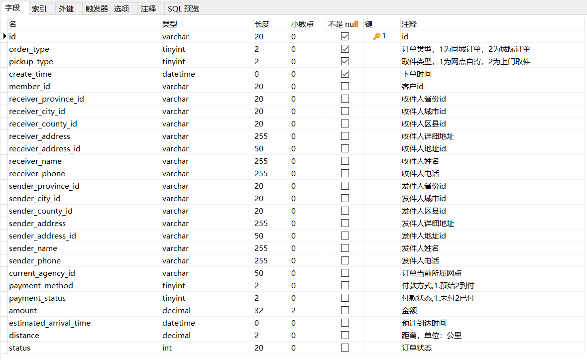

#### 1.2 pd_order_cargo

pd_order_cargo为货物信息表，结构如下：

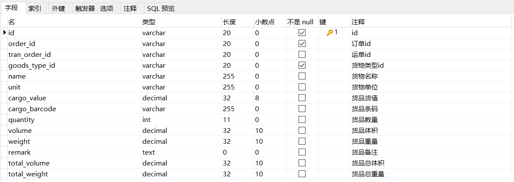

#### 1.3 pd_order_location

pd_order_location为订单位置信息表，结构如下：

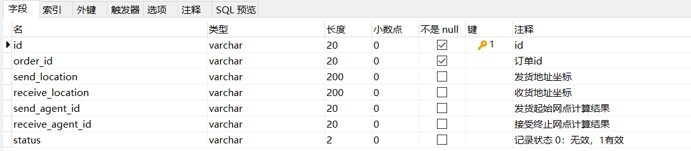

#### 1.4 rule

rule为规则表，结构如下：

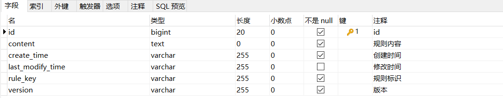

### 2. 业务需求和产品原型

#### 2.1 货物信息

货物信息是指用户所寄物品相关信息，包括货物名称、货物单位、货物重量、所属订单id、所属运单id、货物数量等。

产品原型如下：

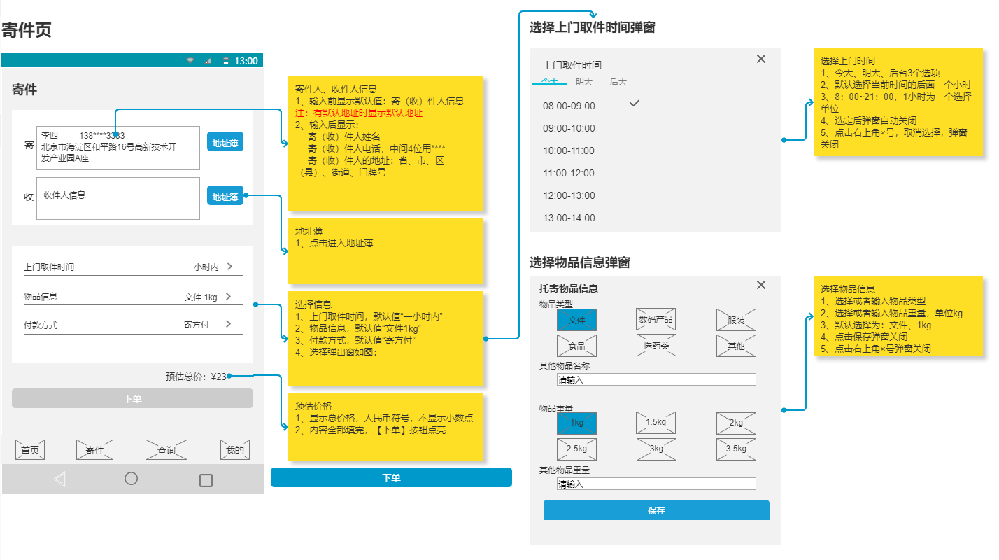

#### 2.2 订单

订单是指客户下达运输业务的单个委托单证。用户可以通过手机端品达速运App在寄件页输入相关信息，点击“下单”按钮即可提交订单。

产品原型如下：

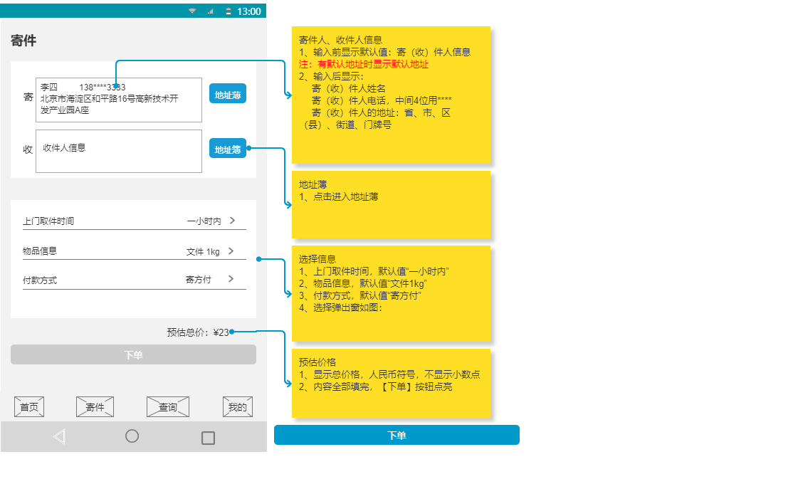

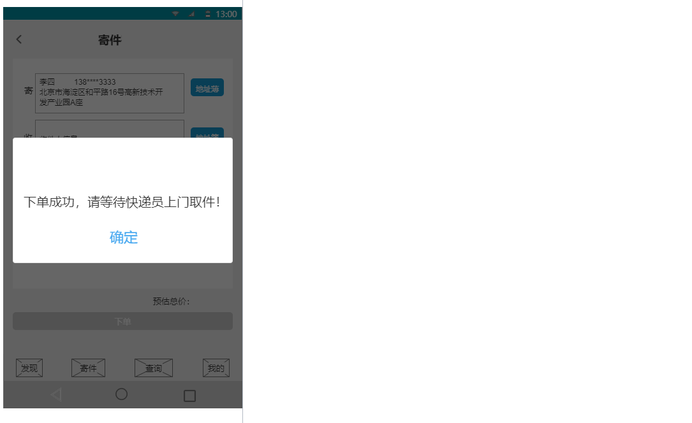

### 3. 订单中心服务代码

初始工程中对于基本的数据维护代码已经提供好了，直接使用即可。其中新增订单时需要设置订单距离和订单价格需要我们实现。

订单距离：可以调用百度地图提供的服务接口计算寄件人地址到收件人地址的距离

订单价格：需要根据规则计算订单价格，计算的维度包括重量和距离，具体规则如下

1、1千克以内20元 2、1千克以上，订单距离在200公里以下的，首重1千克，首重价格20元，续重每1千克资费为6元 3、1千克以上，订单距离在200~500公里的，首重1千克，首重价格20元，续重每1千克资费为9元 4、1千克以上，订单距离在500公里以上的，首重1千克，首重价格20元，续重每1千克资费为15元

### 4. 百度地图开放平台

#### 4.1 介绍

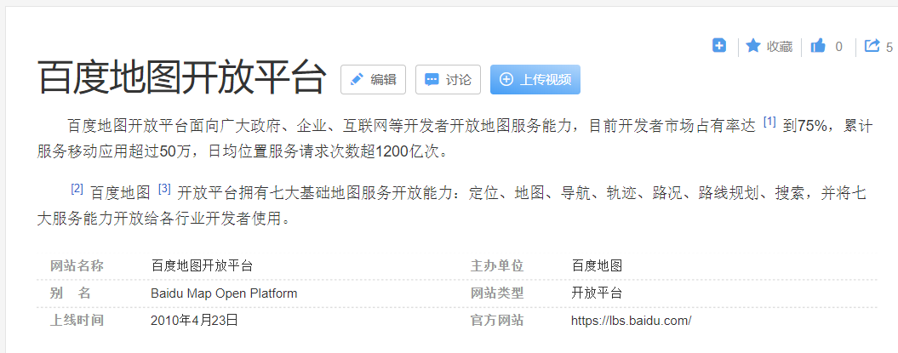

官网地址：http://lbsyun.baidu.com/

百度地图开放平台提供了多种服务接入方式：

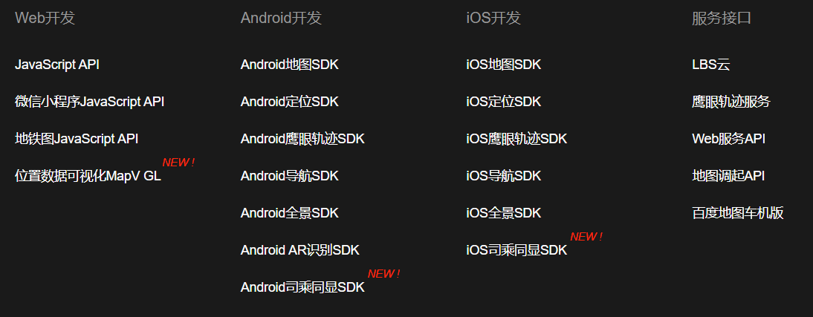

#### 4.2 注册账号、申请AK

要使用百度地图提供的服务，需要注册百度账号、申请服务密钥等，具体步骤如下：

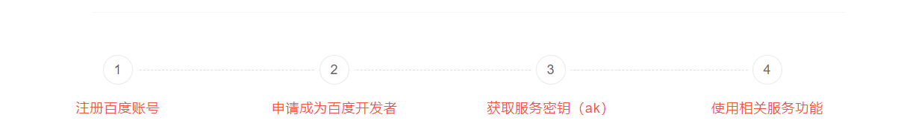

 

注册百度账号，使用手机号即可完成注册

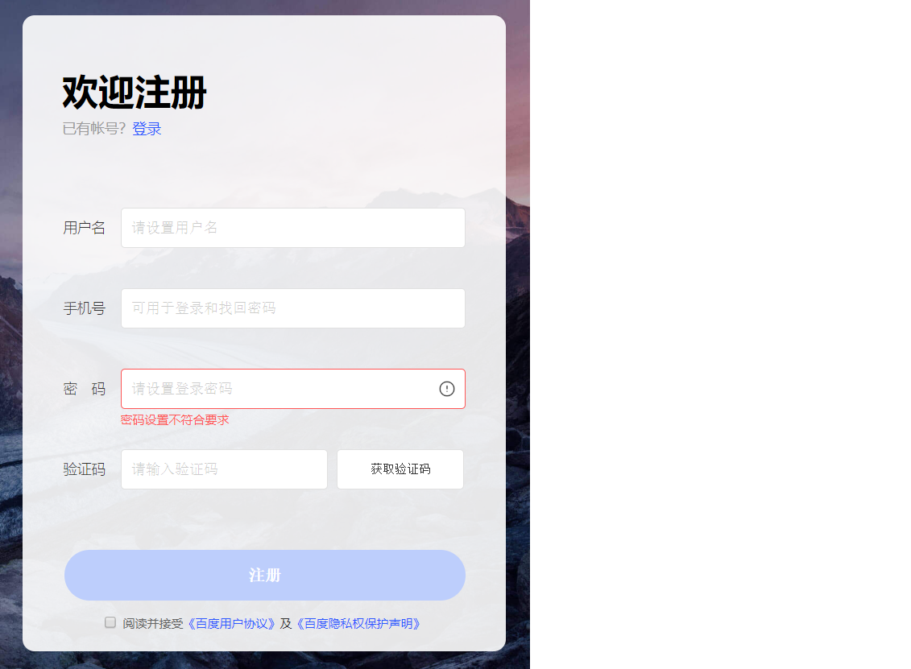

 

注册完成后登录

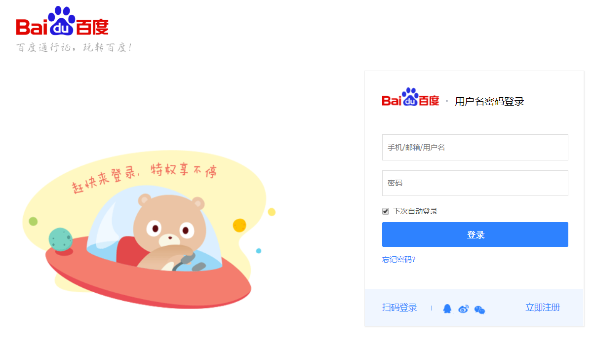

 

要使用地图服务还需要申请密钥(AK)，地址：http://lbsyun.baidu.com/apiconsole/key#/home

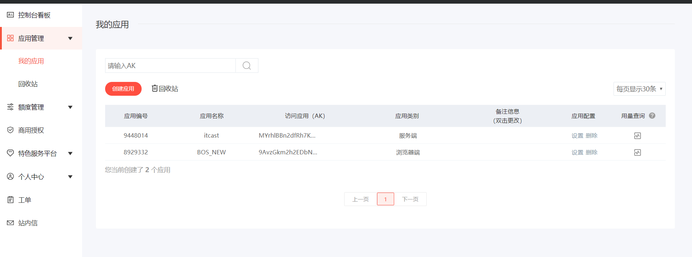

 

点击"创建应用"按钮，跳转到创建应用页面

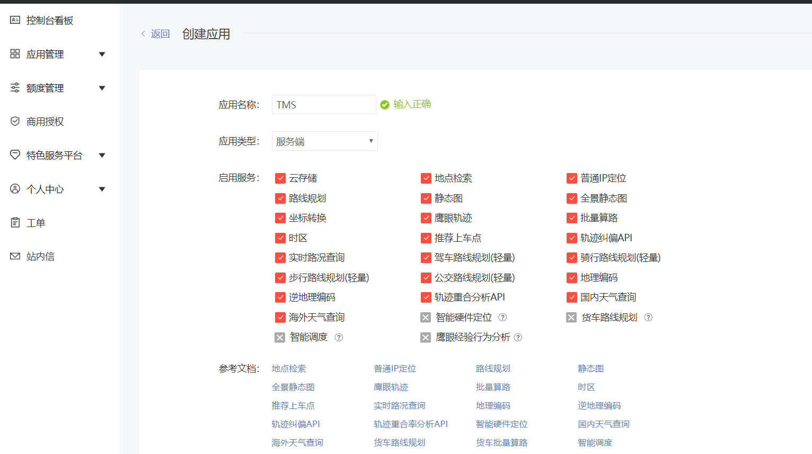

应用类型下拉框选项如下：


 

点击"提交"按钮完成AK创建：

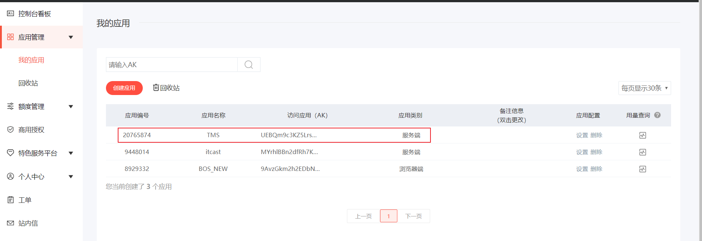

 

注意：应用类别需要根据我们使用百度地图的方式进行相应选择，如果在网页中通过js方式使用百度地图，应用类别为浏览器端，如果要通过HTTP方式使用百度地图，应用类别为服务端。

#### 4.3 入门案例

##### 4.3.1 案例一

```
<!DOCTYPE html>
<html>
<head>
    <meta http-equiv="Content-Type" content="text/html; charset=utf-8" />
    <meta name="viewport" content="initial-scale=1.0, user-scalable=no" />
    <style type="text/css">
        body, html,#allmap {width: 100%;height: 100%;overflow: hidden;margin:0;font-family:"微软雅黑";}
    </style>
    <script type="text/javascript" src="http://api.map.baidu.com/api?v=2.0&ak=9AvzGkm2h2EDbNmULlOApaiOCteZWcqF"></script>
    <title>地图展示</title>
</head>
<body>
<div id="allmap"></div>
</body>
</html>
<script type="text/javascript">
    // 百度地图API功能
    var map = new BMap.Map("allmap");    // 创建Map实例
    map.centerAndZoom(new BMap.Point(116.404, 39.915), 11);  // 初始化地图,设置中心点坐标和地图级别
    //添加地图类型控件
    map.addControl(new BMap.MapTypeControl({
        mapTypes:[
            BMAP_NORMAL_MAP,
            BMAP_HYBRID_MAP
        ]}));
    map.enableScrollWheelZoom(true);     //开启鼠标滚轮缩放
</script>
```

##### 4.3.2 案例二

```
<!DOCTYPE html>
<html>
<head>
    <meta http-equiv="Content-Type" content="text/html; charset=utf-8" />
    <meta name="viewport" content="initial-scale=1.0, user-scalable=no" />
    <style type="text/css">
        body, html,#allmap {width: 100%;height: 100%;overflow: hidden;margin:0;font-family:"微软雅黑";}
    </style>
    <script type="text/javascript" src="http://api.map.baidu.com/api?v=2.0&ak=9AvzGkm2h2EDbNmULlOApaiOCteZWcqF"></script>
    <title>计算两点间距离</title>
</head>
<body>
<div id="allmap"></div>
</body>
</html>
<script type="text/javascript">
    // 百度地图API功能
    var map = new BMap.Map("allmap");
    map.centerAndZoom("重庆",12);  //初始化地图,设置城市和地图级别。
    var pointA = new BMap.Point(106.486654,29.490295);  // 创建点坐标A--大渡口区
    var pointB = new BMap.Point(106.581515,29.615467);  // 创建点坐标B--江北区
    alert('从大渡口区到江北区的距离是：'+(map.getDistance(pointA,pointB)).toFixed(2)+' 米。');  //获取两点距离,保留小数点后两位
    var polyline = new BMap.Polyline([pointA,pointB], {strokeColor:"blue", strokeWeight:6, strokeOpacity:0.5});  //定义折线
    map.addOverlay(polyline);     //添加折线到地图上
</script>
```

##### 4.3.3 案例三

```
<!DOCTYPE html>
<html>
<head>
    <meta http-equiv="Content-Type" content="text/html; charset=utf-8" />
    <meta name="viewport" content="initial-scale=1.0, user-scalable=no" />
    <style type="text/css">
        body, html,#allmap {width: 100%;height: 100%;overflow: hidden;margin:0;font-family:"微软雅黑";}
    </style>
    <script type="text/javascript" src="http://api.map.baidu.com/api?v=2.0&ak=9AvzGkm2h2EDbNmULlOApaiOCteZWcqF"></script>
    <title>单击获取点击的经纬度</title>
</head>
<body>
<div id="allmap"></div>
</body>
</html>
<script type="text/javascript">
    // 百度地图API功能
    var map = new BMap.Map("allmap");
    map.centerAndZoom("北京",12);
    //单击获取点击的经纬度
    map.addEventListener("click",function(e){
        alert(e.point.lng + "," + e.point.lat);
    });
</script>
```

##### 4.3.4 案例四

```
<!DOCTYPE html>
<html>
<head>
    <meta http-equiv="Content-Type" content="text/html; charset=utf-8" />
    <meta name="viewport" content="initial-scale=1.0, user-scalable=no" />
    <style type="text/css">
        body, html,#allmap {width: 100%;height: 100%;overflow: hidden;margin:0;font-family:"微软雅黑";}
    </style>
    <script type="text/javascript" src="http://api.map.baidu.com/api?v=2.0&ak=9AvzGkm2h2EDbNmULlOApaiOCteZWcqF"></script>
    <title>根据关键字检索</title>
</head>
<body>
<div id="allmap"></div>
<p>返回北京市地图上圆形覆盖范围内的“餐馆”检索结果，并展示在地图上</p>
</body>
</html>
<script type="text/javascript">
    // 百度地图API功能
    var map = new BMap.Map("allmap");            // 创建Map实例
    var mPoint = new BMap.Point(116.404, 39.915);
    map.enableScrollWheelZoom();
    map.centerAndZoom(mPoint,15);

    var circle = new BMap.Circle(mPoint,1000,{fillColor:"blue", strokeWeight: 1 ,fillOpacity: 0.3, strokeOpacity: 0.3});
    map.addOverlay(circle);
    var local =  new BMap.LocalSearch(map, {renderOptions: {map: map, autoViewport: false}});
    local.searchNearby('餐馆',mPoint,1000);
</script>
```

##### 4.3.5 案例五

```
<!DOCTYPE html>
<html>
<head>
    <meta http-equiv="Content-Type" content="text/html; charset=utf-8" />
    <meta name="viewport" content="initial-scale=1.0, user-scalable=no" />
    <style type="text/css">
        body, html {width: 100%;height: 100%; margin:0;font-family:"微软雅黑";}
        #allmap{height:500px;width:100%;}
        #r-result,#r-result table{width:100%;}
    </style>
    <script type="text/javascript" src="http://api.map.baidu.com/api?v=2.0&ak=9AvzGkm2h2EDbNmULlOApaiOCteZWcqF"></script>
    <script type="text/javascript" src="http://libs.baidu.com/jquery/1.9.0/jquery.js"></script>
    <title>根据起终点名称驾车导航</title>
</head>
<body>
<div id="allmap"></div>
<div id="driving_way">
    <select>
        <option value="0">最少时间</option>
        <option value="1">最短距离</option>
        <option value="2">避开高速</option>
    </select>
    <input type="button" id="result" value="查询"/>
</div>
<div id="r-result"></div>
</body>
</html>
<script type="text/javascript">
    // 百度地图API功能
    var map = new BMap.Map("allmap");
    var start = "天安门";
    var end = "金燕龙办公楼";
    map.centerAndZoom(new BMap.Point(116.404, 39.915), 11);
    map.enableScrollWheelZoom(true);     //开启鼠标滚轮缩放
    //三种驾车策略：最少时间，最短距离，避开高速
    var routePolicy = [BMAP_DRIVING_POLICY_LEAST_TIME,BMAP_DRIVING_POLICY_LEAST_DISTANCE,BMAP_DRIVING_POLICY_AVOID_HIGHWAYS];
    $("#result").click(function(){
        map.clearOverlays();
        var i=$("#driving_way select").val();
        search(start,end,routePolicy[i]);
        function search(start,end,route){
            var driving = new BMap.DrivingRoute(map, {renderOptions:{map: map, autoViewport: true},policy: route});
            driving.search(start,end);
        }
    });
</script>
```

##### 4.3.6 案例六

本小节案例来调用百度地图提供的HTTP服务接口，实现地理编码，即根据提供的地址获取经纬度。

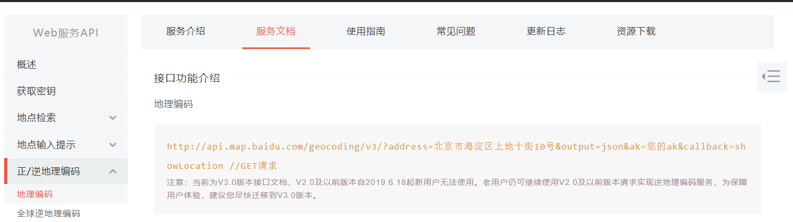

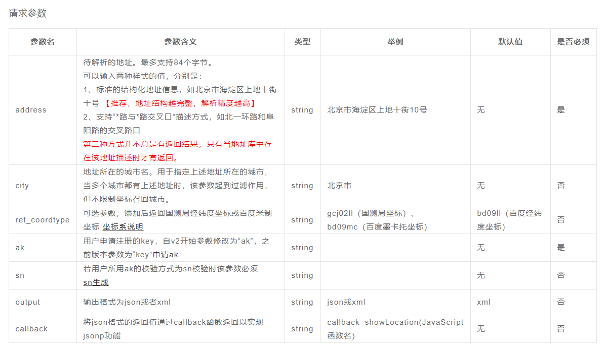

 

可以直接在浏览器中访问上面的接口，output参数指定为json：

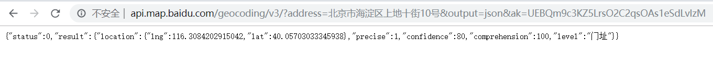

 

output参数指定为xml：

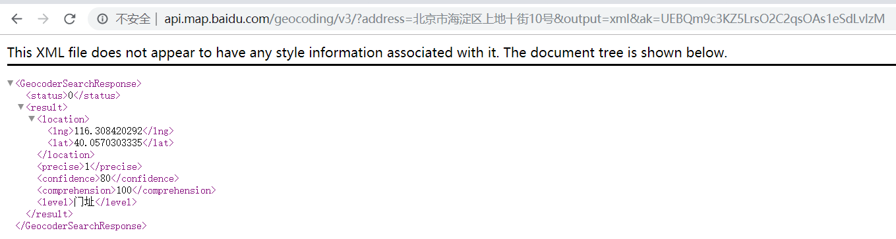

注意：调用上面接口时使用的AK应用类别为服务端。

 

也可以在Java程序中调用上面的HTTP接口，并解析返回的数据：

```
package com.itheima.pinda.common.utils;

import com.alibaba.fastjson.JSON;
import com.alibaba.fastjson.JSONArray;
import com.alibaba.fastjson.JSONObject;
import java.io.BufferedReader;
import java.io.IOException;
import java.io.InputStreamReader;
import java.net.MalformedURLException;
import java.net.URL;
import java.net.URLConnection;
import java.text.DecimalFormat;
import java.util.Map;

public class BaiduMapTest {
    public static void main(String[] args) {
        String ak = "UEBQm9c3KZ5LrsO2C2qsOAs1eSdLvlzM";
        String address = "北京市海淀区上地十街10号";
        String httpUrl = "http://api.map.baidu.com/geocoding/v3/?address="+address+"&output=json&ak=" + ak;


        StringBuilder json = new StringBuilder();
        try {
            URL url = new URL(httpUrl);
            URLConnection urlConnection = url.openConnection();
            BufferedReader in = new BufferedReader(new InputStreamReader(urlConnection.getInputStream(), "UTF-8"));
            String inputLine = null;
            while ((inputLine = in.readLine()) != null) {
                json.append(inputLine);
            }
            in.close();
        } catch (MalformedURLException e) {
        } catch (IOException e) {
        }
        System.out.println(json.toString());


        String data = json.toString();
        if (data != null && !"".equals(data)) {
            Map map = JSON.parseObject(data, Map.class);
            if ("0".equals(map.getOrDefault("status", "500").toString())) {
                Map childMap = (Map) map.get("result");
                Map posMap = (Map) childMap.get("location");
                double lng = Double.parseDouble(posMap.getOrDefault("lng", "0").toString()); // 经度
                double lat = Double.parseDouble(posMap.getOrDefault("lat", "0").toString()); // 纬度
                DecimalFormat df = new DecimalFormat("#.######");
                String lngStr = df.format(lng);
                String latStr = df.format(lat);
                String result = lngStr + "," + latStr;
                System.out.println(result);
            }
        }
    }
}
```

##### 4.3.7 案例七

本小节案例来调用百度地图提供的HTTP服务接口，实现驾车路线规划。

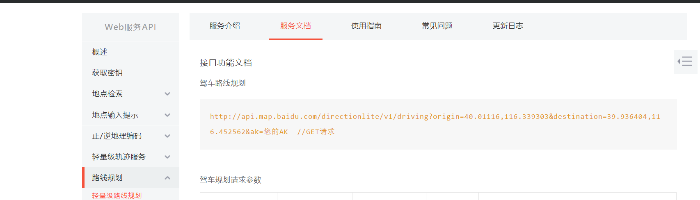

 

可以直接在浏览器中访问上面的接口：

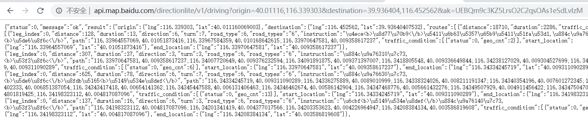

 

也可以在Java程序中调用上面的HTTP接口，并解析返回的数据：

```
package com.itheima.pinda.common.utils;

import com.alibaba.fastjson.JSON;
import com.alibaba.fastjson.JSONArray;
import com.alibaba.fastjson.JSONObject;
import java.io.BufferedReader;
import java.io.IOException;
import java.io.InputStreamReader;
import java.net.MalformedURLException;
import java.net.URL;
import java.net.URLConnection;
import java.text.DecimalFormat;
import java.util.Map;

public class BaiduMapTest {
    public static void main(String[] args) {
        String ak = "UEBQm9c3KZ5LrsO2C2qsOAs1eSdLvlzM";
        String origin = "40.01116,116.339303"; //起点经纬度，格式为：纬度,经度；小数点后不超过6位
        String destination = "39.936404,116.452562"; //终点经纬度，格式为：纬度,经度；小数点后不超过6位
        String httpUrl = "http://api.map.baidu.com/directionlite/v1/driving?origin="
                +origin+"&destination="
                +destination+"&ak=" + ak;


        StringBuilder json = new StringBuilder();
        try {
            URL url = new URL(httpUrl);
            URLConnection urlConnection = url.openConnection();
            BufferedReader in = new BufferedReader(new InputStreamReader(urlConnection.getInputStream(), "UTF-8"));
            String inputLine = null;
            while ((inputLine = in.readLine()) != null) {
                json.append(inputLine);
            }
            in.close();
        } catch (MalformedURLException e) {
        } catch (IOException e) {
        }
        System.out.println(json.toString());


        String data = json.toString();
        if (data != null && !"".equals(data)) {
            Map map = JSON.parseObject(data, Map.class);
            if ("0".equals(map.getOrDefault("status", "500").toString())) {
                Map childMap = (Map) map.get("result");
                JSONArray jsonArray = (JSONArray) childMap.get("routes");
                JSONObject jsonObject = (JSONObject) jsonArray.get(0);
                double distance = Double.parseDouble(jsonObject.get("distance") == null ? "0" : jsonObject.get("distance").toString());
                System.out.println(distance);
            }
        }
    }
}
```

### 5. 基于百度地图计算订单距离

#### 5.1 实现思路

前面我们通过入门案例已经对百度地图的使用有所了解，本小节我们就通过调用百度地图提供的HTTP接口服务来实现订单距离的计算，具体实现思路如下：

第一步：调用百度地图提供的地理编码接口，根据订单中的寄件人地址和收件人地址地址分别获取经纬度。

第二步：调用百度地图提供的驾车路线规划接口，根据第一步获取的寄件人地址经纬度和收件人地址经纬度来获取订单距离等信息。

#### 5.2 封装工具类

封装操作百度地图接口的工具类：

```
package com.itheima.pinda.common.utils;

import com.alibaba.fastjson.JSON;
import com.alibaba.fastjson.JSONArray;
import com.alibaba.fastjson.JSONObject;
import com.google.common.collect.ImmutableMap;
import com.google.common.collect.Maps;
import org.apache.commons.lang3.StringUtils;
import java.io.BufferedReader;
import java.io.IOException;
import java.io.InputStreamReader;
import java.math.BigDecimal;
import java.net.MalformedURLException;
import java.net.URL;
import java.net.URLConnection;
import java.text.DecimalFormat;
import java.util.Map;

/**
 * 百度地图操作工具类
 */
public class BaiduMapUtils {
    static String AK = "UEBQm9c3KZ5LrsO2C2qsOAs1eSdLvlzM"; // 百度地图密钥

    public static void main(String[] args) {
//        String dom = "北京金燕龙";
//        String coordinate = getCoordinate(dom);
//        System.out.println("'" + dom + "'的经纬度为：" + coordinate);
        String begin = getCoordinate("北京金燕龙");
        String end = getCoordinate("北京龙禧苑一区");
        int time = getTime(begin, end);
        double distance = getDistance(begin, end);

        DecimalFormat df = new DecimalFormat("#.##");
        String distanceStr = df.format(distance / 1000);
        BigDecimal orderDistance = new BigDecimal(distanceStr);
        System.out.println("时间-->" + time/60 + "分钟--距离-->" + orderDistance+"km");
    }

    // 调用百度地图API根据的地址，获取坐标
    public static String getCoordinate(String address) {
        if (address != null && !"".equals(address)) {
            address = address.replaceAll("\\s*", "").replace("#", "栋");
            String url = "http://api.map.baidu.com/geocoding/v3/?output=json&ak=" + AK + "&callback=showLocation&address=" + address;
            String json = loadJSON(url);
            json = StringUtils.substringBetween(json, "showLocation(", ")");
            if (json != null && !"".equals(json)) {
                Map map = JSON.parseObject(json, Map.class);
                if ("0".equals(map.getOrDefault("status", "500").toString())) {
                    Map childMap = (Map) map.get("result");
                    Map posMap = (Map) childMap.get("location");
                    double lng = Double.parseDouble(posMap.getOrDefault("lng", "0").toString()); // 经度
                    double lat = Double.parseDouble(posMap.getOrDefault("lat", "0").toString()); // 纬度
                    DecimalFormat df = new DecimalFormat("#.######");
                    String lngStr = df.format(lng);
                    String latStr = df.format(lat);
                    return lngStr + "," + latStr;
                }
            }
        }
        return null;
    }


    public static Integer getTime(String origin, String destination) {
        String[] originArray = origin.split(",");
        String[] destinationArray = destination.split(",");
        origin = originArray[1] + "," + originArray[0];
        destination = destinationArray[1] + "," + destinationArray[0];
        String url = "http://api.map.baidu.com/directionlite/v1/driving?origin=" + origin + "&destination=" + destination + "&ak=" + AK;
        String json = loadJSON(url);
        System.out.println("json-->" + json);
        if (json != null && !"".equals(json)) {
            Map map = JSON.parseObject(json, Map.class);
            if ("0".equals(map.getOrDefault("status", "500").toString())) {
                Map childMap = (Map) map.get("result");
                JSONArray jsonArray = (JSONArray) childMap.get("routes");
                JSONObject jsonObject = (JSONObject) jsonArray.get(0);
                Map posMap = (Map) jsonObject.get("routes");
                int duration = Integer.parseInt(jsonObject.get("duration") == null ? "0" : jsonObject.get("duration").toString());
                return duration;
            }
        }

        return null;
    }

    //根据起止位置经纬度获取距离，单位：米
    public static Double getDistance(String origin, String destination) {
        String[] originArray = origin.split(",");
        String[] destinationArray = destination.split(",");
        origin = originArray[1] + "," + originArray[0];
        destination = destinationArray[1] + "," + destinationArray[0];
        String url = "http://api.map.baidu.com/directionlite/v1/driving?origin=" + origin + "&destination=" + destination + "&ak=" + AK;
        String json = loadJSON(url);
        System.out.println("json-->" + json);
        if (json != null && !"".equals(json)) {
            Map map = JSON.parseObject(json, Map.class);
            if ("0".equals(map.getOrDefault("status", "500").toString())) {
                Map childMap = (Map) map.get("result");
                JSONArray jsonArray = (JSONArray) childMap.get("routes");
                JSONObject jsonObject = (JSONObject) jsonArray.get(0);
                Map posMap = (Map) jsonObject.get("routes");
                double distance = Double.parseDouble(jsonObject.get("distance") == null ? "0" : jsonObject.get("distance").toString());
                return distance;
            }
        }

        return null;
    }

    //访问接口地址，返回结果数据
    public static String loadJSON(String url) {
        StringBuilder json = new StringBuilder();
        try {
            URL oracle = new URL(url);
            URLConnection yc = oracle.openConnection();
            BufferedReader in = new BufferedReader(new InputStreamReader(yc.getInputStream(), "UTF-8"));
            String inputLine = null;
            while ((inputLine = in.readLine()) != null) {
                json.append(inputLine);
            }
            in.close();
        } catch (MalformedURLException e) {
        } catch (IOException e) {
        }
        return json.toString();
    }

}
```

### 6. 规则引擎Drools

由于规则引擎部分内容较多，所有内容另外整理到“规则引擎drools讲义.md”中。

### 7. 根据规则计算订单价格

#### 7.1 规则

需要根据规则计算订单价格，计算的维度包括重量和距离，具体规则如下：

1、1千克以内20元 2、1千克以上，订单距离在200公里以下的，首重1千克，首重价格20元，续重每1千克资费为6元 3、1千克以上，订单距离在200~500公里的，首重1千克，首重价格20元，续重每1千克资费为9元 4、1千克以上，订单距离在500公里以上的，首重1千克，首重价格20元，续重每1千克资费为15元

#### 7.2 实现步骤

第一步：封装实体AddressRule，订单价格计算的参数都在此类中进行封装

```
package com.itheima.pinda.entity.fact;

public class AddressRule {
    /**
     * 货品总重量
     */
    private double totalWeight;
    /**
     * 距离
     */
    private double distance;
    /**
     * 续重价格
     */
    private double continuedFee;
    
    /**
     * 首重
     */
    private double firstWeight;
    
    /**
     * 首重价格
     */
    private double firstFee;

    public double getFirstFee() {
        return firstFee;
    }

    public void setFirstFee(double firstFee) {
        this.firstFee = firstFee;
    }

    public double getFirstWeight() {
        return firstWeight;
    }

    public void setFirstWeight(double firstWeight) {
        this.firstWeight = firstWeight;
    }

    public double getTotalWeight() {
        return totalWeight;
    }

    public void setTotalWeight(double totalWeight) {
        this.totalWeight = totalWeight;
    }

    public double getDistance() {
        return distance;
    }

    public void setDistance(double distance) {
        this.distance = distance;
    }

    public double getContinuedFee() {
        return continuedFee;
    }

    public void setContinuedFee(double continuedFee) {
        this.continuedFee = continuedFee;
    }
}
```

第二步：封装实体AddressCheckResult，封装计算后的结果

```
package com.itheima.pinda.entity.fact;

import java.math.BigDecimal;

public class AddressCheckResult {
    private boolean postCodeResult = false; // true:通过校验；false：未通过校验
    private String result;

    public String getResult() {
        return result;
    }

    public void setResult(String result) {
        this.result = result;
    }

    public boolean isPostCodeResult() {
        return postCodeResult;
    }

    public void setPostCodeResult(boolean postCodeResult) {
        this.postCodeResult = postCodeResult;
    }
}
```

第三步：创建DroolsRulesService接口

```
package com.itheima.pinda.service;

import com.itheima.pinda.entity.fact.AddressRule;

public interface DroolsRulesService {
    //根据条件计算订单价格
    String calcFee(AddressRule addressRule);
}
```

第四步：创建上面接口的实现类，计算订单价格

```
package com.itheima.pinda.service.impl;

import com.itheima.pinda.entity.fact.AddressRule;
import com.itheima.pinda.service.DroolsRulesService;
import org.springframework.stereotype.Service;
import java.math.BigDecimal;

public class DroolsRulesServiceImpl implements DroolsRulesService {
    //根据条件计算订单价格
    public String calcFee(AddressRule addressRule) {
        BigDecimal lost = new BigDecimal(addressRule.getTotalWeight()).subtract(new BigDecimal(addressRule.getFirstWeight()));
        lost = lost.setScale(0,BigDecimal.ROUND_DOWN);
        BigDecimal continuedFee = lost.multiply(new BigDecimal(addressRule.getContinuedFee()));
        return continuedFee.add(new BigDecimal(addressRule.getFirstFee())).toString();
    }
}
```

第五步：在resources/rules目录下创建规则文件orderAmountCalc.drl

```
package rules;

import com.itheima.pinda.entity.fact.AddressRule;
import com.itheima.pinda.entity.fact.AddressCheckResult;
import com.itheima.pinda.service.impl.DroolsRulesServiceImpl;

dialect  "java"

rule "总重量在1kg以下"
    when
        address : AddressRule(totalWeight != null, totalWeight<=1.00)
        checkResult : AddressCheckResult();
    then
        checkResult.setPostCodeResult(true);
        checkResult.setResult("20");
        System.out.println("小于等于1kg价格为20元!");
end

rule "总重量大于1kg：距离在200公里以下"
    when
        address : AddressRule(totalWeight != null && totalWeight>1.00 && distance<200.00)
        checkResult : AddressCheckResult();
    then
        address.setFirstFee(20.00);
        address.setContinuedFee(6.00);
        address.setFirstWeight(1.00);
        DroolsRulesServiceImpl droolsRulesService = new DroolsRulesServiceImpl();
        String fee = droolsRulesService.calcFee(address);
        checkResult.setPostCodeResult(true);
        checkResult.setResult(fee);
        System.out.println("大于1kg,200公里");
end

rule "总重量大于1kg：距离在200-500公里"
    when
        address : AddressRule(totalWeight != null && totalWeight>1.00 && distance>200.00 && distance<500.00)
        checkResult : AddressCheckResult();
    then
        address.setFirstFee(20.00);
        address.setContinuedFee(9.00);
        address.setFirstWeight(1.00);
        DroolsRulesServiceImpl droolsRulesService = new DroolsRulesServiceImpl();
        String fee = droolsRulesService.calcFee(address);
        checkResult.setPostCodeResult(true);
        checkResult.setResult(fee);
        System.out.println("大于1kg,200至500公里!");
end

rule "总重量大于1kg：距离在500公里以上"
    when
        address : AddressRule(totalWeight != null && totalWeight>1.00 && distance>500.00)
        checkResult : AddressCheckResult();
    then
        address.setFirstFee(20.00);
        address.setContinuedFee(15.00);
        address.setFirstWeight(1.00);
        DroolsRulesServiceImpl droolsRulesService = new DroolsRulesServiceImpl();
        String fee = droolsRulesService.calcFee(address);
        checkResult.setPostCodeResult(true);
        checkResult.setResult(fee);
        System.out.println("大于1kg,500公里以上!");
end
```

第六步：创建Drools规则引擎配置类

```
package com.itheima.pinda.config;

import com.itheima.pinda.entity.Order;
import org.kie.api.KieBase;
import org.kie.api.KieServices;
import org.kie.api.builder.*;
import org.kie.api.runtime.KieContainer;
import org.kie.api.runtime.KieSession;
import org.kie.internal.io.ResourceFactory;
import org.kie.spring.KModuleBeanFactoryPostProcessor;
import org.springframework.boot.autoconfigure.condition.ConditionalOnMissingBean;
import org.springframework.context.annotation.Bean;
import org.springframework.context.annotation.Configuration;
import org.springframework.core.Ordered;
import org.springframework.core.io.Resource;
import org.springframework.core.io.support.PathMatchingResourcePatternResolver;
import org.springframework.core.io.support.ResourcePatternResolver;
import java.io.IOException;

//规则引擎自动配置类
@Configuration
public class DroolsAutoConfiguration {
    private static final String RULES_PATH = "rules/";

    @Bean
    @ConditionalOnMissingBean(KieFileSystem.class)
    public KieFileSystem kieFileSystem() throws IOException {
        KieFileSystem kieFileSystem = getKieServices().newKieFileSystem();
        for (Resource file : getRuleFiles()) {
            kieFileSystem.write(ResourceFactory.newClassPathResource(RULES_PATH + file.getFilename(), "UTF-8"));
        }
        return kieFileSystem;
    }

    private Resource[] getRuleFiles() throws IOException {
        ResourcePatternResolver resourcePatternResolver = new PathMatchingResourcePatternResolver();
        return resourcePatternResolver.getResources("classpath*:" + RULES_PATH + "**/*.*");
    }
    
    @Bean
    @ConditionalOnMissingBean(KieContainer.class)
    public KieContainer kieContainer() throws IOException {
        final KieRepository kieRepository = getKieServices().getRepository();
        
        kieRepository.addKieModule(new KieModule() {
            public ReleaseId getReleaseId() {
                return kieRepository.getDefaultReleaseId();
            }
        });
        
        KieBuilder kieBuilder = getKieServices().newKieBuilder(kieFileSystem());
        kieBuilder.buildAll();

        KieContainer kieContainer=getKieServices().newKieContainer(kieRepository.getDefaultReleaseId());
        
        return kieContainer;
    }
    
    private KieServices getKieServices() {
        return KieServices.Factory.get();
    }
    
    @Bean
    @ConditionalOnMissingBean(KieBase.class)
    public KieBase kieBase() throws IOException {
        return kieContainer().getKieBase();
    }
    
    @Bean
    @ConditionalOnMissingBean(KieSession.class)
    public KieSession kieSession() throws IOException {
        return kieContainer().newKieSession();
    }

    @Bean
    @ConditionalOnMissingBean(KModuleBeanFactoryPostProcessor.class)
    public KModuleBeanFactoryPostProcessor kiePostProcessor() {
        return new KModuleBeanFactoryPostProcessor();
    }
}
```

第七步：在IOrderService接口中扩展方法

```
/**
* 计算订单价格
* @param orderDTO
* @return
*/
public Map calculateAmount(OrderDTO orderDTO);
```

第八步：在OrderServiceImpl中实现calculateAmount方法

```
@Autowired
private KieContainer kieContainer;
/**
* 计算订单价格
* @param orderDTO
* @return
*/
public Map calculateAmount(OrderDTO orderDTO) {
    //计算订单距离
    orderDTO = this.getDistance(orderDTO);

    if("sender error msg".equals(orderDTO.getSenderAddress()) || "receiver error msg".equals(orderDTO.getReceiverAddress())){
        //地址解析失败，直接返回
        Map map = new HashMap();
        map.put("amount","0");
        map.put("errorMsg","无法计算订单距离和订单价格，请输入真实地址");
        map.put("orderDto",orderDTO);
        return map;
    }

    KieSession session = kieContainer.newKieSession();
    //设置Fact对象
    AddressRule addressRule = new AddressRule();
    addressRule.setTotalWeight(orderDTO.getOrderCargoDto().getTotalWeight().doubleValue());
    addressRule.setDistance(orderDTO.getDistance().doubleValue());

    //将对象加入到工作内存
    session.insert(addressRule);

    AddressCheckResult addressCheckResult = new AddressCheckResult();
    session.insert(addressCheckResult);

    int i = session.fireAllRules();
    System.out.println("触发了" + i + "条规则");
    session.destroy();

    if(addressCheckResult.isPostCodeResult()){
        System.out.println("规则匹配成功,订单价格为：" + addressCheckResult.getResult());
        orderDTO.setAmount(new BigDecimal(addressCheckResult.getResult()));

        Map map = new HashMap();
        map.put("orderDto",orderDTO);
        map.put("amount",addressCheckResult.getResult());

        return map;
    }

    return null;
}

/**
* 调用百度地图服务接口，根据寄件人地址和收件人地址计算订单距离
* @param orderDTO
* @return
*/
public OrderDTO getDistance(OrderDTO orderDTO){
    //调用百度地图服务接口获取寄件人地址对应的坐标经纬度
    String begin = BaiduMapUtils.getCoordinate(orderDTO.getSenderAddress());
    if(begin == null){
        orderDTO.setSenderAddress("sender error msg");
        return orderDTO;
    }

    //调用百度地图服务接口获取收件人地址对应的坐标经纬度
    String end = BaiduMapUtils.getCoordinate(orderDTO.getReceiverAddress());
    if(end == null){
        orderDTO.setReceiverAddress("receiver error msg");
        return orderDTO;
    }

    Double distance = BaiduMapUtils.getDistance(begin, end);
    DecimalFormat decimalFormat = new DecimalFormat("#.##");
    String distanceStr = decimalFormat.format(distance/1000);

    orderDTO.setDistance(new BigDecimal(distanceStr));

    return orderDTO;
}
```

第九步：修改OrderController的save方法

```
/**
* 新增订单
*
* @param orderDTO 订单信息
* @return 订单信息
*/
@PostMapping("")
public OrderDTO save(@RequestBody OrderDTO orderDTO, HttpServletResponse res) {
    Order order = new Order();
    // 计算订单价格
    Map map = orderService.calculateAmount(orderDTO);
    orderDTO = (OrderDTO) map.get("orderDto");
    BeanUtils.copyProperties(orderDTO, order);
    if ("sender error msg".equals(orderDTO.getSenderAddress()) || "receiver error msg".equals(orderDTO.getReceiverAddress())) {
        return orderDTO;
    }
    order.setAmount(new BigDecimal(map.getOrDefault("amount", "20").toString()));
    orderService.saveOrder(order);
    OrderDTO result = new OrderDTO();
    BeanUtils.copyProperties(order, result);
    return result;
}
```

### 8. 实现动态规则

#### 8.1 实现思路

前面我们已经实现了根据规则计算订单的价格，但是还有一个问题要解决：如果规则发生变化，如何在不重启服务的情况下进行规则的切换呢？

这就需要实现动态规则，具体实现思路如下：

1、将规则文件的内容存储在数据库中

2、Drools相关对象(例如KieContainer对象)的创建都基于数据库中存储的规则来创建

3、提供HTTP访问接口，当规则发生变化时调用此接口重新加载数据库中的规则，重新创建KieContainer等对象

#### 8.2 实现步骤

第一步：在pd_oms数据库中创建数据表rule，用于存储规则内容

```
CREATE TABLE `rule`  (
  `id` bigint(20) NOT NULL AUTO_INCREMENT,
  `content` text CHARACTER SET utf8 COLLATE utf8_general_ci NOT NULL,
  `create_time` varchar(255) CHARACTER SET utf8 COLLATE utf8_general_ci NOT NULL,
  `last_modify_time` varchar(255) CHARACTER SET utf8 COLLATE utf8_general_ci NULL DEFAULT NULL,
  `rule_key` varchar(255) CHARACTER SET utf8 COLLATE utf8_general_ci NOT NULL,
  `version` varchar(255) CHARACTER SET utf8 COLLATE utf8_general_ci NOT NULL,
  PRIMARY KEY (`id`) USING BTREE,
  UNIQUE INDEX `UK_9yepjak9olg92holwkr8p3l0f`(`rule_key`) USING BTREE,
  UNIQUE INDEX `UK_ilmbp99kyt6gy10224pc9bl6n`(`version`) USING BTREE,
  UNIQUE INDEX `UK_ei48upwykmhx9r5p7p4ndxvgn`(`last_modify_time`) USING BTREE
) ENGINE = InnoDB AUTO_INCREMENT = 2 CHARACTER SET = utf8 COLLATE = utf8_general_ci ROW_FORMAT = Compact;
```

第二步：创建Rule实体类，和上面的rule表对应

```
package com.itheima.pinda.entity;

import com.baomidou.mybatisplus.annotation.IdType;
import com.baomidou.mybatisplus.annotation.TableId;
import com.baomidou.mybatisplus.annotation.TableName;
import io.swagger.annotations.ApiModel;
import lombok.Data;
import lombok.EqualsAndHashCode;
import lombok.ToString;
import lombok.experimental.Accessors;
import java.io.Serializable;

@Data
@ToString
@EqualsAndHashCode(callSuper = false)
@Accessors(chain = true)
@TableName("rule")
@ApiModel
public class Rule implements Serializable {
    private static final long serialVersionUID = 1L;
    @TableId(value = "id", type = IdType.INPUT)
    private Long id;
    private String ruleKey;
    private String content;
    private String version;
    private String lastModifyTime;
    private String createTime;
}
```

第三步：创建RuleMapper接口

```
package com.itheima.pinda.mapper;

import com.baomidou.mybatisplus.core.mapper.BaseMapper;
import com.itheima.pinda.entity.Order;
import com.itheima.pinda.entity.Rule;
import org.apache.ibatis.annotations.Mapper;

/**
 * 规则
 */
@Mapper
public interface RuleMapper extends BaseMapper<Rule> {
}
```

第四步：创建ReloadDroolsRulesService，用于重新加载数据库中的规则

```
package com.itheima.pinda.service.impl;

import com.itheima.pinda.entity.Address;
import com.itheima.pinda.entity.Rule;
import com.itheima.pinda.mapper.RuleMapper;
import org.kie.api.KieServices;
import org.kie.api.builder.KieBuilder;
import org.kie.api.builder.KieFileSystem;
import org.kie.api.builder.KieRepository;
import org.kie.api.builder.Message;
import org.kie.api.runtime.KieContainer;
import org.springframework.beans.factory.annotation.Autowired;
import org.springframework.stereotype.Service;
import java.util.List;

/**
 *重新加载规则
 */
@Service
public class ReloadDroolsRulesService {
    public static KieContainer kieContainer;

    @Autowired
    private RuleMapper ruleMapper;

    public void reload() {
        KieContainer kieContainer = loadContainerFromString(loadRules());
        this.kieContainer = kieContainer;
    }

    private List<Rule> loadRules() {
        List<Rule> rules = ruleMapper.selectList(null);
        return rules;
    }

    public KieContainer loadContainerFromString(List<Rule> rules) {
        long startTime = System.currentTimeMillis();
        KieServices ks = KieServices.Factory.get();
        KieRepository kr = ks.getRepository();
        KieFileSystem kfs = ks.newKieFileSystem();

        for (Rule rule : rules) {
            String drl = rule.getContent();
            kfs.write("src/main/resources/" + drl.hashCode() + ".drl", drl);
        }

        KieBuilder kb = ks.newKieBuilder(kfs);

        kb.buildAll();
        if (kb.getResults().hasMessages(Message.Level.ERROR)) {
            throw new RuntimeException("Build Errors:\n" + kb.getResults().toString());
        }
        long endTime = System.currentTimeMillis();
        System.out.println("Time to build rules : " + (endTime - startTime) + " ms");
        startTime = System.currentTimeMillis();
        KieContainer kContainer = ks.newKieContainer(kr.getDefaultReleaseId());
        endTime = System.currentTimeMillis();
        System.out.println("Time to load container: " + (endTime - startTime) + " ms");
        return kContainer;
    }
}
```

第五步：创建CommandLineRunnerImpl，在项目启动时加载数据库中最新规则

```
package com.itheima.pinda.service.impl;

import com.itheima.pinda.service.ReloadDroolsRulesService;
import lombok.extern.slf4j.Slf4j;
import org.springframework.boot.CommandLineRunner;
import org.springframework.stereotype.Component;
import javax.annotation.Resource;

/**
 * 项目启动时加载最新规则
 **/
@Component
@Slf4j
public class CommandLineRunnerImpl implements CommandLineRunner {
    @Resource
    private ReloadDroolsRulesService rules;

    @Override
    public void run(String... args) throws Exception {
        rules.reload();
    }
}
```

第六步：创建RulesReloadController

```
package com.itheima.pinda.controller;

import com.itheima.pinda.service.ReloadDroolsRulesService;
import org.springframework.stereotype.Controller;
import org.springframework.web.bind.annotation.RequestMapping;
import org.springframework.web.bind.annotation.ResponseBody;
import javax.annotation.Resource;
import java.io.IOException;

@RequestMapping("/rules")
@Controller
public class RulesReloadController {
    @Resource
    private ReloadDroolsRulesService rules;

    /**
     * 从数据库加载最新规则
     *
     * @return
     * @throws IOException
     */
    @ResponseBody
    @RequestMapping("/reload")
    public String reload() throws IOException {
        rules.reload();
        return "ok";
    }
}
```

第七步：注释掉DroolsAutoConfiguration

第八步：修改OrderServiceImpl的calculateAmount方法，修改KieSession的获取方式

```
......
    
KieSession kieSession = ReloadDroolsRulesService.kieContainer.newKieSession();

......
```

 