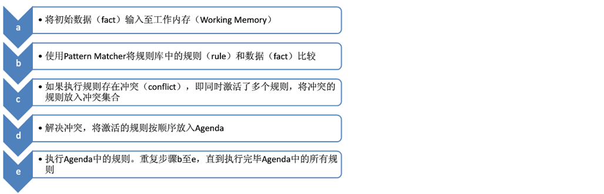
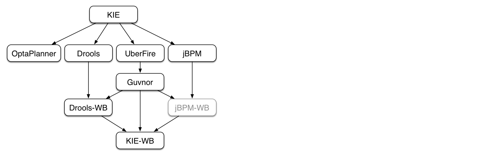

# 规则引擎 Drools

## 1. 问题引出

现有一个在线申请信用卡的业务场景，用户需要录入个人信息，如下图所示：


通过上图可以看到，用户录入的个人信息包括姓名、性别、年龄、学历、电话、所在公司、职位、月收入、是否有房、是否有车、是否有信用卡等。录入完成后点击申请按钮提交即可。

用户提交申请后，需要在系统的服务端进行**用户信息合法性检查**(是否有资格申请信用卡)，只有通过合法性检查的用户才可以成功申请到信用卡(注意：不同用户有可能申请到的信用卡额度不同)。

检查用户信息合法性的规则如下：

| 规则编号 | 名称                       | 描述                                                         |
| -------- | -------------------------- | ------------------------------------------------------------ |
| 1        | 检查学历与薪水1            | 如果申请人既没房也没车，同时学历为大专以下，并且月薪少于5000，那么不通过 |
| 2        | 检查学历与薪水2            | 如果申请人既没房也没车，同时学历为大专或本科，并且月薪少于3000，那么不通过 |
| 3        | 检查学历与薪水3            | 如果申请人既没房也没车，同时学历为本科以上，并且月薪少于2000，同时之前没有信用卡的，那么不通过 |
| 4        | 检查申请人已有的信用卡数量 | 如果申请人现有的信用卡数量大于10，那么不通过                 |

用户信息合法性检查通过后，还需要根据如下**信用卡发放规则**确定用户所办信用卡的额度：

| 规则编号 | 名称  | 描述                                                         |
| -------- | ----- | ------------------------------------------------------------ |
| 1        | 规则1 | 如果申请人有房有车，或者月收入在20000以上，那么发放的信用卡额度为15000 |
| 2        | 规则2 | 如果申请人没房没车，但月收入在10000~20000之间，那么发放的信用卡额度为6000 |
| 3        | 规则3 | 如果申请人没房没车，月收入在10000以下，那么发放的信用卡额度为3000 |
| 4        | 规则4 | 如果申请人有房没车或者没房但有车，月收入在10000以下，那么发放的信用卡额度为5000 |
| 5        | 规则5 | 如果申请人有房没车或者是没房但有车，月收入在10000~20000之间，那么发放的信用卡额度为8000 |

思考：如何实现上面的业务逻辑呢？

我们最容易想到的就是使用分支判断(if else)来实现，例如通过如下代码来检查用户信息合法性:

```
//此处为伪代码

//检查用户信息合法性，返回true表示检查通过，返回false表示检查不通过
public boolean checkUser(User user){
    //如果申请人既没房也没车，同时学历为大专以下，并且月薪少于5000，那么不通过
    if(user.getHouse() == null 
       && user.getcar() == null 
       && user.getEducation().equals("大专以下") 
       && user.getSalary < 5000){
        return false;
    }
    //如果申请人既没房也没车，同时学历为大专或本科，并且月薪少于3000，那么不通过
    else if(user.getHouse() == null 
       && user.getcar() == null 
       && user.getEducation().equals("大专或本科") 
       && user.getSalary < 3000){
        return false;
    }
    //如果申请人既没房也没车，同时学历为本科以上，并且月薪少于2000，同时之前没有信用卡的，那么不通过
    else if(user.getHouse() == null 
       && user.getcar() == null 
       && user.getEducation().equals("本科以上") 
       && user.getSalary < 2000 
       && user.getHasCreditCard() == false){
        return false;
    }
    //如果申请人现有的信用卡数量大于10，那么不通过
    else if(user.getCreditCardCount() > 10){
        return false;
    }
    return true;
}
```

如果用户信息合法性检查通过后，还需要通过如下代码确定用户所办信用卡的额度：

```
//此处为伪代码

//根据用户输入信息确定信用卡额度
public Integer determineCreditCardLimit(User user){
    //如果申请人有房有车，或者月收入在20000以上，那么发放的信用卡额度为15000
    if((user.getHouse() != null && user.getcar() != null) 
       || user.getSalary() > 20000){
        return 15000;
    }
    //如果申请人没房没车，并且月收入在10000到20000之间，那么发放的信用卡额度为6000
    else if(user.getHouse() == null 
       && user.getcar() == null
       && user.getSalary() > 10000 
       && user.getSalary() < 20000){
        return 6000;
    }
    //如果申请人没房没车，并且月收入在10000以下，那么发放的信用卡额度为3000
    else if(user.getHouse() == null 
       && user.getcar() == null
       && user.getSalary() < 10000){
        return 3000;
    }
    //如果申请人有房没车或者没房但有车，并且月收入在10000以下，那么发放的信用卡额度为5000
    else if((((user.getHouse() != null && user.getcar() == null) || (user.getHouse() == null && user.getcar() != null))
       && user.getSalary() < 10000){
        return 5000;
    }
    //如果申请人有房没车或者没房但有车，并且月收入在10000到20000之间，那么发放的信用卡额度为8000
    else if((((user.getHouse() != null && user.getcar() == null) || (user.getHouse() == null && user.getcar() != null))
       && (user.getSalary() > 10000 && user.getSalary() < 20000)){
        return 8000;
    }
}
```

 

通过上面的伪代码我们可以看到，我们的业务规则是通过Java代码的方式实现的。这种实现方式存在如下问题：

1、硬编码实现业务规则难以维护

2、硬编码实现业务规则难以应对变化

3、业务规则发生变化需要修改代码，重启服务后才能生效

 

那么面对上面的业务场景，还有什么好的实现方式吗？

答案是**规则引擎**。

## 2. 规则引擎概述

### 2.1 什么是规则引擎

**规则引擎**，全称为**业务规则管理系统**，英文名为BRMS(即Business Rule Management System)。规则引擎的主要思想是将应用程序中的业务决策部分分离出来，并使用预定义的语义模块编写业务决策（业务规则），由用户或开发者在需要时进行配置、管理。

需要注意的是规则引擎并不是一个具体的技术框架，而是指的一类系统，即业务规则管理系统。目前市面上具体的规则引擎产品有：drools、VisualRules、iLog等。

规则引擎实现了将业务决策从应用程序代码中分离出来，接收数据输入，解释业务规则，并根据业务规则做出业务决策。规则引擎其实就是一个输入输出平台。

上面的申请信用卡业务场景使用规则引擎后效果如下：


系统中引入规则引擎后，业务规则不再以程序代码的形式驻留在系统中，取而代之的是处理规则的规则引擎，业务规则存储在规则库中，完全独立于程序。业务人员可以像管理数据一样对业务规则进行管理，比如查询、添加、更新、统计、提交业务规则等。业务规则被加载到规则引擎中供应用系统调用。

### 2.2 使用规则引擎的优势

使用规则引擎的优势如下：

1、业务规则与系统代码分离，实现业务规则的集中管理

2、在不重启服务的情况下可随时对业务规则进行扩展和维护

3、可以动态修改业务规则，从而快速响应需求变更

4、规则引擎是相对独立的，只关心业务规则，使得业务分析人员也可以参与编辑、维护系统的业务规则

5、减少了硬编码业务规则的成本和风险

6、使用规则引擎提供的规则编辑工具，使复杂的业务规则实现变得的简单

### 2.3 规则引擎应用场景

对于一些存在比较复杂的业务规则并且业务规则会频繁变动的系统比较适合使用规则引擎，如下：

1、风险控制系统----风险贷款、风险评估

2、反欺诈项目----银行贷款、征信验证

3、决策平台系统----财务计算

4、促销平台系统----满减、打折、加价购

### 2.4 Drools介绍

drools是一款由JBoss组织提供的基于Java语言开发的开源规则引擎，可以将复杂且多变的业务规则从硬编码中解放出来，以规则脚本的形式存放在文件或特定的存储介质中(例如存放在数据库中)，使得业务规则的变更不需要修改项目代码、重启服务器就可以在线上环境立即生效。

drools官网地址：https://drools.org/

drools源码下载地址：https://github.com/kiegroup/drools

在项目中使用drools时，即可以单独使用也可以整合spring使用。如果单独使用只需要导入如下maven坐标即可：

```
<dependency>
    <groupId>org.drools</groupId>
    <artifactId>drools-compiler</artifactId>
    <version>7.6.0.Final</version>
</dependency>
```

如果我们使用IDEA开发drools应用，IDEA中已经集成了drools插件。如果使用eclipse开发drools应用还需要单独安装drools插件。

drools API开发步骤如下：

## 3. Drools入门案例

本小节通过一个Drools入门案例来让大家初步了解Drools的使用方式、对Drools有一个整体概念。

### 3.1 业务场景说明

业务场景：消费者在图书商城购买图书，下单后需要在支付页面显示订单优惠后的价格。具体优惠规则如下：

| 规则编号 | 规则名称 | 描述                               |
| -------- | -------- | ---------------------------------- |
| 1        | 规则一   | 所购图书总价在100元以下的没有优惠  |
| 2        | 规则二   | 所购图书总价在100到200元的优惠20元 |
| 3        | 规则三   | 所购图书总价在200到300元的优惠50元 |
| 4        | 规则四   | 所购图书总价在300元以上的优惠100元 |

现在需要根据上面的规则计算优惠后的价格。

### 3.2 开发实现

第一步：创建maven工程drools_quickstart并导入drools相关maven坐标

```
<dependency>
    <groupId>org.drools</groupId>
    <artifactId>drools-compiler</artifactId>
    <version>7.10.0.Final</version>
</dependency>
<dependency>
    <groupId>junit</groupId>
    <artifactId>junit</artifactId>
    <version>4.12</version>
</dependency>
```

第二步：根据drools要求创建resources/META-INF/kmodule.xml配置文件

```
<?xml version="1.0" encoding="UTF-8" ?>
<kmodule xmlns="http://www.drools.org/xsd/kmodule">
    <!--
        name:指定kbase的名称，可以任意，但是需要唯一
        packages:指定规则文件的目录，需要根据实际情况填写，否则无法加载到规则文件
        default:指定当前kbase是否为默认
    -->
    <kbase name="myKbase1" packages="rules" default="true">
        <!--
            name:指定ksession名称，可以任意，但是需要唯一
            default:指定当前session是否为默认
        -->
        <ksession name="ksession-rule" default="true"/>
    </kbase>
</kmodule>
```

注意：上面配置文件的名称和位置都是固定写法，不能更改

第三步：创建实体类Order

```
package com.itheima.drools.entity;

/**
 * 订单
 */
public class Order {
    private Double originalPrice;//订单原始价格，即优惠前价格
    private Double realPrice;//订单真实价格，即优惠后价格

    public String toString() {
        return "Order{" +
                "originalPrice=" + originalPrice +
                ", realPrice=" + realPrice +
                '}';
    }

    public Double getOriginalPrice() {
        return originalPrice;
    }

    public void setOriginalPrice(Double originalPrice) {
        this.originalPrice = originalPrice;
    }

    public Double getRealPrice() {
        return realPrice;
    }

    public void setRealPrice(Double realPrice) {
        this.realPrice = realPrice;
    }
}
```

第四步：创建规则文件resources/rules/bookDiscount.drl

```
//图书优惠规则
package book.discount
import com.itheima.drools.entity.Order

//规则一：所购图书总价在100元以下的没有优惠
rule "book_discount_1"
    when
        $order:Order(originalPrice < 100)
    then
        $order.setRealPrice($order.getOriginalPrice());
        System.out.println("成功匹配到规则一：所购图书总价在100元以下的没有优惠");
end

//规则二：所购图书总价在100到200元的优惠20元
rule "book_discount_2"
    when
        $order:Order(originalPrice < 200 && originalPrice >= 100)
    then
        $order.setRealPrice($order.getOriginalPrice() - 20);
        System.out.println("成功匹配到规则二：所购图书总价在100到200元的优惠20元");
end

//规则三：所购图书总价在200到300元的优惠50元
rule "book_discount_3"
    when
        $order:Order(originalPrice <= 300 && originalPrice >= 200)
    then
        $order.setRealPrice($order.getOriginalPrice() - 50);
        System.out.println("成功匹配到规则三：所购图书总价在200到300元的优惠50元");
end

//规则四：所购图书总价在300元以上的优惠100元
rule "book_discount_4"
    when
        $order:Order(originalPrice >= 300)
    then
        $order.setRealPrice($order.getOriginalPrice() - 100);
        System.out.println("成功匹配到规则四：所购图书总价在300元以上的优惠100元");
end
```

第五步：编写单元测试

```
@Test
public void test1(){
    KieServices kieServices = KieServices.Factory.get();
    KieContainer kieClasspathContainer = kieServices.getKieClasspathContainer();
    //会话对象，用于和规则引擎交互
    KieSession kieSession = kieClasspathContainer.newKieSession();

    //构造订单对象，设置原始价格，由规则引擎根据优惠规则计算优惠后的价格
    Order order = new Order();
    order.setOriginalPrice(210D);

    //将数据提供给规则引擎，规则引擎会根据提供的数据进行规则匹配
    kieSession.insert(order);

    //激活规则引擎，如果规则匹配成功则执行规则
    kieSession.fireAllRules();
    //关闭会话
    kieSession.dispose();

    System.out.println("优惠前原始价格：" + order.getOriginalPrice() +
                       "，优惠后价格：" + order.getRealPrice());
}
```

通过上面的入门案例我们可以发现，使用drools规则引擎主要工作就是编写规则文件，在规则文件中定义跟业务相关的业务规则，例如本案例定义的就是图书优惠规则。规则定义好后就需要调用drools提供的API将数据提供给规则引擎进行规则模式匹配，规则引擎会执行匹配成功的规则并将计算的结果返回给我们。

可能大家会有疑问，就是我们虽然没有在代码中编写规则的判断逻辑，但是我们还是在规则文件中编写了业务规则，这跟在代码中编写规则有什么本质的区别呢？

我们前面其实已经提到，使用规则引擎时业务规则可以做到动态管理。业务人员可以像管理数据一样对业务规则进行管理，比如查询、添加、更新、统计、提交业务规则等。这样就可以做到在不重启服务的情况下调整业务规则。

### 3.3 小结

#### 3.3.1 规则引擎构成

drools规则引擎由以下三部分构成：

- Working Memory（工作内存）
- Rule Base（规则库）
- Inference Engine（推理引擎）

其中Inference Engine（推理引擎）又包括：

- Pattern Matcher（匹配器）
- Agenda(议程)
- Execution Engine（执行引擎）

如下图所示：


#### 3.3.2 相关概念说明

**Working Memory**：工作内存，drools规则引擎会从Working Memory中获取数据并和规则文件中定义的规则进行模式匹配，所以我们开发的应用程序只需要将我们的数据插入到Working Memory中即可，例如本案例中我们调用kieSession.insert(order)就是将order对象插入到了工作内存中。

**Fact**：事实，是指在drools 规则应用当中，将一个普通的JavaBean插入到Working Memory后的对象就是Fact对象，例如本案例中的Order对象就属于Fact对象。Fact对象是我们的应用和规则引擎进行数据交互的桥梁或通道。

**Rule Base**：规则库，我们在规则文件中定义的规则都会被加载到规则库中。

**Pattern Matcher**：匹配器，将Rule Base中的所有规则与Working Memory中的Fact对象进行模式匹配，匹配成功的规则将被激活并放入Agenda中。

**Agenda**：议程，用于存放通过匹配器进行模式匹配后被激活的规则。

**Execution Engine**：执行引擎，执行Agenda中被激活的规则。

#### 3.3.3 规则引擎执行过程



#### 3.3.4 KIE介绍

我们在操作Drools时经常使用的API以及它们之间的关系如下图：


通过上面的核心API可以发现，大部分类名都是以Kie开头。Kie全称为Knowledge Is Everything，即"知识就是一切"的缩写，是Jboss一系列项目的总称。如下图所示，Kie的主要模块有OptaPlanner、Drools、UberFire、jBPM。



通过上图可以看到，Drools是整个KIE项目中的一个组件，Drools中还包括一个Drools-WB的模块，它是一个可视化的规则编辑器。

## 4. Drools基础语法

### 4.1 规则文件构成

在使用Drools时非常重要的一个工作就是编写规则文件，通常规则文件的后缀为.drl。

drl是Drools Rule Language的缩写。在规则文件中编写具体的规则内容。

一套完整的规则文件内容构成如下：

| 关键字   | 描述                                                         |
| -------- | ------------------------------------------------------------ |
| package  | 包名，只限于逻辑上的管理，同一个包名下的查询或者函数可以直接调用 |
| import   | 用于导入类或者静态方法                                       |
| global   | 全局变量                                                     |
| function | 自定义函数                                                   |
| query    | 查询                                                         |
| rule end | 规则体                                                       |

Drools支持的规则文件，除了drl形式，还有Excel文件类型的。

### 4.2 规则体语法结构

规则体是规则文件内容中的重要组成部分，是进行业务规则判断、处理业务结果的部分。

规则体语法结构如下：

```
rule "ruleName"
    attributes
    when
        LHS
    then
        RHS
end
```

**rule**：关键字，表示规则开始，参数为规则的唯一名称。

**attributes**：规则属性，是rule与when之间的参数，为可选项。

**when**：关键字，后面跟规则的条件部分。

**LHS**(Left Hand Side)：是规则的条件部分的通用名称。它由零个或多个条件元素组成。如果LHS为空，则它将被视为始终为true的条件元素。

**then**：关键字，后面跟规则的结果部分。

**RHS**(Right Hand Side)：是规则的后果或行动部分的通用名称。

**end**：关键字，表示一个规则结束。

### 4.3 注释

在drl形式的规则文件中使用注释和Java类中使用注释一致，分为单行注释和多行注释。

单行注释用"//"进行标记，多行注释以"/*"开始，以"*/"结束。如下示例：

```
//规则rule1的注释，这是一个单行注释
rule "rule1"
    when
    then
        System.out.println("rule1触发");
end

/*
规则rule2的注释，
这是一个多行注释
*/
rule "rule2"
    when
    then
        System.out.println("rule2触发");
end
```

### 4.4 Pattern模式匹配

前面我们已经知道了Drools中的匹配器可以将Rule Base中的所有规则与Working Memory中的Fact对象进行模式匹配，那么我们就需要在规则体的LHS部分定义规则并进行模式匹配。LHS部分由一个或者多个条件组成，条件又称为pattern。

pattern的语法结构为：绑定变量名:Object(Field约束)

其中绑定变量名可以省略，通常绑定变量名的命名一般建议以$开始。如果定义了绑定变量名，就可以在规则体的RHS部分使用此绑定变量名来操作相应的Fact对象。Field约束部分是需要返回true或者false的0个或多个表达式。

例如我们的入门案例中：

```
//规则二：所购图书总价在100到200元的优惠20元
rule "book_discount_2"
    when
        //Order为类型约束，originalPrice为属性约束
        $order:Order(originalPrice < 200 && originalPrice >= 100)
    then
        $order.setRealPrice($order.getOriginalPrice() - 20);
        System.out.println("成功匹配到规则二：所购图书总价在100到200元的优惠20元");
end
```

通过上面的例子我们可以知道，匹配的条件为：

1、工作内存中必须存在Order这种类型的Fact对象-----类型约束

2、Fact对象的originalPrice属性值必须小于200------属性约束

3、Fact对象的originalPrice属性值必须大于等于100------属性约束

以上条件必须同时满足当前规则才有可能被激活。

 

绑定变量既可以用在对象上，也可以用在对象的属性上。例如上面的例子可以改为：

```
//规则二：所购图书总价在100到200元的优惠20元
rule "book_discount_2"
    when
        $order:Order($op:originalPrice < 200 && originalPrice >= 100)
    then
        System.out.println("$op=" + $op);
        $order.setRealPrice($order.getOriginalPrice() - 20);
        System.out.println("成功匹配到规则二：所购图书总价在100到200元的优惠20元");
end
```

 

LHS部分还可以定义多个pattern，多个pattern之间可以使用and或者or进行连接，也可以不写，默认连接为and。

```
//规则二：所购图书总价在100到200元的优惠20元
rule "book_discount_2"
    when
        $order:Order($op:originalPrice < 200 && originalPrice >= 100) and
        $customer:Customer(age > 20 && gender=='male')
    then
        System.out.println("$op=" + $op);
        $order.setRealPrice($order.getOriginalPrice() - 20);
        System.out.println("成功匹配到规则二：所购图书总价在100到200元的优惠20元");
end
```

### 4.5 比较操作符

Drools提供的比较操作符，如下表：

| 符号         | 说明                                                         |
| ------------ | ------------------------------------------------------------ |
| >            | 大于                                                         |
| <            | 小于                                                         |
| >=           | 大于等于                                                     |
| <=           | 小于等于                                                     |
| ==           | 等于                                                         |
| !=           | 不等于                                                       |
| contains     | 检查一个Fact对象的某个属性值是否包含一个指定的对象值         |
| not contains | 检查一个Fact对象的某个属性值是否不包含一个指定的对象值       |
| memberOf     | 判断一个Fact对象的某个属性是否在一个或多个集合中             |
| not memberOf | 判断一个Fact对象的某个属性是否不在一个或多个集合中           |
| matches      | 判断一个Fact对象的属性是否与提供的标准的Java正则表达式进行匹配 |
| not matches  | 判断一个Fact对象的属性是否不与提供的标准的Java正则表达式进行匹配 |

前6个比较操作符和Java中的完全相同，下面我们重点学习后6个比较操作符。

#### 4.5.1 语法

- **contains | not contains语法结构**

  Object(Field[Collection/Array] contains value)

  Object(Field[Collection/Array] not contains value)

- **memberOf | not memberOf语法结构**

  Object(field memberOf value[Collection/Array])

  Object(field not memberOf value[Collection/Array])

- **matches | not matches语法结构**

  Object(field matches "正则表达式")

  Object(field not matches "正则表达式")

#### 4.5.2 操作步骤

第一步：创建实体类，用于测试比较操作符

```
package com.itheima.drools.entity;
import java.util.List;

/**
 * 实体类
 * 用于测试比较操作符
 */
public class ComparisonOperatorEntity {
    private String names;
    private List<String> list;

    public String getNames() {
        return names;
    }

    public void setNames(String names) {
        this.names = names;
    }

    public List<String> getList() {
        return list;
    }

    public void setList(List<String> list) {
        this.list = list;
    }
}
```

第二步：在/resources/rules下创建规则文件comparisonOperator.drl

```
package comparisonOperator
import com.itheima.drools.entity.ComparisonOperatorEntity
/*
 当前规则文件用于测试Drools提供的比较操作符
*/

//测试比较操作符contains
rule "rule_comparison_contains"
    when
        ComparisonOperatorEntity(names contains "张三")
        ComparisonOperatorEntity(list contains names)
    then
        System.out.println("规则rule_comparison_contains触发");
end

//测试比较操作符not contains
rule "rule_comparison_notContains"
    when
        ComparisonOperatorEntity(names not contains "张三")
        ComparisonOperatorEntity(list not contains names)
    then
        System.out.println("规则rule_comparison_notContains触发");
end

//测试比较操作符memberOf
rule "rule_comparison_memberOf"
    when
        ComparisonOperatorEntity(names memberOf list)
    then
        System.out.println("规则rule_comparison_memberOf触发");
end

//测试比较操作符not memberOf
rule "rule_comparison_notMemberOf"
    when
        ComparisonOperatorEntity(names not memberOf list)
    then
        System.out.println("规则rule_comparison_notMemberOf触发");
end

//测试比较操作符matches
rule "rule_comparison_matches"
    when
        ComparisonOperatorEntity(names matches "张.*")
    then
        System.out.println("规则rule_comparison_matches触发");
end

//测试比较操作符not matches
rule "rule_comparison_notMatches"
    when
        ComparisonOperatorEntity(names not matches "张.*")
    then
        System.out.println("规则rule_comparison_notMatches触发");
end
```

第三步：编写单元测试

```
//测试比较操作符
@Test
public void test3(){
    KieServices kieServices = KieServices.Factory.get();
    KieContainer kieClasspathContainer = kieServices.getKieClasspathContainer();
    KieSession kieSession = kieClasspathContainer.newKieSession();

    ComparisonOperatorEntity comparisonOperatorEntity = new ComparisonOperatorEntity();
    comparisonOperatorEntity.setNames("张三");
    List<String> list = new ArrayList<String>();
    list.add("张三");
    list.add("李四");
    comparisonOperatorEntity.setList(list);

    //将数据提供给规则引擎，规则引擎会根据提供的数据进行规则匹配，如果规则匹配成功则执行规则
    kieSession.insert(comparisonOperatorEntity);

    kieSession.fireAllRules();
    kieSession.dispose();
}
```

### 4.6 执行指定规则

通过前面的案例可以看到，我们在调用规则代码时，满足条件的规则都会被执行。那么如果我们只想执行其中的某个规则如何实现呢？

Drools给我们提供的方式是通过规则过滤器来实现执行指定规则。对于规则文件不用做任何修改，只需要修改Java代码即可，如下：

```
KieServices kieServices = KieServices.Factory.get();
KieContainer kieClasspathContainer = kieServices.getKieClasspathContainer();
KieSession kieSession = kieClasspathContainer.newKieSession();

ComparisonOperatorEntity comparisonOperatorEntity = new ComparisonOperatorEntity();
comparisonOperatorEntity.setNames("张三");
List<String> list = new ArrayList<String>();
list.add("张三");
list.add("李四");
comparisonOperatorEntity.setList(list);
kieSession.insert(comparisonOperatorEntity);

//通过规则过滤器实现只执行指定规则
kieSession.fireAllRules(new RuleNameEqualsAgendaFilter("rule_comparison_memberOf"));

kieSession.dispose();
```

### 4.7 关键字

Drools的关键字分为：硬关键字(Hard keywords)和软关键字(Soft keywords)。

硬关键字是我们在规则文件中定义包名或者规则名时明确不能使用的，否则程序会报错。软关键字虽然可以使用，但是不建议使用。

硬关键字包括：true false null

软关键字包括：lock-on-active date-effective date-expires no-loop auto-focus activation-group agenda-group ruleflow-group entry-point duration package import dialect salience enabled attributes rule extend when then template query declare function global eval not in or and exists forall accumulate collect from action reverse result end over init

### 4.8 Drools内置方法

规则文件的`RHS`部分的主要作用是通过插入，删除或修改工作内存中的Fact数据，来达到控制规则引擎执行的目的。Drools提供了一些方法可以用来操作工作内存中的数据，操作完成后规则引擎会重新进行相关规则的匹配，原来没有匹配成功的规则在我们修改数据完成后有可能就会匹配成功了。

创建如下实体类：

```
package com.itheima.drools.entity;

import java.util.List;

/**
 * 学生
 */
public class Student {
    private int id;
    private String name;
    private int age;
    
    public int getId() {
        return id;
    }

    public void setId(int id) {
        this.id = id;
    }

    public String getName() {
        return name;
    }

    public void setName(String name) {
        this.name = name;
    }

    public int getAge() {
        return age;
    }

    public void setAge(int age) {
        this.age = age;
    }
}
```

#### 4.8.1 update方法

update方法的作用是更新工作内存中的数据，并让相关的规则重新匹配。

第一步：编写规则文件/resources/rules/student.drl，文件内容如下

```
package student
import com.itheima.drools.entity.Student

/*
 当前规则文件用于测试Drools提供的内置方法
*/

rule "rule_student_age小于10岁"
    when
        $s:Student(age < 10)
    then
        $s.setAge(15);
        update($s);//更新数据，导致相关的规则会重新匹配
        System.out.println("规则rule_student_age小于10岁触发");
end

rule "rule_student_age小于20岁同时大于10岁"
    when
        $s:Student(age < 20 && age > 10)
    then
        $s.setAge(25);
        update($s);//更新数据，导致相关的规则会重新匹配
        System.out.println("规则rule_student_age小于20岁同时大于10岁触发");
end

rule "rule_student_age大于20岁"
    when
        $s:Student(age > 20)
    then
        System.out.println("规则rule_student_age大于20岁触发");
end
```

第二步：编写单元测试

```
KieServices kieServices = KieServices.Factory.get();
KieContainer kieClasspathContainer = kieServices.getKieClasspathContainer();
KieSession kieSession = kieClasspathContainer.newKieSession();

Student student = new Student();
student.setAge(5);

//将数据提供给规则引擎，规则引擎会根据提供的数据进行规则匹配，如果规则匹配成功则执行规则
kieSession.insert(student);

kieSession.fireAllRules();
kieSession.dispose();
```

通过控制台的输出可以看到规则文件中定义的三个规则都触发了。

在更新数据时需要注意防止发生死循环。

#### 4.8.2 insert方法

insert方法的作用是向工作内存中插入数据，并让相关的规则重新匹配。

第一步：修改student.drl文件内容如下

```
package student
import com.itheima.drools.entity.Student

/*
 当前规则文件用于测试Drools提供的内置方法
*/

rule "rule_student_age等于10岁"
    when
        $s:Student(age == 10)
    then
        Student student = new Student();
        student.setAge(5);
        insert(student);//插入数据，导致相关的规则会重新匹配
        System.out.println("规则rule_student_age等于10岁触发");
end

rule "rule_student_age小于10岁"
    when
        $s:Student(age < 10)
    then
        $s.setAge(15);
        update($s);
        System.out.println("规则rule_student_age小于10岁触发");
end

rule "rule_student_age小于20岁同时大于10岁"
    when
        $s:Student(age < 20 && age > 10)
    then
        $s.setAge(25);
        update($s);
        System.out.println("规则rule_student_age小于20岁同时大于10岁触发");
end

rule "rule_student_age大于20岁"
    when
        $s:Student(age > 20)
    then
        System.out.println("规则rule_student_age大于20岁触发");
end
```

第二步：编写单元测试

```
KieServices kieServices = KieServices.Factory.get();
KieContainer kieClasspathContainer = kieServices.getKieClasspathContainer();
KieSession kieSession = kieClasspathContainer.newKieSession();

Student student = new Student();
student.setAge(10);

//将数据提供给规则引擎，规则引擎会根据提供的数据进行规则匹配，如果规则匹配成功则执行规则
kieSession.insert(student);

kieSession.fireAllRules();
kieSession.dispose();
```

通过控制台输出可以发现，四个规则都触发了，这是因为首先进行规则匹配时只有第一个规则可以匹配成功，但是在第一个规则中向工作内存中插入了一个数据导致重新进行规则匹配，此时第二个规则可以匹配成功。在第二个规则中进行了数据修改导致第三个规则也可以匹配成功，以此类推最终四个规则都匹配成功并执行了。

#### 4.8.3 retract方法

retract方法的作用是删除工作内存中的数据，并让相关的规则重新匹配。

第一步：修改student.drl文件内容如下

```
package student
import com.itheima.drools.entity.Student

/*
 当前规则文件用于测试Drools提供的内置方法
*/

rule "rule_student_age等于10岁时删除数据"
    /*
    salience：设置当前规则的执行优先级，数值越大越优先执行，默认值为0.
    因为当前规则的匹配条件和下面规则的匹配条件相同，为了保证先执行当前规则，需要设置优先级
    */
    salience 100 
    when
        $s:Student(age == 10)
    then
        retract($s);//retract方法的作用是删除工作内存中的数据，并让相关的规则重新匹配。
        System.out.println("规则rule_student_age等于10岁时删除数据触发");
end

rule "rule_student_age等于10岁"
    when
        $s:Student(age == 10)
    then
        Student student = new Student();
        student.setAge(5);
        insert(student);
        System.out.println("规则rule_student_age等于10岁触发");
end

rule "rule_student_age小于10岁"
    when
        $s:Student(age < 10)
    then
        $s.setAge(15);
        update($s);
        System.out.println("规则rule_student_age小于10岁触发");
end

rule "rule_student_age小于20岁同时大于10岁"
    when
        $s:Student(age < 20 && age > 10)
    then
        $s.setAge(25);
        update($s);
        System.out.println("规则rule_student_age小于20岁同时大于10岁触发");
end

rule "rule_student_age大于20岁"
    when
        $s:Student(age > 20)
    then
        System.out.println("规则rule_student_age大于20岁触发");
end
```

第二步：编写单元测试

```
KieServices kieServices = KieServices.Factory.get();
KieContainer kieClasspathContainer = kieServices.getKieClasspathContainer();
KieSession kieSession = kieClasspathContainer.newKieSession();

Student student = new Student();
student.setAge(10);

//将数据提供给规则引擎，规则引擎会根据提供的数据进行规则匹配，如果规则匹配成功则执行规则
kieSession.insert(student);

kieSession.fireAllRules();
kieSession.dispose();
```

通过控制台输出可以发现，只有第一个规则触发了，因为在第一个规则中将工作内存中的数据删除了导致第二个规则并没有匹配成功。

## 5. 规则属性

前面我们已经知道了规则体的构成如下：

```
rule "ruleName"
    attributes
    when
        LHS
    then
        RHS
end
```

本章节就是针对规则体的**attributes**属性部分进行讲解。Drools中提供的属性如下表(部分属性)：

| 属性名           | 说明                                               |
| ---------------- | -------------------------------------------------- |
| salience         | 指定规则执行优先级                                 |
| dialect          | 指定规则使用的语言类型，取值为java和mvel           |
| enabled          | 指定规则是否启用                                   |
| activation-group | 激活分组，具有相同分组名称的规则只能有一个规则触发 |
| no-loop          | 防止死循环                                         |

### 5.1 enabled属性

enabled属性对应的取值为true和false，默认值为true。

用于指定当前规则是否启用，如果设置的值为false则当前规则无论是否匹配成功都不会触发。

```
rule "rule_comparison_notMemberOf"
    //指定当前规则不可用，当前规则无论是否匹配成功都不会执行
    enabled false
    when
        ComparisonOperatorEntity(names not memberOf list)
    then
        System.out.println("规则rule_comparison_notMemberOf触发");
end
```

### 5.2 dialect属性

dialect属性用于指定当前规则使用的语言类型，取值为java和mvel，默认值为java。

注：mvel是一种基于java语法的表达式语言。

mvel像正则表达式一样，有直接支持集合、数组和字符串匹配的操作符。

mvel还提供了用来配置和构造字符串的模板语言。

mvel表达式内容包括属性表达式，布尔表达式，方法调用，变量赋值，函数定义等。

### 5.3 salience属性

salience属性用于指定规则的执行优先级，取值类型为Integer。数值越大越优先执行。每个规则都有一个默认的执行顺序，如果不设置salience属性，规则体的执行顺序为由上到下。

可以通过创建规则文件salience.drl来测试salience属性，内容如下：

```
package test.salience

rule "rule_1"
    when
        eval(true)
    then
        System.out.println("规则rule_1触发");
end
    
rule "rule_2"
    when
        eval(true)
    then
        System.out.println("规则rule_2触发");
end

rule "rule_3"
    when
        eval(true)
    then
        System.out.println("规则rule_3触发");
end
```

通过控制台可以看到，由于以上三个规则没有设置salience属性，所以执行的顺序是按照规则文件中规则的顺序由上到下执行的。接下来我们修改一下文件内容：

```
package testsalience

rule "rule_1"
    salience 9
    when
        eval(true)
    then
        System.out.println("规则rule_1触发");
end

rule "rule_2"
    salience 10
    when
        eval(true)
    then
        System.out.println("规则rule_2触发");
end

rule "rule_3"
    salience 8
    when
        eval(true)
    then
        System.out.println("规则rule_3触发");
end
```

通过控制台可以看到，规则文件执行的顺序是按照我们设置的salience值由大到小顺序执行的。

建议在编写规则时使用salience属性明确指定执行优先级。

### 5.4 no-loop属性

no-loop属性用于防止死循环，当规则通过update之类的函数修改了Fact对象时，可能使当前规则再次被激活从而导致死循环。取值类型为Boolean，默认值为false。测试步骤如下：

第一步：编写规则文件/resource/rules/noloop.drl

```
package testnoloop
import com.itheima.drools.entity.Student
/*
    此规则文件用于测试no-loop属性
*/
rule "rule_noloop"
    // no-loop true
    when
        $student:Student(age == 25)
    then
        update($student);//注意此处执行update会导致当前规则重新被激活
        System.out.println("规则rule_noloop触发");
end
```

第二步：编写单元测试

```
KieServices kieServices = KieServices.Factory.get();
KieContainer kieClasspathContainer = kieServices.getKieClasspathContainer();
KieSession kieSession = kieClasspathContainer.newKieSession();

Student student = new Student();
student.setAge(25);

//将数据提供给规则引擎，规则引擎会根据提供的数据进行规则匹配，如果规则匹配成功则执行规则
kieSession.insert(student);

kieSession.fireAllRules();
kieSession.dispose();
```

通过控制台可以看到，由于我们没有设置no-loop属性的值，所以发生了死循环。接下来设置no-loop的值为true再次测试则不会发生死循环。

### 5.5 activation-group属性

activation-group属性是指激活分组，取值为String类型。具有相同分组名称的规则只能有一个规则被触发。

第一步：编写规则文件/resources/rules/activationgroup.drl

```
package testactivationgroup
/*
    此规则文件用于测试activation-group属性
*/
    
rule "rule_activationgroup_1"
    activation-group "mygroup"
    when
    then
        System.out.println("规则rule_activationgroup_1触发");
end

rule "rule_activationgroup_2"
    activation-group "mygroup"
    when
    then
        System.out.println("规则rule_activationgroup_2触发");
end
```

第二步：编写单元测试

```
KieServices kieServices = KieServices.Factory.get();
KieContainer kieClasspathContainer = kieServices.getKieClasspathContainer();
KieSession kieSession = kieClasspathContainer.newKieSession();
kieSession.fireAllRules();
kieSession.dispose();
```

通过控制台可以发现，上面的两个规则因为属于同一个分组，所以只有一个触发了。同一个分组中的多个规则如果都能够匹配成功，具体哪一个最终能够被触发可以通过salience属性确定。

## 6. Spring Boot整合Drools

目前在企业开发中Spring Boot已经成为主流，本小节我们来进行Spring Boot整合Drools。具体操作步骤：

第一步：创建maven工程springboot_drools并配置pom.xml

```
<?xml version="1.0" encoding="UTF-8"?>
<project xmlns="http://maven.apache.org/POM/4.0.0"
         xmlns:xsi="http://www.w3.org/2001/XMLSchema-instance"
         xsi:schemaLocation="http://maven.apache.org/POM/4.0.0 http://maven.apache.org/xsd/maven-4.0.0.xsd">
    <parent>
        <groupId>org.springframework.boot</groupId>
        <artifactId>spring-boot-starter-parent</artifactId>
        <version>2.2.5.RELEASE</version>
    </parent>
    <modelVersion>4.0.0</modelVersion>
    <groupId>com.itheima</groupId>
    <artifactId>springboot_drools</artifactId>
    <version>1.0-SNAPSHOT</version>
    <dependencies>
        <dependency>
            <groupId>org.springframework.boot</groupId>
            <artifactId>spring-boot-starter-web</artifactId>
        </dependency>
        <dependency>
            <groupId>org.springframework.boot</groupId>
            <artifactId>spring-boot-starter-aop</artifactId>
        </dependency>
        <dependency>
            <groupId>org.springframework.boot</groupId>
            <artifactId>spring-boot-starter-test</artifactId>
        </dependency>
        <dependency>
            <groupId>commons-lang</groupId>
            <artifactId>commons-lang</artifactId>
            <version>2.6</version>
        </dependency>
        <!--drools规则引擎-->
        <dependency>
            <groupId>org.drools</groupId>
            <artifactId>drools-core</artifactId>
            <version>7.10.0.Final</version>
        </dependency>
        <dependency>
            <groupId>org.drools</groupId>
            <artifactId>drools-compiler</artifactId>
            <version>7.10.0.Final</version>
        </dependency>
        <dependency>
            <groupId>org.kie</groupId>
            <artifactId>kie-api</artifactId>
            <version>7.10.0.Final</version>
        </dependency>
        <dependency>
            <groupId>org.kie</groupId>
            <artifactId>kie-spring</artifactId>
            <exclusions>
                <exclusion>
                    <groupId>org.springframework</groupId>
                    <artifactId>spring-tx</artifactId>
                </exclusion>
                <exclusion>
                    <groupId>org.springframework</groupId>
                    <artifactId>spring-beans</artifactId>
                </exclusion>
                <exclusion>
                    <groupId>org.springframework</groupId>
                    <artifactId>spring-core</artifactId>
                </exclusion>
                <exclusion>
                    <groupId>org.springframework</groupId>
                    <artifactId>spring-context</artifactId>
                </exclusion>
            </exclusions>
            <version>7.10.0.Final</version>
        </dependency>
    </dependencies>
    <build>
        <plugins>
            <plugin>
                <groupId>org.springframework.boot</groupId>
                <artifactId>spring-boot-maven-plugin</artifactId>
            </plugin>
        </plugins>
    </build>
</project>
```

第二步：创建/resources/application.yml文件

```
server:
  port: 8080
spring:
  application:
    name: drools_springboot
```

第三步：创建规则文件/resources/rules/helloworld.drl

```
package helloworld
rule "rule_helloworld"
    when
        eval(true)
    then
        System.out.println("规则：rule_helloworld触发...");
end
```

第四步：编写配置类DroolsConfig

```
package com.itheima.drools.config;
import org.kie.api.KieBase;
import org.kie.api.KieServices;
import org.kie.api.builder.KieBuilder;
import org.kie.api.builder.KieFileSystem;
import org.kie.api.builder.KieRepository;
import org.kie.api.runtime.KieContainer;
import org.kie.api.runtime.KieSession;
import org.kie.internal.io.ResourceFactory;
import org.kie.spring.KModuleBeanFactoryPostProcessor;
import org.springframework.boot.autoconfigure.condition.ConditionalOnMissingBean;
import org.springframework.context.annotation.Bean;
import org.springframework.context.annotation.Configuration;
import org.springframework.core.io.support.PathMatchingResourcePatternResolver;
import org.springframework.core.io.support.ResourcePatternResolver;
import org.springframework.core.io.Resource;
import java.io.IOException;
/**
 * 规则引擎配置类
 */
@Configuration
public class DroolsConfig {
    //指定规则文件存放的目录
    private static final String RULES_PATH = "rules/";
    private final KieServices kieServices = KieServices.Factory.get();
    @Bean
    @ConditionalOnMissingBean
    public KieFileSystem kieFileSystem() throws IOException {
        KieFileSystem kieFileSystem = kieServices.newKieFileSystem();
        ResourcePatternResolver resourcePatternResolver = 
            new PathMatchingResourcePatternResolver();
        Resource[] files = 
            resourcePatternResolver.getResources("classpath*:" + RULES_PATH + "*.*");
        String path = null;
        for (Resource file : files) {
            path = RULES_PATH + file.getFilename();
            kieFileSystem.write(ResourceFactory.newClassPathResource(path, "UTF-8"));
        }
        return kieFileSystem;
    }
    @Bean
    @ConditionalOnMissingBean
    public KieContainer kieContainer() throws IOException {
        KieRepository kieRepository = kieServices.getRepository();
        kieRepository.addKieModule(kieRepository::getDefaultReleaseId);
        KieBuilder kieBuilder = kieServices.newKieBuilder(kieFileSystem());
        kieBuilder.buildAll();
        return kieServices.newKieContainer(kieRepository.getDefaultReleaseId());
    }
    @Bean
    @ConditionalOnMissingBean
    public KieBase kieBase() throws IOException {
        return kieContainer().getKieBase();
    }
    @Bean
    @ConditionalOnMissingBean
    public KModuleBeanFactoryPostProcessor kiePostProcessor() {
        return new KModuleBeanFactoryPostProcessor();
    }
}
```

第五步：创建RuleService类

```
package com.itheima.drools.service;

import org.kie.api.KieBase;
import org.kie.api.runtime.KieSession;
import org.springframework.beans.factory.annotation.Autowired;
import org.springframework.stereotype.Service;

@Service
public class RuleService {
    @Autowired
    private KieBase kieBase;
    public void rule(){
        KieSession kieSession = kieBase.newKieSession();
        kieSession.fireAllRules();
        kieSession.dispose();
    }
}
```

第六步：创建HelloController类

```
package com.itheima.drools.controller;

import com.itheima.drools.service.RuleService;
import org.springframework.beans.factory.annotation.Autowired;
import org.springframework.web.bind.annotation.RequestMapping;
import org.springframework.web.bind.annotation.RestController;

@RestController
@RequestMapping("/hello")
public class HelloController {
    @Autowired
    private RuleService ruleService;
    @RequestMapping("/rule")
    public String rule(){
        ruleService.rule();
        return "OK";
    }
}
```

第七步：创建启动类DroolsApplication

```
package com.itheima.drools;

import org.springframework.boot.SpringApplication;
import org.springframework.boot.autoconfigure.SpringBootApplication;

@SpringBootApplication
public class DroolsApplication {
    public static void main(String[] args) {
        SpringApplication.run(DroolsApplication.class,args);
    }
}
```

第八步：启动服务，访问http://localhost:8080/hello/rule

 