# 品达物流TMS项目

## 第5章 作业中心服务开发(pd-work)

### 1. 作业中心服务数据模型

本章要开发的是作业中心微服务，对应的maven工程为pd-work。作业中心微服务提供TMS中各种作业、单据、任务的维护功能，例如：快递员的取件任务、快递员的派件任务、司机的运输作业等。

作业中心服务对应操作的数据库为pd_work数据库，本小节就来了解一下pd_work数据库中的数据表结构。

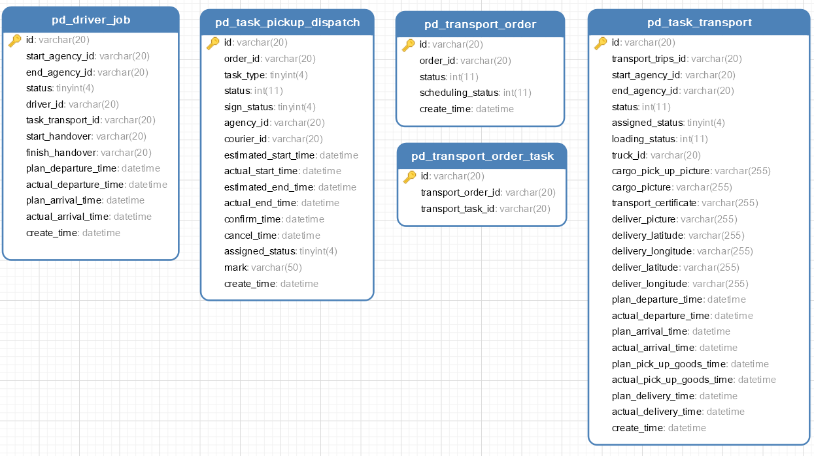

 

逻辑关系： 1、用户通过手机App寄件，产生订单(pd_order),根据订单计算，产生快递员取件任务(pd_task_pickup_dispatch) 2、快递员上门揽件，揽件后产生运单(pd_transport_order) 3、根据订单和运单计算，产生运输任务(pd_task_transport) 4、一个运单可能关联多个运输任务，通过运单与运输任务关联表(pd_transport_order_task)记录关联关系 5、根据运输任务计算，产生司机作业单(pd_driver_job) 6、货物到达收件人网点后，计算产生快递员派件任务(pd_task_pickup_dispatch)

#### 1.1 pd_task_pickup_dispatch

pd_task_pickup_dispatch为快递员取件、派件任务信息表，结构如下：

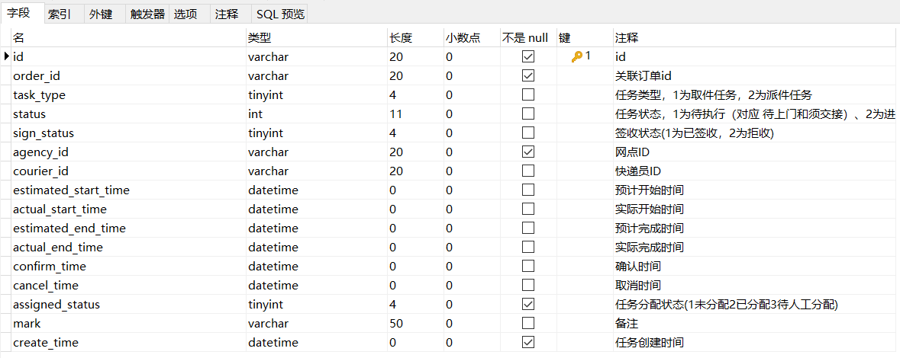

#### 1.2 pd_transport_order

pd_transport_order为运单表，结构如下：

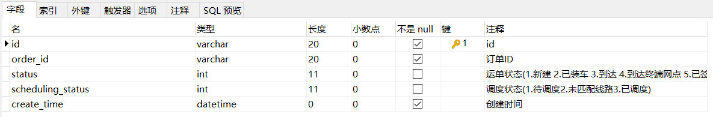

#### 1.3 pd_task_transport

pd_task_transport为运输任务表，结构如下：

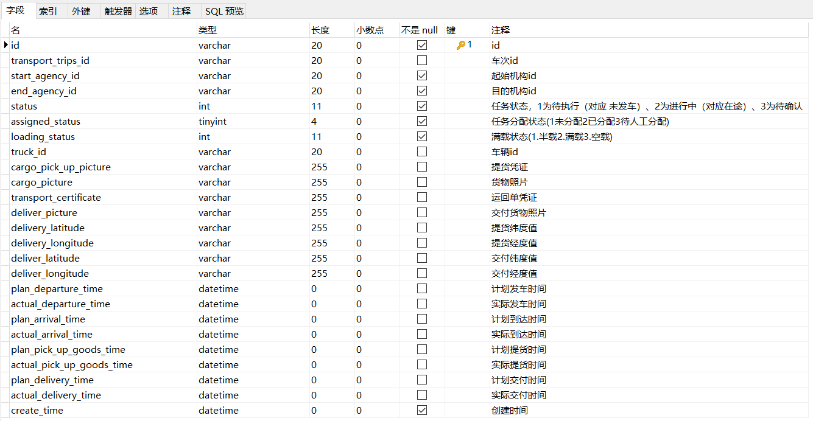

#### 1.4 pd_transport_order_task

pd_transport_order_task为运单与运输任务关联表，结构如下：

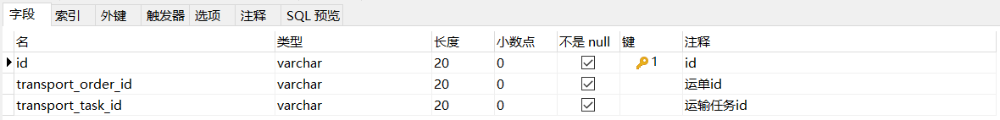

#### 1.5 pd_driver_job

pd_driver_job为司机作业单表，结构如下：

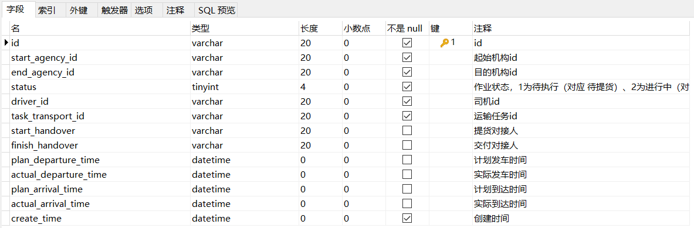

### 2. 作业中心服务开发准备

#### 2.1 SpringBoot配置文件

bootstrap.yml：

```
server:
  tomcat:
    uri-encoding: UTF-8
    max-threads: 1000
    min-spare-threads: 30
  port: 8187
  connection-timeout: 50000ms

spring:
  application:
    name: pd-work
  # 环境 dev|test|prod
  profiles:
    active: dev
  main:
    allow-bean-definition-overriding: true
```

bootstrap-dev.yml：

```
spring:
  cloud:
    nacos:
      username: tms
      password: itheima123
      discovery:
        server-addr: 68.79.63.42:8848
        group: pinda-tms
        namespace: 6107f553-3214-48d8-89c3-945f8446e3d9
      config:
        server-addr: 68.79.63.42:8848
        file-extension: yml
        group: pinda-tms
        namespace: 6107f553-3214-48d8-89c3-945f8446e3d9

  # jackson时间格式化
  jackson:
    time-zone: ${spring.jackson.time-zone}
    date-format: ${spring.jackson.date-format}
  servlet:
    multipart:
      max-file-size: ${spring.servlet.multipart.max-file-size}
      max-request-size: ${spring.servlet.multipart.max-request-size}
      enabled: ${spring.servlet.multipart.enabled}

  datasource:
      druid:
          type: ${spring.datasource.druid.type}
          driver-class-name: ${spring.datasource.druid.driver-class-name}
          url: ${spring.datasource.druid.url}
          username: ${spring.datasource.druid.username}
          password: ${spring.datasource.druid.password}
          initial-size: ${spring.datasource.druid.initial-size}
          max-active: ${spring.datasource.druid.max-active}
          min-idle: ${spring.datasource.druid.min-idle}
          max-wait: ${spring.datasource.druid.max-wait}
          pool-prepared-statements: ${spring.datasource.druid.pool-prepared-statements}
          max-pool-prepared-statement-per-connection-size: ${spring.datasource.druid.max-pool-prepared-statement-per-connection-size}
          time-between-eviction-runs-millis: ${spring.datasource.druid.time-between-eviction-runs-millis}
          min-evictable-idle-time-millis: ${spring.datasource.druid.min-evictable-idle-time-millis}
          test-while-idle: ${spring.datasource.druid.test-while-idle}
          test-on-borrow: ${spring.datasource.druid.test-on-borrow}
          test-on-return: ${spring.datasource.druid.test-on-return}
          stat-view-servlet:
              enabled: ${spring.datasource.druid.stat-view-servlet.stat-view-servlet}
              url-pattern: ${spring.datasource.druid.stat-view-servlet.url-pattern}
          filter:
              stat:
                  log-slow-sql: ${spring.datasource.druid.filter.stat.log-slow-sql}
                  slow-sql-millis: ${spring.datasource.druid.filter.stat.slow-sql-millis}
                  merge-sql: ${spring.datasource.druid.filter.stat.merge-sql}
              wall:
                  config:
                      multi-statement-allow: ${spring.datasource.druid.filter.wall.config.multi-statement-allow}


#mybatis
mybatis-plus:
  mapper-locations: ${mybatis-plus.mapper-locations}
  #实体扫描，多个package用逗号或者分号分隔
  typeAliasesPackage: ${mybatis-plus.typeAliasesPackage}
  global-config:
    #数据库相关配置
    db-config:
      #主键类型  AUTO:"数据库ID自增", INPUT:"用户输入ID", ID_WORKER:"全局唯一ID (数字类型唯一ID)", UUID:"全局唯一ID UUID";
      id-type: ${mybatis-plus.global-config.db-config.id-type}
      #字段策略 IGNORED:"忽略判断",NOT_NULL:"非 NULL 判断"),NOT_EMPTY:"非空判断"
      field-strategy: ${mybatis-plus.global-config.db-config.field-strategy}
      #驼峰下划线转换
      column-underline: ${mybatis-plus.global-config.db-config.column-underline}
      logic-delete-value: ${mybatis-plus.global-config.db-config.logic-delete-value}
      logic-not-delete-value: ${mybatis-plus.global-config.db-config.logic-not-delete-value}
    banner: ${mybatis-plus.global-config.banner}

  #原生配置
  configuration:
    map-underscore-to-camel-case: ${mybatis-plus.configuration.map-underscore-to-camel-case}
    cache-enabled: ${mybatis-plus.configuration.cache-enabled}
    call-setters-on-nulls: ${mybatis-plus.configuration.call-setters-on-nulls}
    jdbc-type-for-null: ${mybatis-plus.configuration.jdbc-type-for-null}
    log-impl: org.apache.ibatis.logging.stdout.StdOutImpl
```

#### 2.2 服务启动类

```
package com.itheima.pinda;

import org.springframework.boot.SpringApplication;
import org.springframework.boot.autoconfigure.SpringBootApplication;
import org.springframework.cloud.client.discovery.EnableDiscoveryClient;

@SpringBootApplication
@EnableDiscoveryClient
public class WorkApplication {

    public static void main(String[] args) {
        SpringApplication.run(WorkApplication.class, args);
    }

}
```

#### 2.3 配置类

```
package com.itheima.pinda.config;

import com.baomidou.mybatisplus.extension.plugins.PaginationInterceptor;
import org.springframework.context.annotation.Bean;
import org.springframework.context.annotation.Configuration;

@Configuration
public class MybatisPlusConfig {
    @Bean
    public PaginationInterceptor paginationInterceptor() {
        return new PaginationInterceptor();
    }
}
package com.itheima.pinda.config;

import org.springframework.context.annotation.Bean;
import org.springframework.context.annotation.Configuration;
import org.springframework.web.servlet.config.annotation.ResourceHandlerRegistry;
import org.springframework.web.servlet.config.annotation.WebMvcConfigurationSupport;
import springfox.documentation.builders.ApiInfoBuilder;
import springfox.documentation.builders.PathSelectors;
import springfox.documentation.builders.RequestHandlerSelectors;
import springfox.documentation.service.ApiInfo;
import springfox.documentation.spi.DocumentationType;
import springfox.documentation.spring.web.plugins.Docket;
import springfox.documentation.swagger2.annotations.EnableSwagger2;

@Configuration
@EnableSwagger2
public class SwaggerConfig extends WebMvcConfigurationSupport {
  // 定义分隔符
  private static final String splitor = ";";
  @Bean
  public Docket createRestApi() {
    // 文档类型
    return new Docket(DocumentationType.SWAGGER_2)
        // 创建api的基本信息
        .apiInfo(apiInfo())
        // 选择哪些接口去暴露
        .select()
        // 扫描的包
        .apis(RequestHandlerSelectors.basePackage("com.itheima.pinda.controller"))
        .paths(PathSelectors.any())
        .build();
  }

  private ApiInfo apiInfo() {
    return new ApiInfoBuilder()
        .title("品达物流订单模块--Swagger文档")
        .version("1.0")
        .build();
  }

  /**
   * 防止@EnableMvc把默认的静态资源路径覆盖了，手动设置的方式
   *
   * @param registry
   */
  @Override
  protected void addResourceHandlers(ResourceHandlerRegistry registry) {
    // 解决静态资源无法访问
    registry.addResourceHandler("/**").addResourceLocations("classpath:/static/");
    // 解决swagger无法访问
    registry.addResourceHandler("/swagger-ui.html").addResourceLocations("classpath:/META-INF/resources/");
    // 解决swagger的js文件无法访问
    registry.addResourceHandler("/webjars/**").addResourceLocations("classpath:/META-INF/resources/webjars/");

  }

}
```

#### 2.4 工具类

```
package com.itheima.pinda.common;

import com.baomidou.mybatisplus.core.incrementer.IdentifierGenerator;
import com.itheima.pinda.common.utils.IdWorker;
import org.springframework.beans.factory.annotation.Autowired;
import org.springframework.context.annotation.Bean;
import org.springframework.stereotype.Component;

/**
 * 自定义ID生成器
 */
@Component
public class CustomIdGenerator implements IdentifierGenerator {
    @Bean
    public IdWorker idWorkker(){
        return new IdWorker(1, 1);
    }
    
    @Autowired
    private IdWorker idWorker;

    @Override
    public Long nextId(Object entity) {
        return idWorker.nextId();
    }

}
```

### 3. 快递员取件、派件任务管理

#### 3.1 业务需求和产品原型

用户通过手机App寄件，产生订单(pd_order),根据订单计算，产生快递员取件任务(pd_task_pickup_dispatch)。 货物到达收件人网点后，计算产生快递员派件任务(pd_task_pickup_dispatch)。

任务类型：1为取件任务，2为派件任务

任务状态：1为待执行（对应 待上门和须交接）、2为进行中（该状态暂不使用，属于保留状态）、3为待确认（对应 待妥投和须交件）、4为已完成、5为已取消

签收状态：1为已签收，2为拒收

任务分配状态：1为未分配，2为已分配，3为待人工分配

产品原型如下：

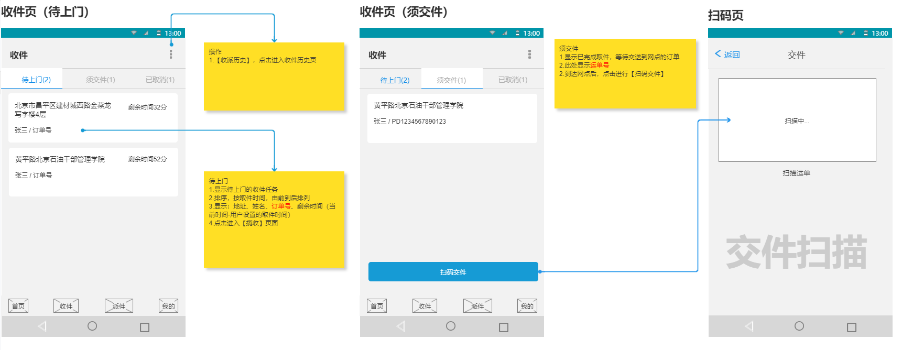

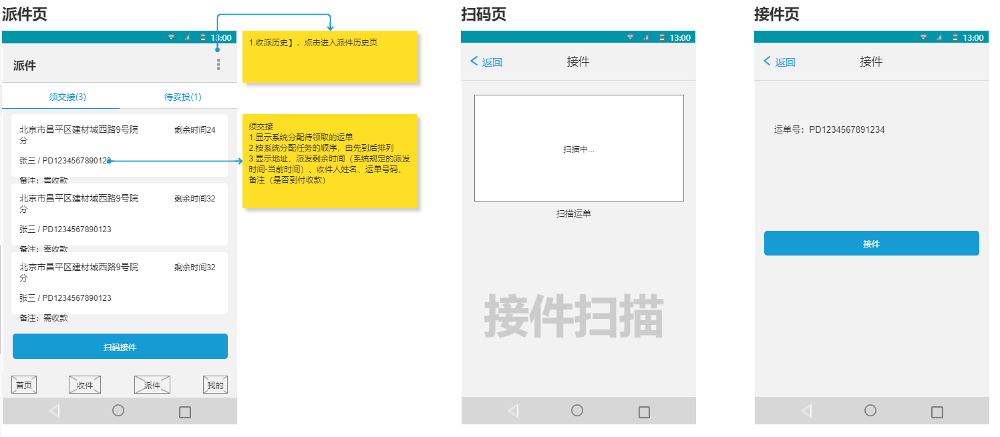

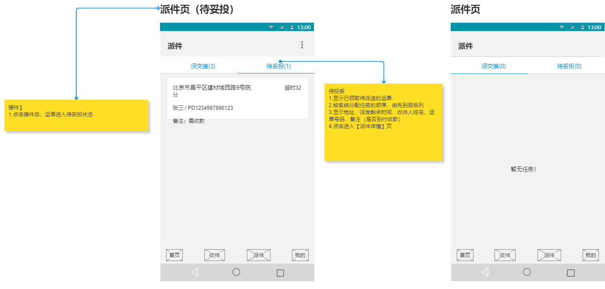

#### 3.2 数据模型

快递员取件、派件任务对应的数据模型为：pd_work数据库中的pd_task_pickup_dispatch表，表结构如下：


#### 3.3 导入实体类

```
package com.itheima.pinda.entity;

import com.baomidou.mybatisplus.annotation.IdType;
import com.baomidou.mybatisplus.annotation.TableId;
import com.baomidou.mybatisplus.annotation.TableName;
import java.io.Serializable;
import java.time.LocalDateTime;
import lombok.Data;
import lombok.EqualsAndHashCode;
import lombok.experimental.Accessors;

/**
 * 快递员取件、派件任务
 */
@Data
@EqualsAndHashCode(callSuper = false)
@Accessors(chain = true)
@TableName("pd_task_pickup_dispatch")
public class TaskPickupDispatch implements Serializable {
    private static final long serialVersionUID = 1L;

    /**
     * id
     */
    @TableId(value = "id", type = IdType.INPUT)
    private String id;

    /**
     * 关联订单id
     */
    private String orderId;

    /**
     * 任务类型，1为取件任务，2为派件任务
     */
    private Integer taskType;

    /**
     * 任务状态，1为待执行（对应 待上门和须交接）、2为进行中（该状态暂不使用，属于保留状态）、3为待确认（对应 待妥投和须交件）、4为已完成、5为已取消
     */
    private Integer status;

    /**
     * 签收状态(1为已签收，2为拒收)
     */
    private Integer signStatus;

    /**
     * 网点ID
     */
    private String agencyId;

    /**
     * 快递员ID
     */
    private String courierId;

    /**
     * 预计开始时间
     */
    private LocalDateTime estimatedStartTime;

    /**
     * 实际开始时间
     */
    private LocalDateTime actualStartTime;

    /**
     * 预计完成时间
     */
    private LocalDateTime estimatedEndTime;

    /**
     * 实际完成时间
     */
    private LocalDateTime actualEndTime;

    /**
     * 确认时间
     */
    private LocalDateTime confirmTime;

    /**
     * 取消时间
     */
    private LocalDateTime cancelTime;

    /**
     * 任务分配状态(1未分配2已分配3待人工分配)
     */
    private Integer assignedStatus;

    /**
     * 备注
     */
    private String mark;

    /**
     * 任务创建时间
     */
    private LocalDateTime createTime;
}
```

#### 3.4 服务接口开发

##### 3.4.1 新增取派件任务

第一步：创建PickupDispatchTaskController并提供save方法

```
package com.itheima.pinda.controller;

import com.itheima.pinda.DTO.TaskPickupDispatchDTO;
import com.itheima.pinda.common.utils.PageResponse;
import com.itheima.pinda.entity.TaskPickupDispatch;
import com.itheima.pinda.enums.pickuptask.PickupDispatchTaskAssignedStatus;
import com.itheima.pinda.service.ITaskPickupDispatchService;
import org.apache.commons.lang.StringUtils;
import org.springframework.beans.BeanUtils;
import org.springframework.beans.factory.annotation.Autowired;
import org.springframework.web.bind.annotation.*;
import java.util.ArrayList;
import java.util.List;
import java.util.stream.Collectors;

/**
 * 取件、派件任务
 */
@RestController
@RequestMapping("pickup-dispatch-task")
public class PickupDispatchTaskController {
    @Autowired
    private ITaskPickupDispatchService taskPickupDispatchService;

    /**
     * 新增取派件任务
     *
     * @param dto 取派件任务信息
     * @return 取派件任务信息
     */
    @PostMapping("")
    public TaskPickupDispatchDTO save(@RequestBody TaskPickupDispatchDTO dto) {
        TaskPickupDispatch dispatch = new TaskPickupDispatch();
        BeanUtils.copyProperties(dto, dispatch);
        taskPickupDispatchService.saveTaskPickupDispatch(dispatch);
        TaskPickupDispatchDTO result = new TaskPickupDispatchDTO();
        BeanUtils.copyProperties(dispatch, result);
        return result;
    }
}
```

第二步：创建ITaskPickupDispatchService接口

```
package com.itheima.pinda.service;

import com.baomidou.mybatisplus.core.metadata.IPage;
import com.baomidou.mybatisplus.extension.service.IService;
import com.itheima.pinda.entity.TaskPickupDispatch;

import java.util.List;

/**
 * 取件、派件任务服务接口
 */
public interface ITaskPickupDispatchService extends IService<TaskPickupDispatch> {
    /**
     * 新增取派件任务
     *
     * @param taskPickupDispatch 取派件任务信息
     * @return 取派件任务信息
     */
    TaskPickupDispatch saveTaskPickupDispatch(TaskPickupDispatch taskPickupDispatch);
}
```

第三步：创建上面服务接口的实现类TaskPickupDispatchServiceImpl

```
package com.itheima.pinda.service.impl;

import com.baomidou.mybatisplus.core.conditions.query.LambdaQueryWrapper;
import com.baomidou.mybatisplus.core.metadata.IPage;
import com.baomidou.mybatisplus.extension.plugins.pagination.Page;
import com.baomidou.mybatisplus.extension.service.impl.ServiceImpl;
import com.itheima.pinda.common.CustomIdGenerator;
import com.itheima.pinda.entity.TaskPickupDispatch;
import com.itheima.pinda.enums.pickuptask.PickupDispatchTaskAssignedStatus;
import com.itheima.pinda.enums.pickuptask.PickupDispatchTaskStatus;
import com.itheima.pinda.mapper.TaskPickupDispatchMapper;
import com.itheima.pinda.service.ITaskPickupDispatchService;
import org.apache.commons.lang.StringUtils;
import org.springframework.beans.factory.annotation.Autowired;
import org.springframework.stereotype.Service;
import java.time.LocalDateTime;
import java.util.List;

/**
 * 取件、派件任务服务实现类
 */
@Service
public class TaskPickupDispatchServiceImpl extends ServiceImpl<TaskPickupDispatchMapper, TaskPickupDispatch> implements ITaskPickupDispatchService {
    @Autowired
    private CustomIdGenerator idGenerator;

    /**
     * 新增取派件任务
     *
     * @param taskPickupDispatch 取派件任务信息
     * @return 取派件任务信息
     */
    @Override
    public TaskPickupDispatch saveTaskPickupDispatch(TaskPickupDispatch taskPickupDispatch) {
        taskPickupDispatch.setId(idGenerator.nextId(taskPickupDispatch) + "");
        taskPickupDispatch.setCreateTime(LocalDateTime.now());
        taskPickupDispatch.setStatus(PickupDispatchTaskStatus.PENDING.getCode());
        taskPickupDispatch.setAssignedStatus(PickupDispatchTaskAssignedStatus.TO_BE_DISTRIBUTED.getCode());
        save(taskPickupDispatch);
        return taskPickupDispatch;
    }
}
```

第四步：创建TaskPickupDispatchMapper接口

```
package com.itheima.pinda.mapper;

import com.baomidou.mybatisplus.core.mapper.BaseMapper;
import com.itheima.pinda.entity.TaskPickupDispatch;
import org.apache.ibatis.annotations.Mapper;

/**
 * 取件、派件任务Mapper接口
 */
@Mapper
public interface TaskPickupDispatchMapper extends BaseMapper<TaskPickupDispatch> {
}
```

第五步：创建上面Mapper接口对应的xml映射文件

文件位置：/resources/mapper/TaskPickupDispatchMapper.xml

```
<?xml version="1.0" encoding="UTF-8"?>
<!DOCTYPE mapper PUBLIC "-//mybatis.org//DTD Mapper 3.0//EN" "http://mybatis.org/dtd/mybatis-3-mapper.dtd">
<mapper namespace="com.itheima.pinda.mapper.TaskPickupDispatchMapper">
</mapper>
```

##### 3.4.2 修改取派件任务信息

在PickupDispatchTaskController中创建updateById方法

```
/**
* 修改取派件任务信息
*
* @param id  取派件任务id
* @param dto 取派件任务信息
* @return 取派件任务信息
*/
@PutMapping("/{id}")
public TaskPickupDispatchDTO updateById(@PathVariable(name = "id") String id, @RequestBody TaskPickupDispatchDTO dto) {
    dto.setId(id);
    TaskPickupDispatch dispatch = new TaskPickupDispatch();
    BeanUtils.copyProperties(dto, dispatch);
    if (StringUtils.isNotEmpty(dispatch.getCourierId())) {
        dispatch.setAssignedStatus(PickupDispatchTaskAssignedStatus.DISTRIBUTED.getCode());
    }
    taskPickupDispatchService.updateById(dispatch);
    return dto;
}
```

##### 3.4.3 获取取派件任务分页数据

第一步：在PickupDispatchTaskController中创建findByPage方法

```
/**
* 获取取派件任务分页数据
*
* @param dto 查询条件
* @return 取派件分页数据
*/
@PostMapping("/page")
public PageResponse<TaskPickupDispatchDTO> findByPage(@RequestBody TaskPickupDispatchDTO dto) {
    if (dto.getPage() == null) {
        dto.setPage(1);
    }
    if (dto.getPageSize() == null) {
        dto.setPageSize(10);
    }
    TaskPickupDispatch queryTask = new TaskPickupDispatch();
    BeanUtils.copyProperties(dto, queryTask);
    IPage<TaskPickupDispatch> orderIPage = taskPickupDispatchService.findByPage(dto.getPage(), dto.getPageSize(), queryTask);
    List<TaskPickupDispatchDTO> dtoList = new ArrayList<>();
    orderIPage.getRecords().forEach(order -> {
        TaskPickupDispatchDTO resultDto = new TaskPickupDispatchDTO();
        BeanUtils.copyProperties(order, resultDto);
        dtoList.add(resultDto);
    });
    return PageResponse.<TaskPickupDispatchDTO>builder().items(dtoList).pagesize(dto.getPageSize()).page(dto.getPage()).counts(orderIPage.getTotal())
        .pages(orderIPage.getPages()).build();
}
```

第二步：在ITaskPickupDispatchService接口中扩展findByPage方法

```
/**
* 获取取派件任务分页数据
*
* @param page     页码
* @param pageSize 页尺寸
* @param dispatch 查询条件
* @return 取派件任务分页数据
*/
IPage<TaskPickupDispatch> findByPage(Integer page, Integer pageSize, TaskPickupDispatch dispatch);
```

第三步：在TaskPickupDispatchServiceImpl实现类中实现findByPage方法

```
@Override
public IPage<TaskPickupDispatch> findByPage(Integer page, Integer pageSize, TaskPickupDispatch dispatch) {
    Page<TaskPickupDispatch> iPage = new Page(page, pageSize);
    LambdaQueryWrapper<TaskPickupDispatch> lambdaQueryWrapper = new LambdaQueryWrapper<>();
    if (StringUtils.isNotBlank(dispatch.getCourierId())) {
        lambdaQueryWrapper.eq(TaskPickupDispatch::getCourierId, dispatch.getCourierId());
    }
    if (dispatch.getAssignedStatus() != null) {
        lambdaQueryWrapper.eq(TaskPickupDispatch::getAssignedStatus, dispatch.getAssignedStatus());
    }
    if (dispatch.getTaskType() != null) {
        lambdaQueryWrapper.eq(TaskPickupDispatch::getTaskType, dispatch.getTaskType());
    }
    if (dispatch.getStatus() != null) {
        lambdaQueryWrapper.eq(TaskPickupDispatch::getStatus, dispatch.getStatus());
    }
    lambdaQueryWrapper.orderBy(true, false, TaskPickupDispatch::getId);
    return page(iPage, lambdaQueryWrapper);
}
```

##### 3.4.4 获取取派件任务列表

第一步：在PickupDispatchTaskController中创建findAll方法

```
/**
* 获取取派件任务列表
*
* @param dto 查询条件
* @return 取派件任务列表
*/
@PostMapping("/list")
public List<TaskPickupDispatchDTO> findAll(@RequestBody TaskPickupDispatchDTO dto) {
    TaskPickupDispatch queryTask = new TaskPickupDispatch();
    BeanUtils.copyProperties(dto, queryTask);
    return taskPickupDispatchService.findAll(dto.getIds(), dto.getOrderIds(), queryTask).stream().map(taskPickupDispatch -> {
        TaskPickupDispatchDTO resultDto = new TaskPickupDispatchDTO();
        BeanUtils.copyProperties(taskPickupDispatch, resultDto);
        return resultDto;
    }).collect(Collectors.toList());
}
```

第二步：在ITaskPickupDispatchService接口中扩展findAll方法

```
/**
* 获取取派件任务列表
*
* @param ids      取派件任务id列表
* @param dispatch 查询条件
* @return 取派件任务列表
*/
List<TaskPickupDispatch> findAll(List<String> ids, List<String> orderIds, TaskPickupDispatch dispatch);
```

第三步：在TaskPickupDispatchServiceImpl实现类中实现findAll方法

```
@Override
public List<TaskPickupDispatch> findAll(List<String> ids, List<String> orderIds, TaskPickupDispatch dispatch) {
    LambdaQueryWrapper<TaskPickupDispatch> lambdaQueryWrapper = new LambdaQueryWrapper<>();
    if (ids != null && ids.size() > 0) {
        lambdaQueryWrapper.in(TaskPickupDispatch::getId, ids);
    }
    if (orderIds != null && orderIds.size() > 0) {
        lambdaQueryWrapper.in(TaskPickupDispatch::getOrderId, orderIds);
    }
    if (dispatch.getAssignedStatus() != null) {
        lambdaQueryWrapper.eq(TaskPickupDispatch::getAssignedStatus, dispatch.getAssignedStatus());
    }
    if (dispatch.getTaskType() != null) {
        lambdaQueryWrapper.eq(TaskPickupDispatch::getTaskType, dispatch.getTaskType());
    }
    if (dispatch.getStatus() != null) {
        lambdaQueryWrapper.eq(TaskPickupDispatch::getStatus, dispatch.getStatus());
    }
    if (StringUtils.isNotEmpty(dispatch.getOrderId())) {
        lambdaQueryWrapper.like(TaskPickupDispatch::getOrderId, dispatch.getOrderId());
    }
    lambdaQueryWrapper.orderBy(true, false, TaskPickupDispatch::getId);
    return list(lambdaQueryWrapper);
}
```

##### 3.4.5 根据id获取取派件任务信息

在PickupDispatchTaskController中创建findById方法

```
/**
* 根据id获取取派件任务信息
*
* @param id 任务Id
* @return 任务详情
*/
@GetMapping("/{id}")
public TaskPickupDispatchDTO findById(@PathVariable(name = "id") String id) {
    TaskPickupDispatchDTO dto = new TaskPickupDispatchDTO();
    TaskPickupDispatch dispatch = taskPickupDispatchService.getById(id);
    if (dispatch != null) {
        BeanUtils.copyProperties(dispatch, dto);
    } else {
        dto = null;
    }
    return dto;
}
```

##### 3.4.6 根据订单id获取取派件任务信息

在PickupDispatchTaskController中创建findByOrderId方法

```
/**
* 根据订单id获取取派件任务信息
*
* @param orderId 订单Id
* @return 任务详情
*/
@GetMapping("/orderId/{orderId}/{taskType}")
public TaskPickupDispatchDTO findByOrderId(@PathVariable("orderId") String orderId, @PathVariable("taskType") Integer taskType) {
    TaskPickupDispatchDTO dto = new TaskPickupDispatchDTO();

    LambdaQueryWrapper<TaskPickupDispatch> wrapper = new LambdaQueryWrapper<>();
    wrapper.eq(TaskPickupDispatch::getOrderId, orderId);
    wrapper.eq(TaskPickupDispatch::getTaskType, taskType);
    TaskPickupDispatch dispatch = taskPickupDispatchService.getOne(wrapper);
    if (dispatch != null) {
        BeanUtils.copyProperties(dispatch, dto);
    } else {
        dto = null;
    }
    return dto;
}
```

### 4. 运单管理

#### 4.1 业务需求和产品原型

运单是指承运人与托运人之间关于货物运输事宜的“一次性’’书面契约。是货物运输及运输代理的合同凭证，也是运输经营者接受货物并在运输期间负责保管和据以交付的凭据。整个运输过程中，运单是进行各项运输作业和处理有关事项(如货运事故或运费计收等)的基本依据。

运单状态：1.新建 2.已装车 3.到达 4.到达终端网点 5.已签收 6.拒收

调度状态：1.待调度 2.未匹配线路 3.已调度

产品原型如下：

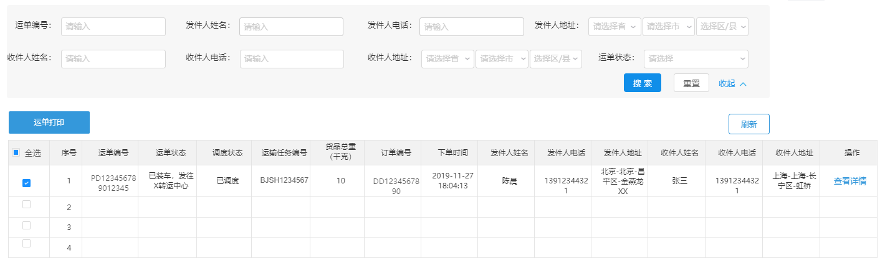

#### 4.2 数据模型

运单对应的数据模型为：pd_work数据库中的pd_transport_order表，表结构如下：


#### 4.3 导入实体类

```
package com.itheima.pinda.entity;

import com.baomidou.mybatisplus.annotation.IdType;
import com.baomidou.mybatisplus.annotation.TableId;
import com.baomidou.mybatisplus.annotation.TableName;
import java.io.Serializable;
import java.time.LocalDateTime;
import lombok.Data;
import lombok.EqualsAndHashCode;
import lombok.experimental.Accessors;

/**
 * 运单
 */
@Data
@EqualsAndHashCode(callSuper = false)
@Accessors(chain = true)
@TableName("pd_transport_order")
public class TransportOrder implements Serializable {
    private static final long serialVersionUID = 1L;

    /**
     * id
     */
    @TableId(value = "id", type = IdType.INPUT)
    private String id;


    /**
     * 订单ID
     */
    private String orderId;

    /**
     * 运单状态(1.新建 2.已装车，发往x转运中心 3.到达 4.到达终端网点)
     */
    private Integer status;

    /**
     * 调度状态调度状态(1.待调度2.未匹配线路3.已调度)
     */
    private Integer schedulingStatus;

    /**
     * 创建时间
     */
    private LocalDateTime createTime;
}
```

#### 4.4 服务接口开发

##### 4.4.1 新增运单

第一步：创建TransportOrderController并提供save方法

```
package com.itheima.pinda.controller;

import com.baomidou.mybatisplus.core.conditions.query.LambdaQueryWrapper;
import com.baomidou.mybatisplus.core.metadata.IPage;
import com.itheima.pinda.DTO.TransportOrderDTO;
import com.itheima.pinda.DTO.TransportOrderSearchDTO;
import com.itheima.pinda.common.utils.PageResponse;
import com.itheima.pinda.entity.TransportOrder;
import com.itheima.pinda.service.ITransportOrderService;
import lombok.extern.slf4j.Slf4j;
import org.springframework.beans.BeanUtils;
import org.springframework.beans.factory.annotation.Autowired;
import org.springframework.util.CollectionUtils;
import org.springframework.web.bind.annotation.*;
import java.util.ArrayList;
import java.util.List;
import java.util.stream.Collectors;

/**
 * 运单管理
 */
@Slf4j
@RestController
@RequestMapping("transport-order")
public class TransportOrderController {
    @Autowired
    private ITransportOrderService transportOrderService;

    /**
     * 新增运单
     *
     * @param dto 运单信息
     * @return 运单信息
     */
    @PostMapping("")
    public TransportOrderDTO save(@RequestBody TransportOrderDTO dto) {
        TransportOrder transportOrder = new TransportOrder();
        BeanUtils.copyProperties(dto, transportOrder);
        transportOrderService.saveTransportOrder(transportOrder);
        TransportOrderDTO result = new TransportOrderDTO();
        BeanUtils.copyProperties(transportOrder, result);
        return result;
    }
}
```

第二步：创建ITransportOrderService接口

```
package com.itheima.pinda.service;

import com.baomidou.mybatisplus.extension.service.IService;
import com.itheima.pinda.entity.TransportOrder;
import java.util.List;

/**
 * 运单服务接口
 */
public interface ITransportOrderService extends IService<TransportOrder> {
    /**
     * 新增运单
     *
     * @param transportOrder 运单信息
     * @return 运单信息
     */
    TransportOrder saveTransportOrder(TransportOrder transportOrder);
}
```

第三步：创建TransportOrderServiceImpl实现类

```
package com.itheima.pinda.service.impl;

import com.baomidou.mybatisplus.core.conditions.query.LambdaQueryWrapper;
import com.baomidou.mybatisplus.core.metadata.IPage;
import com.baomidou.mybatisplus.extension.plugins.pagination.Page;
import com.baomidou.mybatisplus.extension.service.impl.ServiceImpl;
import com.itheima.pinda.common.CustomIdGenerator;
import com.itheima.pinda.entity.TransportOrder;
import com.itheima.pinda.enums.transportorder.TransportOrderSchedulingStatus;
import com.itheima.pinda.enums.transportorder.TransportOrderStatus;
import com.itheima.pinda.mapper.TransportOrderMapper;
import com.itheima.pinda.service.ITransportOrderService;
import org.apache.commons.lang.StringUtils;
import org.springframework.beans.factory.annotation.Autowired;
import org.springframework.stereotype.Service;
import java.time.LocalDateTime;
import java.util.List;

/**
 * 运单服务实现类
 */
@Service
public class TransportOrderServiceImpl extends
        ServiceImpl<TransportOrderMapper, TransportOrder> implements ITransportOrderService {
    @Autowired
    private CustomIdGenerator idGenerator;

    @Override
    public TransportOrder saveTransportOrder(TransportOrder transportOrder) {
        transportOrder.setCreateTime(LocalDateTime.now());
        transportOrder.setId(idGenerator.nextId(transportOrder) + "");
        transportOrder.setStatus(TransportOrderStatus.CREATED.getCode());
        transportOrder.setSchedulingStatus(TransportOrderSchedulingStatus.TO_BE_SCHEDULED.getCode());
        save(transportOrder);
        return transportOrder;
    }
    
}
```

第四步：创建TransportOrderMapper接口

```
package com.itheima.pinda.mapper;

import com.baomidou.mybatisplus.core.mapper.BaseMapper;
import com.itheima.pinda.entity.TransportOrder;
import org.apache.ibatis.annotations.Mapper;

/**
 * 运单Mapper接口
 */
@Mapper
public interface TransportOrderMapper extends BaseMapper<TransportOrder> {
}
```

第五步：创建上面Mapper接口对应的xml映射文件

文件位置：/resources/mapper/TransportOrderMapper.xml

```
<?xml version="1.0" encoding="UTF-8" ?>
<!DOCTYPE mapper PUBLIC "-//mybatis.org//DTD Mapper 3.0//EN" "http://mybatis.org/dtd/mybatis-3-mapper.dtd" >
<mapper namespace="com.itheima.pinda.mapper.TransportOrderMapper">
</mapper>
```

##### 4.4.2 修改运单信息

在TransportOrderController中创建updateById方法：

```
/**
* 修改运单信息
*
* @param id  运单id
* @param dto 运单信息
* @return 运单信息
*/
@PutMapping("/{id}")
public TransportOrderDTO updateById(@PathVariable(name = "id") String id, @RequestBody TransportOrderDTO dto) {
    dto.setId(id);
    TransportOrder transportOrder = new TransportOrder();
    BeanUtils.copyProperties(dto, transportOrder);
    transportOrderService.updateById(transportOrder);
    return dto;
}
```

##### 4.4.3 获取运单分页数据

第一步：在TransportOrderController中创建findByPage方法

```
/**
* 获取运单分页数据
*
* @param page             页码
* @param pageSize         页尺寸
* @param orderId          订单ID
* @param status           运单状态(1.新建 2.已装车，发往x转运中心 3.到达 4.到达终端网点)
* @param schedulingStatus 调度状态调度状态(1.待调度2.未匹配线路3.已调度)
* @return 运单分页数据
*/
@GetMapping("/page")
public PageResponse<TransportOrderDTO> findByPage(@RequestParam(name = "page") Integer page,
                                                  @RequestParam(name = "pageSize") Integer pageSize,
                                                  @RequestParam(name = "orderId", required = false) String orderId,
                                                  @RequestParam(name = "status", required = false) Integer status,
                                                  @RequestParam(name = "schedulingStatus", required = false) Integer schedulingStatus) {
    IPage<TransportOrder> orderIPage = transportOrderService.findByPage(page, pageSize, orderId, status, schedulingStatus);
    List<TransportOrderDTO> dtoList = new ArrayList<>();
    orderIPage.getRecords().forEach(order -> {
        TransportOrderDTO resultDto = new TransportOrderDTO();
        BeanUtils.copyProperties(order, resultDto);
        dtoList.add(resultDto);
    });
    return PageResponse.<TransportOrderDTO>builder().items(dtoList).pagesize(pageSize).page(page).counts(orderIPage.getTotal())
        .pages(orderIPage.getPages()).build();
}
```

第二步：在ITransportOrderService接口中扩展findByPage方法

```
/**
* 获取运单分页数据
*
* @param page             页码
* @param pageSize         页尺寸
* @param orderId          订单Id
* @param status           运单状态
* @param schedulingStatus 运单调度状态
* @return 运单分页数据
*/
IPage<TransportOrder> findByPage(Integer page, Integer pageSize, String orderId, Integer status, Integer schedulingStatus);
```

第三步：在TransportOrderServiceImpl实现类中实现findByPage方法

```
@Override
public IPage<TransportOrder> findByPage(Integer page, Integer pageSize, String orderId, Integer status, Integer schedulingStatus) {
    Page<TransportOrder> iPage = new Page(page, pageSize);
    LambdaQueryWrapper<TransportOrder> lambdaQueryWrapper = new LambdaQueryWrapper<>();
    if (StringUtils.isNotEmpty(orderId)) {
        lambdaQueryWrapper.like(TransportOrder::getOrderId, orderId);
    }
    if (status != null) {
        lambdaQueryWrapper.eq(TransportOrder::getStatus, status);
    }
    if (schedulingStatus != null) {
        lambdaQueryWrapper.eq(TransportOrder::getSchedulingStatus, schedulingStatus);
    }
    return page(iPage, lambdaQueryWrapper);
}
```

##### 4.4.4 根据id获取运单信息

在TransportOrderController中创建findById方法：

```
/**
* 根据id获取运单信息
*
* @param id 运单id
* @return 运单信息
*/
@GetMapping("/{id}")
public TransportOrderDTO findById(@PathVariable(name = "id") String id) {
    TransportOrderDTO dto = new TransportOrderDTO();
    TransportOrder transportOrder = transportOrderService.getById(id);
    if (transportOrder != null) {
        BeanUtils.copyProperties(transportOrder, dto);
    } else {
        dto = null;
    }
    return dto;
}
```

##### 4.4.5 根据订单id获取运单信息

第一步：在TransportOrderController中创建findByOrderId方法

```
/**
* 根据订单id获取运单信息
*
* @param orderId 订单id
* @return 运单信息
*/
@GetMapping("/orderId/{orderId}")
public TransportOrderDTO findByOrderId(@PathVariable(name = "orderId") String orderId) {
    TransportOrderDTO dto = new TransportOrderDTO();
    TransportOrder transportOrder = transportOrderService.findByOrderId(orderId);
    if (transportOrder != null) {
        BeanUtils.copyProperties(transportOrder, dto);
    } else {
        dto = null;
    }
    return dto;
}
```

第二步：在ITransportOrderService接口中扩展findByOrderId方法

```
/**
* 通过订单id获取运单信息
*
* @param orderId 订单id
* @return 运单信息
*/
TransportOrder findByOrderId(String orderId);
```

第三步：在TransportOrderServiceImpl实现类中实现findByOrderId方法

```
@Override
public TransportOrder findByOrderId(String orderId) {
    return getOne(new LambdaQueryWrapper<TransportOrder>().eq(TransportOrder::getOrderId, orderId));
}
```

##### 4.4.6 根据多个订单id查询运单信息

在TransportOrderController中创建findByOrderIds方法

```
/**
* 根据多个订单id查询运单信息
*
* @param ids
* @return
*/
@GetMapping("orderIds")
public List<TransportOrderDTO> findByOrderIds(@RequestParam(name = "ids") List<String> ids) {
    LambdaQueryWrapper<TransportOrder> wrapper = new LambdaQueryWrapper();
    wrapper.in(TransportOrder::getOrderId, ids);
    List<TransportOrder> transportOrders = transportOrderService.list(wrapper);
    return transportOrders.stream().map(item -> {
        TransportOrderDTO dto = new TransportOrderDTO();
        BeanUtils.copyProperties(item, dto);
        return dto;
    }).collect(Collectors.toList());
}
```

##### 4.4.7 根据多个参数获取运单信息

在TransportOrderController中创建list方法

```
/**
* 根据多个参数获取运单信息
*
* @param transportOrderSearchDTO
* @return
*/
@PostMapping("list")
public List<TransportOrderDTO> list(@RequestBody TransportOrderSearchDTO transportOrderSearchDTO) {
    LambdaQueryWrapper<TransportOrder> wrapper = new LambdaQueryWrapper();
    wrapper.eq(transportOrderSearchDTO.getStatus() != null, TransportOrder::getStatus, transportOrderSearchDTO.getStatus());
    wrapper.eq(transportOrderSearchDTO.getSchedulingStatus() != null, TransportOrder::getSchedulingStatus, transportOrderSearchDTO.getSchedulingStatus());
    wrapper.in(!CollectionUtils.isEmpty(transportOrderSearchDTO.getOrderIds()), TransportOrder::getOrderId, transportOrderSearchDTO.getOrderIds());
    List<TransportOrder> transportOrders = transportOrderService.list(wrapper);
    return transportOrders.stream().map(item -> {
        TransportOrderDTO dto = new TransportOrderDTO();
        BeanUtils.copyProperties(item, dto);
        return dto;
    }).collect(Collectors.toList());
}
```

### 5. 运输任务管理

#### 5.1 业务需求和产品原型

根据订单和运单计算，产生运输任务(pd_task_transport)。一个运单可能关联多个运输任务。

任务状态：1为待执行（对应 未发车）、2为进行中（对应在途）、3为待确认（保留状态）、4为已完成（对应 已交付）、5为已取消。

任务分配状态：1未分配、2已分配、3待人工分配。

产品原型如下：

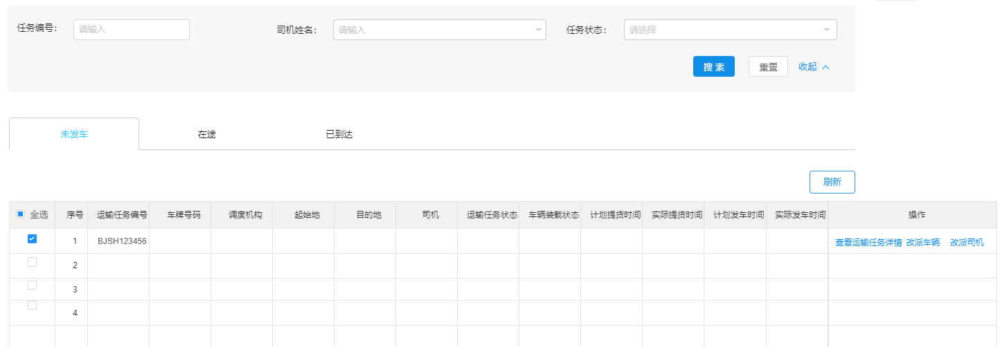

#### 5.2 数据模型

运输任务对应的数据模型为：pd_work数据库中的pd_task_transport表，表结构如下：


#### 5.3 导入实体类

```
package com.itheima.pinda.entity;

import com.baomidou.mybatisplus.annotation.IdType;
import com.baomidou.mybatisplus.annotation.TableId;
import com.baomidou.mybatisplus.annotation.TableName;
import lombok.Data;
import lombok.EqualsAndHashCode;
import lombok.experimental.Accessors;
import java.io.Serializable;
import java.time.LocalDateTime;

/**
 * 运输任务
 */
@Data
@EqualsAndHashCode(callSuper = false)
@Accessors(chain = true)
@TableName("pd_task_transport")
public class TaskTransport implements Serializable {
    private static final long serialVersionUID = 1L;

    /**
     * id
     */
    @TableId(value = "id", type = IdType.INPUT)
    private String id;

    /**
     * 车次id
     */
    private String transportTripsId;

    /**
     * 起始机构id
     */
    private String startAgencyId;

    /**
     * 目的机构id
     */
    private String endAgencyId;

    /**
     * 任务状态，1为待执行（对应 待提货）、2为进行中（对应在途）、3为待确认（保留状态）、4为已完成（对应 已交付）、5为已取消
     */
    private Integer status;

    /**
     * 任务分配状态(1未分配2已分配3待人工分配)
     */
    private Integer assignedStatus;

    /**
     * 满载状态(1.半载2.满载3.空载)
     */
    private Integer loadingStatus;

    /**
     * 车辆id
     */
    private String truckId;

    /**
     * 提货凭证
     */
    private String cargoPickUpPicture;

    /**
     * 货物照片
     */
    private String cargoPicture;

    /**
     * 运回单凭证
     */
    private String transportCertificate;

    /**
     * 计划发车时间
     */
    private LocalDateTime planDepartureTime;

    /**
     * 实际发车时间
     */
    private LocalDateTime actualDepartureTime;

    /**
     * 计划到达时间
     */
    private LocalDateTime planArrivalTime;

    /**
     * 实际到达时间
     */
    private LocalDateTime actualArrivalTime;

    /**
     * 计划提货时间
     */
    private LocalDateTime planPickUpGoodsTime;

    /**
     * 实际提货时间
     */
    private LocalDateTime actualPickUpGoodsTime;

    /**
     * 计划交付时间
     */
    private LocalDateTime planDeliveryTime;

    /**
     * 实际交付时间
     */
    private LocalDateTime actualDeliveryTime;

    /**
     * 交付货物照片
     */
    private String deliverPicture;
    /**
     * 提货纬度
     */
    private String deliveryLatitude;
    /**
     * 提货经度
     */
    private String deliveryLongitude;
    /**
     * 交付纬度
     */
    private String deliverLatitude;
    /**
     * 交付经度
     */
    private String deliverLongitude;

    /**
     * 任务创建时间
     */
    private LocalDateTime createTime;
}
package com.itheima.pinda.entity;

import com.baomidou.mybatisplus.annotation.IdType;
import com.baomidou.mybatisplus.annotation.TableId;
import com.baomidou.mybatisplus.annotation.TableName;
import lombok.Data;
import lombok.EqualsAndHashCode;
import lombok.experimental.Accessors;

import java.io.Serializable;
import java.time.LocalDateTime;

/**
 * <p>
 * 运单与运输任务关联表
 * </p>
 */
@Data
@EqualsAndHashCode(callSuper = false)
@Accessors(chain = true)
@TableName("pd_transport_order_task")
public class TransportOrderTask implements Serializable {

    private static final long serialVersionUID = 1L;

    /**
     * id
     */
    @TableId(value = "id", type = IdType.INPUT)
    private String id;

    /**
     * 运单Id
     */
    private String transportOrderId;

    /**
     * 运输任务Id
     */
    private String transportTaskId;
}
```

#### 5.4 服务接口开发

##### 5.4.1 新增运输任务

第一步：创建TransportTaskController并提供save方法

```
package com.itheima.pinda.controller;

import com.baomidou.mybatisplus.core.metadata.IPage;
import com.itheima.pinda.DTO.TaskTransportDTO;
import com.itheima.pinda.common.utils.PageResponse;
import com.itheima.pinda.entity.TaskTransport;
import com.itheima.pinda.entity.TransportOrderTask;
import com.itheima.pinda.service.ITaskTransportService;
import com.itheima.pinda.service.ITransportOrderTaskService;
import lombok.extern.slf4j.Slf4j;
import org.springframework.beans.BeanUtils;
import org.springframework.beans.factory.annotation.Autowired;
import org.springframework.web.bind.annotation.*;
import java.util.ArrayList;
import java.util.List;
import java.util.stream.Collectors;

/**
 * 运输任务管理
 */
@Slf4j
@RestController
@RequestMapping("transport-task")
public class TransportTaskController {
    @Autowired
    private ITaskTransportService taskTransportService;
    @Autowired
    private ITransportOrderTaskService transportOrderTaskService;

    /**
     * 新增运输任务
     *
     * @param dto 运输任务信息
     * @return 运输任务信息
     */
    @PostMapping("")
    public TaskTransportDTO save(@RequestBody TaskTransportDTO dto) {
        TaskTransport transportOrder = new TaskTransport();
        BeanUtils.copyProperties(dto, transportOrder);
        taskTransportService.saveTaskTransport(transportOrder);
        //保存与运单的关联关系
        if (dto.getTransportOrderIds() != null && dto.getTransportOrderIds().size() > 0) {
            List<TransportOrderTask> transportOrderTaskList = dto.getTransportOrderIds().stream().map(transportOrderId -> {
                TransportOrderTask transportOrderTask = new TransportOrderTask();
                transportOrderTask.setTransportOrderId(transportOrderId);
                transportOrderTask.setTransportTaskId(transportOrder.getId());
                return transportOrderTask;
            }).collect(Collectors.toList());
            transportOrderTaskService.batchSaveTransportOrder(transportOrderTaskList);
        }
        TaskTransportDTO result = new TaskTransportDTO();
        BeanUtils.copyProperties(transportOrder, result);
        result.setTransportOrderIds(dto.getTransportOrderIds());
        return result;
    }
}
```

第二步：创建ITaskTransportService和ITransportOrderTaskService接口

```
package com.itheima.pinda.service;

import com.baomidou.mybatisplus.core.metadata.IPage;
import com.baomidou.mybatisplus.extension.service.IService;
import com.itheima.pinda.DTO.TaskTransportDTO;
import com.itheima.pinda.entity.TaskTransport;
import java.util.List;

/**
 * 运输任务服务接口
 */
public interface ITaskTransportService extends IService<TaskTransport> {
    /**
     * 新增运输任务
     *
     * @param taskTransport 运输任务信息
     * @return 运输任务信息
     */
    TaskTransport saveTaskTransport(TaskTransport taskTransport);
}
package com.itheima.pinda.service;

import com.baomidou.mybatisplus.core.metadata.IPage;
import com.baomidou.mybatisplus.extension.service.IService;
import com.itheima.pinda.entity.TransportOrder;
import com.itheima.pinda.entity.TransportOrderTask;
import java.util.List;

/**
 * 运单和运输任务关联表服务接口
 */
public interface ITransportOrderTaskService extends IService<TransportOrderTask> {
    /**
     * 批量添加运单与运输任务关联关系
     *
     * @param transportOrderTaskList 关联关系列表
     */
    void batchSaveTransportOrder(List<TransportOrderTask> transportOrderTaskList);
}
```

第三步：创建TaskTransportServiceImpl服务实现类，实现ITaskTransportService接口

```
package com.itheima.pinda.service.impl;

import com.baomidou.mybatisplus.core.conditions.query.LambdaQueryWrapper;
import com.baomidou.mybatisplus.core.metadata.IPage;
import com.baomidou.mybatisplus.extension.plugins.pagination.Page;
import com.baomidou.mybatisplus.extension.service.impl.ServiceImpl;
import com.itheima.pinda.DTO.TaskTransportDTO;
import com.itheima.pinda.common.CustomIdGenerator;
import com.itheima.pinda.entity.TaskTransport;
import com.itheima.pinda.enums.transporttask.TransportTaskAssignedStatus;
import com.itheima.pinda.enums.transporttask.TransportTaskLoadingStatus;
import com.itheima.pinda.enums.transporttask.TransportTaskStatus;
import com.itheima.pinda.mapper.TaskTransportMapper;
import com.itheima.pinda.service.ITaskTransportService;
import org.apache.commons.lang.StringUtils;
import org.springframework.beans.factory.annotation.Autowired;
import org.springframework.stereotype.Service;
import java.time.LocalDateTime;
import java.util.List;

/**
 * 运输任务服务实现类
 */
@Service
public class TaskTransportServiceImpl extends
        ServiceImpl<TaskTransportMapper, TaskTransport>implements ITaskTransportService {
    @Autowired
    private CustomIdGenerator idGenerator;

    @Override
    public TaskTransport saveTaskTransport(TaskTransport taskTransport) {
        taskTransport.setId(idGenerator.nextId(taskTransport) + "");
        taskTransport.setCreateTime(LocalDateTime.now());
        taskTransport.setStatus(TransportTaskStatus.PENDING.getCode());
        taskTransport.setAssignedStatus(TransportTaskAssignedStatus.TO_BE_DISTRIBUTED.getCode());
        taskTransport.setLoadingStatus(TransportTaskLoadingStatus.EMPTY.getCode());
        save(taskTransport);
        return taskTransport;
    }
}
```

第四步：创建TransportOrderTaskServiceImpl实现类，实现ITransportOrderTaskService接口

```
package com.itheima.pinda.service.impl;

import com.baomidou.mybatisplus.core.conditions.query.LambdaQueryWrapper;
import com.baomidou.mybatisplus.core.metadata.IPage;
import com.baomidou.mybatisplus.extension.plugins.pagination.Page;
import com.baomidou.mybatisplus.extension.service.impl.ServiceImpl;
import com.itheima.pinda.common.CustomIdGenerator;
import com.itheima.pinda.entity.TransportOrder;
import com.itheima.pinda.entity.TransportOrderTask;
import com.itheima.pinda.enums.transportorder.TransportOrderSchedulingStatus;
import com.itheima.pinda.enums.transportorder.TransportOrderStatus;
import com.itheima.pinda.mapper.TransportOrderTaskMapper;
import com.itheima.pinda.service.ITransportOrderTaskService;
import org.apache.commons.lang.StringUtils;
import org.springframework.beans.factory.annotation.Autowired;
import org.springframework.stereotype.Service;
import java.time.LocalDateTime;
import java.util.List;

/**
 * 运单和运输任务关联表服务实现类
 */
@Service
public class TransportOrderTaskServiceImpl extends
        ServiceImpl<TransportOrderTaskMapper, TransportOrderTask> 
    implements ITransportOrderTaskService {
    @Autowired
    private CustomIdGenerator idGenerator;

    @Override
    public void batchSaveTransportOrder(List<TransportOrderTask> transportOrderTaskList) {
        transportOrderTaskList.forEach(transportOrderTask -> transportOrderTask.setId(idGenerator.nextId(transportOrderTask) + ""));
        saveBatch(transportOrderTaskList);
    }
}
```

第五步：创建TaskTransportMapper接口和TransportOrderTaskMapper接口

```
package com.itheima.pinda.mapper;

import com.baomidou.mybatisplus.core.mapper.BaseMapper;
import com.baomidou.mybatisplus.core.metadata.IPage;
import com.itheima.pinda.entity.TaskTransport;
import org.apache.ibatis.annotations.Mapper;
import org.apache.ibatis.annotations.Param;
import java.util.Map;

/**
 * 运输任务Mapper接口
 */
@Mapper
public interface TaskTransportMapper extends BaseMapper<TaskTransport> {
}
package com.itheima.pinda.mapper;

import com.baomidou.mybatisplus.core.mapper.BaseMapper;
import com.itheima.pinda.entity.TransportOrder;
import com.itheima.pinda.entity.TransportOrderTask;
import org.apache.ibatis.annotations.Mapper;

/**
 * 运单与运输任务关联表Mapper接口
 */
@Mapper
public interface TransportOrderTaskMapper extends BaseMapper<TransportOrderTask> {
}
```

第六步：创建上面Mapper接口对应的xml映射文件

文件位置：/resources/mapper/TaskTransportMapper.xml

/resources/mapper/TransportOrderTaskMapper.xml

```
<?xml version="1.0" encoding="UTF-8"?>
<!DOCTYPE mapper PUBLIC "-//mybatis.org//DTD Mapper 3.0//EN" "http://mybatis.org/dtd/mybatis-3-mapper.dtd">
<mapper namespace="com.itheima.pinda.mapper.TaskTransportMapper">
</mapper>
<?xml version="1.0" encoding="UTF-8" ?>
<!DOCTYPE mapper PUBLIC "-//mybatis.org//DTD Mapper 3.0//EN" "http://mybatis.org/dtd/mybatis-3-mapper.dtd" >
<mapper namespace="com.itheima.pinda.mapper.TransportOrderTaskMapper">
</mapper>
```

##### 5.4.2 修改运输任务

第一步：在TransportTaskController中创建updateById方法

```
/**
* 修改运输任务信息
*
* @param id  运输任务id
* @param dto 运输任务信息
* @return 运输任务信息
*/
@PutMapping("/{id}")
public TaskTransportDTO updateById(@PathVariable(name = "id") String id, @RequestBody TaskTransportDTO dto) {
    dto.setId(id);
    TaskTransport taskTransport = new TaskTransport();
    BeanUtils.copyProperties(dto, taskTransport);
    taskTransportService.updateById(taskTransport);
    transportOrderTaskService.del(null, id);
    //保存与运单的关联关系
    if (dto.getTransportOrderIds() != null && dto.getTransportOrderIds().size() > 0) {
        List<TransportOrderTask> transportOrderTaskList = dto.getTransportOrderIds().stream().map(transportOrderId -> {
            TransportOrderTask transportOrderTask = new TransportOrderTask();
            transportOrderTask.setTransportOrderId(transportOrderId);
            transportOrderTask.setTransportTaskId(id);
            return transportOrderTask;
        }).collect(Collectors.toList());
        transportOrderTaskService.batchSaveTransportOrder(transportOrderTaskList);
    }
    return dto;
}
```

第二步：在ITransportOrderTaskService接口中扩展del方法

```
/**
* 根据条件删除关联关系
*
* @param transportOrderId 运单id
* @param transportTaskId  运输任务id
*/
void del(String transportOrderId, String transportTaskId);
```

第三步：在TransportOrderTaskServiceImpl实现类中实现del方法

```
@Override
public void del(String transportOrderId, String transportTaskId) {
    boolean isDel = false;
    LambdaQueryWrapper<TransportOrderTask> lambdaQueryWrapper = new LambdaQueryWrapper<>();
    if (StringUtils.isNotEmpty(transportOrderId)) {
        lambdaQueryWrapper.eq(TransportOrderTask::getTransportOrderId, transportOrderId);
        isDel = true;
    }
    if (StringUtils.isNotEmpty(transportTaskId)) {
        lambdaQueryWrapper.eq(TransportOrderTask::getTransportTaskId, transportTaskId);
        isDel = true;
    }
    if (isDel) {
        remove(lambdaQueryWrapper);
    }
}
```

##### 5.4.3 获取运输任务分页数据

第一步：在TransportTaskController中创建findByPage方法

```
/**
* 获取运输任务分页数据
*
* @param dto 查询参数
* @return 运输任务分页数据
*/
@PostMapping("/page")
public PageResponse<TaskTransportDTO> findByPage(@RequestBody TaskTransportDTO dto) {
    Integer page = 1;
    Integer pageSize = 10;
    List<TaskTransportDTO> dtoList = new ArrayList<>();
    Long total = 0L;
    Long pages = 0L;
    if (dto != null) {
        if (dto.getPage() != null) {
            page = dto.getPage();
        }
        if (dto.getPageSize() != null) {
            pageSize = dto.getPageSize();
        }
        IPage<TaskTransport> taskTransportIPage = taskTransportService.findByPage(page, pageSize, dto.getId(), dto.getStatus());
        taskTransportIPage.getRecords().forEach(taskTransport -> {
            TaskTransportDTO resultDto = new TaskTransportDTO();
            BeanUtils.copyProperties(taskTransport, resultDto);
            List<String> transportOrderIds = new ArrayList<>();
            //查询运输任务与运单关系
            List<TransportOrderTask> transportOrderTaskList = transportOrderTaskService.findAll(null, taskTransport.getId());
            transportOrderIds.addAll(transportOrderTaskList.stream().map(transportOrderTask -> transportOrderTask.getTransportOrderId()).collect(Collectors.toList()));
            resultDto.setTransportOrderIds(transportOrderIds);
            resultDto.setTransportOrderCount(resultDto.getTransportOrderIds().size());
            dtoList.add(resultDto);
        });
        total = taskTransportIPage.getTotal();
        pages = taskTransportIPage.getPages();
    }
    return PageResponse.<TaskTransportDTO>builder().items(dtoList).pagesize(pageSize).page(page).counts(total)
        .pages(pages).build();
}
```

第二步：在ITaskTransportService接口中扩展findByPage方法

```
/**
* 获取运输任务分页数据
*
* @param page     页码
* @param pageSize 页尺寸
* @param id       任务id
* @param status   运输任务状态
* @return 运输任务分页数据
*/
IPage<TaskTransport> findByPage(Integer page, Integer pageSize, String id, Integer status);
```

第三步：在ITransportOrderTaskService接口中扩展findAll方法

```
/**
* 获取运单与运输任务关联关系列表
*
* @param transportOrderId 运单id
* @param transportTaskId  订单id
* @return 运单与运输任务关联关系列表
*/
List<TransportOrderTask> findAll(String transportOrderId, String transportTaskId);
```

第四步：在TaskTransportServiceImpl实现类中实现findByPage方法

```
@Override
public IPage<TaskTransport> findByPage(Integer page, Integer pageSize, String id, Integer status) {
    Page<TaskTransport> iPage = new Page(page, pageSize);
    LambdaQueryWrapper<TaskTransport> lambdaQueryWrapper = new LambdaQueryWrapper<>();
    if (StringUtils.isNotEmpty(id)) {
        lambdaQueryWrapper.like(TaskTransport::getId, id);
    }
    if (status != null) {
        lambdaQueryWrapper.eq(TaskTransport::getStatus, status);
    }
    return page(iPage, lambdaQueryWrapper);
}
```

第五步：在TransportOrderTaskServiceImpl实现类中实现findAll方法

```
@Override
public List<TransportOrderTask> findAll(String transportOrderId, String transportTaskId) {
    LambdaQueryWrapper<TransportOrderTask> lambdaQueryWrapper = new LambdaQueryWrapper<>();
    if (StringUtils.isNotEmpty(transportOrderId)) {
        lambdaQueryWrapper.like(TransportOrderTask::getTransportOrderId, transportOrderId);
    }
    if (StringUtils.isNotEmpty(transportTaskId)) {
        lambdaQueryWrapper.like(TransportOrderTask::getTransportTaskId, transportTaskId);
    }
    lambdaQueryWrapper.orderBy(true, true, TransportOrderTask::getId);
    return list(lambdaQueryWrapper);
}
```

##### 5.4.4 获取运单列表

第一步：在TransportTaskController中创建findAll方法

```
/**
* 获取运单列表
*
* @param dto 查询条件
* @return 运单列表
*/
@PostMapping("/list")
public List<TaskTransportDTO> findAll(@RequestBody TaskTransportDTO dto) {
    return taskTransportService.findAll(dto.getIds(), dto.getId(), dto.getStatus(),dto).stream().map(taskTransport -> {
        TaskTransportDTO resultDto = new TaskTransportDTO();
        BeanUtils.copyProperties(taskTransport, resultDto);
        return resultDto;
    }).collect(Collectors.toList());
}
```

第二步：在ITaskTransportService接口中扩展findAll方法

```
/**
* 获取运输任务列表
*
* @param ids    运输任务id列表
* @param id     运输任务Id
* @param status 运单状态
* @param dto
* @return 运输任务列表
*/
List<TaskTransport> findAll(List<String> ids, String id, Integer status, TaskTransportDTO dto);
```

第三步：在TaskTransportServiceImpl实现类中实现findAll方法

```
@Override
public List<TaskTransport> findAll(List<String> ids, String id, Integer status, TaskTransportDTO dto) {
    LambdaQueryWrapper<TaskTransport> lambdaQueryWrapper = new LambdaQueryWrapper<>();
    if (ids != null && ids.size() > 0) {
        lambdaQueryWrapper.in(TaskTransport::getId, ids);
    }
    if (StringUtils.isNotEmpty(id)) {
        lambdaQueryWrapper.like(TaskTransport::getId, id);
    }
    if (status != null) {
        lambdaQueryWrapper.eq(TaskTransport::getStatus, status);
    }
    if (dto != null) {
        lambdaQueryWrapper.eq(StringUtils.isNotBlank(dto.getTruckId()), TaskTransport::getTruckId, dto.getTruckId());
    }
    return list(lambdaQueryWrapper);
}
```

##### 5.4.5 根据运单id或运输任务id获取运输任务列表

在TransportTaskController中创建findAllByOrderIdOrTaskId方法

```
/**
* 根据运单id或运输任务id获取运输任务列表
*
* @return 运输任务列表
*/
@GetMapping("/listByOrderIdOrTaskId")
public List<TaskTransportDTO> findAllByOrderIdOrTaskId(@RequestParam(name = "transportOrderId", required = false) String transportOrderId,
                                                       @RequestParam(name = "taskTransportId", required = false) String taskTransportId) {
    List<TransportOrderTask> transportOrderTaskList = transportOrderTaskService.findAll(transportOrderId, taskTransportId);
    List<String> transportTaskIds = transportOrderTaskList.stream().map(transportOrderTask -> transportOrderTask.getTransportTaskId()).collect(Collectors.toList());
    List<TaskTransportDTO> dtoList = new ArrayList<>();
    if (transportTaskIds != null && transportTaskIds.size() > 0) {
        dtoList.addAll(taskTransportService.findAll(transportTaskIds, null, null, null).stream().map(taskTransport -> {
            TaskTransportDTO resultDto = new TaskTransportDTO();
            BeanUtils.copyProperties(taskTransport, resultDto);
            return resultDto;
        }).collect(Collectors.toList()));
    }
    return dtoList;
}
```

##### 5.4.6 根据id获取运输任务信息

在TransportTaskController中创建findById方法

```
/**
* 根据id获取运输任务信息
*
* @param id 运输任务id
* @return 运输任务信息
*/
@GetMapping("/{id}")
public TaskTransportDTO findById(@PathVariable(name = "id") String id) {
    TaskTransportDTO dto = new TaskTransportDTO();
    TaskTransport taskTransport = taskTransportService.getById(id);
    if (taskTransport != null) {
        BeanUtils.copyProperties(taskTransport, dto);
        List<String> transportOrderIds = new ArrayList<>();
        List<TransportOrderTask> transportOrderTaskList = transportOrderTaskService.findAll(null, taskTransport.getId());
        transportOrderIds.addAll(transportOrderTaskList.stream().map(transportOrderTask -> transportOrderTask.getTransportOrderId()).collect(Collectors.toList()));
        dto.setTransportOrderIds(transportOrderIds);
        dto.setTransportOrderCount(dto.getTransportOrderIds().size());
    } else {
        dto = null;
    }
    return dto;
}
```

### 6. 司机作业单管理

#### 6.1 业务需求和产品原型

调度过程中会根据运输任务计算产生司机作业单，司机根据作业单进行运输作业。

作业状态：1为待执行（对应 待提货）、2为进行中（对应在途）、3为改派（对应 已交付）、4为已完成（对应 已交付）、5为已作废。

产品原型如下：

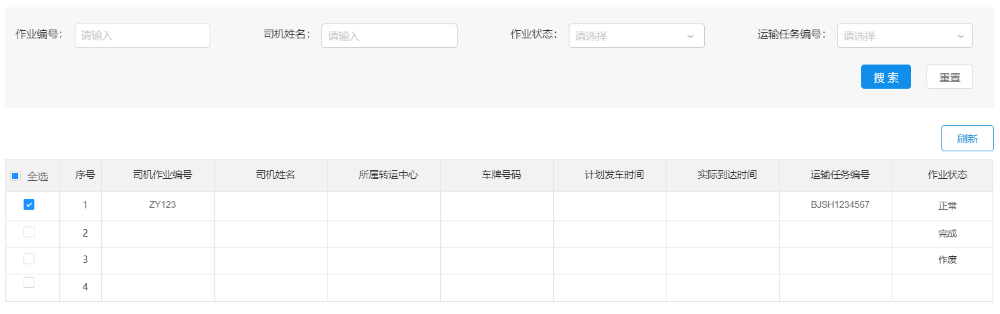

#### 6.2 数据模型

司机作业单对应的数据模型为：pd_work数据库中的pd_driver_job表，表结构如下：


#### 6.3 导入实体类

```
package com.itheima.pinda.entity;

import com.baomidou.mybatisplus.annotation.IdType;
import com.baomidou.mybatisplus.annotation.TableId;
import com.baomidou.mybatisplus.annotation.TableName;
import lombok.Data;
import lombok.EqualsAndHashCode;
import lombok.experimental.Accessors;
import java.io.Serializable;
import java.time.LocalDateTime;

/**
 * 司机作业单
 */
@Data
@EqualsAndHashCode(callSuper = false)
@Accessors(chain = true)
@TableName("pd_driver_job")
public class DriverJob implements Serializable {

    private static final long serialVersionUID = 1L;

    /**
     * id
     */
    @TableId(value = "id", type = IdType.INPUT)
    private String id;

    /**
     * 起始机构id
     */
    private String startAgencyId;

    /**
     * 目的机构id
     */
    private String endAgencyId;

    /**
     * 作业状态，1为待执行（对应 待提货）、2为进行中（对应在途）、3为改派（对应 已交付）、4为已完成（对应 已交付）、5为已作废
     */
    private Integer status;

    /**
     * 司机id
     */
    private String driverId;

    /**
     * 运输任务id
     */
    private String taskTransportId;

    /**
     * 提货对接人
     */
    private String startHandover;

    /**
     * 交付对接人
     */
    private String finishHandover;

    /**
     * 计划发车时间
     */
    private LocalDateTime planDepartureTime;

    /**
     * 实际发车时间
     */
    private LocalDateTime actualDepartureTime;

    /**
     * 计划到达时间
     */
    private LocalDateTime planArrivalTime;

    /**
     * 实际到达时间
     */
    private LocalDateTime actualArrivalTime;

    /**
     * 创建时间
     */
    private LocalDateTime createTime;
}
```

#### 6.4 服务接口开发

##### 6.4.1 新增司机作业单

第一步：创建DriverJobController并提供save方法

```
package com.itheima.pinda.controller;

import com.itheima.pinda.DTO.DriverJobDTO;
import com.itheima.pinda.entity.DriverJob;
import com.itheima.pinda.service.IDriverJobService;
import lombok.extern.slf4j.Slf4j;
import org.springframework.beans.BeanUtils;
import org.springframework.beans.factory.annotation.Autowired;
import org.springframework.web.bind.annotation.*;

/**
 * 司机作业单管理
 */
@Slf4j
@RestController
@RequestMapping("driver-job")
public class DriverJobController {
    @Autowired
    private IDriverJobService driverJobService;

    /**
     * 新增司机作业单
     *
     * @param dto 司机作业单信息
     * @return 司机作业单信息
     */
    @PostMapping("")
    public DriverJobDTO save(@RequestBody DriverJobDTO dto) {
        DriverJob driverJob = new DriverJob();
        BeanUtils.copyProperties(dto, driverJob);
        driverJobService.saveDriverJob(driverJob);
        DriverJobDTO result = new DriverJobDTO();
        BeanUtils.copyProperties(driverJob, result);
        return result;
    }
}
```

第二步：创建IDriverJobService接口

```
package com.itheima.pinda.service;

import com.baomidou.mybatisplus.extension.service.IService;
import com.itheima.pinda.entity.DriverJob;

/**
 * 运输任务表服务接口
 */
public interface IDriverJobService extends IService<DriverJob> {
    /**
     * 新增司机作业单
     *
     * @param driverJob 作业单信息
     * @return 作业单信息
     */
    DriverJob saveDriverJob(DriverJob driverJob);
}
```

第三步：创建DriverJobServiceImpl服务实现类，实现IDriverJobService接口

```
package com.itheima.pinda.service.impl;

import com.baomidou.mybatisplus.core.conditions.query.LambdaQueryWrapper;
import com.baomidou.mybatisplus.core.metadata.IPage;
import com.baomidou.mybatisplus.extension.plugins.pagination.Page;
import com.baomidou.mybatisplus.extension.service.impl.ServiceImpl;
import com.itheima.pinda.common.CustomIdGenerator;
import com.itheima.pinda.entity.DriverJob;
import com.itheima.pinda.enums.driverjob.DriverJobStatus;
import com.itheima.pinda.mapper.DriverJobMapper;
import com.itheima.pinda.service.IDriverJobService;
import org.apache.commons.lang.StringUtils;
import org.springframework.beans.factory.annotation.Autowired;
import org.springframework.stereotype.Service;
import java.time.LocalDateTime;
import java.util.List;

@Service
public class DriverJobServiceImpl extends
        ServiceImpl<DriverJobMapper, DriverJob> implements IDriverJobService {
    @Autowired
    private CustomIdGenerator idGenerator;

    @Override
    public DriverJob saveDriverJob(DriverJob driverJob) {
        driverJob.setId(idGenerator.nextId(driverJob) + "");
        driverJob.setCreateTime(LocalDateTime.now());
        driverJob.setStatus(DriverJobStatus.PENDING.getCode());
        save(driverJob);
        return driverJob;
    }
}
```

第四步：创建DriverJobMapper接口

```
package com.itheima.pinda.mapper;

import com.baomidou.mybatisplus.core.mapper.BaseMapper;
import com.itheima.pinda.entity.DriverJob;
import org.apache.ibatis.annotations.Mapper;

/**
 * 司机作业单Mapper接口
 */
@Mapper
public interface DriverJobMapper extends BaseMapper<DriverJob> {
}
```

第五步：创建上面Mapper接口对应的xml映射文件

文件位置：/resources/mapper/DriverJobMapper.xml

```
<?xml version="1.0" encoding="UTF-8"?>
<!DOCTYPE mapper PUBLIC "-//mybatis.org//DTD Mapper 3.0//EN" "http://mybatis.org/dtd/mybatis-3-mapper.dtd">
<mapper namespace="com.itheima.pinda.mapper.DriverJobMapper">
</mapper>
```

##### 6.4.2 修改司机作业单信息

在DriverJobController中创建updateById方法

```
/**
* 修改司机作业单信息
*
* @param id  司机作业单id
* @param dto 司机作业单信息
* @return 司机作业单信息
*/
@PutMapping("/{id}")
public DriverJobDTO updateById(@PathVariable(name = "id") String id, @RequestBody DriverJobDTO dto) {
    dto.setId(id);
    DriverJob driverJob = new DriverJob();
    BeanUtils.copyProperties(dto, driverJob);
    driverJobService.updateById(driverJob);
    return dto;
}
```

##### 6.4.3 获取司机作业单分页数据

第一步：在DriverJobController中创建findByPage方法

```
/**
* 获取司机作业单分页数据
*
* @param dto 查询参数
* @return 司机作业单分页数据
*/
@PostMapping("/page")
public PageResponse<DriverJobDTO> findByPage(@RequestBody DriverJobDTO dto) {
    Integer page = 1;
    Integer pageSize = 10;
    List<DriverJobDTO> dtoList = new ArrayList<>();
    Long total = 0L;
    Long pages = 0L;
    if (dto != null) {
        if (dto.getPage() != null) {
            page = dto.getPage();
        }
        if (dto.getPageSize() != null) {
            pageSize = dto.getPageSize();
        }
        IPage<DriverJob> driverJobIPage = driverJobService.findByPage(page, pageSize, dto.getId(), dto.getDriverId(), dto.getStatus(), dto.getTaskTransportId());
        driverJobIPage.getRecords().forEach(driverJob -> {
            DriverJobDTO resultDto = new DriverJobDTO();
            BeanUtils.copyProperties(driverJob, resultDto);
            dtoList.add(resultDto);
        });
        total = driverJobIPage.getTotal();
        pages = driverJobIPage.getPages();
    }
    return PageResponse.<DriverJobDTO>builder().items(dtoList).pagesize(pageSize).page(page).counts(total)
        .pages(pages).build();
}
```

第二步：在IDriverJobService接口中扩展findByPage方法

```
/**
* 获取司机作业单分页数据
*
* @param page     页码
* @param pageSize 页尺寸
* @param id 作业Id
* @param driverId 司机id
* @param status 作业状态
* @param taskTransportId 运输任务id
* @return 司机作业单分页数据
*/
IPage<DriverJob> findByPage(Integer page, Integer pageSize,String id,String driverId,Integer status,String taskTransportId);
```

第三步：在DriverJobServiceImpl实现类中实现findByPage方法

```
@Override
public IPage<DriverJob> findByPage(Integer page, Integer pageSize, String id, String driverId, Integer status, String taskTransportId) {
    Page<DriverJob> iPage = new Page(page, pageSize);
    LambdaQueryWrapper<DriverJob> lambdaQueryWrapper = new LambdaQueryWrapper<>();
    if (StringUtils.isNotEmpty(id)) {
        lambdaQueryWrapper.like(DriverJob::getId, id);
    }
    if (StringUtils.isNotEmpty(driverId)) {
        lambdaQueryWrapper.eq(DriverJob::getDriverId, driverId);
    }
    if (status != null) {
        lambdaQueryWrapper.eq(DriverJob::getStatus, status);
    }
    if (StringUtils.isNotEmpty(taskTransportId)) {
        lambdaQueryWrapper.like(DriverJob::getTaskTransportId, taskTransportId);
    }
    lambdaQueryWrapper.orderByAsc(DriverJob::getCreateTime);
    return page(iPage, lambdaQueryWrapper);
}
```

##### 6.4.4 根据id获取司机作业单信息

在DriverJobController中创建findById方法

```
/**
* 根据id获取司机作业单信息
*
* @param id 司机作业单id
* @return 司机作业单信息
*/
@GetMapping("/{id}")
public DriverJobDTO findById(@PathVariable(name = "id") String id) {
    DriverJobDTO dto = new DriverJobDTO();
    DriverJob driverJob = driverJobService.getById(id);
    if (driverJob != null) {
        BeanUtils.copyProperties(driverJob, dto);
    } else {
        dto = null;
    }
    return dto;
}
```

##### 6.4.5 多条件查询司机作业单

第一步：在DriverJobController中创建findAll方法

```
/**
*  多条件查询司机作业单
*
* @param dto
* @return
*/
@PostMapping("/findAll")
public List<DriverJobDTO> findAll(@RequestBody DriverJobDTO dto) {
    List<DriverJobDTO> dtos = new ArrayList<>();
    List<DriverJob> driverJobs = driverJobService.findAll(null, dto.getId(), dto.getDriverId(), dto.getStatus(), dto.getTaskTransportId());
    if (driverJobs != null) {
        for (DriverJob driverJob : driverJobs) {
            dto = new DriverJobDTO();
            BeanUtils.copyProperties(driverJob, dto);
            dtos.add(dto);
        }
    }
    return dtos;
}
```

第二步：在IDriverJobService接口中扩展findAll方法

```
/**
* 获取司机作业单列表
*
* @param ids    司机作业单id列表
* @param id     司机作业单Id
* @param status 司机作业单状态
* @return 司机作业单列表
*/
List<DriverJob> findAll(List<String> ids, String id, String driverId, Integer status, String taskTransportId);
```

第三步：在DriverJobServiceImpl实现类中实现findAll方法

```
@Override
public List<DriverJob> findAll(List<String> ids, String id, String driverId, Integer status, String taskTransportId) {
    LambdaQueryWrapper<DriverJob> lambdaQueryWrapper = new LambdaQueryWrapper<>();
    if (ids != null && ids.size() > 0) {
        lambdaQueryWrapper.in(DriverJob::getId, ids);
    }
    if (StringUtils.isNotEmpty(id)) {
        lambdaQueryWrapper.like(DriverJob::getId, id);
    }
    if (StringUtils.isNotEmpty(driverId)) {
        lambdaQueryWrapper.like(DriverJob::getDriverId, driverId);
    }
    if (status != null) {
        lambdaQueryWrapper.eq(DriverJob::getStatus, status);
    }
    if (StringUtils.isNotEmpty(taskTransportId)) {
        lambdaQueryWrapper.like(DriverJob::getTaskTransportId, taskTransportId);
    }
    lambdaQueryWrapper.orderByDesc(DriverJob::getCreateTime);
    return list(lambdaQueryWrapper);
}
```

 

 

 