# 品达物流TMS项目

## 第6章 数据聚合服务开发(pd-aggregation)

### 1. Canal概述

**canal**译意为水道/管道，主要用途是基于 MySQL 数据库增量日志解析，提供增量数据订阅和消费。


#### 1.1 背景

早期阿里巴巴因为杭州和美国双机房部署，存在跨机房同步的业务需求，实现方式主要是基于业务 trigger 获取增量变更。从 2010 年开始，业务逐步尝试数据库日志解析获取增量变更进行同步，由此衍生出了大量的数据库增量订阅和消费业务。

基于日志增量订阅和消费的业务包括

- 数据库镜像
- 数据库实时备份
- 索引构建和实时维护(拆分异构索引、倒排索引等)
- 业务 cache 刷新
- 带业务逻辑的增量数据处理

当前的 canal 支持源端 MySQL 版本包括 5.1.x , 5.5.x , 5.6.x , 5.7.x , 8.0.x

#### 1.2 工作原理

**MySQL主从复制原理**

- MySQL master 将数据变更写入二进制日志( binary log, 其中记录叫做二进制日志事件binary log events)

- MySQL slave 将 master 的 binary log events 拷贝到它的中继日志(relay log)

- MySQL slave 重放 relay log 中事件，将数据变更反映它自己的数据

  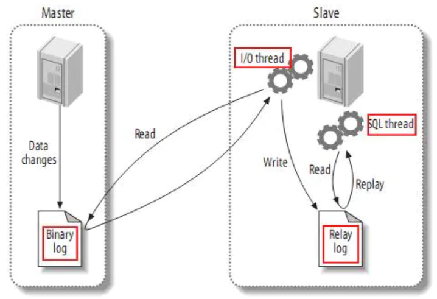

**canal 工作原理**

- canal 模拟 MySQL slave 的交互协议，伪装自己为 MySQL slave ，向 MySQL master 发送dump 协议
- MySQL master 收到 dump 请求，开始推送 binary log 给 slave (即 canal )
- canal 解析 binary log 对象(原始为 byte 流)


#### 1.3 架构

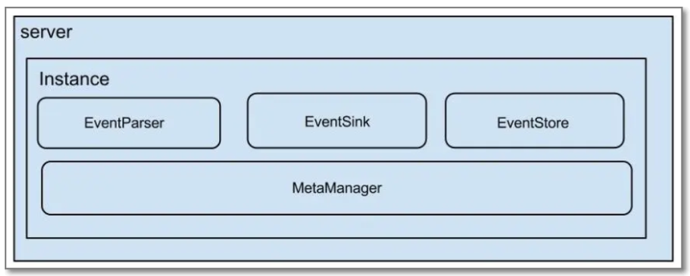

说明：

- server 代表一个canal服务，管理多个instance
- instance 伪装成一个slave,从mysql dump数据

instance模块：

- eventParser (数据源接入，模拟slave协议和master进行交互，协议解析)
- eventSink (Parser和Store链接器，进行数据过滤，加工，分发的工作)
- eventStore (数据存储)
- metaManager (增量订阅&消费信息管理器)

#### 1.4 HA机制设计

canal的高可用HA(High Availability)

- 为了减少对mysql dump的请求，要求同一时间只能有一个处于running，其他的处于standby状态

如下图所示:

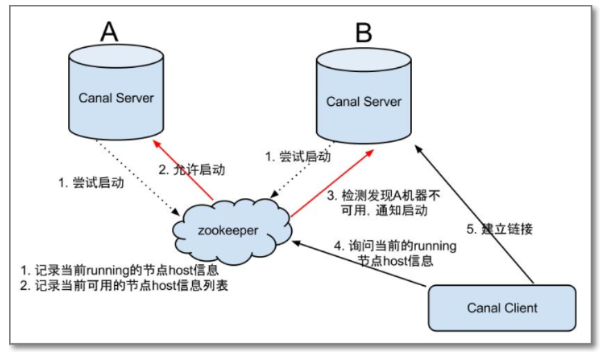

大致步骤：

1. canal server要启动某个canal instance时都先向zookeeper进行一次尝试启动判断 (实现：创建短暂的节点，谁创建成功就允许谁启动)
2. 创建zookeeper节点成功后，对应的canal server就启动对应的canal instance，没有创建成功的canal instance就会处于备用状态
3. 一旦zookeeper发现canal server A创建的节点消失后，立即通知其他的canal server再次进行步骤1的操作，重新选出一个canal server启动instance.
4. canal client每次进行连接时，会首先向zookeeper询问当前是谁启动了canal instance，然后和其建立链接，一旦链接不可用，会重新尝试connect

#### 1.5 canal安装

- 创建mysql容器

```
docker run -id --name canal_mysql \
-v /mnt/canal_mysql:/var/lib/mysql \
-p 3306:3306 \
-e MYSQL_ROOT_PASSWORD=123456 mysql:5.7
```

- 安装vim

需要在MySQL容器中修改配置文件，但是容器中默认没有vim命令，需要进行安装。

直接执行命令安装vim速度会很慢，因为使用的是国外的源，需要更新Debian源以提高速度。

```
#在宿主机创建sources.list配置文件
vi sources.list
#内容为：
deb http://mirrors.tuna.tsinghua.edu.cn/debian/ buster main
deb http://mirrors.tuna.tsinghua.edu.cn/debian-security buster/updates main
deb http://mirrors.tuna.tsinghua.edu.cn/debian/ buster-updates main

#复制宿主机的配置到MySQL容器中
docker cp sources.list canal_mysql:/etc/apt/

#进入MySQL容器
docker exec -it canal_mysql /bin/bash

#执行安装命令
apt-get update && apt-get install vim -y
```

- 修改MySQL配置

需要让canal伪装成salve并正确获取mysql中的binary log，首先要开启 Binlog 写入功能，配置 binlog-format 为 ROW 模式，命令如下：

```
#修改MySQL配置文件
vim /etc/mysql/mysql.conf.d/mysqld.cnf
#添加的内容如下：
log-bin=mysql-bin
binlog-format=ROW
server_id=1
#开启binlog 选择ROW模式 
#server_id不要和canal的slaveId重复
```

- 重启MySQL

```
docker restart canal_mysql
```

远程登录MySQL，查看配置状态，执行以下sql：

```
show variables like 'log_bin';
show variables like 'binlog_format';
show master status;
```

- 创建Canal账号

创建连接MySQL的账号`canal`并授予作为 MySQL slave 的权限，执行以下sql：

```
# 创建账号
CREATE USER canal IDENTIFIED BY 'canal'; 
# 授予权限
GRANT SELECT, REPLICATION SLAVE, REPLICATION CLIENT ON *.* TO 'canal'@'%';
# 刷新并应用
FLUSH PRIVILEGES;
```

- 创建canal-server容器

```
docker run -d --name canal-server \
-p 11111:11111 canal/canal-server:v1.1.4
```

- 配置canal-server

```
#进入canal-server容器
docker exec -it canal-server /bin/bash
#编辑canal-server的配置 
vi canal-server/conf/example/instance.properties
```

内容如下：

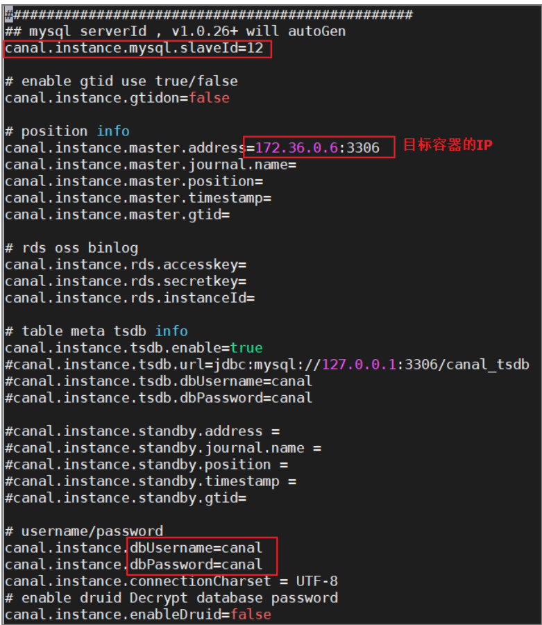

- 重启canal-server

修改完成后重启canal-server，并查看日志：

```
#按ctrl+D退出容器，并重启容器
docker restart canal-server
#重启成功后进入容器
docker exec -it canal-server /bin/bash
#查看日志
tail -100f canal-server/logs/example/example.log
```

#### 1.6 简单使用

在数据库服务中创建数据库canal_test并创建表：

```
CREATE TABLE `student` (
  `id` varchar(20) NOT NULL,
  `name` varchar(50) DEFAULT NULL,
  `age` int(11) DEFAULT NULL,
  `sex` varchar(5) DEFAULT NULL,
  `city` varchar(20) DEFAULT NULL,
  PRIMARY KEY (`id`)
) ENGINE=InnoDB DEFAULT CHARSET=utf8;
```

 

创建Maven工程canal-demo，在pom.xml中添加依赖：

```
<dependencies>
    <dependency>
        <groupId>com.alibaba.otter</groupId>
        <artifactId>canal.client</artifactId>
        <version>1.1.4</version>
    </dependency>
</dependencies>
```

 

编写代码获取canal数据：

```
import com.alibaba.otter.canal.client.CanalConnector;
import com.alibaba.otter.canal.client.CanalConnectors;
import com.alibaba.otter.canal.protocol.CanalEntry.Entry;
import com.alibaba.otter.canal.protocol.CanalEntry.EntryType;
import com.alibaba.otter.canal.protocol.CanalEntry.RowChange;
import com.alibaba.otter.canal.protocol.CanalEntry.RowData;
import com.alibaba.otter.canal.protocol.Message;
import java.net.InetSocketAddress;
import java.util.List;
import java.util.concurrent.TimeUnit;

public class CanalTest {

    public static void main(String[] args) {
        String ip = "39.98.107.235";
        String destination = "example";
        //创建连接对象
        CanalConnector canalConnector = CanalConnectors.newSingleConnector(
                new InetSocketAddress(ip, 11111), destination, "", ""
        );

        //进行连接
        canalConnector.connect();
        //进行订阅
        canalConnector.subscribe();

        int batchSize = 5 * 1024;
        //使用死循环不断的获取canal信息
        while (true) {
            //获取Message对象
            Message message = canalConnector.getWithoutAck(batchSize);
            long id = message.getId();
            int size = message.getEntries().size();

            System.out.println("当前监控到的binLog消息数量是：" + size);

            //判断是否有数据
            if (id == -1 || size == 0) {
                //如果没有数据，等待1秒
                try {
                    TimeUnit.SECONDS.sleep(1);
                } catch (InterruptedException e) {
                    e.printStackTrace();
                }
            } else {
                //如果有数据，进行数据解析
                List<Entry> entries = message.getEntries();

                //遍历获取到的Entry集合
                for (Entry entry : entries) {
                    System.out.println("----------------------------------------");
                    System.out.println("当前的二进制日志的条目（entry）类型是：" + entry.getEntryType());

                    //如果属于原始数据ROWDATA，进行打印内容
                    if (entry.getEntryType() == EntryType.ROWDATA) {
                        try {
                            //获取存储的内容
                            RowChange rowChange = RowChange.parseFrom(entry.getStoreValue());

                            //打印事件的类型，增删改查哪种 eventType
                            System.out.println("事件类型是：" + rowChange.getEventType());

                            //打印改变的内容(增量数据)
                            for (RowData rowData : rowChange.getRowDatasList()) {
                                System.out.println("改变前的数据：" + rowData.getBeforeColumnsList());
                                System.out.println("改变后的数据：" + rowData.getAfterColumnsList());
                            }

                        } catch (Exception e) {
                            e.printStackTrace();
                        }
                    }
                }
                //消息确认已经处理了
                canalConnector.ack(id);
            }
        }
    }
}
```

 

数据对象格式：

```
Entry
    Header
        version         [协议的版本号,default = 1]
        logfileName     [binlog文件名]
        logfileOffset   [binlog position]
        serverId        [服务端serverId]
        serverenCode    [变更数据的编码]
        executeTime     [变更数据的执行时间]
        sourceType      [变更数据的来源,default = MYSQL]
        schemaName      [变更数据的schemaname]
        tableName       [变更数据的tablename]
        eventLength     [每个event的长度]
        eventType       [insert/update/delete类型,default = UPDATE]
        props           [预留扩展]
        gtid            [当前事务的gitd]
    entryType           [事务头BEGIN/事务尾END/数据ROWDATA/HEARTBEAT/GTIDLOG]
    storeValue          [byte数据,可展开，对应的类型为RowChange]    
RowChange
    tableId             [tableId,由数据库产生]
    eventType           [数据变更类型,default = UPDATE]
    isDdl               [标识是否是ddl语句，比如create table/drop table]
    sql                 [ddl/query的sql语句]
    rowDatas            [insert/update/delete的变更数据，可为多条，event可对应多条变更，如批处理]
        beforeColumns   [字段信息，增量数据(修改前,删除前),Column类型的数组]
        afterColumns    [字段信息，增量数据(修改后,新增后),Column类型的数组] 
        props           [预留扩展]
    props               [预留扩展]
    ddlSchemaName       [ddl/query的schemaName，会存在跨库ddl，需要保留执行ddl的当前schemaName]
Column 
    index               [字段下标]      
    sqlType             [jdbc type]
    name                [字段名称(忽略大小写)，在mysql中是没有的]
    isKey               [是否为主键]
    updated             [是否发生过变更]
    isNull              [值是否为null]
    props               [预留扩展]
    value               [字段值,timestamp,Datetime是一个时间格式的文本]
    length              [对应数据对象原始长度]
    mysqlType           [字段mysql类型]
```

### 2. Otter概述

#### 2.1 介绍

Otter底层依赖Canal接收和解析mysql binlog日志，提供了可配置化的同步机制，纯java开发，免费开源的，基于数据库增量日志解析，准实时同步到本机房或异地机房的mysql/oracle数据库，是一个分布式数据同步系统。

典型的应用场景：

1. 异构库同步

a. mysql -> mysql/oracle. (目前开源版只支持mysql增量,目标库可以是mysql或oracle,取决于canal的功能)

1. 单机房同步 (数据库之间RTT < 1ms, RTT: 往返延迟)

a. 数据库版本升级

b. 数据表迁移

c. 异步二级索引

1. 异地机房同步 (比如阿里巴巴国际站就是杭州和美国机房的数据库同步，RTT > 200ms)

a. 机房容灾

1. 双向同步

a. 避免回环算法 (通用的解决方案，支持大部分关系型数据库)

b. 数据一致性算法 (保证双A机房模式下，数据保证最终一致性)

1. 文件同步

a. 站点镜像 (进行数据复制的同时，复制关联的图片，比如复制产品数据，同时复制产品图片).

例如： 账户信息表和账户交易明细表，更新账户余额后需要登记一条账户明细，用户可以通过交易明细表查看交易记录，但是交易明细表的数据量是逐步递增的，用户量多的系统，几个月下来的数据超过千万了，表数据量一多就导致查询和插入变慢，通过otter可以将记录同步到历史表，并且进行分表处理，用户往年的交易记录就可以查询历史表了，而原交易明细表就可以删除一个月甚至几天前的数据；

#### 2.2 架构

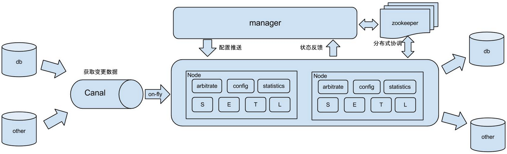

**说明：**

- db : 数据源以及需要同步到的库
- Canal : 获取数据库增量日志，canal支持独立部署和内嵌使用两种模式。otter使用canal的内嵌方法获取数据库增量日志
- manager :　配置同步规则设置数据源同步源等
- zookeeper : 协调node进行协调工作
- node : 负责任务处理，即根据任务配置对数据源进行解析并同步到目标数据库的操作。

**原理描述：**

基于Canal的开源产品，获取数据库增量日志数据。典型管理系统架构：manager(web管理)+node(工作节点)

1. manager运行时推送同步配置到node节点
2. node节点将同步状态反馈到manager上
3. 基于zookeeper，解决分布式状态调度的，允许多node节点之间协同工作

**单机房复制示意图：**

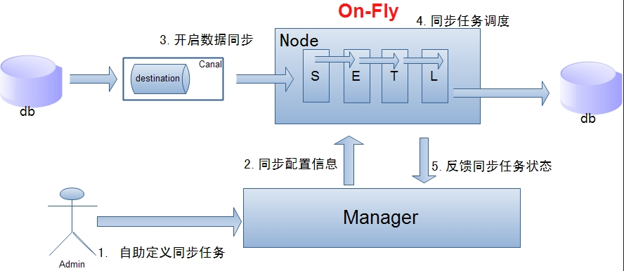

说明：

- 数据on-Fly，尽可能不落地，更快的进行数据同步.
- node节点可以有failover / loadBalancer.

**跨机房复制示意图：**

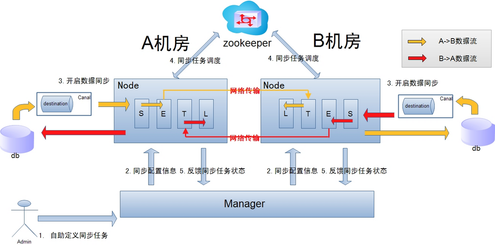

说明：

- 数据涉及网络传输，S/E/T/L几个阶段会分散在2个或者更多Node节点上，多个Node之间通过zookeeper进行协同工作 (一般是Select和Extract在一个机房的Node，Transform/Load落在另一个机房的Node)
- node节点可以有failover / loadBalancer. (每个机房的Node节点，都可以是集群，一台或者多台机器)

### 3. Otter安装配置

#### 3.1 依赖环境安装

环境使用： CentOS 7.6

##### 3.1.1 jdk安装

安装：

```
# 解压命令
tar -zxf jdk-8u191-linux-x64.tar.gz -C /usr/local/
# 修改配置命令
vi /etc/profile

# 添加内容：
export JAVA_HOME=/usr/local/jdk1.8.0_191
export PATH=$JAVA_HOME/bin:$PATH

# 配置生效命令
source /etc/profile
#查看java版本命令
java -version
```

##### 3.1.2 docker安装

卸载旧版本:

```
yum remove docker \
docker-client \
docker-client-latest \
docker-common \
docker-latest \
docker-latest-logrotate \
docker-logrotate \
docker-engine
```

使用 Docker 仓库进行安装,设置仓库:

```
yum install -y yum-utils \
device-mapper-persistent-data lvm2
```

设置稳定的仓库:

```
yum-config-manager --add-repo \
https://download.docker.com/linux/centos/docker-ce.repo
```

安装Docker:

```
#安装
yum install docker-ce docker-ce-cli containerd.io
#启动
systemctl start docker
#设置开机启动
systemctl enable docker

#安装好后，可以查看docker的版本
docker -v
```

#### 3.2 MySQL安装

使用otter进行数据同步时，有三类数据库：

- 源数据库
- 目标数据库
- otter配置数据库

##### 3.2.1 创建源数据库

在两个服务器上分别创建两个数据库，一个作为源库，一个作为目标库。

在服务器A上，使用docker创建otter的源库

```
cd /mnt
#创建目录，用于存放MySQL源库所需配置文件和数据，后续启动MySQL容器时需要进行目录映射
mkdir mysql_src
cd mysql_src
#conf目录用于存放MySQL数据库配置文件，data用于存放数据
mkdir conf data
cd conf
#创建MySQL数据库配置文件
vim docker.cnf
#文件内容
[mysqld]  
server_id=1
character-set-server=utf8
collation-server=utf8_general_ci
binlog_format=row
log-bin=mysql-bin
sql_mode='ONLY_FULL_GROUP_BY,NO_AUTO_VALUE_ON_ZERO,STRICT_TRANS_TABLES,ERROR_FOR_DIVISION_BY_ZERO,NO_AUTO_CREATE_USER,NO_ENGINE_SUBSTITUTION'

#启动MySQL容器
docker run -id --name otter_mysql1 \
-v /mnt/mysql_src/data:/var/lib/mysql \
-v /mnt/mysql_src/conf:/etc/mysql/conf.d \
-p 3306:3306 \
-e MYSQL_ROOT_PASSWORD=123456 mysql:5.7
```

##### 3.2.2 创建目标数据库

在服务器B上，使用docker创建otter的目标库，同时也作为otter的配置数据库

```
cd /mnt
#创建目录，用于存放MySQL目标库所需配置文件和数据，后续启动MySQL容器时需要进行目录映射
mkdir mysql_dest
cd mysql_dest
#conf目录用于存放MySQL数据库配置文件，data用于存放数据
mkdir conf data
cd conf
#创建MySQL数据库配置文件
vim docker.cnf
#文件内容
[mysqld]  
server_id=2
character-set-server=utf8
collation-server=utf8_general_ci
binlog_format=row
log-bin=mysql-bin
sql_mode='ONLY_FULL_GROUP_BY,NO_AUTO_VALUE_ON_ZERO,STRICT_TRANS_TABLES,ERROR_FOR_DIVISION_BY_ZERO,NO_AUTO_CREATE_USER,NO_ENGINE_SUBSTITUTION'

#启动MySQL容器
docker run -id --name otter_mysql2 \
-v /mnt/mysql_dest/data:/var/lib/mysql \
-v /mnt/mysql_dest/conf:/etc/mysql/conf.d \
-p 3306:3306 \
-e MYSQL_ROOT_PASSWORD=123456 mysql:5.7
```

 

mysql源数据库的binlog必须配置成row，才能够进行数据同步：

```
-- 必须开启log-bin二进制日志
show variables like 'log_bin';

-- binlong 格式必须是row，以下命令查看当前数据库binlog方式：
show variables like 'binlog_format';

-- 必须有server_id,该参数跟数据库复制有关，详情看官网
show variables like 'server_id';

-- 字符集character_set_server 必须是utf8,否则配置数据源表验证不通过。
show variables like 'character_set_server';
```

##### 3.2.3 初始化Otter配置数据库

```
cd /mnt
#创建目录，用于存放MySQL目标库所需配置文件和数据，后续启动MySQL容器时需要进行目录映射
mkdir mysql_otter
cd mysql_otter
#conf目录用于存放MySQL数据库配置文件，data用于存放数据
mkdir conf data
cd conf
#创建MySQL数据库配置文件
vim docker.cnf
#文件内容
[mysqld]  
server_id=3
character-set-server=utf8
collation-server=utf8_general_ci
binlog_format=row
log-bin=mysql-bin
sql_mode='ONLY_FULL_GROUP_BY,NO_AUTO_VALUE_ON_ZERO,STRICT_TRANS_TABLES,ERROR_FOR_DIVISION_BY_ZERO,NO_AUTO_CREATE_USER,NO_ENGINE_SUBSTITUTION'

#启动MySQL容器
docker run -id --name otter_mysql \
-v /mnt/mysql_otter/data:/var/lib/mysql \
-v /mnt/mysql_otter/conf:/etc/mysql/conf.d \
-p 3306:3306 \
-e MYSQL_ROOT_PASSWORD=123456 mysql:5.7
```

 

在准备安装Otter的服务器的MySQL中执行以下SQL，创建名称为otter的数据库

```
create database otter DEFAULT CHARACTER SET utf8;
CREATE USER 'canal'@'%' IDENTIFIED BY 'canal';
GRANT ALL PRIVILEGES ON `otter`.* TO 'canal'@'%'; 
flush PRIVILEGES;
```

在otter数据库中创建表

```
# 下载otter数据库文件
wget https://github.com/alibaba/otter/blob/master/manager/deployer/src/main/resources/sql/otter-manager-schema.sql
# 在mysql命令行中执行sql脚本进行建表
source /opt/otter/manager/otter-manager-schema.sql;
```

#### 3.3 zookeeper安装

##### 3.3.1 单机版安装

```
#启动容器：
docker run -id --name my_zookeeper -p 2181:2181 zookeeper:3.4.14
#查看容器运行情况：
docker logs -f my_zookeeper
```

使用客户端连接zookeeper：

```
docker run -it --rm --link my_zookeeper:zk zookeeper:3.4.14 zkCli.sh -server zk
```

##### 3.3.2 集群版安装

一个一个的启动 ZK 很麻烦，这里直接使用 docker-compose 来启动 ZK 集群。

**Docker Compose安装：**

下载 Docker Compose 的当前稳定版本：

```
#安装pip
yum -y install epel-release python-pip
#升级pip
pip install --upgrade pip 
pip install --upgrade setuptools --upgrade requests
#查看pip版本
pip -V
#使用pip安装Docker Compose
pip install docker-compose
```

测试是否安装成功：

```
docker-compose --version
```

删除docker-compose

```
pip uninstall docker-compose -y
```

首先创建一个名为 **docker-compose.yml** 的文件：

```
mkdir ~/zk_cluster
cd ~/zk_cluster
vi docker-compose.yml
```

docker-compose.yml 内容如下:

```
version: '3.8'
services:
    zk01:
        image: zookeeper:3.4.14
        restart: always
        container_name: zk01
        ports:
            - "2181:2181"
        environment:
            ZOO_MY_ID: 1
            ZOO_SERVERS: server.1=zk01:2888:3888 server.2=zk02:2888:3888 server.3=zk03:2888:3888
 
    zk02:
        image: zookeeper:3.4.14
        restart: always
        container_name: zk02
        ports:
            - "2182:2181"
        environment:
            ZOO_MY_ID: 2
            ZOO_SERVERS: server.1=zk01:2888:3888 server.2=zk02:2888:3888 server.3=zk03:2888:3888
 
    zk03:
        image: zookeeper:3.4.14
        restart: always
        container_name: zk03
        ports:
            - "2183:2181"
        environment:
            ZOO_MY_ID: 3
            ZOO_SERVERS: server.1=zk01:2888:3888 server.2=zk02:2888:3888 server.3=zk03:2888:3888
```

注意Compose文件的版本，需要符合以下要求：

| Compose file format | Docker Engine release |
| :-----------------: | :-------------------: |
|         3.8         |       19.03.0+        |
|         3.7         |       18.06.0+        |
|         3.6         |       18.02.0+        |
|         3.5         |       17.12.0+        |
|         3.4         |       17.09.0+        |
|         3.3         |       17.06.0+        |
|         3.2         |       17.04.0+        |
|         3.1         |        1.13.1+        |
|          3          |        1.13.0+        |
|         2.4         |       17.12.0+        |
|         2.3         |       17.06.0+        |
|         2.2         |        1.13.0+        |
|         2.1         |        1.12.0+        |
|          2          |        1.10.0+        |
|          1          |        1.9.1.+        |

在 docker-compose.yml 当前目录下运行命令：

```
#校验docker-compose.yml
docker-compose config
#启动zookeeper集群
COMPOSE_PROJECT_NAME=zk_otter docker-compose up -d
```

查看启动的 ZK 容器，运行以下命令：

```
COMPOSE_PROJECT_NAME=zk_otter docker-compose ps
```

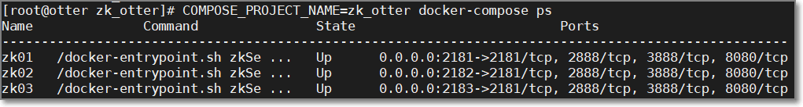

*COMPOSE_PROJECT_NAME=zk_test 这个环境变量, 这是为我们的 compose 工程起一个名字, 以免与其他的 compose 混淆.*

依次执行命令：

```
docker exec zk01 /bin/bash -c 'bin/zkServer.sh status'
docker exec zk02 /bin/bash -c 'bin/zkServer.sh status'
docker exec zk03 /bin/bash -c 'bin/zkServer.sh status'
```

可以看到一个主，两个从，集群搭建完成


 

集群连接：

查看Networks名称

```
docker inspect -f '{{.NetworkSettings.Networks}}' zk01
```

根据Networks名称连接集群：

```
docker run -it --rm \
        --link zk01:zk1 \
        --link zk02:zk2 \
        --link zk03:zk3 \
        --net zk_otter_default \
        zookeeper:3.4.14 zkCli.sh -server zk1:2181,zk2:2181,zk3:2181
```

#### 3.4 aria2安装

aria2是一个多线程下载工具，运行otter需要aria2的支持

```
yum -y install epel-release aria2
```

#### 3.5 Otter manager

##### 3.5.1 安装

https://github.com/alibaba/otter/releases

```
mkdir /opt/otter
cd /opt/otter
# 将文件下载到/opt/otter目录
wget https://github.com/alibaba/otter/releases/download/otter-4.2.18/manager.deployer-4.2.18.tar.gz
wget https://github.com/alibaba/otter/releases/download/otter-4.2.18/node.deployer-4.2.18.tar.gz
# 解压manager
mkdir manager
tar -zxf manager.deployer-4.2.18.tar.gz -C manager
```

修改otter manager配置文件：

```
# 修改mysql数据库和zookeeper配置信息
vim /opt/otter/manager/conf/otter.properties 

# 主要配置四个方面： 服务端口、数据库、zookeeper、邮箱
# 其他方面使用默认配置即可 修改内容如下：
## otter manager 域名/ip地址
otter.domainName = {更改成服务器ip或域名}

## otter manager database config
otter.database.driver.class.name = com.mysql.jdbc.Driver
otter.database.driver.url = jdbc:mysql://127.0.0.1:3306/otter?autoReconnect=true&useSSL=false
otter.database.driver.username = {更改成你的用户名}
otter.database.driver.password = {更改成你的密码}

```

启动otter manager：

```
/opt/otter/manager/bin/startup.sh
```

查看日志：

```
tail -500f /opt/otter/manager/logs/manager.log
```

用浏览器打开： http://{otter主机ip}:8080/

默认密码：admin/admin

##### 3.5.2 配置

Manager启动后，需要配置zookeeper和node

###### 3.5.2.1 配置zookeeper

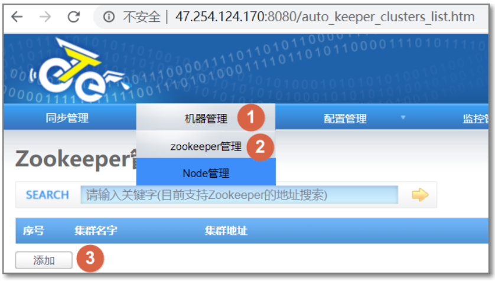

 

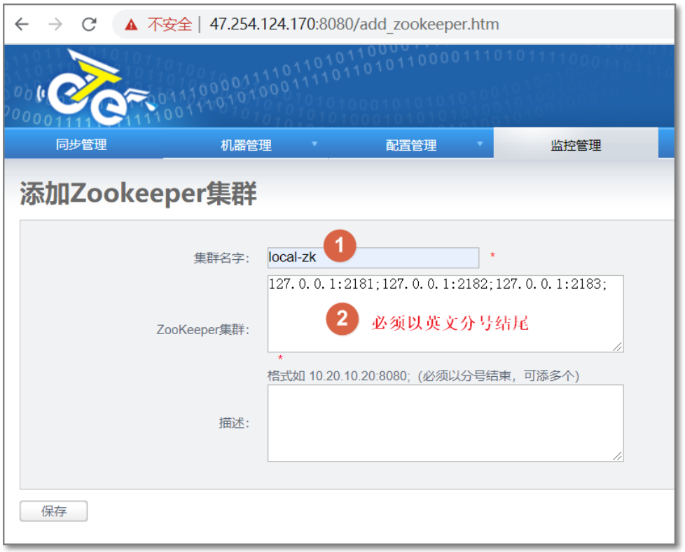

###### 3.5.2.2 配置node

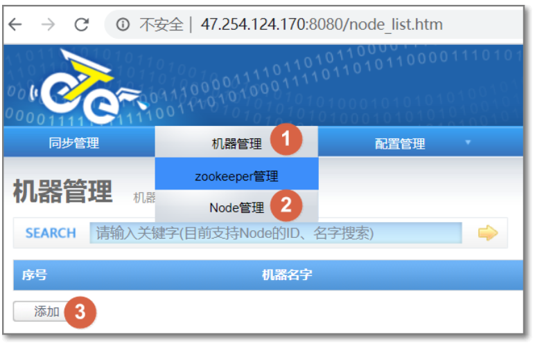

 

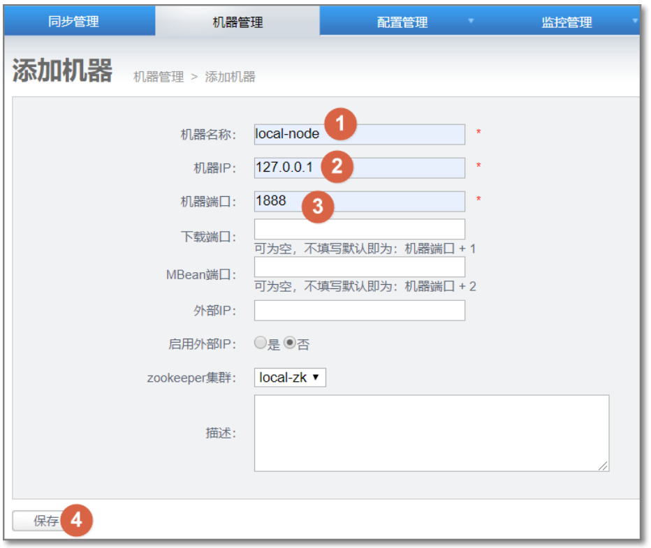

- 机器名称：可以随意定义，方便记忆即可
- 机器ip：对应node节点将要部署的机器ip，如果有多ip时，可选择其中一个ip进行暴露. (此ip是整个集群通讯的入口，实际情况千万别使用127.0.0.1，否则多个机器的node节点会无法识别)
- 机器端口：对应node节点将要部署时启动的数据通讯端口
- 下载端口：对应node节点将要部署时启动的数据下载端口
- 外部ip ：对应node节点将要部署的机器ip，存在的一个外部ip，允许通讯的时候走公网处理
- zookeeper集群：为提升通讯效率，不同机房的机器可选择就近的zookeeper集群
- node这种设计，是为解决单机部署多实例而设计的，允许单机多node指定不同的端口

端口默认即可，添加完node后，列表中第一列是nid（此id要保存到node/conf/nid文件中的值）：

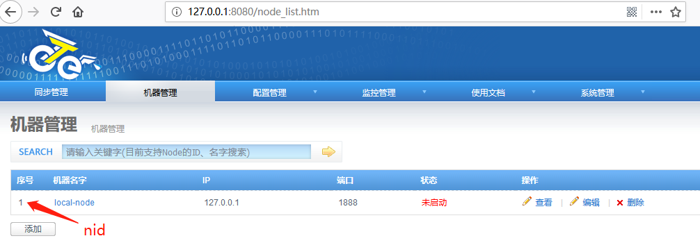

##### 3.5.3 说明

Otter Manager简化了一些admin管理上的操作成本，比如可以通过manager发布同步任务配置，接收同步任务反馈的状态信息等。

**同步配置管理**

1. 添加数据源
2. canal解析配置
3. 添加数据表
4. 同步任务

**同步状态查询**

1. 查询延迟
2. 查询吞吐量
3. 查询同步进度
4. 查询报警&异常日志

**用户权限**

1. ADMIN : 超级管理员
2. OPERATOR : 普通用户，管理某个同步任务下的同步配置，添加数据表，修改canal配置等
3. ANONYMOUS : 匿名用户，只能进行同步状态查询的操作.

#### 3.6 Otter node

```
# 解压到node目录中
cd /opt/otter/
mkdir node
tar -zxf node.deployer-4.2.18.tar.gz -C node/

# 添加nid（在manager中添加的node节点的nid）
cd /opt/otter/node/conf/
echo 1 > nid
```

node/conf/otter.properties这个文件是node节点的配置文件，使用默认配置即可：

```
# otter node root dir
otter.nodeHome = ${user.dir}/../

## otter node dir
otter.htdocs.dir = ${otter.nodeHome}/htdocs
otter.download.dir = ${otter.nodeHome}/download
otter.extend.dir= ${otter.nodeHome}/extend

## default zookeeper sesstion timeout = 60s
otter.zookeeper.sessionTimeout = 60000

## otter communication payload size (default = 8388608)
otter.communication.payload = 8388608

## otter communication pool size
otter.communication.pool.size = 10

## otter arbitrate & node connect manager config
otter.manager.address = 127.0.0.1:1099
```

启动node：

```
/opt/otter/node/bin/startup.sh 
```

查看日志：

```
tail -500f /opt/otter/node/logs/node/node.log 
```

此时从manager上可以看到node节点已启动：

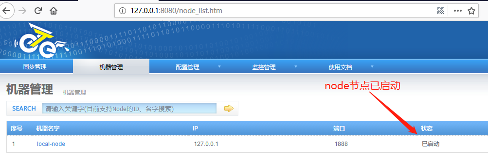

我们可以通过这种方式添加多个node节点。

此时otter manager和node节点都启动了，我们可以开始配置数据同步了。

### 4. 设置同步任务

在源数据库和目标数据库中都需要创建数据库otter_test，并执行以下建表语句：

```
DROP TABLE IF EXISTS `tb_item`;
CREATE TABLE `tb_item` (
  `id` bigint(20) NOT NULL COMMENT '商品id，同时也是商品编号',
  `title` varchar(100) NOT NULL COMMENT '商品标题',
  `sell_point` varchar(500) DEFAULT NULL COMMENT '商品卖点',
  `price` bigint(20) NOT NULL COMMENT '商品价格，单位为：分',
  `image` varchar(500) DEFAULT NULL COMMENT '商品图片',
  `status` tinyint(4) NOT NULL DEFAULT '1' COMMENT '商品状态，1-正常，2-下架，3-删除',
  `created` datetime NOT NULL COMMENT '创建时间',
  `updated` datetime NOT NULL COMMENT '更新时间',
  PRIMARY KEY (`id`)
) ENGINE=InnoDB DEFAULT CHARSET=utf8 COMMENT='商品表';
```

#### 4.1 数据源配置

配置源数据库：

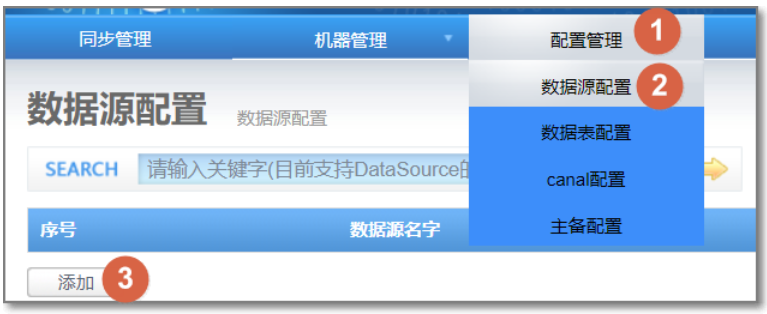

 

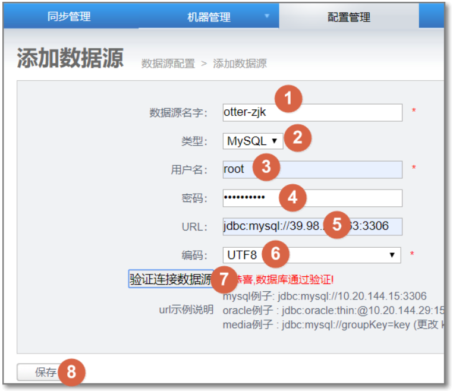

配置目标数据库：

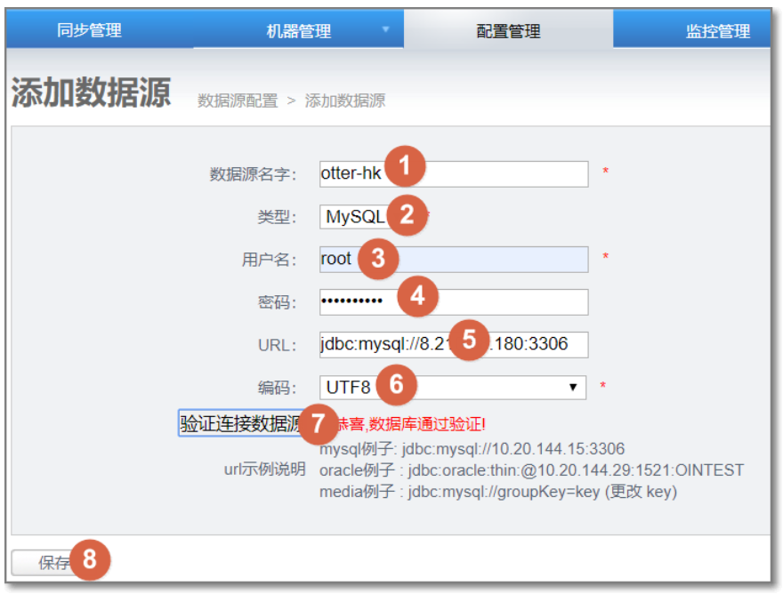

添加完成：

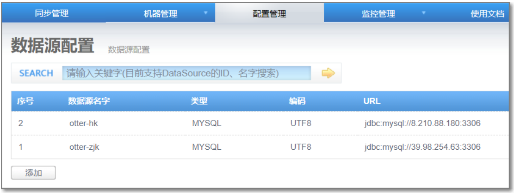

#### 4.2 数据表配置

添加源数据库表和目标数据库表

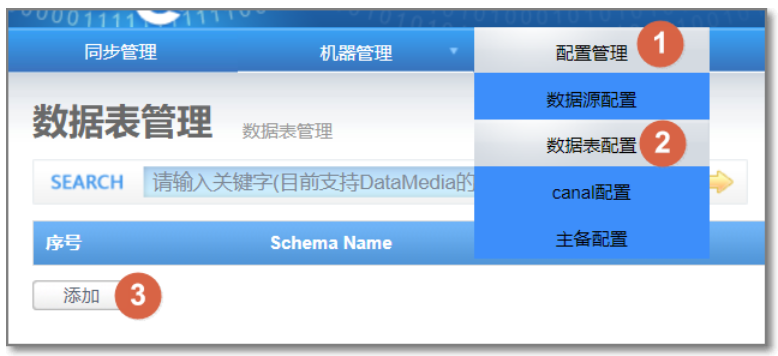

 

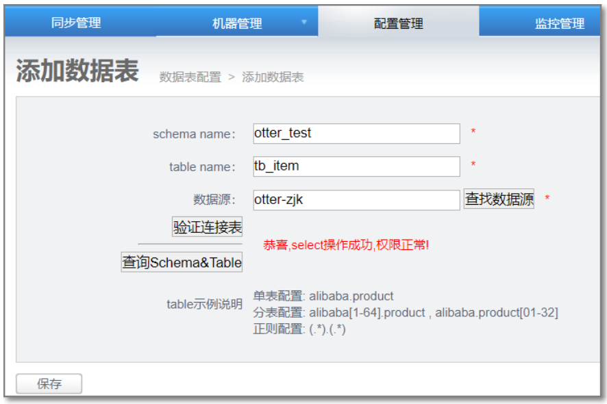

#### 4.3 添加canal


 

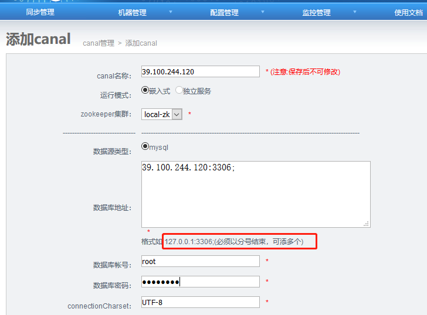

 

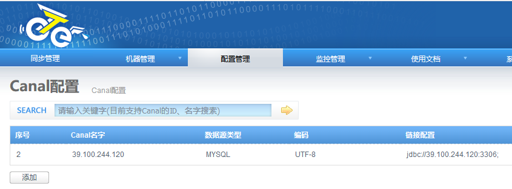

```
1. 数据库地址：指源库的ip和端口
2. connectionCharset ==> 获取binlog时指定的编码
3. 位点自定义设置 ==> 格式：{“journalName”:"",“position”:0,“timestamp”:0};
指定位置：{“journalName”:"",“position”:0};
指定时间：{“timestamp”:0};
4. 内存存储batch获取模式　==> MEMSIZE/ITEMSIZE，前者为内存控制，后者为数量控制. 　针对MEMSIZE模式的内存大小计算 = 记录数 * 记录单元大小
内存存储buffer记录数
内存存储buffer记录单元大小
5. 心跳SQL配置 ==> 可配置对应心跳SQL，如果配置 是否启用心跳HA，当心跳SQL检测失败后，canal就会自动进行主备切换.
```

#### 4.4 添加channel


 

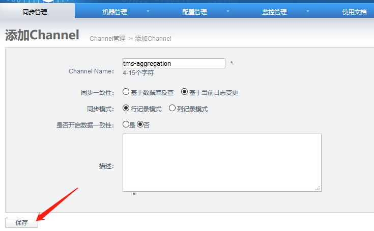

```
行记录模式：如果目标库中不存在记录时，执行插入。

列记录模式：变更哪个字段就同步哪个字段，在双A同步时，为减少数据冲突，建议使用此选项。（双A只的是双主、且会同时修改同一条记录）
```

#### 4.5 添加pipeline

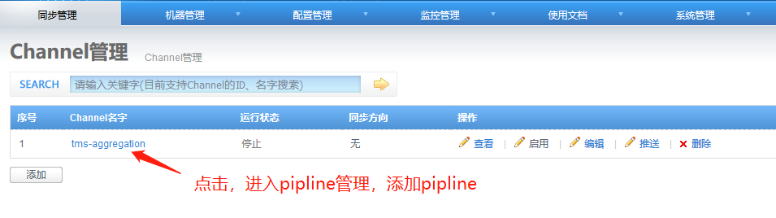

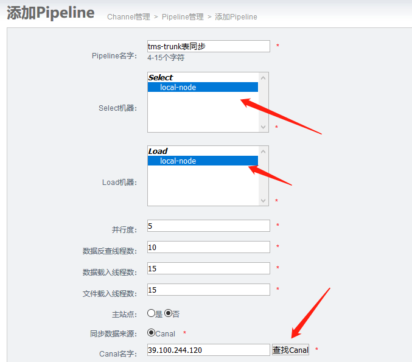

**pipeline参数**

1. 并行度. ==> 查看文档：Otter调度模型，主要是并行化调度参数.(滑动窗口大小)
2. 数据反查线程数. ==> 如果选择了同步一致性为反查数据库，在反查数据库时的并发线程数大小
3. 数据载入线程数. ==> 在目标库执行并行载入算法时并发线程数大小
4. 文件载入线程数. ==> 数据带文件同步时处理的并发线程数大小
5. 主站点. ==> 双Ａ同步中的主站点设置
6. 消费批次大小. ==> 获取canal数据的batchSize参数
7. 获取批次超时时间. ==> 获取canal数据的timeout参数

**pipeline 高级设置**

1. 使用batch. ==> 是否使用jdbc batch提升效率，部分分布式数据库系统不一定支持batch协议
2. 跳过load异常. ==> 比如同步时出现目标库主键冲突，开启该参数后，可跳过数据库执行异常
3. 仲裁器调度模式. ==> 查看文档：Otter调度模型
4. 负载均衡算法. ==> 查看文档：Otter调度模型
5. 传输模式. ==> 多个node节点之间的传输方式，RPC或HTTP. HTTP主要就是使用aria2c，如果测试环境不装aria2c，可强制选择为RPC
6. 记录selector日志. ==> 是否记录简单的canal抓取binlog的情况
7. 记录selector详细日志. ==> 是否记录canal抓取binlog的数据详细内容
8. 记录load日志. ==> 是否记录otter同步数据详细内容
9. dryRun模式. ==> 只记录load日志，不执行真实同步到数据库的操作
10. 支持ddl同步. ==> 是否同步ddl语句
11. 是否跳过ddl异常. ==> 同步ddl出错时，是否自动跳过
12. 文件重复同步对比 ==> 数据带文件同步时，是否需要对比源和目标库的文件信息，如果文件无变化，则不同步，减少网络传输量.
13. 文件传输加密 ==> 基于HTTP协议传输时，对应文件数据是否需要做加密处理
14. 启用公网同步 ==> 每个node节点都会定义一个外部ip信息，如果启用公网同步，同步时数据传递会依赖外部ip.
15. 跳过自由门数据 ==> 自定义数据同步的内容
16. 跳过反查无记录数据 ==> 反查记录不存在时，是否需要进行忽略处理，不建议开启.
17. 启用数据表类型转化 ==> 源库和目标库的字段类型不匹配时，开启改功能，可自动进行字段类型转化
18. 兼容字段新增同步 ==> 同步过程中，源库新增了一个字段(必须无默认值)，而目标库还未增加，是否需要兼容处理
19. 自定义同步标记 ==> 级联同步中屏蔽同步的功能.

#### 4.6 添加映射关系表

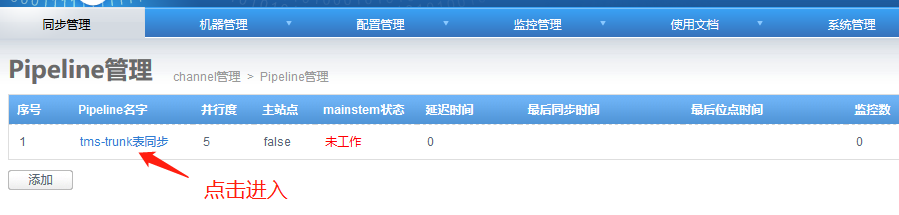

 


 

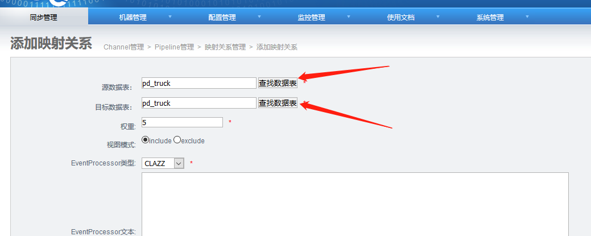

 

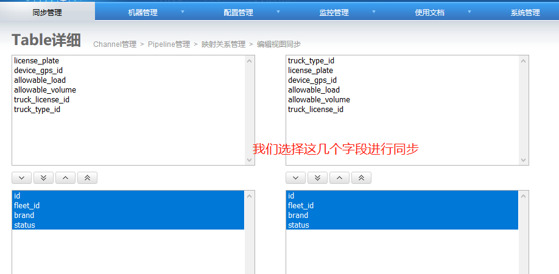

 

添加完成：

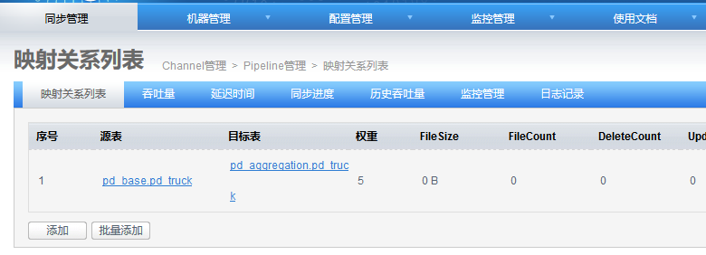

#### 4.7 测试验证

启动channel

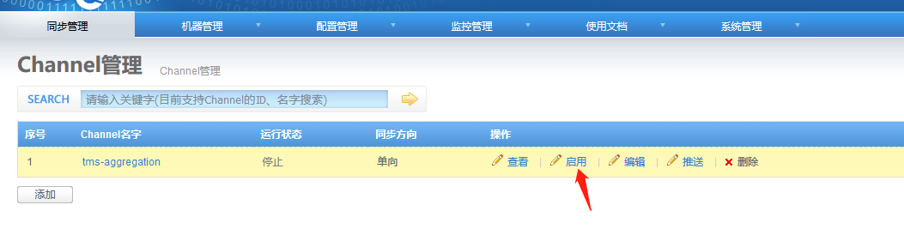

在源表中插入条记录，数据同步到目标表中。

### 5. 数据聚合服务介绍

数据聚合微服务，对应的maven工程为pd-aggregation。数据聚合微服务提供TMS中各种作业、单据、任务的集中查询功能。数据聚合服务对应操作的数据库为pd_aggregation，库中的表和数据都是通过otter从其他库同步过来的。