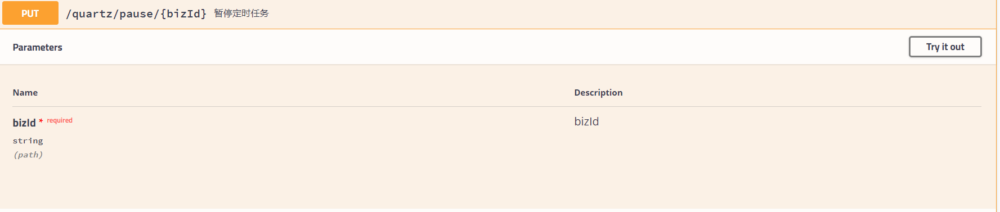

# 品达物流TMS项目

## 第8章 智能调度服务(pd-dispatch)

### 1. 定时任务组件Quartz

#### 1.1 Quartz介绍

Quartz是OpenSymphony开源组织在Job scheduling领域的一个开源项目，由Java开发，可以用来执行定时任务，类似于java.util.Timer。Quartz是功能强大的开源作业调度库，几乎可以集成到任何Java应用程序中。Quartz包含许多企业级功能，例如对JTA事务和集群的支持。Quartz作为定时任务组件，既可以单独使用，也可以整合Spring使用。

官网：http://www.quartz-scheduler.org/

maven坐标：

```
<dependency>
    <groupId>org.quartz-scheduler</groupId>
    <artifactId>quartz</artifactId>
    <version>2.3.0</version>
</dependency>
<dependency>
    <groupId>org.quartz-scheduler</groupId>
    <artifactId>quartz-jobs</artifactId>
    <version>2.3.0</version>
</dependency>
```

#### 1.2 核心API


 


 


 

- Scheduler：任务调度器，使任务和触发器关联，统一进行任务的调度
- StdSchedulerFactory:任务调度器工厂，可以创建Scheduler对象
- JobDetail：任务对象
- JobBuilder：任务构建器，用于创建JobDetail对象
- Trigger：触发器对象
- TriggerBuilder：触发器构建器，用于创建Trigger对象
- JobExecutionContext：任务执行的上下文对象，通过此对象可以获取当前执行任务的相关信息，例如JobDetail、Trigger对象都可以获取到
- JobDataMap：保存任务实例的状态信息
- RAMJobStore：此类实现了一个利用RAM作为其存储设备的JobStore，访问速度极快，但是数据却易失，如果需要在程序关闭之前保持真正的持久性，则不应使用此JobStore
- JobStoreTX：通过JDBC将所有数据保存在数据库中

#### 1.3 入门案例

##### 1.3.1 代码实现

第一步：创建maven工程，导入Quartz的maven坐标

```
<dependency>
    <groupId>org.quartz-scheduler</groupId>
    <artifactId>quartz</artifactId>
    <version>2.3.0</version>
</dependency>
<dependency>
    <groupId>org.quartz-scheduler</groupId>
    <artifactId>quartz-jobs</artifactId>
    <version>2.3.0</version>
</dependency>
```

第二步：创建作业类，需要实现Job接口

```
package cn.itcast.jobs;

import org.quartz.Job;
import org.quartz.JobExecutionContext;
import org.quartz.JobExecutionException;
import java.time.LocalDateTime;
import java.time.format.DateTimeFormatter;

/**
 * 自定义Job
 */
public class HelloJob implements Job {
    /**
     * 执行方法
     * @param jobExecutionContext 任务执行上下文对象
     * @throws JobExecutionException
     */
    public void execute(JobExecutionContext jobExecutionContext) throws JobExecutionException {
        LocalDateTime now = LocalDateTime.now();
        DateTimeFormatter formatter = DateTimeFormatter.ofPattern("yyyy-MM-dd hh:mm:ss");
        System.out.println("自定义Job开始执行:" + formatter.format(now));
    }
}
```

第三步：基于Quartz提供的API启动任务调度

```
package cn.itcast;

import cn.itcast.jobs.HelloJob;
import org.quartz.*;
import org.quartz.impl.StdSchedulerFactory;

public class HelloJobMain {
    public static void main(String[] args) {
        try {
            //1:创建调度器
            Scheduler scheduler = StdSchedulerFactory.getDefaultScheduler();

            //2:创建任务实例
            JobDetail jobDetail = JobBuilder.newJob(HelloJob.class).
                    withIdentity("JobDetail_1").
                    build();
            
            //3:创建触发器Trigger
            Trigger trigger = TriggerBuilder.newTrigger().
                    withIdentity("Trigger_1").
                    withSchedule(SimpleScheduleBuilder.simpleSchedule().withIntervalInSeconds(5).repeatForever()).
                    build();

            //4:触发器和任务关联
            scheduler.scheduleJob(jobDetail,trigger);

            //5:启动任务调度器
            scheduler.start();
        } catch (SchedulerException e) {
            e.printStackTrace();
        }
    }
}
```

查看控制台执行效果：


可以看到自定义Job每隔5秒会执行一次。

##### 1.3.2 问题思考

针对前面的入门案例，有三个问题需要思考：

- 自定义任务HelloJob是单例的还是每次执行定时任务都创建一个实例呢？
- 如何给定时任务传递参数并且在执行任务时可以获取到相应参数呢？
- 入门案例中触发器设置的是每隔5秒执行一次，是否可以使用cron表达式设置触发时间呢？

 

- 解答

针对第一个问题，可以为HelloJob类添加无参构造方法：

```
public HelloJob(){
    System.out.println("创建HelloJob实例");
}
```

观察控制台输出：


可以看到每次执行定时任务都会重新创建一个HelloJob实例。

 

- 解答

针对第二个问题，Quartz为我们提供了相应方法可以在创建任务时设置参数，并且通过提供的上下文对象（JobExecutionContext）来获取参数。

HelloJobMain做如下修改：

```
package cn.itcast;

import cn.itcast.jobs.HelloJob;
import org.quartz.*;
import org.quartz.impl.StdSchedulerFactory;

public class HelloJobMain {
    public static void main(String[] args) {
        try {
            //1:创建调度器
            Scheduler scheduler = StdSchedulerFactory.getDefaultScheduler();

            //2:创建任务实例
            JobDetail jobDetail = JobBuilder.newJob(HelloJob.class).
                    withIdentity("JobDetail_1").
                    build();
            
            //设置参数，在定时任务执行时可以动态获取这些参数
            jobDetail.getJobDataMap().put("key1","value1");
            jobDetail.getJobDataMap().put("key2","value2");
            
            //3:创建触发器Trigger
            Trigger trigger = TriggerBuilder.newTrigger().
                    withIdentity("Trigger_1").
                    withSchedule(SimpleScheduleBuilder.simpleSchedule().withIntervalInSeconds(5).repeatForever()).
                    build();

            //4:触发器和任务关联
            scheduler.scheduleJob(jobDetail,trigger);

            //5:启动任务调度器
            scheduler.start();
        } catch (SchedulerException e) {
            e.printStackTrace();
        }
    }
}
```

HelloJob做如下修改：

```
package cn.itcast.jobs;

import org.quartz.Job;
import org.quartz.JobExecutionContext;
import org.quartz.JobExecutionException;
import java.time.LocalDateTime;
import java.time.format.DateTimeFormatter;

/**
 * 自定义Job
 */
public class HelloJob implements Job {
    public HelloJob(){
        System.out.println("创建HelloJob实例");
    }
    
    /**
     * 执行方法
     * @param jobExecutionContext 任务执行上下文对象
     * @throws JobExecutionException
     */
    public void execute(JobExecutionContext jobExecutionContext) throws JobExecutionException {
        LocalDateTime now = LocalDateTime.now();
        DateTimeFormatter formatter = DateTimeFormatter.ofPattern("yyyy-MM-dd hh:mm:ss");
        System.out.println("自定义Job开始执行:" + formatter.format(now));
        
        //通过上下文对象JobExecutionContext可以获取到任务相关参数
        JobDataMap jobDataMap = jobExecutionContext.getJobDetail().getJobDataMap();
        Set<Map.Entry<String, Object>> entries = jobDataMap.entrySet();
        entries.forEach((entry) -> {
            String key = entry.getKey();
            Object value = entry.getValue();
            System.out.println(key + " = " + value);
        });
    }
}
```

查看控制台输出效果：


可以看到通过上下文对象可以获取到相应参数。

通过断点调试可以看到上下文对象中封装了很多信息，这些信息都可以通过上下文对象获取到：


 

- 解答

针对第3个问题，Quartz是支持cron表达式来设置触发时间的，HelloJobMain做如下修改：

```
package cn.itcast;

import cn.itcast.jobs.HelloJob;
import org.quartz.*;
import org.quartz.impl.StdSchedulerFactory;

public class HelloJobMain {
    public static void main(String[] args) {
        try {
            //1:创建调度器
            Scheduler scheduler = StdSchedulerFactory.getDefaultScheduler();

            //2:创建任务实例
            JobDetail jobDetail = JobBuilder.newJob(HelloJob.class).
                    withIdentity("JobDetail_1").
                    build();
            
            //设置参数，在定时任务执行时可以动态获取这些参数
            jobDetail.getJobDataMap().put("key1","value1");
            jobDetail.getJobDataMap().put("key2","value2");
            
            //构建cron表达式
            CronScheduleBuilder cronScheduleBuilder = 
                CronScheduleBuilder.cronSchedule("1,5,11,20,27,35 * * * * ?");
            
            //3:创建触发器Trigger
            Trigger trigger = TriggerBuilder.newTrigger().
                    withIdentity("Trigger_1").
                    withSchedule(cronScheduleBuilder).
                    build();

            //4:触发器和任务关联
            scheduler.scheduleJob(jobDetail,trigger);

            //5:启动任务调度器
            scheduler.start();
        } catch (SchedulerException e) {
            e.printStackTrace();
        }
    }
}
```

观察控制台输出：


### 2. Quartz动态定时任务

前面的入门案例中我们已经通过Quartz实现了简单的定时任务效果，但是这种方式的任务信息是保存在内存中的，如果服务重启后则任务信息都会丢失。通过上下文对象JobExecutionContext可以看到任务的存储是通过RAMJobStore实现的，如下图：


 

Quartz提供了另外一种方式，即通过JobStoreTX对象将任务相关信息保存在数据库中，这样就可以避免服务重启后任务信息丢失的问题。同时此种方式还支持动态定时任务，例如动态添加定时任务、暂停定时任务、删除定时任务等操作。

#### 2.1 数据模型

Quartz官方提供了一套数据模型(共11张表)用于保存定时任务相关信息，建表脚本：


可以看到Quartz针对不同的数据库提供了不同的sql脚本文件，本课程使用的是MySQL数据库，执行上面MySQL对应的sql脚本，创建如下11张表：


#### 2.2 环境搭建

第一步：创建maven工程并导入maven坐标

```
<?xml version="1.0" encoding="UTF-8"?>
<project xmlns="http://maven.apache.org/POM/4.0.0"
         xmlns:xsi="http://www.w3.org/2001/XMLSchema-instance"
         xsi:schemaLocation="http://maven.apache.org/POM/4.0.0 http://maven.apache.org/xsd/maven-4.0.0.xsd">
    <modelVersion>4.0.0</modelVersion>
    <parent>
        <groupId>org.springframework.boot</groupId>
        <artifactId>spring-boot-starter-parent</artifactId>
        <version>2.2.5.RELEASE</version>
        <relativePath/>
    </parent>
    <groupId>com.itheima</groupId>
    <artifactId>quartzTest</artifactId>
    <version>1.0-SNAPSHOT</version>
    <properties>
        <java.version>1.8</java.version>
        <!-- Spring Cloud 版本信息 -->
        <spring-cloud.version>Hoxton.SR3</spring-cloud.version>
        <spring-boot.version>2.2.5.RELEASE</spring-boot.version>
        <swagger.version>2.9.2</swagger.version>
        <spring-cloud-alibaba-version>2.2.1.RELEASE</spring-cloud-alibaba-version>
        <druid.version>1.1.23</druid.version>
        <java.version>1.8</java.version>
        <commons.lang.version>2.6</commons.lang.version>
        <commons.io.version>2.5</commons.io.version>
        <lombok.version>1.18.4</lombok.version>
        <commons.io.version>2.5</commons.io.version>
        <http-core.version>4.4.9</http-core.version>
        <httpclient.version>4.5.11</httpclient.version>
        <mybatis-spring-boot-starter.version>2.1.0</mybatis-spring-boot-starter.version>
        <mybatis-plus.version>3.3.0</mybatis-plus.version>
        <quartz.version>2.3.0</quartz.version>
    </properties>
    <dependencyManagement>
        <dependencies>
            <!-- Spring Cloud begin-->
            <dependency>
                <groupId>org.springframework.cloud</groupId>
                <artifactId>spring-cloud-dependencies</artifactId>
                <version>${spring-cloud.version}</version>
                <type>pom</type>
                <scope>import</scope>
            </dependency>
            <!-- Spring Cloud end-->
            <dependency>
                <groupId>io.springfox</groupId>
                <artifactId>springfox-swagger2</artifactId>
                <version>${swagger.version}</version>
            </dependency>
            <dependency>
                <groupId>io.springfox</groupId>
                <artifactId>springfox-swagger-ui</artifactId>
                <version>${swagger.version}</version>
            </dependency>
        </dependencies>
    </dependencyManagement>

    <dependencies>
        <dependency>
            <groupId>org.quartz-scheduler</groupId>
            <artifactId>quartz</artifactId>
            <version>${quartz.version}</version>
            <exclusions>
                <exclusion>
                    <groupId>com.mchange</groupId>
                    <artifactId>c3p0</artifactId>
                </exclusion>
                <exclusion>
                    <groupId>com.zaxxer</groupId>
                    <artifactId>HikariCP-java6</artifactId>
                </exclusion>
            </exclusions>
        </dependency>
        <dependency>
            <groupId>org.projectlombok</groupId>
            <artifactId>lombok</artifactId>
            <optional>true</optional>
        </dependency>
        <dependency>
            <groupId>org.springframework.boot</groupId>
            <artifactId>spring-boot-starter-web</artifactId>
        </dependency>
        <dependency>
            <groupId>org.springframework.boot</groupId>
            <artifactId>spring-boot-starter-test</artifactId>
            <scope>test</scope>
        </dependency>
        <dependency>
            <groupId>io.springfox</groupId>
            <artifactId>springfox-swagger2</artifactId>
        </dependency>
        <dependency>
            <groupId>io.springfox</groupId>
            <artifactId>springfox-swagger-ui</artifactId>
        </dependency>
        <dependency>
            <groupId>mysql</groupId>
            <artifactId>mysql-connector-java</artifactId>
            <scope>runtime</scope>
        </dependency>
        <!--MyBatisPLus-->
        <dependency>
            <groupId>org.mybatis.spring.boot</groupId>
            <artifactId>mybatis-spring-boot-starter</artifactId>
            <version>${mybatis-spring-boot-starter.version}</version>
        </dependency>
        <dependency>
            <groupId>com.baomidou</groupId>
            <artifactId>mybatis-plus</artifactId>
            <version>${mybatis-plus.version}</version>
        </dependency>
        <dependency>
            <groupId>com.baomidou</groupId>
            <artifactId>mybatis-plus-boot-starter</artifactId>
            <version>${mybatis-plus.version}</version>
        </dependency>
        <dependency>
            <groupId>com.alibaba</groupId>
            <artifactId>druid-spring-boot-starter</artifactId>
            <version>${druid.version}</version>
        </dependency>
        <dependency>
            <groupId>org.springframework.boot</groupId>
            <artifactId>spring-boot-starter-aop</artifactId>
        </dependency>
        <dependency>
            <groupId>org.springframework</groupId>
            <artifactId>spring-context-support</artifactId>
        </dependency>
        <dependency>
            <groupId>org.springframework.boot</groupId>
            <artifactId>spring-boot-configuration-processor</artifactId>
            <optional>true</optional>
        </dependency>
    </dependencies>
    <build>
        <plugins>
            <plugin>
                <groupId>org.springframework.boot</groupId>
                <artifactId>spring-boot-maven-plugin</artifactId>
            </plugin>
        </plugins>
    </build>
</project>
```

第二步：创建springBoot配置文件application.yml

```
server:
  port: 8080

spring:
  application:
    name: quartz-test
  datasource:
    type: com.alibaba.druid.pool.DruidDataSource
    druid:
      driver-class-name: com.mysql.jdbc.Driver
      url: jdbc:mysql://68.79.7.219:3306/quartz?allowMultiQueries=true&useUnicode=true&characterEncoding=UTF-8&useSSL=false
      username: root
      password: WQm2bJxN
```

第三步：编写定时任务配置类ScheduleConfig

```
package com.itheima.config;

import com.alibaba.druid.pool.DruidDataSource;
import org.springframework.context.annotation.Bean;
import org.springframework.context.annotation.Configuration;
import org.springframework.scheduling.quartz.SchedulerFactoryBean;
import javax.sql.DataSource;
import java.util.Properties;

/**
 * 定时任务配置
 *
 * @author
 */
@Configuration
public class ScheduleConfig {
    //调度器工厂，用于创建调度器对象Scheduler
    @Bean
    public SchedulerFactoryBean schedulerFactoryBean(DataSource dataSource) {
        SchedulerFactoryBean factory = new SchedulerFactoryBean();
        factory.setDataSource(dataSource);

        //quartz参数
        Properties prop = new Properties();
        prop.put("org.quartz.scheduler.instanceName", "WitlinkedScheduler");
        prop.put("org.quartz.scheduler.instanceId", "AUTO");
        //线程池配置
        prop.put("org.quartz.threadPool.class", "org.quartz.simpl.SimpleThreadPool");
        prop.put("org.quartz.threadPool.threadCount", "20");
        prop.put("org.quartz.threadPool.threadPriority", "5");
        //JobStore配置
        prop.put("org.quartz.jobStore.class", "org.quartz.impl.jdbcjobstore.JobStoreTX");
        //集群配置
        prop.put("org.quartz.jobStore.isClustered", "true");
        prop.put("org.quartz.jobStore.clusterCheckinInterval", "15000");
        prop.put("org.quartz.jobStore.maxMisfiresToHandleAtATime", "1");

        prop.put("org.quartz.jobStore.misfireThreshold", "12000");
        prop.put("org.quartz.jobStore.tablePrefix", "QRTZ_");
        prop.put("org.quartz.jobStore.selectWithLockSQL", "SELECT * FROM {0}LOCKS UPDLOCK WHERE LOCK_NAME = ?");

        factory.setQuartzProperties(prop);

        factory.setSchedulerName("pdScheduler");
        //延时启动
        factory.setStartupDelay(3);
        factory.setApplicationContextSchedulerContextKey("applicationContextKey");
        factory.setOverwriteExistingJobs(true);
        //设置自动启动，默认为true
        factory.setAutoStartup(true);

        return factory;
    }
}
```

第四步：编写Swagger相关配置类ConfigurationSupport

```
package com.itheima.config;

import lombok.extern.slf4j.Slf4j;
import org.springframework.context.annotation.Bean;
import org.springframework.context.annotation.Configuration;
import org.springframework.web.servlet.config.annotation.ResourceHandlerRegistry;
import org.springframework.web.servlet.config.annotation.WebMvcConfigurationSupport;
import springfox.documentation.builders.ApiInfoBuilder;
import springfox.documentation.builders.PathSelectors;
import springfox.documentation.builders.RequestHandlerSelectors;
import springfox.documentation.service.ApiInfo;
import springfox.documentation.spi.DocumentationType;
import springfox.documentation.spring.web.plugins.Docket;
import springfox.documentation.swagger2.annotations.EnableSwagger2;

@Slf4j
@Configuration
@EnableSwagger2
public class ConfigurationSupport extends WebMvcConfigurationSupport {
    @Bean
    public Docket createRestApi() {
        // 文档类型
        return new Docket(DocumentationType.SWAGGER_2)
                // 创建api的基本信息
                .apiInfo(apiInfo())
                // 选择哪些接口去暴露
                .select()
                // 扫描的包
                .apis(RequestHandlerSelectors.basePackage("com.itheima.controller"))
                .paths(PathSelectors.any())
                .build();
    }

    private ApiInfo apiInfo() {
        return new ApiInfoBuilder()
                .title("Swagger文档")
                .version("1.0")
                .build();
    }

    /**
     * 防止@EnableMvc把默认的静态资源路径覆盖了，手动设置的方式
     *
     * @param registry
     */
    @Override
    protected void addResourceHandlers(ResourceHandlerRegistry registry) {
        // 解决静态资源无法访问
        registry.addResourceHandler("/**").addResourceLocations("classpath:/static/");
        // 解决swagger无法访问
        registry.addResourceHandler("/swagger-ui.html").addResourceLocations("classpath:/META-INF/resources/");
        // 解决swagger的js文件无法访问
        registry.addResourceHandler("/webjars/**").addResourceLocations("classpath:/META-INF/resources/webjars/");

    }
}
```

第五步：编写自定义任务类HelloJob

```
package com.itheima.jobs;

import org.quartz.JobExecutionContext;
import org.quartz.JobExecutionException;
import org.springframework.scheduling.quartz.QuartzJobBean;
import java.time.LocalDateTime;
import java.time.format.DateTimeFormatter;

/**
 * 自定义Job
 */
public class HelloJob extends QuartzJobBean {
    //任务触发时执行此方法
    @Override
    protected void executeInternal(JobExecutionContext context) throws JobExecutionException {
        LocalDateTime now = LocalDateTime.now();
        DateTimeFormatter dateTimeFormatter = DateTimeFormatter.ofPattern("yyyy-MM-dd HH:mm:ss");
        String time = dateTimeFormatter.format(now);

        Object bizId = context.getJobDetail().getJobDataMap().get("bizId");
        System.out.println("自定义Job...bizId = " + bizId + " 执行时间" + time);
    }
}
```

第六步：编写启动类QuartzApplication

```
package com.itheima;

import org.springframework.boot.SpringApplication;
import org.springframework.boot.autoconfigure.SpringBootApplication;

@SpringBootApplication
public class QuartzApplication {
    public static void main(String[] args) {
        SpringApplication.run(QuartzApplication.class,args);
    }
}
```

第七步：编写QuartzController

```
package com.itheima.controller;

import org.quartz.*;
import org.springframework.beans.factory.annotation.Autowired;
import org.springframework.web.bind.annotation.*;

@RestController
@RequestMapping("/quartz")
public class QuartzController {
    //注入调度器对象
    @Autowired
    private Scheduler scheduler;
}
```

#### 2.3 实现定时任务

##### 2.3.1 添加定时任务

在QuartzController中创建save方法

```
/**
* 添加定时任务
* @param bizId
* @return
*/
@PostMapping
@ApiOperation("添加定时任务")
public String save(String bizId,String cronExpression) throws Exception{
    //构建job信息
    JobDetail jobDetail = JobBuilder.newJob(HelloJob.class).withIdentity(bizId).build();
    jobDetail.getJobDataMap().put("bizId",bizId);

    //表达式调度构建器
    CronScheduleBuilder scheduleBuilder = CronScheduleBuilder.cronSchedule(cronExpression)
        .withMisfireHandlingInstructionDoNothing();

    //按新的cronExpression表达式构建一个新的trigger
    CronTrigger trigger = TriggerBuilder.newTrigger().withIdentity(bizId).withSchedule(scheduleBuilder).build();

    //关联任务和触发器
    scheduler.scheduleJob(jobDetail,trigger);
    return "OK";
}
```


##### 2.3.2 暂停定时任务

在QuartzController中创建pause方法

```
/**
* 暂停定时任务
* @param bizId
* @return
*/
@PutMapping("/pause/{bizId}")
@ApiOperation("暂停定时任务")
public String pause(@PathVariable String bizId) throws Exception{
    JobKey jobKey = JobKey.jobKey(bizId);
    scheduler.pauseJob(jobKey);
    return "OK";
}
```



##### 2.3.3 恢复定时任务

在QuartzController中创建resume方法

```
/**
* 恢复定时任务
* @param bizId
* @return
*/
@PutMapping("/resume/{bizId}")
@ApiOperation("恢复定时任务")
public String resume(@PathVariable String bizId) throws Exception{
    JobKey jobKey = JobKey.jobKey(bizId);
    scheduler.resumeJob(jobKey);
    return "OK";
}
```


##### 2.3.4 删除定时任务

在QuartzController中创建delete方法

```
/**
* 删除定时任务
* @param bizId
* @return
*/
@DeleteMapping
@ApiOperation("删除定时任务")
public String delete(String bizId) throws Exception{
    JobKey jobKey = JobKey.jobKey(bizId);
    scheduler.deleteJob(jobKey);
    return "OK";
}
```


##### 2.3.5 立即执行定时任务

在QuartzController中创建run方法

```
/**
* 立即执行定时任务
* @param bizId
* @return
*/
@PutMapping("/run/{bizId}")
@ApiOperation("立即执行定时任务")
public String run(@PathVariable String bizId) throws Exception{
    JobKey jobKey = JobKey.jobKey(bizId);
    scheduler.triggerJob(jobKey);
    return "OK";
}
```


##### 2.3.6 更新定时任务

在QuartzController中创建update方法

```
/**
* 更新定时任务
* @param bizId
* @param cronExpression
* @return
* @throws Exception
*/
@PutMapping
@ApiOperation("更新定时任务")
public String update(String bizId,String cronExpression) throws Exception{
    TriggerKey triggerKey = TriggerKey.triggerKey(bizId);

    //表达式调度构建器
    CronScheduleBuilder scheduleBuilder = CronScheduleBuilder.cronSchedule(cronExpression)
        .withMisfireHandlingInstructionDoNothing();

    //获取触发器对象
    CronTrigger trigger = (CronTrigger) scheduler.getTrigger(triggerKey);

    //按新的cronExpression表达式重新构建trigger
    trigger = trigger.getTriggerBuilder().withIdentity(triggerKey).withSchedule(scheduleBuilder).build();

    scheduler.rescheduleJob(triggerKey, trigger);
    return "OK";
}
```


### 3. 智能调度服务

#### 3.1 业务说明

智能调度服务对应的maven工程为pd-dispatch，对应操作的数据库为pd_dispatch。

智能调度服务，主要功能就是针对物流公司的网点和转运中心的订单进行处理，最终生成司机的运输作业，司机根据运输作业进行货物的运输操作。

具体处理流程如下：


注意：智能调度是针对某一个网点或者转运中心的，即每个网点或转运中心都需要根据当前自己机构的订单进行智能调度处理。

```
订单分类：就是根据订单的收件人地址所属网点将订单进行分类，收件网点相同的订单分为一类
路线规划：根据当前网点和目的地网点查询符合条件的线路(包括直达线路和中转线路)，确定订单分类和线路的对应关系
创建运输任务：根据前面路线规划的结果，创建运输任务，同时更新订单状态并且让运输任务关联运单
规划车次车辆：根据前面路线规划的结果，查询符合条件的车次、车辆、司机
创建司机运输作业：根据前面路线规划和车次车辆规划的结果，创建司机的运输作业，同时更新运输任务信息
```

智能调度操作可以通过定时任务自动触发，也可以人工干预立即执行，如下图：


#### 3.2 数据模型


上面QRTZ_开头的表是Quartz框架自带的表。

##### 3.2.1 schedule_job

schedule_job为定时任务表，每个网点和转运中心都对应一个定时任务


##### 3.2.2 schedule_job_log

schedule_job_log为定时任务日志表，即在定时任务执行时对应记录一条日志信息


##### 3.2.3 pd_order_classify

pd_order_classify为订单分类表，智能调度时需要对订单进行分类，每个分类对应一条数据


##### 3.2.4 pd_order_classsify_order

pd_order_classsify_order为订单分类和订单关联表，每个订单分类可以对应多个订单


##### 3.2.5 pd_cache_line

pd_cache_line为缓存路线表，智能调度时需要根据订单分类规划线路，规划成功后则向当前表插入数据


##### 3.2.6 pd_cache_line_detail

pd_cache_line_detail为缓存路线子表，通过此表关联上面的缓存线路表和线路表


##### 3.2.7 pd_cache_line_use

pd_cache_line_use为缓存路线使用表，通过此表关联缓存线路表和订单分类表


##### 3.2.8 pd_order_classify_attach


pd_order_classify_attach为车次车辆司机订单分类关联表

#### 3.3 实现过程

##### 3.3.1 基础环境

导入课程资料中提供的配置文件、Entity、DTO、枚举、Mapper、配置类、工具类、启动类等。如下：


 


##### 3.3.2 编写定时任务

编写定时任务类ScheduleJob，此处开发的定时任务并不是最终版本，后续我们会测试此定时任务，能够正常初始化和执行后再对此定时任务进行完善。代码如下：

```
package com.itheima.pinda.execute;
import org.quartz.JobExecutionContext;
import org.springframework.scheduling.quartz.QuartzJobBean;

/**
 * 定时任务
 */
public class ScheduleJob extends QuartzJobBean {
    @Override
    protected void executeInternal(JobExecutionContext context) {
        ScheduleJobEntity scheduleJob = 
            (ScheduleJobEntity) context.getMergedJobDataMap().
                get(ScheduleUtils.JOB_PARAM_KEY);
        System.out.println(new Date() + "定时任务开始执行...,定时任务id：" + scheduleJob.getId());
    }
}
```

##### 3.3.3 初始化定时任务

编写初始化定时任务类DispatchCommandLineRunner，此类的作用是在项目启动时初始化定时任务。

```
package com.itheima.pinda.init;
import com.itheima.pinda.entity.ScheduleJobEntity;
import com.itheima.pinda.mapper.ScheduleJobMapper;
import com.itheima.pinda.utils.ScheduleUtils;
import lombok.extern.slf4j.Slf4j;
import org.quartz.CronTrigger;
import org.quartz.Scheduler;
import org.springframework.beans.factory.annotation.Autowired;
import org.springframework.boot.CommandLineRunner;
import org.springframework.stereotype.Component;
import java.util.List;

/**
 * 项目启动时进行定时任务初始化
 */
@Slf4j
@Component
public class DispatchCommandLineRunner implements CommandLineRunner {
    @Autowired
    private Scheduler scheduler;
    @Autowired
    private ScheduleJobMapper scheduleJobMapper;
    @Override
    public void run(String... args) {
        log.info("定时任务初始化");
        //查询定时任务
        List<ScheduleJobEntity> scheduleJobList = scheduleJobMapper.selectList(null);
        for (ScheduleJobEntity scheduleJob : scheduleJobList) {
            CronTrigger cronTrigger = ScheduleUtils.getCronTrigger(scheduler, scheduleJob.getId());
            //如果不存在，则创建
            if (cronTrigger == null) {
                ScheduleUtils.createScheduleJob(scheduler, scheduleJob);
            } else {
                ScheduleUtils.updateScheduleJob(scheduler, scheduleJob);
            }
        }
    }
}
```

为了方便测试，我们需要在schedule_job表中插入一条定时任务数据：


 

启动项目进行测试，查看控制台：


 


##### 3.3.4 完善定时任务

前面我们已经测试了定时任务能够实现初始化并根据指定的cron表达式进行任务触发，本小节需要完善定时任务类ScheduleJob

```
package com.itheima.pinda.execute;
import com.itheima.pinda.common.utils.SpringContextUtils;
import com.itheima.pinda.entity.ScheduleJobEntity;
import com.itheima.pinda.entity.ScheduleJobLogEntity;
import com.itheima.pinda.service.IScheduleJobLogService;
import com.itheima.pinda.utils.ExceptionUtils;
import com.itheima.pinda.utils.IdUtils;
import com.itheima.pinda.utils.ScheduleUtils;
import org.quartz.JobExecutionContext;
import org.slf4j.Logger;
import org.slf4j.LoggerFactory;
import org.springframework.scheduling.quartz.QuartzJobBean;
import java.lang.reflect.Method;
import java.util.Date;

/**
 * 定时任务
 */
public class ScheduleJob extends QuartzJobBean {
    private Logger logger = LoggerFactory.getLogger(getClass());

    @Override
    protected void executeInternal(JobExecutionContext context) {
        ScheduleJobEntity scheduleJob = (ScheduleJobEntity) context.getMergedJobDataMap().
                get(ScheduleUtils.JOB_PARAM_KEY);

        //数据库保存执行记录
        ScheduleJobLogEntity log = new ScheduleJobLogEntity();
        log.setId(IdUtils.get());
        log.setJobId(scheduleJob.getId());
        log.setBeanName(scheduleJob.getBeanName());
        log.setParams(scheduleJob.getParams());
        log.setCreateDate(new Date());

        //任务开始时间
        long startTime = System.currentTimeMillis();

        try {
            //执行任务
            logger.info("任务准备执行，任务ID：{}", scheduleJob.getId());
            Object target = SpringContextUtils.getBean(scheduleJob.getBeanName());
            Method method = target.getClass().getDeclaredMethod("run", String.class, String.class, String.class, String.class);
            //通过反射调用目标方法，完成智能调度
            method.invoke(target, scheduleJob.getBusinessId(), scheduleJob.getParams(), scheduleJob.getId(), log.getId());

            //任务执行总时长
            long times = System.currentTimeMillis() - startTime;
            log.setTimes((int) times);
            //任务状态
            log.setStatus(1);

            logger.info("任务执行完毕，任务ID：{}  总共耗时：{} 毫秒", scheduleJob.getId(), times);
        } catch (Exception e) {
            logger.error("任务执行失败，任务ID：{}", scheduleJob.getId(), e);

            //任务执行总时长
            long times = System.currentTimeMillis() - startTime;
            log.setTimes((int) times);

            //任务状态
            log.setStatus(0);
            log.setError(ExceptionUtils.getErrorStackTrace(e));
        } finally {
            //获取spring bean
            IScheduleJobLogService scheduleJobLogService = SpringContextUtils.getBean(IScheduleJobLogService.class);
            scheduleJobLogService.save(log);
        }
    }
}
通过上面的代码可以看到，真正的智能调度核心逻辑并不在定时任务ScheduleJob类中，而是在定时任务类中通过反射调用目标方法（后续会实现此方法），在此方法中完成真正的智能调度核心逻辑。
```

上面的定时任务类中需要使用到IScheduleJobLogService来完成定时任务日志数据的操作，代码如下：

IScheduleJobLogService接口：

```
package com.itheima.pinda.service;
import com.baomidou.mybatisplus.core.metadata.IPage;
import com.baomidou.mybatisplus.extension.service.IService;
import com.itheima.pinda.DTO.ScheduleJobLogDTO;
import com.itheima.pinda.entity.ScheduleJobLogEntity;
import java.util.Map;

/**
 * 定时任务日志
 */
public interface IScheduleJobLogService extends IService<ScheduleJobLogEntity> {

    IPage<ScheduleJobLogEntity> page(Map<String, Object> params);

    ScheduleJobLogDTO get(Long id);
}
```

ScheduleJobLogServiceImpl实现类：

```
package com.itheima.pinda.service.impl;
import com.baomidou.mybatisplus.core.conditions.query.LambdaQueryWrapper;
import com.baomidou.mybatisplus.core.conditions.query.QueryWrapper;
import com.baomidou.mybatisplus.core.metadata.IPage;
import com.baomidou.mybatisplus.extension.plugins.pagination.Page;
import com.baomidou.mybatisplus.extension.service.impl.ServiceImpl;
import com.itheima.pinda.DTO.ScheduleJobLogDTO;
import com.itheima.pinda.entity.ScheduleJobLogEntity;
import com.itheima.pinda.mapper.ScheduleJobLogMapper;
import com.itheima.pinda.service.IScheduleJobLogService;
import com.itheima.pinda.utils.ConvertUtils;
import org.apache.commons.lang3.StringUtils;
import org.springframework.stereotype.Service;
import java.util.Map;

@Service
public class ScheduleJobLogServiceImpl extends ServiceImpl<ScheduleJobLogMapper, ScheduleJobLogEntity> implements IScheduleJobLogService {

    @Override
    public IPage<ScheduleJobLogEntity> page(Map<String, Object> params) {
        IPage<ScheduleJobLogEntity> page = new Page<>();
        page.setCurrent(Long.parseLong(params.get("page").toString()));
        page.setSize(Long.parseLong(params.get("pageSize").toString()));

        LambdaQueryWrapper<ScheduleJobLogEntity> wrapper = new LambdaQueryWrapper<>();
        wrapper.eq(params.containsKey("jobId"), ScheduleJobLogEntity::getJobId, params.get("jobId"));
        wrapper.orderByDesc(ScheduleJobLogEntity::getCreateDate);
        return this.baseMapper.selectPage(page,wrapper);
    }

    @Override
    public ScheduleJobLogDTO get(Long id) {
        ScheduleJobLogEntity entity = baseMapper.selectById(id);

        return ConvertUtils.sourceToTarget(entity, ScheduleJobLogDTO.class);
    }

}
```

##### 3.3.5 编写智能调度组件

编写智能调度组件DispatchTask，封装的是智能调度的核心逻辑，此类中需要提供run方法，在前面的ScheduleJob定时任务中通过反射调用此run方法来完成智能调度。

```
package com.itheima.pinda.task;
import lombok.extern.slf4j.Slf4j;
import org.springframework.stereotype.Component;

/**
 * 智能调度组件
 */
@Slf4j
@Component("dispatchTask")
public class DispatchTask{
    /**
     * 智能调度
     * @param businessId
     * @param params
     * @param jobId
     * @param logId
     */
    public void run(String businessId, String params, String jobId, String logId) {
        log.info("智能调度正在执行，参数为：{},{},{},{}", businessId, params, jobId, logId);
    }
}
```

重启项目测试DispatchTask的run方法能否被成功调用，观察控制台如下：


 

前面章节中已经提到智能调度的处理流程如下：


由于整个处理流程比较复杂，代码量比较多，所以需要按照处理流程进行功能的抽取和封装。具体类和接口设计如下：

- ITaskOrderClassifyService：订单分类Service接口
- TaskOrderClassifyServiceImpl：订单分类实现类，订单分类核心逻辑在此类中完成
- ITaskRoutePlanningService：路线规划Service接口
- TaskRoutePlanningServiceImpl：路线规划实现类，路线规划核心逻辑在此类中完成
- IBusinessOperationService：运输任务、司机作业Service接口
- BusinessOperationServiceImpl：运输任务、司机作业实现类，创建运输任务、司机作业核心逻辑在此类中完成
- ITaskTripsSchedulingService：车次车辆规划Service接口
- TaskTripsSchedulingServiceImpl：车次车辆规划实现类，规划车次车辆核心逻辑在此类中完成

###### 3.3.5.1 订单分类

订单分类就是根据订单的收件人地址所属网点将订单进行分类，网点相同的订单分为一类。

第一步：创建ITaskOrderClassifyService接口

```
package com.itheima.pinda.service;
import com.itheima.pinda.DTO.OrderClassifyGroupDTO;
import java.util.List;

/**
 * 订单分类接口
 */
public interface ITaskOrderClassifyService {
    /**
     * 订单分类
     * @param agencyId
     * @param jobId
     * @param logId
     * @return
     */
    List<OrderClassifyGroupDTO> execute(String agencyId, String jobId, String logId);
}
```

第二步：创建TaskOrderClassifyServiceImpl实现类，需要实现ITaskOrderClassifyService接口

```
package com.itheima.pinda.service.impl;
import com.itheima.pinda.DTO.OrderClassifyGroupDTO;
import com.itheima.pinda.service.ITaskOrderClassifyService;
import lombok.SneakyThrows;
import lombok.extern.slf4j.Slf4j;
import org.springframework.stereotype.Service;
import java.util.List;

/**
 * 订单分类实现类
 */
@Service
@Slf4j
public class TaskOrderClassifyServiceImpl implements ITaskOrderClassifyService {
    /**
     * 订单分类
     * @param agencyId
     * @param jobId
     * @param logId
     * @return
     */
    public List<OrderClassifyGroupDTO> execute(String agencyId, String jobId, String logId) {
        return null;
    }
}
```

第三步：在TaskOrderClassifyServiceImpl中完善execute方法

```
/**
 * 订单分类实现类
 */
@Service
@Slf4j
public class TaskOrderClassifyServiceImpl implements ITaskOrderClassifyService {
    /**
     * 订单分类
     * @param agencyId
     * @param jobId
     * @param logId
     * @return
     */
    public List<OrderClassifyGroupDTO> execute(String agencyId, String jobId, String logId) {
        //当前集合用于存放当前机构的订单
        List<OrderClassifyDTO> orderClassifyDTOS = new ArrayList<>();
        //当前集合用于存放分类之后的订单信息
        List<OrderClassifyGroupDTO> orderClassifyGroupDTOS = new ArrayList<>();

        // 将新订单放入集合中
        orderClassifyDTOS.addAll(buildNewOrder(agencyId));
        
        return orderClassifyGroupDTOS;
    }
}
```

第四步：在TaskOrderClassifyServiceImpl类中扩展buildNewOrder方法，用于获取当前机构所有新订单

```
@Autowired
private OrderFeign orderFeign;//注入Feign接口，用于远程调用pd-oms微服务
/**
* 构建新订单
*
* @param agencyId
* @return
*/
private List<OrderClassifyDTO> buildNewOrder(String agencyId) {
    OrderSearchDTO orderSearchDTO = new OrderSearchDTO();
    //订单状态为网点入库
    orderSearchDTO.setStatus(OrderStatus.OUTLETS_WAREHOUSE.getCode());
    //订单当前所在机构
    orderSearchDTO.setCurrentAgencyId(agencyId);
    List<Order> orders = orderFeign.list(orderSearchDTO);
    log.info("查询[网点入库]状态订单：{} 条", orders.size());

    OrderClassifyDTO.OrderClassifyDTOBuilder builder = OrderClassifyDTO.builder();
    builder.currentAgencyId(agencyId);
    List<OrderClassifyDTO> orderClassifyDTOS = orders.stream().map(item -> {
        //起始机构
        builder.startAgencyId(agencyId);
        //目的地机构（网点）
        builder.endAgencyId(getEndAgencyId(item));
        builder.orderType(item.getOrderType());
        builder.order(item);
        return builder.build();
    }).collect(Collectors.toList());
    log.info("订单分类：首次发出订单{}条", orderClassifyDTOS.size());
    return orderClassifyDTOS;
}
```

第五步：在TaskOrderClassifyServiceImpl类中扩展getEndAgencyId方法，用于获取订单的目的地机构（网点）id

```
@Autowired
private AgencyScopeFeign agencyScopeFeign;//注入Feign接口，用于远程调用pd-base微服务
@Autowired
private AreaApi areaApi;//注入Feign接口，用于远程调用pd-auth-server微服务

/**
* 异常处理
* @param s
*/
private void exceptionHappend(String s) {
    try {
        throw new Exception(s);
    } catch (Exception e) {
        e.printStackTrace();
    }
}

/**
* 获取订单的目的地机构（网点）id
* @param order
* @return
*/
private String getEndAgencyId(Order order) {
    //获得收件人详细地址（包含省市区）
    String address = receiverFullAddress(order);
    if (StringUtils.isBlank(address)) {
        exceptionHappend("下单时收货地址不能为空");
    }
    //调用百度地图工具类，根据地址获取对应经纬度坐标
    String location = EntCoordSyncJob.getCoordinate(address);
    log.info("订单收货地址和坐标-->" + address + "--" + location);
    if (StringUtils.isBlank(location)) {
        exceptionHappend("下单时收货地址不能正确");
    }
    //根据坐标获取区域检查区域是否正常
    Map map = EntCoordSyncJob.getLocationByPosition(location);
    if (ObjectUtils.isEmpty(map)) {
        exceptionHappend("根据地图获取区域信息为空");
    }
    String adcode = map.getOrDefault("adcode", "").toString();
    R<Area> r = areaApi.getByCode(adcode + "000000");

    Area area = r.getData();
    if (area == null) {
        exceptionHappend("区域编码:" + adcode + "区域信息未从库中获取到");
    }
    Long areaId = area.getId();
    if (!order.getReceiverCountyId().equals(String.valueOf(areaId))) {
        exceptionHappend("参数中收货区域id和坐标计算出真实区域id不同，数据不合法");
    }
    List<AgencyScopeDto> agencyScopes = agencyScopeFeign.findAllAgencyScope(areaId + "", null, null, null);
    if (agencyScopes == null || agencyScopes.size() == 0) {
        exceptionHappend("根据区域无法从机构范围获取网点信息列表");
    }
    
    //计算距离最近的网点
    Result res = caculate(location, agencyScopes);

    return res.get("agencyId").toString();
}
```

第六步：在TaskOrderClassifyServiceImpl类中扩展receiverFullAddress方法，用于获得收件人详细地址（包含省市区）

```
/**
* 获得收件人详细地址（包含省市区）
* @param order
* @return
*/
@SneakyThrows
private String receiverFullAddress(Order order) {
    StringBuffer stringBuffer = new StringBuffer();

    Long province = Long.valueOf(order.getReceiverProvinceId());
    Long city = Long.valueOf(order.getReceiverCityId());
    Long county = Long.valueOf(order.getReceiverCountyId());

    Set areaIdSet = new HashSet();
    areaIdSet.add(province);
    areaIdSet.add(city);
    areaIdSet.add(county);

    CompletableFuture<Map<Long, Area>> areaMapFuture = PdCompletableFuture.areaMapFuture(areaApi, null, areaIdSet);
    Map<Long, Area> areaMap = areaMapFuture.get();

    stringBuffer.append(areaMap.get(province).getName());
    stringBuffer.append(areaMap.get(city).getName());
    stringBuffer.append(areaMap.get(county).getName());
    stringBuffer.append(order.getReceiverAddress());

    return stringBuffer.toString();
}
```

第七步：在TaskOrderClassifyServiceImpl类中扩展caculate方法，用于计算距离指定地址最近的网点

```
/**
* 计算距离指定地址最近的网点
*
* @param location
* @param agencyScopes
* @return
*/
private Result caculate(String location, List<AgencyScopeDto> agencyScopes) {
    try {
        Map agencyMap = Maps.newHashMap();
        for (AgencyScopeDto agencyScopeDto : agencyScopes) {
            List<List<Map>> mutiPoints = agencyScopeDto.getMutiPoints();
            for (List<Map> list : mutiPoints) {
                for (Map map : list) {
                    String point = getPoint(map);
                    Double distance = EntCoordSyncJob.getDistance(location, point);
                    //获取上一个距离
                    Double preDistance = 
                        (Double)agencyMap.get(agencyScopeDto.getAgencyId());
                    if(preDistance == null || distance < preDistance){
                        agencyMap.put(agencyScopeDto.getAgencyId(), distance);
                    }
                }
            }
        }
        //获取map中最小距离的网点
        List<Map.Entry<String, Double>> list = new ArrayList(agencyMap.entrySet());
        list.sort(Comparator.comparingDouble(Map.Entry::getValue));
        String agencyId = list.get(0).getKey();
        return Result.ok().put("agencyId", agencyId);
    } catch (Exception e) {
        e.printStackTrace();
        return Result.error(5000, "获取最短距离网点失败");
    }

}

/**
* 拼坐标
*
* @param pointMap
* @return
*/
private String getPoint(Map pointMap) {
    String lng = pointMap.getOrDefault("lng", "").toString();
    String lat = pointMap.getOrDefault("lat", "").toString();
    return lng + "," + lat;
}
```

第八步：在TaskOrderClassifyServiceImpl中进一步完善execute方法，并扩展buildTransferOrder方法

```
...
//将中转订单放入集合中
orderClassifyDTOS.addAll(buildTransferOrder(agencyId));
...
/**
* 获取中转订单
*
* @param agencyId
* @return
*/
@SneakyThrows
private List<OrderClassifyDTO> buildTransferOrder(String agencyId) {
    OrderSearchDTO orderSearchDTO = new OrderSearchDTO();
    //订单状态为运输中
    orderSearchDTO.setStatus(OrderStatus.IN_TRANSIT.getCode());
    //订单当前所在机构
    orderSearchDTO.setCurrentAgencyId(agencyId);
    List<Order> orders = orderFeign.list(orderSearchDTO);
    log.info("查询[运输中]状态订单：{} 条", orders.size());

    OrderClassifyDTO.OrderClassifyDTOBuilder builder = OrderClassifyDTO.builder();
    builder.currentAgencyId(agencyId);
    List<OrderClassifyDTO> orderClassifyDTOS = orders.stream().map(item -> {
        builder.startAgencyId(getStartAgencyId(item));
        builder.endAgencyId(getEndAgencyId(item));
        builder.orderType(item.getOrderType());
        builder.order(item);

        return builder.build();
    }).collect(Collectors.toList());
    log.info("订单分类：中转订单{}条", orderClassifyDTOS.size());
    return orderClassifyDTOS;
}
```

第九步：在TaskOrderClassifyServiceImpl中扩展getStartAgencyId方法，用于获取订单的起始机构（网点）id

```
/**
* 获取订单的起始机构（网点）id
* @param order
* @return
*/
private String getStartAgencyId(Order order) {
    String address = senderFullAddress(order);
    if (StringUtils.isBlank(address)) {
        exceptionHappend("下单时发货地址不能为空");
    }
    String location = EntCoordSyncJob.getCoordinate(address);
    log.info("订单发货地址和坐标-->" + address + "--" + location);
    if (StringUtils.isBlank(location)) {
        exceptionHappend("下单时发货地址不能为空");
    }
    //根据坐标获取区域检查区域是否正常
    Map map = EntCoordSyncJob.getLocationByPosition(location);
    if (ObjectUtils.isEmpty(map)) {
        exceptionHappend("根据地图获取区域信息为空");
    }
    String adcode = map.getOrDefault("adcode", "").toString();
    R<Area> r = areaApi.getByCode(adcode + "000000");
    if (!r.getIsSuccess()) {
        Result.error(r.getMsg());
    }
    Area area = r.getData();
    if (area == null) {
        exceptionHappend("区域编码:" + adcode + "区域信息未从库中获取到");
    }
    Long areaId = area.getId();
    if (!order.getSenderCountyId().equals(String.valueOf(areaId))) {
        exceptionHappend("参数中发货区域id和坐标计算出真实区域id不同，数据不合法");
    }
    List<AgencyScopeDto> agencyScopes = agencyScopeFeign.findAllAgencyScope(areaId + "", null, null, null);
    if (agencyScopes == null || agencyScopes.size() == 0) {
        exceptionHappend("根据区域无法从机构范围获取网点信息列表");
    }
    Result res = calcuate(location, agencyScopes);

    return res.get("agencyId").toString();
}
```

第十步：在TaskOrderClassifyServiceImpl中扩展senderFullAddress方法，用于获得寄件人详细地址（包含省市区）

```
/**
* 获得寄件人详细地址（包含省市区）
* @param order
* @return
*/
@SneakyThrows
private String senderFullAddress(Order order) {
    StringBuffer stringBuffer = new StringBuffer();

    Long province = Long.valueOf(order.getSenderProvinceId());
    Long city = Long.valueOf(order.getSenderCityId());
    Long county = Long.valueOf(order.getSenderCountyId());

    Set areaIdSet = new HashSet();
    areaIdSet.add(province);
    areaIdSet.add(city);
    areaIdSet.add(county);

    CompletableFuture<Map<Long, Area>> areaMapFuture = PdCompletableFuture.areaMapFuture(areaApi, null, areaIdSet);
    Map<Long, Area> areaMap = areaMapFuture.get();

    stringBuffer.append(areaMap.get(province).getName());
    stringBuffer.append(areaMap.get(city).getName());
    stringBuffer.append(areaMap.get(county).getName());
    stringBuffer.append(order.getSenderAddress());

    return stringBuffer.toString();
}
```

第十一步：完善TaskOrderClassifyServiceImpl中扩展execute方法

```
public List<OrderClassifyGroupDTO> execute(String agencyId, String jobId, String logId) {
    //当前集合用于存放当前机构的订单
    List<OrderClassifyDTO> orderClassifyDTOS = new ArrayList<>();
    //当前集合用于存放分类之后的订单信息
    List<OrderClassifyGroupDTO> orderClassifyGroupDTOS = new ArrayList<>();
    
    // 将新订单放入集合中
    orderClassifyDTOS.addAll(buildNewOrder(agencyId));
    // 将中转订单放入集合中
    orderClassifyDTOS.addAll(buildTransferOrder(agencyId));

    // 订单分组  OrderClassifyDTO::groupBy 可自定义分组维度
    Map<String, List<OrderClassifyDTO>> orderClassifyDTOGroup = orderClassifyDTOS.stream().collect(Collectors.groupingBy(OrderClassifyDTO::groupBy));

    // 分组后的订单装在如下实体
    OrderClassifyGroupDTO.OrderClassifyGroupDTOBuilder groupBuilder = OrderClassifyGroupDTO.builder();

    orderClassifyDTOGroup.forEach((key, value) -> {
        groupBuilder.key(key);
        groupBuilder.orders(value.stream().map(item -> item.getOrder()).collect(Collectors.toList()));
        orderClassifyGroupDTOS.add(groupBuilder.build());
    });

    //保存订单分类后的数据
    saveRecord(orderClassifyGroupDTOS, jobId, logId);

    return orderClassifyGroupDTOS;
}
```

第十二步：在TaskOrderClassifyServiceImpl中扩展saveRecord方法，用于保存订单分类后的数据

```
@Autowired
private IOrderClassifyService orderClassifyService;
@Autowired
private IOrderClassifyOrderService orderClassifyOrderService;

/**
* 保存订单分类记录
* @param orderClassifyGroupDTOS
* @param jobId
* @param logId
*/
private void saveRecord(List<OrderClassifyGroupDTO> orderClassifyGroupDTOS, String jobId, String logId) {
    orderClassifyGroupDTOS.forEach(item -> {
        if (item.isNew()) {
            log.info("新订单 保存分组信息");
            OrderClassifyEntity entity = new OrderClassifyEntity();
            entity.setClassify(item.getKey());
            entity.setJobId(jobId);
            entity.setJobLogId(logId);
            if (!entity.getClassify().equals("ERROR")) {
                entity.setStartAgencyId(item.getStartAgencyId());
                entity.setEndAgencyId(item.getEndAgencyId());
            }
            entity.setTotal(item.getOrders().size());
            entity.setId(IdUtils.get());

            List<OrderClassifyOrderEntity> orderClassifyOrders = item.getOrders().stream().map((order) -> {
                OrderClassifyOrderEntity orderClassifyOrderEntity = new OrderClassifyOrderEntity();
                orderClassifyOrderEntity.setOrderId(order.getId());
                orderClassifyOrderEntity.setOrderClassifyId(entity.getId());
                orderClassifyOrderEntity.setId(IdUtils.get());
                return orderClassifyOrderEntity;
            }).collect(Collectors.toList());

            item.setId(entity.getId());
            orderClassifyService.save(entity);
            orderClassifyOrderService.saveBatch(orderClassifyOrders);
        } else {
            log.info("中转订单，查询分组信息");
            List<String> orderIds = item.getOrders().stream().map(order -> order.getId()).collect(Collectors.toList());
            log.info("当前分组的订单id：{}", orderIds);
            LambdaQueryWrapper<OrderClassifyOrderEntity> wrapper = new LambdaQueryWrapper<>();
            wrapper.in(OrderClassifyOrderEntity::getOrderId, orderIds);
            List<OrderClassifyOrderEntity> orderClassifyOrders = orderClassifyOrderService.list(wrapper);
            // 不出意外只会查到一个订单分类id
            Set<String> orderClassifyIds = orderClassifyOrders.stream().map(orderClassifyOrderEntity -> orderClassifyOrderEntity.getOrderClassifyId()).collect(Collectors.toSet());
            log.info("查询订单分组id:{}", orderClassifyIds);
            if (CollectionUtils.isEmpty(orderClassifyIds)) {
                log.error("中转订单异常:{}", orderIds);
                return;
            }
            item.setId(orderClassifyIds.iterator().next());
        }
    });
}
```

第十三步：创建IOrderClassifyService接口和对应的实现类，用于操作订单分类表pd_order_classify

```
package com.itheima.pinda.service;
import com.baomidou.mybatisplus.extension.service.IService;
import com.itheima.pinda.entity.OrderClassifyEntity;
import java.util.List;

/**
 * 订单分类
 */
public interface IOrderClassifyService extends IService<OrderClassifyEntity> {
    List<OrderClassifyEntity> findByJobLogId(String id);
}
package com.itheima.pinda.service.impl;
import com.baomidou.mybatisplus.core.conditions.query.LambdaQueryWrapper;
import com.baomidou.mybatisplus.extension.service.impl.ServiceImpl;
import com.itheima.pinda.entity.OrderClassifyEntity;
import com.itheima.pinda.mapper.OrderClassifyMapper;
import com.itheima.pinda.service.IOrderClassifyService;
import org.springframework.stereotype.Service;
import java.util.List;

@Service
public class OrderClassifyServiceImpl extends ServiceImpl<OrderClassifyMapper, OrderClassifyEntity> implements IOrderClassifyService {
    @Override
    public List<OrderClassifyEntity> findByJobLogId(String id) {
        LambdaQueryWrapper<OrderClassifyEntity> wrapper = new LambdaQueryWrapper<>();
        wrapper.eq(OrderClassifyEntity::getJobLogId, id);
        return this.baseMapper.selectList(wrapper);
    }
}
```

第十四步：创建IOrderClassifyOrderService接口和对应的实现类，用于操作订单分类和订单关联表pd_order_classify_order

```
package com.itheima.pinda.service;
import com.baomidou.mybatisplus.extension.service.IService;
import com.itheima.pinda.entity.OrderClassifyOrderEntity;

/**
 * 订单分类关联订单
 */
public interface IOrderClassifyOrderService extends IService<OrderClassifyOrderEntity> {
    String getClassifyId(String orderId);
}
package com.itheima.pinda.service.impl;
import com.baomidou.mybatisplus.core.conditions.query.LambdaQueryWrapper;
import com.baomidou.mybatisplus.extension.service.impl.ServiceImpl;
import com.itheima.pinda.entity.OrderClassifyOrderEntity;
import com.itheima.pinda.mapper.OrderClassifyOrderMapper;
import com.itheima.pinda.service.IOrderClassifyOrderService;
import org.springframework.stereotype.Service;

@Service
public class OrderClassifyOrderServiceImpl extends ServiceImpl<OrderClassifyOrderMapper, OrderClassifyOrderEntity> implements IOrderClassifyOrderService {
    @Override
    public String getClassifyId(String orderId) {
        LambdaQueryWrapper<OrderClassifyOrderEntity> wrapper = new LambdaQueryWrapper<>();
        wrapper.eq(OrderClassifyOrderEntity::getOrderId, orderId);

        OrderClassifyOrderEntity entity = this.baseMapper.selectOne(wrapper);

        return entity.getOrderClassifyId();
    }
}
```

###### 3.3.5.2 优化订单分类代码

前面在实现订单分类过程中，其中一个环节为计算距离指定地址最近的网点，代码如下：

```
/**
* 计算距离指定地址最近的网点
*
* @param location
* @param agencyScopes
* @return
*/
private Result caculate(List<AgencyScopeDto> agencyScopes,String location) {
    try {
        Map agencyMap = Maps.newHashMap();
        for (AgencyScopeDto agencyScopeDto : agencyScopes) {
            List<List<Map>> mutiPoints = agencyScopeDto.getMutiPoints();
            for (List<Map> list : mutiPoints) {
                for (Map map : list) {
                    String point = getPoint(map);
                    Double distance = EntCoordSyncJob.getDistance(location, point);
                    //获取上一个距离
                    Double preDistance = 
                        (Double)agencyMap.get(agencyScopeDto.getAgencyId());
                    if(preDistance == null || distance < preDistance){
                        agencyMap.put(agencyScopeDto.getAgencyId(), distance);
                    }
                }
            }
        }
        //获取map中最小距离的网点
        List<Map.Entry<String, Double>> list = new ArrayList(agencyMap.entrySet());
        list.sort(Comparator.comparingDouble(Map.Entry::getValue));
        String agencyId = list.get(0).getKey();
        return Result.ok().put("agencyId", agencyId);
    } catch (Exception e) {
        e.printStackTrace();
        return Result.error(5000, "获取最短距离网点失败");
    }

}
```

此处的业务逻辑是获取到应该是哪个网点负责当前地址客户的取件或者派件任务，但是在有些情况下并不一定就是离的最近的网点来负责，如下图：


所以实现逻辑需要调整为：查找某个点（地址）是否在某个网点的作业范围内，如果在则匹配当前网点。

那么如何确定某个点是否在某个范围内呢？在jdk中为我们提供了相应的方案，如下：

```
import java.awt.geom.Path2D;

/**
 * 测试某个点是否在某个区域范围内
 */
public class ScopeTest {
    public static void main(String[] args) {
        Path2D.Double generalPath = new Path2D.Double();

        //绘制区域范围
        generalPath.moveTo(0,0);
        generalPath.lineTo(1,0);
        generalPath.lineTo(1,1);
        generalPath.lineTo(0,1);
        generalPath.lineTo(0,0);
        generalPath.closePath();

        //判断指定点是否在上面的区域范围内
        boolean contains = generalPath.contains(0.1, 0.1);
        System.out.println(contains);
    }
}
```

下面对程序进行改造：

第一步：在EntCoordSyncJob工具类中提供方法

```
/**
* 判断点是否在区域内
*
* @param polygon   区域经纬度集合
* @param longitude 经度
* @param latitude  纬度
* @return
*/
public static boolean isInScope(List<Map> polygon, double longitude, double latitude) {
    Path2D.Double generalPath = new Path2D.Double();

    //获取第一个起点经纬度的坐标
    Map first = polygon.get(0);

    //通过移动到以double精度指定的指定坐标，把第一个起点添加到路径中
    generalPath.moveTo(Double.parseDouble(first.getOrDefault("lng", "").toString()), Double.parseDouble(first.getOrDefault("lat", "").toString()));

    //把集合中的第一个点删除防止重复添加
    polygon.remove(0);

    //循环集合里剩下的所有经纬度坐标
    for (Map d : polygon) {
        //通过从当前坐标绘制直线到以double精度指定的新指定坐标，将路径添加到路径。
        //从第一个点开始，不断往后绘制经纬度点
        generalPath.lineTo(Double.parseDouble(d.getOrDefault("lng", "").toString()), Double.parseDouble(d.getOrDefault("lat", "").toString()));

    }

    // 最后要多边形进行封闭，起点及终点
    generalPath.lineTo(Double.parseDouble(first.getOrDefault("lng", "").toString()), Double.parseDouble(first.getOrDefault("lat", "").toString()));

    //将直线绘制回最后一个 moveTo的坐标来关闭当前子路径。
    generalPath.closePath();

    //true如果指定的坐标在Shape边界内; 否则为false 。
    return generalPath.contains(longitude, latitude);
}
```

第二步：修改TaskOrderClassifyServiceImpl类的caculate方法

```
/**
* 从给定网点中查找覆盖指定点的网点
* @param agencyScopes
* @param location
* @return
*/
private Result caculate(List<AgencyScopeDto> agencyScopes, String location) {
    try {
        for (AgencyScopeDto agencyScopeDto : agencyScopes) {
            List<List<Map>> mutiPoints = agencyScopeDto.getMutiPoints();
            for (List<Map> list : mutiPoints) {
                String[] originArray = location.split(",");
                boolean flag = EntCoordSyncJob.isInScope(list, Double.parseDouble(originArray[0]), Double.parseDouble(originArray[1]));
                if (flag) {
                    return Result.ok().put("agencyId", agencyScopeDto.getAgencyId());
                }
            }
        }
    } catch (Exception e) {
        log.error("获取所属网点异常", e);
        return Result.error(5000, "获取所属网点失败");
    }
    return Result.error(5000, "获取所属网点失败");
}
```

###### 3.3.5.3 其他代码导入

其他功能代码位于`资料\智能调度服务相关资料\智能调度服务功能代码导入`中

 