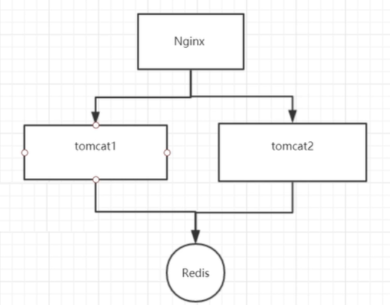
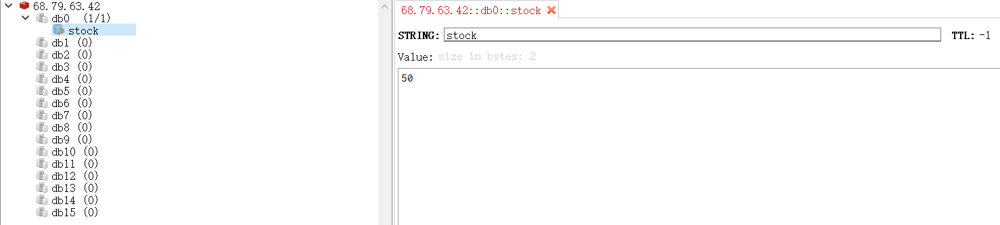
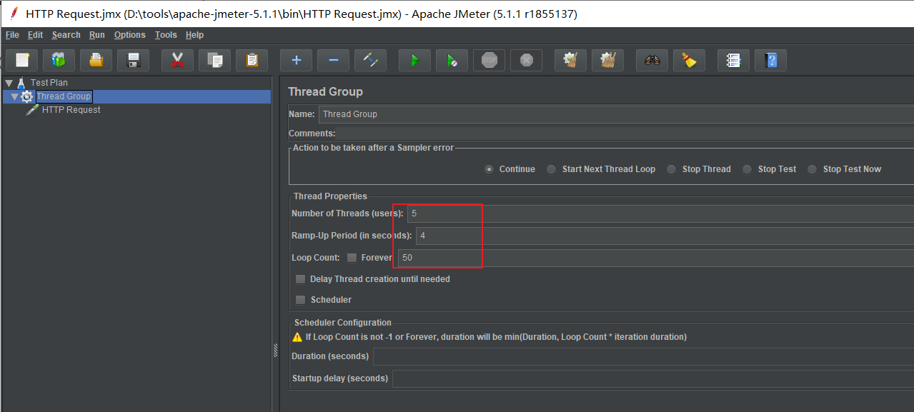
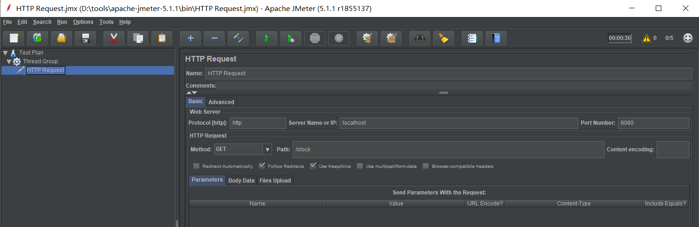
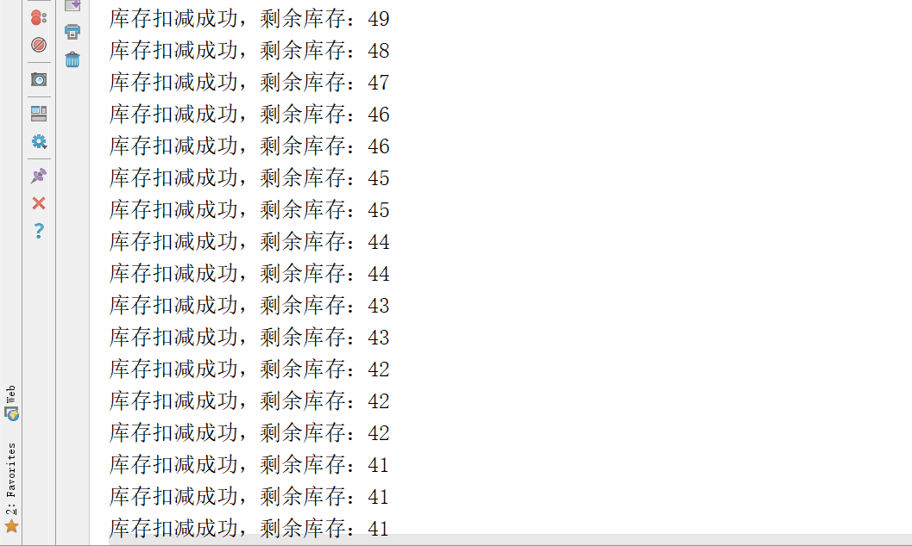
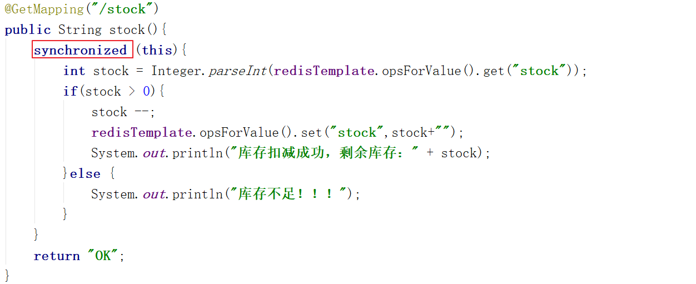
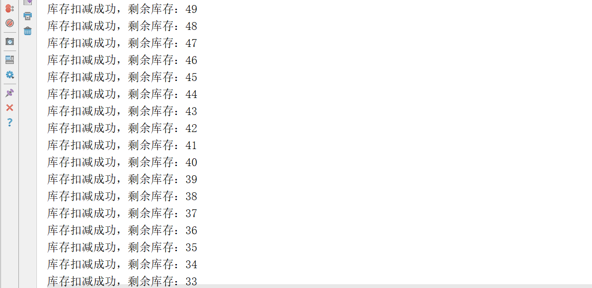
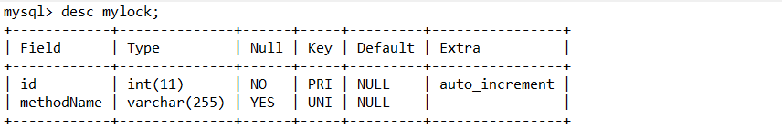
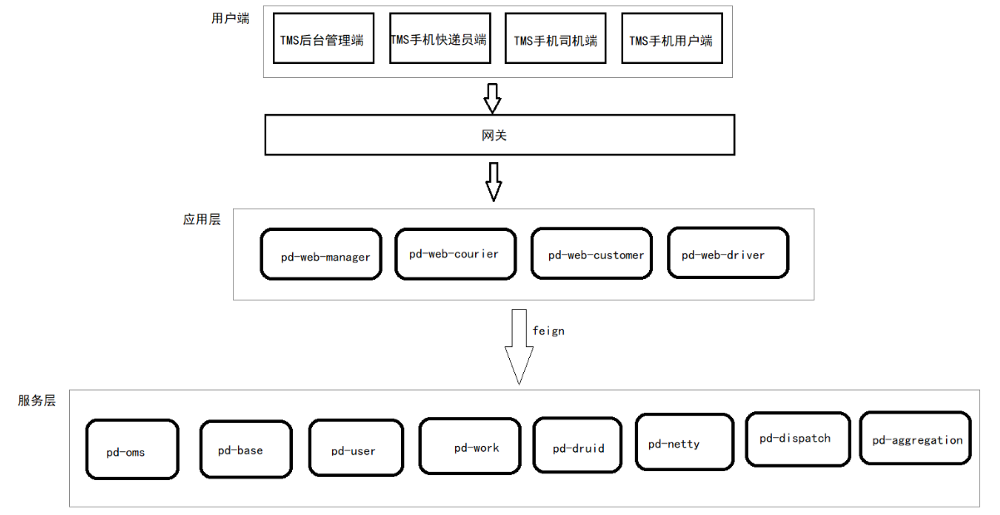

# 品达物流TMS项目

## 第9章 TMS后台管理端开发(pd-web-manager)

### 1. 分布式锁

#### 1.1 什么是分布式锁

在我们进行单机应用开发涉及并发同步的时候，我们往往采用synchronized或者ReentrantLock的方式来解决多线程间的代码同步问题。但是当我们的应用是在分布式集群工作的情况下，那么就需要一种更加高级的锁机制，来处理种跨机器的进程之间的数据同步问题，这就是分布式锁。

分布式锁，是控制分布式系统之间同步访问共享资源的一种方式。在分布式系统中，常常需要协调他们的动作。如果不同的系统或是同一个系统的不同主机之间共享了一个或一组资源，那么访问这些资源的时候，往往需要互斥来防止彼此干扰来保证一致性，在这种情况下，便需要使用到分布式锁。

分布式锁可以理解为：控制分布式系统有序的去对共享资源进行操作，通过互斥来保证数据的一致性。

可能有同学会问，使用我们以前学习的Java中的锁机制，例如synchronized、ReentrantLock不就能解决问题了吗？为什么还要使用分布式锁？

对于简单的单体项目，即运行时程序在同一个Java虚拟机中，此时使用上面的Java的锁机制确实可以解决多线程并发问题。例如下面程序代码：

```
public class LockTest implements Runnable {
    
    public synchronized void get() {
        System.out.println("1 线程 -->" + Thread.currentThread().getName());
        System.out.println("2 线程 -->" + Thread.currentThread().getName());
        System.out.println("3 线程 -->" + Thread.currentThread().getName());
    }

    public void run() {
        get();
    }

    public static void main(String[] args) {
        LockTest test = new LockTest();
        for (int i = 0; i < 10; i++) {
            new Thread(test, "线程-" + i).start();
        }
    }
    
}
```

运行结果如下：

1 线程 -->线程-0 2 线程 -->线程-0 3 线程 -->线程-0 1 线程 -->线程-2 2 线程 -->线程-2 3 线程 -->线程-2 1 线程 -->线程-1 2 线程 -->线程-1 3 线程 -->线程-1 1 线程 -->线程-3 2 线程 -->线程-3 3 线程 -->线程-3 1 线程 -->线程-4 2 线程 -->线程-4 3 线程 -->线程-4

但是在分布式环境中，程序是集群方式部署，如下图：



上面的集群部署方式依然会产生线程并发问题，因为synchronized、ReentrantLock只是jvm级别的加锁，没有办法控制其他jvm。也就是上面两个tomcat实例还是可以出现并发执行的情况。要解决分布式环境下的并发问题，则必须使用分布式锁。

分布式锁的实现方式有多种，例如：数据库实现方式、ZooKeeper实现方式、Redis实现方式等。

#### 1.2 为什么要使用分布式锁

为了能够说明分布式锁的重要性，下面通过一个电商项目中减库存的案例来演示如果没有使用分布式锁会出现什么问题。代码如下：

第一步：导入坐标

```
<?xml version="1.0" encoding="UTF-8"?>
<project xmlns="http://maven.apache.org/POM/4.0.0"
         xmlns:xsi="http://www.w3.org/2001/XMLSchema-instance"
         xsi:schemaLocation="http://maven.apache.org/POM/4.0.0 http://maven.apache.org/xsd/maven-4.0.0.xsd">
    <modelVersion>4.0.0</modelVersion>
    <parent>
        <groupId>org.springframework.boot</groupId>
        <artifactId>spring-boot-starter-parent</artifactId>
        <version>2.2.5.RELEASE</version>
        <relativePath/>
    </parent>
    <groupId>com.itheima</groupId>
    <artifactId>lock-test</artifactId>
    <version>1.0-SNAPSHOT</version>

    <dependencies>
        <dependency>
            <groupId>org.springframework.boot</groupId>
            <artifactId>spring-boot-starter-web</artifactId>
        </dependency>
        <!--集成redis-->
        <dependency>
            <groupId>org.springframework.boot</groupId>
            <artifactId>spring-boot-starter-data-redis</artifactId>
            <version>1.4.1.RELEASE</version>
        </dependency>
        <dependency>
            <groupId>com.alibaba</groupId>
            <artifactId>fastjson</artifactId>
            <version>1.2.3</version>
        </dependency>
        <dependency>
            <groupId>com.fasterxml.jackson.core</groupId>
            <artifactId>jackson-databind</artifactId>
        </dependency>
    </dependencies>

</project>
```

第二步：配置application.yml文件

```
server:
  port: 8080
spring:
  redis:
    host: 68.79.63.42
    port: 26379
    password: itheima123
```

第三步：编写Controller

```
package com.itheima.controller;

import org.springframework.beans.factory.annotation.Autowired;
import org.springframework.data.redis.core.StringRedisTemplate;
import org.springframework.web.bind.annotation.GetMapping;
import org.springframework.web.bind.annotation.RestController;

@RestController
public class StockController {
    @Autowired
    private StringRedisTemplate redisTemplate;

    @GetMapping("/stock")
    public String stock(){
        int stock = Integer.parseInt(redisTemplate.opsForValue().get("stock"));
        if(stock > 0){
            stock --;
            redisTemplate.opsForValue().set("stock",stock+"");
            System.out.println("库存扣减成功，剩余库存：" + stock);
        }else {
            System.out.println("库存不足！！！");
        }
        return "OK";
    }
}
```

第四步：编写启动类

```
@SpringBootApplication
public class MyApplication {
    public static void main(String[] args) {
        SpringApplication.run(MyApplication.class,args);
    }
}
```

第五步：设置redis



 

测试方式：使用jmeter进行压力测试，如下：





```
注：Apache JMeter是Apache组织开发的基于Java的压力测试工具。用于对软件做压力测试，它最初被设计用于Web应用测试，但后来扩展到其他测试领域。
```

查看控制台输出，发现已经出现了线程并发问题，如下：



由于当前程序是部署在一个Tomcat中的，即程序运行在一个jvm中，此时可以对减库存的代码进行同步处理，如下：



再次进行测试(注意恢复redis中的数据)，此时已经没有线程并发问题，控制台输出如下：



这说明如果程序运行在一个jvm中，使用synchronized即可解决线程并发问题。

 

下面将程序进行集群部署（如下图所示），并通过Nginx进行负载，再进行测试。


操作过程：

第一步：配置Nginx

```
    upstream upstream_name{
        server 127.0.0.1:8001;
        server 127.0.0.1:8002;
    }
    
    server {
        listen       8080;
        server_name  localhost;

        location / {
            proxy_pass http://upstream_name;
            proxy_set_header Host $host;
            proxy_set_header X-Real-IP $remote_addr;
            proxy_set_header X-Forwarded-For $proxy_add_x_forwarded_for;
        }
    }
```

第二步：修改application.yml中端口号改为8001和8002并分别启动程序

第三步：使用jemter再次测试，可以看到又出现了并发问题

#### 1.3 分布式锁应具有的特性

- 在分布式系统环境下，一个方法在同一时间只能被一个机器的一个线程执行
- 高可用的获取锁与释放锁
- 高性能的获取锁与释放锁
- 具备可重入特性
- 具备锁失效机制，防止死锁
- 具备非阻塞锁特性，即没有获取到锁将直接返回获取锁失败

### 2. 分布式锁实现方案

#### 2.1 数据库实现分布式锁

基于数据库实现分布式锁的核心思想是：在数据库中创建一个表，表中包含**方法名**等字段，并在**方法名字段上创建唯一索引**。想要执行某个方法，首先需要将这个方法名插入表中，成功插入则获取锁，执行完成后删除对应的行数据释放锁。此种方式就是建立在数据库唯一索引的特性基础上的。

表结构如下：



具体实现过程如下（在前面lock-test工程基础上进行改造）：

第一步：在pom.xml中导入maven坐标

```
<dependency>
    <groupId>com.baomidou</groupId>
    <artifactId>mybatis-plus-boot-starter</artifactId>
    <version>3.2.0</version>
</dependency>
<dependency>
    <groupId>mysql</groupId>
    <artifactId>mysql-connector-java</artifactId>
</dependency>
```

第二步：配置文件application.yml中配置mybatis-plus相关配置

```
server:
  port: 8002
spring:
  redis:
    host: 68.79.63.42
    port: 26379
    password: itheima123
  application:
    name: lockTest
  datasource:
      driver-class-name: com.mysql.cj.jdbc.Driver
      url: jdbc:mysql://127.0.0.1:3306/dlock
      username: root
      password: root
mybatis-plus:
  configuration:
    map-underscore-to-camel-case: false
    auto-mapping-behavior: full
    #log-impl: org.apache.ibatis.logging.stdout.StdOutImpl
  mapper-locations: classpath*:mapper/**/*Mapper.xml
```

第三步：创建实体类

```
package com.itheima.entity;

import com.baomidou.mybatisplus.annotation.TableName;
import java.io.Serializable;

@TableName("mylock")
public class MyLock implements Serializable {
    private int id;
    private String methodName;

    public int getId() {
        return id;
    }

    public void setId(int id) {
        this.id = id;
    }

    public String getMethodName() {
        return methodName;
    }

    public void setMethodName(String methodName) {
        this.methodName = methodName;
    }
}
```

第四步：创建Mapper接口

```
package com.itheima.mapper;

import com.baomidou.mybatisplus.core.mapper.BaseMapper;
import com.itheima.entity.MyLock;
import org.apache.ibatis.annotations.Mapper;

@Mapper
public interface MyLockMapper extends BaseMapper<MyLock> {
    public void deleteByMethodName(String methodName);
}
```

第五步：在resources/mapper目录下创建Mapper映射文件MyLockMapper.xml

```
<?xml version="1.0" encoding="UTF-8"?>
<!DOCTYPE mapper PUBLIC "-//mybatis.org//DTD Mapper 3.0//EN" "http://mybatis.org/dtd/mybatis-3-mapper.dtd">
<mapper namespace="com.itheima.mapper.MyLockMapper">
    <delete id="deleteByMethodName" parameterType="string">
        delete from mylock where methodName = #{value}
    </delete>
</mapper>
```

第六步：改造StockController

```
@Autowired
private MyLockMapper myLockMapper;

@GetMapping("/stock")
public String stock(){
    MyLock entity = new MyLock();
    entity.setMethodName("stock");

    try {
        //插入数据，如果不抛异常则表示插入成功，即获得锁
        myLockMapper.insert(entity);
        
        int stock = Integer.parseInt(redisTemplate.opsForValue().get("stock"));
        if(stock > 0){
            stock --;
            redisTemplate.opsForValue().set("stock",stock+"");
            System.out.println("库存扣减成功，剩余库存：" + stock);
        }else {
            System.out.println("库存不足！！！");
        }
        
        //释放锁
        myLockMapper.deleteByMethodName("stock");
    }catch (Exception ex){
        System.out.println("没有获取锁，不能执行减库存操作！！！");
    }

    return "OK";
}
```

通过观察控制台输出可以看到，使用此种方式已经解决了线程并发问题。

 

注意，虽然使用数据库方式可以实现分布式锁，但是这种实现方式还存在如下一些问题：

1、因为是基于数据库实现的，数据库的可用性和性能将直接影响分布式锁的可用性及性能，所以，数据库需要双机部署、数据同步、主备切换；

2、不具备可重入的特性，因为同一个线程在释放锁之前，行数据一直存在，无法再次成功插入数据，所以，需要在表中新增一列，用于记录当前获取到锁的机器和线程信息，在再次获取锁的时候，先查询表中机器和线程信息是否和当前机器和线程相同，若相同则直接获取锁；

3、没有锁失效机制，因为有可能出现成功插入数据后，服务器宕机了，对应的数据没有被删除，当服务恢复后一直获取不到锁，所以，需要在表中新增一列，用于记录失效时间，并且需要有定时任务清除这些失效的数据；

4、不具备阻塞锁特性，获取不到锁直接返回失败，所以需要优化获取逻辑，循环多次去获取。

5、在实施的过程中会遇到各种不同的问题，为了解决这些问题，实现方式将会越来越复杂；依赖数据库需要一定的资源开销，性能问题需要考虑。

#### 2.2 ZooKeeper实现分布式锁

Zookeeper的数据存储结构就像一棵树，这棵树由节点组成，这种节点叫做Znode。

Zookeeper中节点分为4种类型：

**1.持久节点 （PERSISTENT）**

默认的节点类型。创建节点的客户端与zookeeper断开连接后，该节点依旧存在

**2.持久顺序节点（PERSISTENT_SEQUENTIAL）**

所谓顺序节点，就是在创建节点时，Zookeeper根据创建的时间顺序给该节点名称进行编号

**3.临时节点（EPHEMERAL）**

和持久节点相反，当创建节点的客户端与zookeeper断开连接后，临时节点会被删除

**4.临时顺序节点（EPHEMERAL_SEQUENTIAL）**

顾名思义，临时顺序节点结合和临时节点和顺序节点的特点：在创建节点时，Zookeeper根据创建的时间顺序给该节点名称进行编号；当创建节点的客户端与zookeeper断开连接后，临时节点会被删除

Zookeeper实现分布式锁的原理是基于Zookeeper的临时顺序节点，如下图：


客户端A和客户端B争抢分布式锁，其实就是在/my_lock节点下创建临时顺序节点，这个顺序节点由zk内部自行维护一个节点序号，序号最小则表示对应客户端获得锁。

Apache Curator是一个比较完善的ZooKeeper客户端框架，通过封装的一套高级API 简化了ZooKeeper的操作，其中就包括分布式锁的实现。

具体操作过程如下（在前面lock-test工程基础上进行改造）：

第一步：在pom.xml中导入maven坐标

```
<dependency>
    <groupId>org.apache.zookeeper</groupId>
    <artifactId>zookeeper</artifactId>
    <version>3.4.10</version>
</dependency>
<dependency>
    <groupId>org.apache.curator</groupId>
    <artifactId>curator-framework</artifactId>
    <version>2.12.0</version>
</dependency>
<dependency>
    <groupId>org.apache.curator</groupId>
    <artifactId>curator-recipes</artifactId>
    <version>2.12.0</version>
</dependency>
```

第二步：编写配置类

```
package com.itheima.config;
import org.apache.curator.RetryPolicy;
import org.apache.curator.framework.CuratorFramework;
import org.apache.curator.framework.CuratorFrameworkFactory;
import org.apache.curator.retry.ExponentialBackoffRetry;
import org.springframework.context.annotation.Bean;
import org.springframework.context.annotation.Configuration;

@Configuration
public class ZkConfig {
    @Bean
    public CuratorFramework curatorFramework(){
        RetryPolicy retryPolicy = new ExponentialBackoffRetry(1000,3);
        CuratorFramework client = CuratorFrameworkFactory.builder()
                .connectString("localhost:2181")
                .sessionTimeoutMs(5000)
                .connectionTimeoutMs(5000)
                .retryPolicy(retryPolicy)
                .build();
        client.start();
        return client;
    }
}
```

第三步：改造StockController

```
@Autowired
private CuratorFramework curatorFramework;

@GetMapping("/stock")
public String stock() {
    InterProcessMutex mutex = new InterProcessMutex(curatorFramework,"/mylock");

    try {
        //尝试获得锁
        boolean locked = mutex.acquire(0, TimeUnit.SECONDS);
        if(locked){
            int stock = Integer.parseInt(redisTemplate.opsForValue().get("stock"));
            if(stock > 0){
                stock --;
                redisTemplate.opsForValue().set("stock",stock+"");
                System.out.println("库存扣减成功，剩余库存：" + stock);
            }else {
                System.out.println("库存不足！！！");
            }
            //释放锁
            mutex.release();
        }else{
            System.out.println("没有获取锁，不能执行减库存操作！！！");
        }
    }catch (Exception ex){
        System.out.println("出现异常！！！");
    }

    return "OK";
}
```

通过观察控制台输出可以看到，使用此种方式已经解决了线程并发问题。

#### 2.3 Redis实现分布式锁

redis实现分布式锁比较简单，就是调用redis的**set**命令设置值，能够设置成功则表示加锁成功，即获得锁，通过调用del命令来删除设置的键值，即释放锁。

##### 2.3.1 版本一

加锁命令：**set** lock_key lock_value **NX**

解锁命令：**del** lock_key

Java程序：

```
@GetMapping("/stock")
public String stock() {
    try {
        //尝试加锁
        Boolean locked = redisTemplate.opsForValue().setIfAbsent("mylock", "mylock");
        if(locked){//加锁成功
            int stock = Integer.parseInt(redisTemplate.opsForValue().get("stock"));
            if(stock > 0){
                stock --;
                redisTemplate.opsForValue().set("stock",stock+"");
                System.out.println("库存扣减成功，剩余库存：" + stock);
            }else {
                System.out.println("库存不足！！！");
            }
            //释放锁
            redisTemplate.delete("mylock");
        }else{
            System.out.println("没有获取锁，不能执行减库存操作！！！");
        }
    }catch (Exception ex){
        System.out.println("出现异常！！！");
    }

    return "OK";
}
```

##### 2.3.2 版本二

上面版本一的实现中存在一个问题，就是当某个线程获得锁后程序挂掉，此时还没来得及释放锁，这样后面所有的线程都无法获得锁了。为了解决这个问题可以在加锁时设置一个过期时间防止死锁。

加锁命令：**set** lock_key lock_value **NX** **PX** 5000

解锁命令：**del** lock_key

Java程序：

```
@GetMapping("/stock")
public String stock() {
    try {
        //尝试加锁
        Boolean locked = redisTemplate.opsForValue().setIfAbsent("mylock", "mylock",5000,TimeUnit.MILLISECONDS);
        if(locked){//加锁成功
            int stock = Integer.parseInt(redisTemplate.opsForValue().get("stock"));
            if(stock > 0){
                stock --;
                redisTemplate.opsForValue().set("stock",stock+"");
                System.out.println("库存扣减成功，剩余库存：" + stock);
            }else {
                System.out.println("库存不足！！！");
            }
            //释放锁
            redisTemplate.delete("mylock");
        }else{
            System.out.println("没有获取锁，不能执行减库存操作！！！");
        }
    }catch (Exception ex){
        System.out.println("出现异常！！！");
    }

    return "OK";
}
```

##### 2.3.3 版本三

针对前面版本二还有一点需要优化，就是加锁和解锁必须是同一个客户端，所以在加锁时可以设置当前线程id，在释放锁时判断是否为当前线程加的锁，如果是再释放锁即可。

Java程序：

```
@GetMapping("/stock")
public String stock() {
    try {
        String threadId = Thread.currentThread().getId()+"";
        //尝试加锁
        Boolean locked = redisTemplate.opsForValue().setIfAbsent("mylock",threadId,5000,TimeUnit.MILLISECONDS);
        if(locked){//加锁成功
            int stock = Integer.parseInt(redisTemplate.opsForValue().get("stock"));
            if(stock > 0){
                stock --;
                redisTemplate.opsForValue().set("stock",stock+"");
                System.out.println("库存扣减成功，剩余库存：" + stock);
            }else {
                System.out.println("库存不足！！！");
            }
            String myValue = redisTemplate.opsForValue().get("mylock");
            if(threadId.equals(myValue)){
                //释放锁
                redisTemplate.delete("mylock");
            }
        }else{
            System.out.println("没有获取锁，不能执行减库存操作！！！");
        }
    }catch (Exception ex){
        System.out.println("出现异常！！！");
    }

    return "OK";
}
```

### 3. Redisson

#### 3.1 Redisson介绍

[Redisson](https://redisson.org/)是架设在[Redis](http://redis.cn/)基础上的一个Java驻内存数据网格（In-Memory Data Grid）。充分的利用了Redis键值数据库提供的一系列优势，基于Java实用工具包中常用接口，为使用者提供了一系列具有分布式特性的常用工具类。使得原本作为协调单机多线程并发程序的工具包获得了协调分布式多机多线程并发系统的能力，大大降低了设计和研发大规模分布式系统的难度。同时结合各富特色的分布式服务，更进一步简化了分布式环境中程序相互之间的协作。

Redisson已经内置提供了基于Redis的分布式锁实现，此种方式是我们推荐的分布式锁使用方式。

Redisson的maven坐标如下：

```
<dependency>
    <groupId>org.redisson</groupId>
    <artifactId>redisson</artifactId>
    <version>3.10.1</version>
</dependency>
```

#### 3.2 Redisson分布式锁使用方式

第一步：在pom.xml中导入redisson的maven坐标

```
<dependency>
    <groupId>org.redisson</groupId>
    <artifactId>redisson</artifactId>
    <version>3.10.1</version>
</dependency>
```

第二步：编写配置类

```
package com.itheima.config;
import org.redisson.Redisson;
import org.redisson.api.RedissonClient;
import org.redisson.config.Config;
import org.springframework.beans.factory.annotation.Value;
import org.springframework.context.annotation.Bean;
import org.springframework.context.annotation.Configuration;

@Configuration
public class RedissonConfig {
    @Value("${spring.redis.host}")
    private String host;
    @Value("${spring.redis.port}")
    private String port;
    @Value("${spring.redis.password}")
    private String password;

    @Bean
    public RedissonClient redissonClient(){
        Config config = new Config();
        config.useSingleServer().setAddress("redis://" + host + ":" + port);
        config.useSingleServer().setPassword(password);
        final RedissonClient client = Redisson.create(config);
        return client;
    }
}
```

第三步：改造Controller

```
@Autowired
private RedissonClient redissonClient;

@GetMapping("/stock")
public String stock() {
    //获得分布式锁对象，注意，此时还没有加锁成功
    RLock lock = redissonClient.getLock("mylock");
    try {
        //尝试加锁，如果加锁成功则后续程序继续执行，如果加锁不成功则阻塞等待
        lock.lock(5000,TimeUnit.MILLISECONDS);

        int stock = Integer.parseInt(redisTemplate.opsForValue().get("stock"));
        if(stock > 0){
            stock --;
            redisTemplate.opsForValue().set("stock",stock+"");
            System.out.println("库存扣减成功，剩余库存：" + stock);
        }else {
            System.out.println("库存不足！！！");
        }
    }catch (Exception ex){
        System.out.println("出现异常！！！");
    }finally {
        //解锁
        lock.unlock();
    }

    return "OK";
}
```

#### 3.3 Lua脚本

##### 3.3.1 Lua简介

Lua 是一种轻量小巧的脚本语言，用标准C语言编写并以源代码形式开放， 其设计目的是为了嵌入应用程序中，从而为应用程序提供灵活的扩展和定制功能。

从Redis2.6.0版本开始提供了EVAL 和 EVALSHA 命令，这两个命令可以执行 Lua 脚本。

##### 3.3.2 Redis中使用Lua的好处

Redis中使用Lua的好处：

- 减少网络开销。可以将多个请求通过脚本的形式一次发送，减少网络时延
- 原子操作。redis会将整个脚本作为一个整体执行，中间不会被其他命令插入。因此在编写脚本的过程中无需担心会出现竞态条件，无需使用事务
- 复用。客户端发送的脚本会永久存在redis中，这样，其他客户端可以复用这一脚本而不需要使用代码完成相同的逻辑

##### 3.3.3 如何在Redis中使用Lua

在redis中使用Lua脚本主要有三个命令

- eval
- evalsha
- script load

eval用来直接执行lua脚本，使用方式如下：

```
EVAL script numkeys key [key ...] arg [arg ...]
```

key代表要操作的redis key

arg可以传自定义的参数

numkeys用来确定key有几个

script就是你写的lua脚本

lua脚本里面使用KEYS[1]和ARGV[1]来获取传递的第一个key和第一个arg，后面以此类推

举例：

```
eval "return redis.call('set',KEYS[1],ARGV[1])" 1 city beijing
eval "return redis.call('set','name','xiaoming')" 0
eval "return redis.call('del',KEYS[1])" 1 city
eval "return redis.call('get',KEYS[1])" 1 name
eval "if (redis.call('exists', KEYS[1]) == 0) then redis.call('set', KEYS[2], ARGV[1]); redis.call('expire', KEYS[2], ARGV[2]);return nil;end;" 2 citys city beijing 5000
```

在用eval命令的时候，可以注意到每次都要把执行的脚本发送过去，这样势必会有一定的网络开销，所以redis对lua脚本做了缓存，通过script load 和 evalsha实现：

```
SCRIPT LOAD script
EVALSHA sha1 numkeys key [key ...] arg [arg ...]
```

举例：

```
script load "return redis.call('get',KEYS[1]);"
evalsha 0e11c9f252fd76115c38403ce6095872b8c70580 1 name
```

### 4. 导入功能代码

TMS中各个微服务之间的调用关系如下：



直接将资料`后台管理端(pd-web-manager)代码导入`中的代码导入项目中即可。